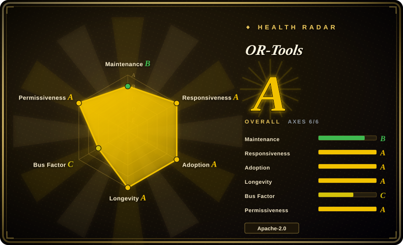
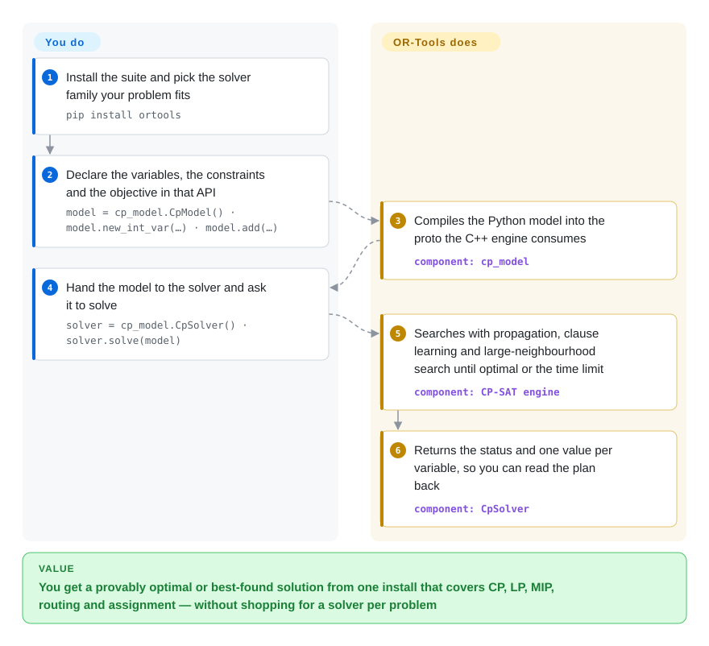

# OR-Tools

Google's combinatorial-optimization suite: CP-SAT, the Glop/PDLP linear-programming solvers, wrappers around MIP solvers, plus dedicated routing, bin-packing, knapsack, graph and linear-sum-assignment libraries — one C++ core with Python, Java and .NET wrappers.

## When to use

You have a combinatorial problem — a fleet to route, a job shop to schedule, bins to pack, a set of assignments to satisfy — and you do not want the answer to depend on which single solver you happened to install. You reach for OR-Tools because it is a **suite**: CP-SAT for constraint/integer models, Glop and PDLP for linear programs, wrappers to reach commercial or other open-source MIP solvers, and purpose-built libraries for the TSP, vehicle routing and linear-sum-assignment shapes that would otherwise be clumsy to encode yourself. Against the narrower alternatives the deciding tradeoff is breadth-vs-tuned-model: choosing OR-Tools means you write the model and let it pick (or you pick) an engine, whereas Rebalancer hands you assignment-shaped policy specs with a search already tuned for rebalancing, and HiGHS is only the LP/MIP engine with no modelling layer at all. What you buy with OR-Tools is that the problem you actually have is probably expressible in one of its APIs, in four languages, with a decade of public examples behind it.

You also reach for it when the problem is genuinely mixed: a routing model with a capacity side-constraint, an assignment with a fairness objective, a scheduling problem that needs both propagation and an LP relaxation. Those are where a single-purpose tool runs out of road.

## How it works

You pick an API, describe the model, and the selected engine searches. Each API has the same shape — declare variables, add constraints, set an objective, then solve and read values back — so the flow below follows CP-SAT, the constraint-programming engine, while the routing and LP APIs differ only in the vocabulary of their variables. Concretely, `cp_model.CpModel()` collects the model as a Python object that is compiled down to a protobuf the C++ engine consumes; `cp_model.CpSolver()` runs that engine with propagation, clause learning and large-neighbourhood search until the model is proven optimal or you hit the time limit. What stays on your side is the modelling work: deciding what a variable means, which constraint is hard, and which term in the objective deserves weight. OR-Tools does not invent the model for you, and it does not repair a wrong one — the failure mode it reports is INFEASIBLE, not "your problem is wrong".

<!-- flow-steps:begin (generated from flows/or-tools.json by tools/flow_card.py — do not edit) -->

Text version of the flow

1. **You**: Install the suite and pick the solver family your problem fits — `pip install ortools`
2. **You**: Declare the variables, the constraints and the objective in that API — `model = cp_model.CpModel() · model.new_int_var(…) · model.add(…)`
3. **OR-Tools**: Compiles the Python model into the proto the C++ engine consumes — component: `cp_model`
4. **You**: Hand the model to the solver and ask it to solve — `solver = cp_model.CpSolver() · solver.solve(model)`
5. **OR-Tools**: Searches with propagation, clause learning and large-neighbourhood search until optimal or the time limit — component: `CP-SAT engine`
6. **OR-Tools**: Returns the status and one value per variable, so you can read the plan back — component: `CpSolver`

**Value**: You get a provably optimal or best-found solution from one install that covers CP, LP, MIP, routing and assignment — without shopping for a solver per problem

<!-- flow-steps:end -->

## When NOT to use

- **The problem is a resource-allocation model over objects and containers with policies like balance, capacity and minimize-movement, at shard/host scale.** Use [Rebalancer](rebalancer.md): it ships those policies as named specs and a local search tuned for millions of objects, where in OR-Tools you would be encoding the same policies as linear expressions and choosing move strategies yourself.
- **You already have the model and need only the solve.** Use [HiGHS](highs.md) directly: it is a small, MIT-licensed, dependency-free LP/QP/MIP engine you can call with a matrix or an `ml.mps` file, with none of the modelling layer OR-Tools adds.
- **The constraints are business rules that a non-programmer maintains, and replanning must be incremental inside a long-running JVM app.** Use [Timefold Solver](timefold-solver.md): its ConstraintStreams score calculation is built for changing rules and live replanning, which is the workload CP-SAT's batch `solve()` is not shaped for.
- **You need a commercial SLA, certified support, or the fastest possible MIP performance on a hard instance.** Buy a commercial solver instead: OR-Tools can *call* Gurobi or FICO Xpress, but the licence, the support contract and the tuned MIP engine come from them, not from the wrapper.
- **Your model is genuinely nonlinear** (nonconvex objectives, transcendental constraints, simulation in the loop). OR-Tools is combinatorial plus linear/quadratic; a nonlinear or global optimizer is the right hammer, and bolting linear approximations onto a nonconvex problem is how you get a plausible answer that is wrong.
- **You want a single-language, single-purpose dependency with a small surface.** OR-Tools is a large suite: the macOS arm64 Python wheel alone is 20.9 MB, and the same install brings solvers you will never call. If you need exactly one engine, take that engine.

## Comparison

| Alternative | In index | Our verdict | Tradeoff |
|---|---|---|---|
| [Rebalancer](rebalancer.md) | ✅ | Choose Rebalancer when the problem is exactly "re-place these objects under these policies" at scale and you would rather declare `BalanceSpec`/`CapacitySpec` than build a search; choose OR-Tools when the model is general, needs routing or scheduling, or must run in Java/.NET. | Rebalancer brings a tuned local search and a MIP fallback for one shape of problem and is three months old; OR-Tools is far broader with a decade of examples, and pays for it in modelling work and per-problem engine choices. |
| [HiGHS](highs.md) | ✅ | Choose HiGHS when the model already exists as a matrix or an MPS/LP file and you want a dependency-free MIT engine; choose OR-Tools when you want the modelling APIs and the routing/CP solvers around it. | HiGHS is a solver, not a suite: tiny API, no third-party dependencies, no DSL; OR-Tools wraps HiGHS-class engines with four language bindings and a much larger install. |
| [Timefold Solver](timefold-solver.md) | ✅ | Choose Timefold when the constraints are maintainable business rules and the plan must be re-solved incrementally inside a JVM service; choose OR-Tools when the model is numeric and the solve can be a batch job. | Timefold's score-based rules DSL is easier for changing policies but confines you to Java/Kotlin; OR-Tools is language-diverse and algorithm-diverse but you express policy as constraints and objective terms. |
| Gurobi / FICO Xpress | 未收录 | Buy Gurobi or Xpress when you need the fastest MIP performance and a commercial SLA; choose OR-Tools when you need breadth, permissive licensing, and the option to plug those solvers in later. | Commercial solvers are closed-source products with per-seat licensing and no public repository — OR-Tools' wrapper makes them reachable but cannot replace their engine or their support. |
| A hosted/cloud optimization service | 未收录 | Choose a hosted service when nobody on the team wants to own a solver and pay-per-solve is acceptable; choose OR-Tools when the data cannot leave your environment or per-call cost is the binding constraint. | Hosted services remove ops and licensing work but put your model and data in someone else's environment and bill per solve; OR-Tools runs locally with nothing to operate but your own process. |

## Tech stack

- **Core:** C++ (the README states the suite "was written in C++, but provide wrappers in Python, C# and Java").
- **Engines in the suite:** CP* and CP-SAT (constraint programming), Glop (simplex LP) and PDLP (first-order LP), BOP (SAT-based Boolean), plus wrappers to commercial and other open-source MIP solvers.
- **Domain libraries:** bin-packing and knapsack algorithms, TSP and vehicle-routing search, graph algorithms (shortest paths, min cost flow, max flow, linear sum assignment).
- **Build systems:** Make (legacy), CMake, and Bazel are all supported from the same tree.
- **Bindings:** Python (`ortools`), Java (`com.google.ortools:ortools-java` on Maven Central), .NET (`Google.OrTools` on NuGet), C++.
- **Samples:** `examples/` carries C++, Java, .NET, Python and FlatZinc samples plus Jupyter notebooks; `ortools/sat/samples` holds the constraint-programming set.

## Dependencies

- **Python:** `pip install ortools` — wheels for CPython 3.9–3.14; the suite is one wheel, no external solver install needed for the built-in engines (the macOS arm64 wheel is 20.9 MB).
- **Java / .NET:** the published Maven Central and NuGet packages, which carry the native libraries per platform.
- **C++ from source:** whichever of Make/CMake/Bazel you prefer, plus a C++ toolchain; the README points at per-build-system instructions.
- **To call a commercial MIP solver:** that solver's own licence and installation, plus its library on the library path.
- **Runtime infrastructure:** none — it is a library. Solving is CPU-bound; parallelism and time limits are solver options.

## Ops difficulty

**Low.** There is nothing to deploy or monitor: OR-Tools is a library you install from a language package manager or build into your own binary. The operational questions are modelling questions — how long a solve may take before you accept the incumbent, how much memory the model needs, whether a remote MIP solver's licence is reachable from the machine that runs the job. Building the C++ core from source is the only heavy path, and the prebuilt wheels and Maven/NuGet packages exist precisely so most users never take it. If you route the model to a commercial solver you inherit that solver's licensing and its failures, but that is a decision about the backend, not about OR-Tools.

## Health & viability

- **Maintenance — B; Responsiveness — A; Adoption — A; Longevity — A (measured 2026-09-22).** The four axes that decide whether this is safe to build on all score at or near the top: a repository created 2015-02 that is still pushed daily, first-response times measured in hours across a large volume of issues, and real adoption signals. The B on maintenance reflects cadence rather than inactivity — releases move on a multi-month cycle (v9.12 in 2025-02 through v9.15 in 2026-01) while the default branch is pushed continuously.
- **Governance — C.** Two things pull the grade down. Institutionally, Google owns the project outright and the CLA process in `CONTRIBUTING.md` means contributions assign rights to Google, so the roadmap has one owner. Statistically, the measured window shows a concentrated contributor base — 9 active maintainers in the last 12 months, with the top contributor at 0.602 of the work and the top three at 0.947. That is not a bus-factor emergency, but it is the shape of a vendor-run repository rather than a foundation project.
- **Backing & longevity — the strongest Lindy signal in this category.** Google-scale backing plus 11 years of continuous public history plus daily commits means the realistic failure mode is *scope* change, not abandonment. Compare that with the rest of `optimization-solvers`: the second-newest entry is three months old.
- **Risk flags.** No relicense history and no open-core gating — the licence is Apache-2.0 across the suite. The real flags are the CLA (contributors sign rights over), the size of the dependency, and the fact that the best MIP performance lives in commercial solvers OR-Tools merely wraps. Whether all bundled third-party solvers are equally production-grade was not audited here.

## Caveats (unverified)

- [未验证] Star count (~14.1k), fork count (~2.5k) and open-issue count (~123) are as of 2026-09-22 and move continuously.
- [未验证] The release cadence quoted (v9.12 2025-02 → v9.15 2026-01) is the four most recent GitHub releases; older tags were not enumerated.
- [推断] "A decade of public examples" is inferred from the repository age (2015-02) plus the presence of `examples/` in five languages, not from a measured count of answered questions.
- [推断] The claim that CP-SAT is the engine most new models start with is an inference from the sample/notebook distribution in this repository, not a documented recommendation.
- [未验证] Which third-party MIP solvers ship inside the released wheels, versus only being reachable when you install them separately, was not checked per platform.
- [推断] The comparison rows for Gurobi/FICO Xpress and for hosted optimization services are reasoned from those products' public positioning, not benchmarked against OR-Tools.
- [未验证] Whether the Java and .NET packages track the C++ release train exactly was not verified version-by-version.
