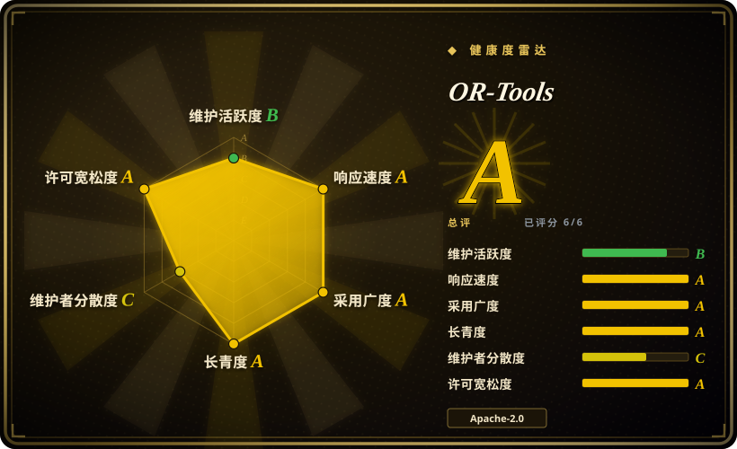
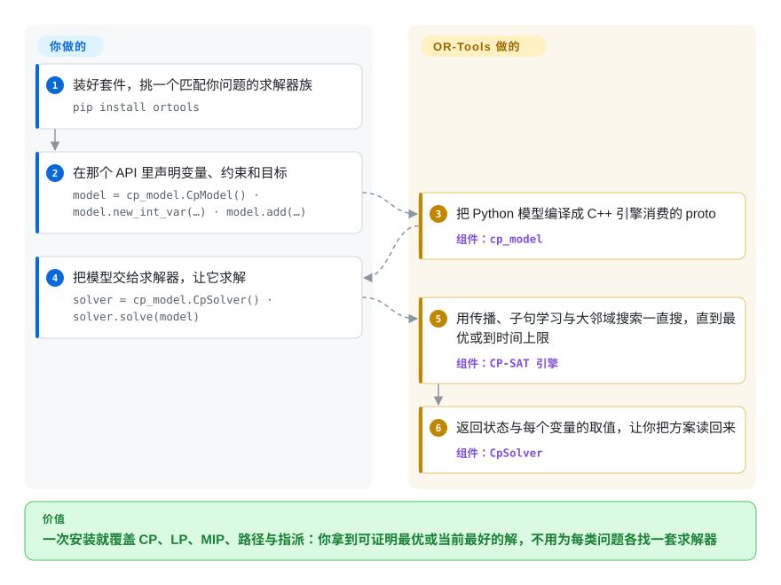

# OR-Tools

Google 的组合最优化套件：CP-SAT、Glop／PDLP 线性规划求解器、对 MIP 求解器的封装，外加路径规划、装箱、背包、图算法与线性指派等专用库——一套 C++ 内核，配 Python、Java 与 .NET 封装。

## 何时使用

你手上是一个组合问题——车队要排线、车间要排产、箱子要打包、一组指派要满足约束——而你不希望答案取决于你碰巧装了哪个求解器。你选 OR-Tools，因为它是**套件**：约束／整数模型用 CP-SAT，线性规划用 Glop 与 PDLP，还能通过封装去调商用或其他开源 MIP 求解器；TSP、车辆路径与线性指派这些形状另有专门的库，自己编码会很别扭。相对更窄的替代品，决定性的取舍是「广度对专项调优」：选 OR-Tools 意味着模型由你写、引擎由它提供（或你挑）；[Rebalancer](rebalancer.zh.md) 则直接给你分配问题形状的策略 spec 和一套按 rebalancing 调过的搜索，[HiGHS](highs.zh.md) 只是 LP／MIP 引擎、完全没有建模层。你从 OR-Tools 换到的，是「你真正要解的那个问题，多半能在它某个 API 里表达出来」，而且是四种语言、背后有十年公开示例。

还有一类场景也会让你选它：问题本身是混合的——一个带容量副约束的路径模型、一个既要不公平度又要满足硬约束的指派、一个既要传播又要 LP 松弛的排程。这些正是单一用途工具走到头的地方。

## 怎么用起来

你挑一个 API，描述模型，选中的引擎去搜。各个 API 形状相同——声明变量、加约束、设目标，然后求解并读回取值——所以下面的流程以 CP-SAT 这条约束规划引擎为主线，而 routing 与 LP 两类 API 只是在变量词汇上不同。具体说，`cp_model.CpModel()` 把模型收集成一个 Python 对象，编译成 C++ 引擎消费的 protobuf；`cp_model.CpSolver()` 用传播、子句学习与大邻域搜索把它跑到证明最优或撞上你的时间上限。留在你这边的是建模工作：定什么当变量、哪条约束是硬的、目标里哪一项该加权重。OR-Tools 不会替你想出模型，也不会替你修一个错的模型——它报的失败是 INFEASIBLE，而不是「你的问题问错了」。

<!-- flow-steps:begin (generated from flows/or-tools.json by tools/flow_card.py — do not edit) -->

流程文字版

1. **你**：装好套件，挑一个匹配你问题的求解器族 — `pip install ortools`
2. **你**：在那个 API 里声明变量、约束和目标 — `model = cp_model.CpModel() · model.new_int_var(…) · model.add(…)`
3. **OR-Tools**：把 Python 模型编译成 C++ 引擎消费的 proto — 组件：`cp_model`
4. **你**：把模型交给求解器，让它求解 — `solver = cp_model.CpSolver() · solver.solve(model)`
5. **OR-Tools**：用传播、子句学习与大邻域搜索一直搜，直到最优或到时间上限 — 组件：`CP-SAT 引擎`
6. **OR-Tools**：返回状态与每个变量的取值，让你把方案读回来 — 组件：`CpSolver`

**价值**：一次安装就覆盖 CP、LP、MIP、路径与指派：你拿到可证明最优或当前最好的解，不用为每类问题各找一套求解器

<!-- flow-steps:end -->

## 何时不用

- **问题是「对象与容器 + 均衡／容量／尽量少搬」这类资源分配模型，规模在分片／主机量级。** 用 [Rebalancer](rebalancer.zh.md)：那些策略它以具名 spec 提供，还带一套按百万级对象调过的局部搜索；在 OR-Tools 里你得把同样的策略编码成线性表达式，并自己决定移动策略。
- **模型已经有了，只差求解。** 直接用 [HiGHS](highs.zh.md)：一个 MIT 许可、无第三方依赖的 LP／QP／MIP 引擎，喂矩阵或 `ml.mps` 文件即可，不带 OR-Tools 那层建模框架。
- **约束是业务规则、要由非程序员维护，而且要在长驻 JVM 服务里增量重排。** 用 [Timefold Solver](timefold-solver.zh.md)：它的 ConstraintStreams 算分机制就是为规则变动与在线重排设计的，而 CP-SAT 的批量 `solve()` 不是那个形状。
- **你要商用 SLA、认证支持，或者在硬实例上最快的 MIP 性能。** 直接买商用求解器：OR-Tools 可以**调** Gurobi 或 FICO Xpress，但许可、支持合同与调优过的 MIP 引擎来自它们，不来自这层封装。
- **模型真的是非线性的**（非凸目标、超越函数约束、仿真在环）。OR-Tools 覆盖的是组合优化加线性／二次；该上非线性或全局优化器，而在非凸问题上硬套线性近似，得到的会是一个看着合理但其实错的答案。
- **你想要单一语言、单一用途、表面积小的依赖。** OR-Tools 是个大套件：仅 macOS arm64 的 Python wheel 就有 20.9 MB，一次安装会带进你永远不会调用的求解器。只要一个引擎，就直接拿那个引擎。

## 横向对比

| 替代品 | 是否收录 | 我们的评价 | 取舍 |
|---|---|---|---|
| [Rebalancer](rebalancer.zh.md) | ✅ | 问题恰好是「按这些策略在规模上重新安置这些对象」、且你宁愿声明 `BalanceSpec`／`CapacitySpec` 而不是自己搭搜索时选 Rebalancer；模型通用、需要路径或排程、或必须跑在 Java／.NET 上时选 OR-Tools。 | Rebalancer 只覆盖一类问题，但带调好的局部搜索与 MIP 兜底，且只有三个月历史；OR-Tools 广得多、有十年示例，代价是建模工作量和逐问题挑引擎。 |
| [HiGHS](highs.zh.md) | ✅ | 模型已经是矩阵或 MPS／LP 文件、你只要一个无依赖的 MIT 引擎时选 HiGHS；你要建模 API 以及围绕它的 routing／CP 求解器时选 OR-Tools。 | HiGHS 是求解器不是套件：接口小、无第三方依赖、没有 DSL；OR-Tools 把 HiGHS 这一类引擎包起来，另给四种语言绑定，安装体积也大得多。 |
| [Timefold Solver](timefold-solver.zh.md) | ✅ | 约束是可维护的业务规则、方案要在 JVM 服务里增量重解时选 Timefold；模型是数值型、求解可以是一次批处理时选 OR-Tools。 | Timefold 的算分式规则 DSL 更适合策略常改，但把你锁在 Java／Kotlin；OR-Tools 语言与算法都多，但策略要写成约束与目标项。 |
| Gurobi／FICO Xpress | 未收录 | 要最快的 MIP 性能与商用 SLA 时买 Gurobi 或 Xpress；要广度、宽松许可、并保留以后接上它们的可能时选 OR-Tools。 | 商用求解器是闭源产品、按席位授权、没有公开仓库——OR-Tools 的封装让它们可达，但替代不了它们的引擎与支持。 |
| 托管的云端最优化服务 | 未收录 | 团队里没人愿意维护求解器、且按次付费可接受时选托管服务；数据不能出环境、或每次调用成本是硬约束时选 OR-Tools。 | 托管服务省掉运维与许可工作，但把你的模型与数据放在别人的环境里并按次计费；OR-Tools 本地运行，除了你自己的进程没有要运维的东西。 |

## 技术栈

- **内核：** C++（README 原话是套件「用 C++ 写成，但提供 Python、C# 与 Java 的封装」）。
- **套件内的引擎：** CP* 与 CP-SAT（约束规划）、Glop（单纯形 LP）与 PDLP（一阶 LP）、BOP（基于 SAT 的布尔求解），以及对商用与其他开源 MIP 求解器的封装。
- **领域库：** 装箱与背包算法、TSP 与车辆路径搜索、图算法（最短路、最小费用流、最大流、线性指派）。
- **构建系统：** Make（旧版）、CMake 与 Bazel 在同一棵源码树上都支持。
- **绑定：** Python（`ortools`）、Java（Maven Central 上 `com.google.ortools:ortools-java`）、.NET（NuGet 上 `Google.OrTools`）、C++。
- **示例：** `examples/` 里有 C++、Java、.NET、Python 与 FlatZinc 示例和 Jupyter notebook；`ortools/sat/samples` 是约束规划那一套。

## 依赖

- **Python：** `pip install ortools`——CPython 3.9–3.14 都有 wheel；内置引擎不需要另装外部求解器（macOS arm64 的 wheel 为 20.9 MB）。
- **Java／.NET：** 用 Maven Central 与 NuGet 上发布的包，其中含各平台的原生库。
- **C++ 从源码构建：** Make／CMake／Bazel 任选，外加 C++ 工具链；README 分别指向三套构建说明。
- **要调商用 MIP 求解器时：** 该求解器自己的许可与安装，以及让它的库能被找到。
- **运行时基础设施：** 无——它是库。求解是 CPU 密集的；并行度与时间上限都是求解器选项。

## 运维难度

**低。** 没有要部署或监控的东西：OR-Tools 就是从语言包管理器装进来、或编进你自己二进制里的库。运维问题其实是建模问题——一次求解允许跑多久才接受当前解、模型需要多少内存、跑作业的机器能不能拿到远程 MIP 求解器的许可。唯一重一点的路径是从源码构建 C++ 内核，而预编译 wheel 与 Maven／NuGet 包的存在，就是为了让多数人不必走那条路。如果你把模型接到商用求解器上，就会继承那个求解器的许可与故障，但那是关于后端的选择，不是关于 OR-Tools 的。

## 健康度与可持续性

- **维护 B、响应 A、采用 A、长寿 A（2026-09-22 实测）。** 决定「能不能押上去」的四个轴都接近满分：仓库创建于 2015-02 且仍每天有推送，在大量 issue 上首次响应以小时计，且有真实的采用信号。维护拿到 B 反映的是节奏而非停滞——发版按数月一轮（v9.12 在 2025-02，v9.15 在 2026-01），而默认分支是持续推送的。
- **治理 C。** 拉低这一档的有两件事。制度上，Google 完全拥有该项目，`CONTRIBUTING.md` 里的 CLA 流程意味着贡献都把权利让渡给 Google，路线图只有一个主人。统计上，测量窗口显示贡献者集中——最近 12 个月 9 位活跃维护者，头号贡献者占 0.602、前三占 0.947。这不是巴士因子告急，但这是厂商自营仓库的形状，而不是基金会的形状。
- **背书与长寿性——本分类里最强的 Lindy 信号。** Google 量级的背书，加 11 年连续公开历史，加每天提交，意味着现实的失败模式是**范围**变化，而不是被放弃。对比同分类其他条目：这里第二新的项目也只有三个月历史。
- **风险信号。** 没有 relicense 历史，也没有 open-core 功能阉割——整个套件都是 Apache-2.0。真正的信号是 CLA（贡献者要让渡权利）、依赖体积，以及最强 MIP 性能其实在 OR-Tools 只是封装的那些商用求解器里。随包捆绑的第三方求解器是否都同样可用于生产，此处未做审计。

## 存疑（未验证）

- [未验证] star 数（约 14.1k）、fork 数（约 2.5k）与 open issue 数（约 123）截至 2026-09-22，且持续变化。
- [未验证] 文中引用的发版节奏（v9.12 2025-02 → v9.15 2026-01）取自 GitHub 最近四个 release，更早的 tag 未逐个列举。
- [推断] 「十年公开示例」由仓库年龄（2015-02）加 `examples/` 覆盖五种语言推断，而不是统计出来的已答问题数。
- [推断] 「多数新模型从 CP-SAT 起步」是从本仓库示例与 notebook 的分布推断，并非文档里的推荐原话。
- [未验证] 发布的 wheel 里究竟内置了哪些第三方 MIP 求解器、哪些必须另行安装，未按平台逐个核对。
- [推断] Gurobi／FICO Xpress 与托管最优化服务两行依据的是那些产品的公开定位，未与 OR-Tools 做基准对比。
- [未验证] Java 与 .NET 包是否与 C++ 的发版节奏完全一致，未逐版本核对。
