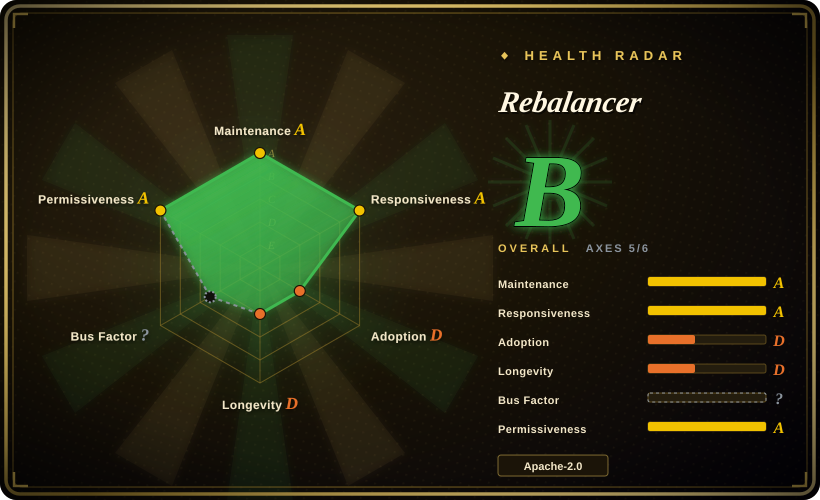
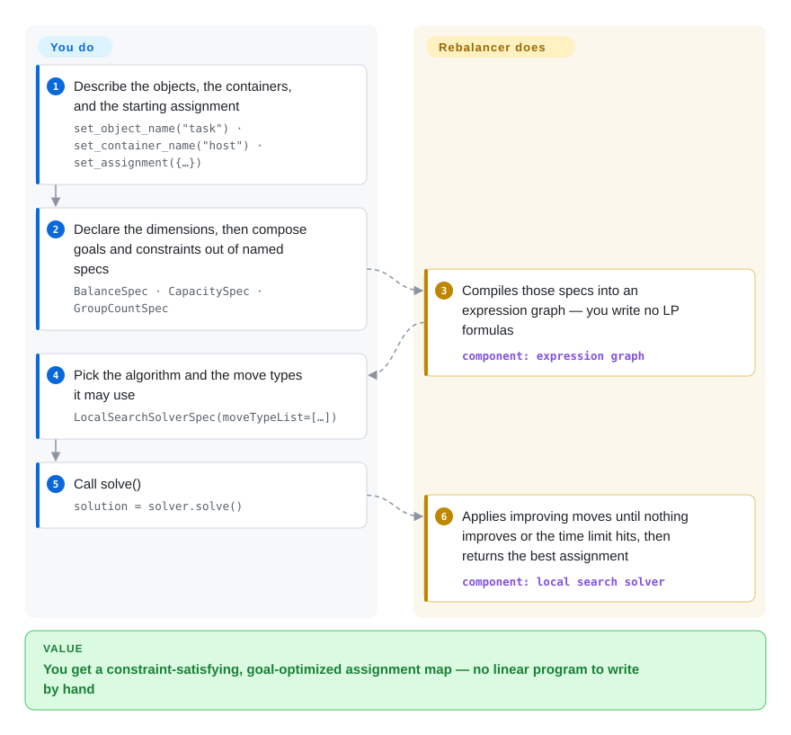

# Rebalancer

Meta's C++ (with Python bindings) library for **assignment problems**: describe objects, containers, dimensions, goals and constraints with a named-spec DSL, then let a local-search heuristic scale to millions of objects or hand the same model to a MIP backend (HiGHS / Gurobi / FICO Xpress) for a proven optimum.

## When to use

You're a platform or infrastructure engineer who has to re-place a large population of things into a smaller set of boxes — shards onto hosts, live services onto servers, inference replicas onto GPUs, traffic onto clusters — under capacity limits, balance targets, failure-domain spread, and "move as little as possible" policies. Writing that by hand as a linear program is tedious, and the LP you hand-write stops scaling in the low thousands of rows. You reach for Rebalancer because each policy is a named spec (`CapacitySpec`, `BalanceSpec`, `MinimizeMovementSpec`, `GroupCountSpec`, …) over dimensions you already have, the model stays the same while you try different algorithms, and the bundled local search targets a scale a hand-rolled MIP would not reach (the README claims ~1M objects and containers). The tradeoff that decides it against a general solver: you give up OR-Tools' breadth and ecosystem, and in exchange you get assignment-shaped policy specs plus a search engine already tuned for rebalancing at shard/host scale, with a MIP fallback on the same API.

You also reach for it when a placement policy is *contested* rather than merely large. The optional Rebalancer Explorer (`docker compose up`) shows a solved run as tables of objects, containers and scopes, diffs two assignments against every goal and constraint, and lets you try a hypothetical move to see whether it breaks a constraint — which is often faster than re-deriving the math you were about to argue about.

## How it works

You build the model; Rebalancer does the search. You declare the object and container names plus an initial assignment — that one map both defines the full universe of tasks and hosts and supplies the baseline that move-minimizing goals compare against — then attach dimensions (memory, CPU), then add goals (`BalanceSpec`) and hard constraints (`CapacitySpec`, `GroupCountSpec`) from the built-in spec library. Rebalancer compiles those specs into an expression graph instead of a linear program, and you read the result back as a plain `object → container` map. Crucially, the algorithm is chosen separately from the model: the default local search repeatedly evaluates small changes and applies the best improving one until it reaches a local optimum or hits your time limit, while the "optimal" path converts the same model into a MIP and hands it to HiGHS, Gurobi or FICO Xpress. The Explorer is a separate, optional inspection surface for a solved run — a debugging tool, not part of the solve path, and the reason you can explain a placement you no longer control by hand.

<!-- flow-steps:begin (generated from flows/rebalancer.json by tools/flow_card.py — do not edit) -->

Text version of the flow

1. **You**: Describe the objects, the containers, and the starting assignment — `set_object_name("task") · set_container_name("host") · set_assignment({…})`
2. **You**: Declare the dimensions, then compose goals and constraints out of named specs — `BalanceSpec · CapacitySpec · GroupCountSpec`
3. **Rebalancer**: Compiles those specs into an expression graph — you write no LP formulas — component: `expression graph`
4. **You**: Pick the algorithm and the move types it may use — `LocalSearchSolverSpec(moveTypeList=[…])`
5. **You**: Call solve() — `solution = solver.solve()`
6. **Rebalancer**: Applies improving moves until nothing improves or the time limit hits, then returns the best assignment — component: `local search solver`

**Value**: You get a constraint-satisfying, goal-optimized assignment map — no linear program to write by hand

<!-- flow-steps:end -->

## When NOT to use

- **Your problem is not "each object in exactly one container."** Rebalancer's whole abstraction assumes exactly that; splitting a job across containers, multi-hop routing (VRP/PDP), time-windowed scheduling, and priority queues are outside it. Use OR-Tools' routing library for vehicle routing, or an actual scheduler (Kubernetes scheduler, Slurm) when the question is *when* and *in what order* rather than *where*.
- **You need a general LP/MIP/CP model.** The spec catalogue is a fixed set of assignment-shaped goals and constraints (~25 documented). If your model needs arbitrary linear expressions, table constraints, interval scheduling or global constraints, write it in a real modelling layer (OR-Tools CP-SAT, Pyomo, CVXPY, JuMP); adding one to Rebalancer means touching its C++ expression nodes, not declaring a formula.
- **You want a solver, not a framework.** HiGHS — which Rebalancer itself calls for the open-source MIP path — is a standalone LP/MIP solver with a small stable API and no Folly/fbthrift in the build. If you are writing the model yourself anyway, taking HiGHS directly skips both the DSL and the Meta toolchain.
- **Your instance is small.** Tens of objects and a handful of containers do not repay the setup (objects, containers, dimensions, scopes, partitions, specs) or the C++/Folly build. A greedy loop, `scipy.optimize.linear_sum_assignment`, or a hand-written model in HiGHS will be faster to get right and easier to reason about.
- **You need a hard optimality guarantee on a huge instance.** Local search is a heuristic and says so in its own docs: it stops at a local optimum and can stall on non-smooth objectives (their example: "container A must contain either 5 or 8 objects exactly"). The MIP path is provably optimal *given enough time* but does not scale to millions; if a bound is the requirement, size the problem for a MIP solver (Gurobi, CP-SAT) instead of assuming the heuristic will get there.
- **You cannot take a young, single-vendor, alpha-stage dependency.** The OSS repo is about three months old, the Python wheel is classified "Development Status :: 3 - Alpha", and Meta owns the roadmap. Prebuilt packages (PyPI, `.deb`, `.rpm`, Homebrew formula) avoid the build, but the API should be treated as pre-stable.

## Comparison

| Alternative | In index | Our verdict | Tradeoff |
|---|---|---|---|
| [OR-Tools](or-tools.md) | ✅ | Choose OR-Tools when the model is general — arbitrary integer/linear constraints, scheduling, VRP — or when one library must cover many problem shapes; choose Rebalancer when the problem is exactly "re-place these objects under these policies" at shard/host scale and you would rather declare `BalanceSpec`/`CapacitySpec` than build the search loop. | OR-Tools is far broader, with a decade of community, docs and language coverage; Rebalancer trades that breadth for an assignment-shaped DSL, a search engine tuned for rebalancing, and a MIP fallback — at the cost of being three months old. |
| [HiGHS](highs.md) | ✅ | Choose HiGHS when you want a standalone, permissively licensed LP/MIP solver for a model you write yourself; choose Rebalancer when you want the assignment DSL and a scalable heuristic and only use HiGHS underneath for the small-instance optimal path. | They are complementary rather than competing: HiGHS is the solver Rebalancer calls, with a tiny stable surface and no Meta toolkit in the build, while Rebalancer's value is the DSL plus local search, not the LP solve. |
| [Timefold Solver](timefold-solver.md) · [OptaPlanner](optaplanner.md) | ✅ | Choose Timefold when the constraint model is really a rules engine (score calculation, planning entities and variables, JVM shop-floor scheduling); choose Rebalancer when the model is numeric dimensions on objects and containers over a C++/Python stack — and do not start new work on OptaPlanner, which is archived. | Both are heuristic planners with local search underneath; Timefold brings a mature constraint-streams DSL and a large enterprise practice on the JVM, Rebalancer brings simpler bindings and a MIP fallback but a far narrower spec catalogue and a much smaller community. The OptaPlanner entry exists to explain the lineage and the archive, not as a live option. |
| Gurobi / FICO Xpress | 未收录 | Choose Gurobi or Xpress directly when a proven optimum and a commercial SLA (or a free academic/community licence) are what you are buying; choose Rebalancer when you need heuristics at scale and would use these only for small instances. | These are the exact optimizers Rebalancer delegates to on its optimal path — commercial licence, no heuristic, no assignment DSL. Neither is open source and neither publishes a repository, so neither is indexed; pick one directly and you own the model, pick Rebalancer and you own a young framework instead. |
| [Descheduler](../dev-utilities/ops-infra/descheduler.md) | ✅ | Choose Kubernetes-native descheduling when the containers *are* Kubernetes pods and the goal is to correct placement drift inside the cluster; choose Rebalancer when you want to compute a placement offline for anything (hosts, shards, replicas, trucks) and apply it yourself afterwards. | In-cluster descheduling needs no model and keeps running unattended, but it only decides *which pods to evict* and cannot promise a destination; Rebalancer computes a placement you can review and diff, but you own the apply-back path and any drift while it runs. |

## Tech stack

- **Core:** C++20, single multi-threaded process, no daemon. Linux and macOS are the documented targets (Ubuntu, Fedora/RHEL, macOS Homebrew).
- **Build:** CMake (>= 3.20 documented; the pip wheel pins CMake 3.31) + Ninja. The README documents an unusual CMake design: it walks the tree and classifies every file as library, test, benchmark or executable, so newly added files need a manual CMake re-run.
- **Meta dependencies:** Folly, fbthrift (Thrift), fmt, glog, boost; GoogleTest/gmock and google-benchmark for the test/benchmark targets.
- **Python bindings:** built with `nanobind` via `scikit-build-core`; requires Python >= 3.12; package name `rebalancer`.
- **MIP backends:** HiGHS (open source), Gurobi and FICO Xpress (commercial).
- **Explorer:** a C++ Thrift service plus a small JSON proxy exposing `POST /v2/<method>`, fronted by a Next.js app; wired together by the repo's `docker-compose.yml`.
- **Extras in-tree:** examples (`algopt/rebalancer/examples/` — shard allocation, web balancing, knapsack, Sudoku, eight queens), benchmarks, and a Docusaurus site under `website/`.

## Dependencies

- **Prebuilt path (recommended):** `pip install rebalancer` (Python >= 3.12), or the release `.deb` / `.rpm` / Homebrew formula. v1.0.4 shipped `rebalancer_1.0.4_amd64.deb`, `rebalancer-1.0.4-1.x86_64.rpm`, an arm64-sonoma Homebrew bottle and cp312–cp314 wheels for `manylinux_2_28_x86_64` / `macosx_14_0_arm64` — so the covered platforms are x86-64 Linux and Apple-silicon macOS.
- **Source build:** a C++20 compiler (GCC 10+/Clang 11+), CMake, Ninja, and **fbthrift + Folly** — the README builds them from source on Ubuntu and takes them from Homebrew on macOS. This is the heaviest part of adopting the project.
- **Optimal path only:** one of HiGHS (`conda install conda-forge::highs` or `pip install highspy`), Gurobi, or FICO Xpress; Gurobi and Xpress need licences (free academic/community tiers exist).
- **Explorer only:** Docker + `docker compose`.
- **Runtime infrastructure:** none — no database, queue or external service. CPU-bound, with a configurable `solveTime`.

## Ops difficulty

**Low as a library, medium as a source build.** Installed from a wheel or distro package, Rebalancer is an in-process library: nothing to deploy, monitor or back up, and a solve is a CPU-bound call with an optional time limit. The burden sits in two places. First, building from source pulls Meta's Folly + fbthrift toolchain — the most common place adoption stalls, and the reason the prebuilt PyPI/`.deb`/`.rpm`/Homebrew routes exist; the repo's own CI has needed repeated fixes for this (several "fix GitHub CI builds" PRs). Second, the MIP path makes a third-party solver part of your licence and support story. The Explorer is the only networked component and is entirely optional; it is a real three-service deploy, so run it for debugging rather than keeping it up.

## Health & viability

- **Maintenance — A (measured 2026-09-22).** All 13 of the last 13 weeks had commits and the latest commit is same-day. Releases shipped v1.0.1 → v1.0.4 across June–July 2026, so the line is moving but not yet settling on an API.
- **Responsiveness — A.** Median first response across 22 qualifying pull requests measured at ~0 hours (same-day) with only 3 open issues. That pattern reads as a paid team doing triage, not a spare-time maintainer.
- **Governance / bus factor — B.** Owned by the `facebook` organization; 30 contributors active in the last 12 months, top-1 share 0.457 and top-3 0.662. A real team, but one vendor sets the roadmap, and "Re-sync with internal repository" recurs as a PR title — the public tree is periodically pushed out of Meta's monorepo rather than developed in the open.
- **Backing & longevity — the Lindy prior cuts against it.** As an OSS repository it is **103 days old** (created 2026-06-10), which is why the longevity axis scores D: age × still-active is *not* satisfiable yet on age. What replaces that prior is documented internal production use at Meta (hardware/server allocation, ML training and inference placement, traffic routing, load-balancing migrations) and the OSDI 2024 paper behind the design — [未验证] whether the paper's production numbers transfer to this OSS codebase, which is younger than the paper. Bet on it where the alternative is writing the search yourself; do not bet on it where you need a decade-old community.
- **Adoption — unknown (`?`, not a low score).** No package-registry or dependent-repo signal was measurable at scoring time; ~27 stars and 5 forks at three months old is a young-repo count, not social proof.
- **Risk flags.** Apache-2.0 with no relicense history. The flags are governance and maturity rather than licensing: single-vendor roadmap, an alpha classifier on the Python package, and a source build that drags in Folly/fbthrift. No CVEs or deprecation notices were found.

## Caveats (unverified)

- [未验证] Star / fork / open-issue counts (~27 / 5 / 3) and the contributor breakdown are as of 2026-09-22 and move fast on a young repo.
- [未验证] "~1M objects and containers" (README) and "100,000s of objects" (local-search docs) are the project's own scale claims; they were not reproduced here.
- [推断] The OSDI 2024 paper describes the system as used inside Meta; because the public repository postdates the paper, the paper's production experience is not evidence about this codebase's maturity.
- [推断] The responsiveness grade is derived from GitHub first-response timestamps; on a vendor-run repo it partly measures triage speed, not resolution quality.
- [未验证] Windows support looks absent rather than merely undocumented: the Python classifiers list Linux/macOS only, the README documents Ubuntu/Fedora/macOS, and the v1.0.4 assets are x86-64 Linux plus Apple-silicon macOS — yet the repo ships a `check_windows_macros.py` tool. Do not assume Windows builds are supported.
- [推断] The Timefold/OptaPlanner and Descheduler rows are reasoned from those projects' public positioning and were not benchmarked against Rebalancer.
