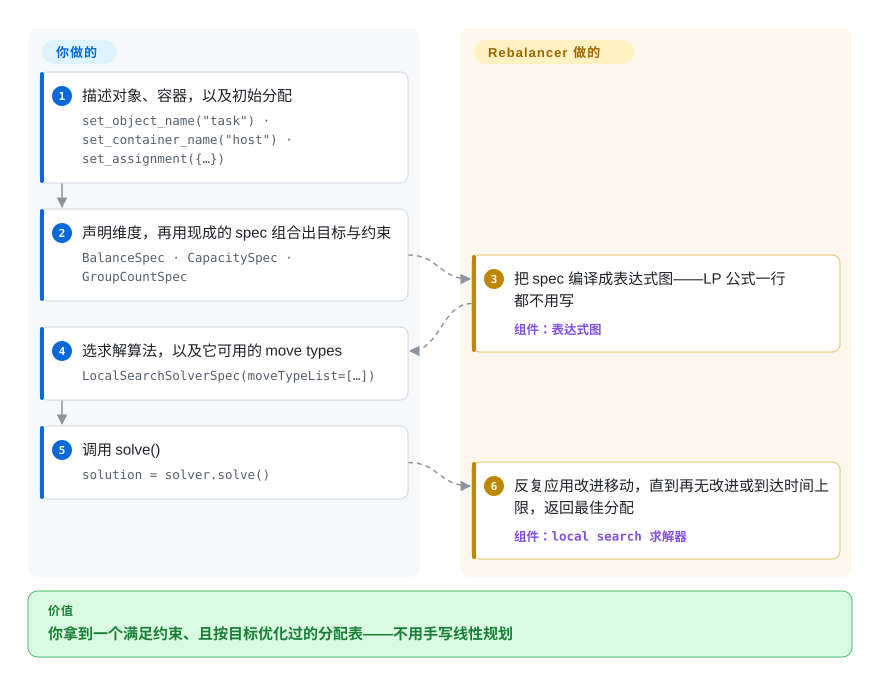

# Rebalancer

Meta 开源的 C++ 库（带 Python 绑定），解决**分配问题（assignment problem）**：用一套具名 spec 的 DSL 描述对象、容器、维度、目标与约束，再由局部搜索启发式撑到百万级对象，或把同一个模型交给 MIP 后端（HiGHS／Gurobi／FICO Xpress）求可证明的最优解。

## 何时使用

你是一个平台或基础设施工程师，要重新安置一大批东西到一小组盒子里——分片到主机、在线服务到服务器、推理副本到 GPU、流量到集群——同时要满足容量上限、均衡目标、故障域打散，以及「尽量少搬」的变更策略。把这套策略手写成线性规划很繁琐，而且手写的 LP 到几千行规模就顶住了。你选 Rebalancer，是因为每条策略都是一个具名 spec（`CapacitySpec`、`BalanceSpec`、`MinimizeMovementSpec`、`GroupCountSpec`……），挂在你自己已有的维度上；模型不变，换不同算法即可；自带的局部搜索能到手工 MIP 到不了的规模（README 自述约 100 万对象与容器）。相对通用求解器的取舍是：你放弃 OR-Tools 那种广度与生态，换回「分配问题形状」的策略 spec，加一个已经按分片／主机场景调过的搜索引擎，并且同一套 API 上还留着 MIP 兜底。

还有一种场景也会让你转向它：待定的不是规模，而是**placement 策略本身有争议**。可选的 Rebalancer Explorer（`docker compose up`）把一次求解结果显示成对象、容器、scope 的表格，能把两份分配按每条目标与约束做对比，还能试着搬一个对象看会不会破坏约束——这往往比重新推导那套大家正要吵的数学更快。

## 怎么用起来

模型你搭，搜索它做。你先声明对象名、容器名和初始分配——这张 map 同时定义了整个对象／容器全集，也是「尽量少搬」这类目标拿来对比的基线——再挂上维度（memory、CPU），然后从内置 spec 库里挑目标（`BalanceSpec`）和硬约束（`CapacitySpec`、`GroupCountSpec`）。Rebalancer 把这些 spec 编译成表达式图，而不是线性规划；结果你按普通的 `object → container` map 读回来。关键在于算法与模型是分开选的：默认的局部搜索反复评估小的改动、应用其中最好的那一个，直到到达局部最优或撞上你设的时间上限；而 optimal 路径把同一个模型转成 MIP，交给 HiGHS、Gurobi 或 FICO Xpress。Explorer 是另一条可选的观察面，只用于看一次已完成的求解——它是调试工具，不在求解链路上，也正是它让你还能解释一个已经不再由你手控的分配结果。

<!-- flow-steps:begin (generated from flows/rebalancer.json by tools/flow_card.py — do not edit) -->

流程文字版

1. **你**：描述对象、容器，以及初始分配 — `set_object_name("task") · set_container_name("host") · set_assignment({…})`
2. **你**：声明维度，再用现成的 spec 组合出目标与约束 — `BalanceSpec · CapacitySpec · GroupCountSpec`
3. **Rebalancer**：把 spec 编译成表达式图——LP 公式一行都不用写 — 组件：`表达式图`
4. **你**：选求解算法，以及它可用的 move types — `LocalSearchSolverSpec(moveTypeList=[…])`
5. **你**：调用 solve() — `solution = solver.solve()`
6. **Rebalancer**：反复应用改进移动，直到再无改进或到达时间上限，返回最佳分配 — 组件：`local search 求解器`

**价值**：你拿到一个满足约束、且按目标优化过的分配表——不用手写线性规划

<!-- flow-steps:end -->

## 何时不用

- **你的问题不是「每个对象恰好进一个容器」。** Rebalancer 整个抽象都建立在这一条上：把一个作业拆到多个容器、多跳路径规划（VRP／PDP）、带时间窗的调度、优先级队列，都在它之外。车辆路径问题用 OR-Tools 的 routing 库；当要回答的是「什么时候、以什么顺序」而不是「放到哪里」时，用真正的调度器（Kubernetes scheduler、Slurm）。
- **你要的是通用 LP／MIP／CP 模型。** 它的 spec 目录是一组固定的、分配问题形状的目标与约束（文档约 25 个）。如果模型需要任意线性表达式、表约束、区间调度或全局约束，用真正的建模层写（OR-Tools CP-SAT、Pyomo、CVXPY、JuMP）；给 Rebalancer 加一个，意味着改它的 C++ 表达式节点，而不是声明一条公式。
- **你要的是一个求解器，不是一个框架。** HiGHS——Rebalancer 自己在开源 MIP 路径上就是调它——是独立的 LP／MIP 求解器，API 小且稳定，构建链里没有 Folly／fbthrift。既然模型本来就要自己写，直接用 HiGHS 可以同时省掉 DSL 和 Meta 那套工具链。
- **你的实例很小。** 几十个对象配几个容器，撑不起这些准备工作（对象、容器、维度、scope、partition、spec），也撑不起 C++／Folly 的构建代价。一个贪心循环、`scipy.optimize.linear_sum_assignment`，或者用 HiGHS 手写模型，都会更快写对、也更好解释。
- **你要在超大实例上拿到最优性保证。** 局部搜索是启发式，它自己的文档就这么写：它会停在局部最优，遇到非平滑目标还容易卡住（文档的例子是「容器 A 必须恰好装 5 个或 8 个对象」）。MIP 路径在**时间足够**时可证明最优，但撑不到百万级；如果硬性要求是误差上界，就该把问题规模压到 MIP 求解器（Gurobi、CP-SAT）能处理的量级，而不是指望启发式自己走出来。
- **你接受不了一个年轻、单一厂商、alpha 阶段的依赖。** 这个 OSS 仓库只有约三个月历史，Python wheel 的分类器写着 “Development Status :: 3 - Alpha”，路线图归 Meta。预编译包（PyPI、`.deb`、`.rpm`、Homebrew formula）能绕开构建，但 API 应当按 pre-stable 对待。

## 横向对比

| 替代品 | 是否收录 | 我们的评价 | 取舍 |
|---|---|---|---|
| Google OR-Tools（CP-SAT／routing） | 未收录 | 模型是通用的——任意整数／线性约束、调度、VRP——或一个库要覆盖多种问题形状时选 OR-Tools；问题恰好是「按这些策略重新安置这些对象」、规模在分片／主机量级、且你宁愿声明 `BalanceSpec`／`CapacitySpec` 而不是自己搭搜索循环时选 Rebalancer。 | OR-Tools 广得多，有十年的社区、文档与多语言覆盖；Rebalancer 拿这份广度换来分配形状的 DSL、按 rebalancing 调过的搜索引擎和 MIP 兜底，代价是只有三个月历史。 |
| HiGHS | 未收录 | 你要一个独立、许可宽松的 LP／MIP 求解器、模型自己写时选 HiGHS；你要分配 DSL 加可扩展的启发式、只在小实例最优路径上用 HiGHS 时选 Rebalancer。 | 两者互补而非竞争：HiGHS 是 Rebalancer 内部调用的求解器，接口小而稳定、构建里没有 Meta 工具链；Rebalancer 的价值在 DSL 与局部搜索，而不在 LP 求解。 |
| Timefold／OptaPlanner | 未收录 | 约束模型实质是一套规则引擎（score 计算、planning entity 与 variable、JVM 上的车间排产）时选 Timefold；模型是对象与容器上的数值维度、技术栈在 C++／Python 时选 Rebalancer。 | 两者底层都是局部搜索式的启发式规划器；Timefold 带来成熟的 constraint-streams DSL 与 JVM 上大量企业实践，Rebalancer 带来更简单的绑定和 MIP 兜底，但 spec 目录窄得多、社区小得多。 |
| Gurobi／FICO Xpress | 未收录 | 你买的就是可证明最优加商用 SLA（或免费学术／社区许可）时，直接选 Gurobi 或 Xpress；你要的是大规模启发式、只在小实例上用到它们时选 Rebalancer。 | 它们正是 Rebalancer 在 optimal 路径上委派的求解器——商用许可、不做启发式、也没有分配 DSL。直接选它们，模型由你负责；选 Rebalancer，则由你换来一个年轻框架。 |
| Kubernetes descheduler／scheduler 插件 | 未收录 | 容器就是 Kubernetes Pod、目标只是让 kube-scheduler 自己的决策更好时选集群内方案；你想离线为任何东西（主机、分片、副本、卡车）算出 placement、之后再自己应用时选 Rebalancer。 | 集群内插件留在 scheduler 自己的 predicate 模型里，不需要额外系统；Rebalancer 是外部优化器，策略 DSL 丰富得多、还有调试 UI，但没有集群集成——回写路径和运行期间的漂移都由你负责。 |

## 技术栈

- **核心：** C++20，单进程多线程，无守护进程。文档覆盖的目标平台是 Linux 与 macOS（Ubuntu、Fedora／RHEL、macOS Homebrew）。
- **构建：** CMake（文档要求 >= 3.20；pip wheel 锁 CMake 3.31）加 Ninja。README 记了一处不寻常的 CMake 设计：它遍历整棵目录树，把每个文件分类成库、测试、benchmark 或可执行文件，所以新增文件要手动重跑一次 CMake。
- **Meta 侧依赖：** Folly、fbthrift（Thrift）、fmt、glog、boost；测试与 benchmark 用 GoogleTest／gmock 和 google-benchmark。
- **Python 绑定：** 用 `nanobind` 加 `scikit-build-core` 构建；要求 Python >= 3.12；包名 `rebalancer`。
- **MIP 后端：** HiGHS（开源）、Gurobi 与 FICO Xpress（商用）。
- **Explorer：** 一个 C++ Thrift 服务，加一个小型 JSON 代理（暴露 `POST /v2/<method>`），前面是 Next.js 应用；由仓库里的 `docker-compose.yml` 串起来。
- **仓库内的附属物：** 示例（`algopt/rebalancer/examples/`，含分片分配、web 均衡、背包、数独、八皇后）、benchmark，以及 `website/` 下的 Docusaurus 站点。

## 依赖

- **走预编译包（推荐）：** `pip install rebalancer`（Python >= 3.12），或 release 里的 `.deb`／`.rpm`／Homebrew formula。v1.0.4 发布了 `rebalancer_1.0.4_amd64.deb`、`rebalancer-1.0.4-1.x86_64.rpm`、arm64-sonoma 的 Homebrew bottle，以及 `manylinux_2_28_x86_64`／`macosx_14_0_arm64` 的 cp312–cp314 wheel——覆盖的平台是 x86-64 Linux 与 Apple 芯片 macOS。
- **从源码构建：** C++20 编译器（GCC 10+／Clang 11+）、CMake、Ninja，以及 **fbthrift 与 Folly**——README 在 Ubuntu 上从源码构建它们，在 macOS 上走 Homebrew。这是采用该项目最重的一段。
- **只走最优路径时：** HiGHS（`conda install conda-forge::highs` 或 `pip install highspy`）、Gurobi、FICO Xpress 任选其一；Gurobi 与 Xpress 需要许可（有免费学术／社区档）。
- **只跑 Explorer 时：** Docker 加 `docker compose`。
- **运行时基础设施：** 无——不需要数据库、队列或外部服务。计算是 CPU 密集的，可设 `solveTime`。

## 运维难度

**作为库是低，从源码构建是中。** 从 wheel 或发行版包装好后，Rebalancer 是一个进程内库：没有东西要部署、监控或备份，一次求解就是一次带可选时间上限的 CPU 密集型调用。负担集中在两处。第一，从源码构建会拉进 Meta 的 Folly 加 fbthrift 工具链，这是采用最常卡住的地方，也是预编译 PyPI／`.deb`／`.rpm`／Homebrew 路线存在的原因；仓库自己的 CI 就为此反复修过（多个 “fix GitHub CI builds” PR）。第二，MIP 路径会把第三方求解器带进你的许可与支持故事里。Explorer 是唯一的联网组件，且完全可选；它是一次真刀真枪的三服务部署，所以拿它调试就好，别长期挂着。

## 健康度与可持续性

- **维护——A（2026-09-22 实测）。** 最近 13 周每周都有提交，最新一次提交就是当天。2026 年 6–7 月间从 v1.0.1 发到 v1.0.4，说明这条线在动，但还没在 API 上稳定下来。
- **响应速度——A。** 22 条合格 PR 的中位首次响应约 0 小时（当天），且只有 3 个 open issue。这种形态更像有薪团队在做分诊，而不是业余维护者。
- **治理与巴士因子——B。** 归属 `facebook` 组织；最近 12 个月有 30 位活跃贡献者，top-1 占比 0.457、top-3 占比 0.662。团队是真的，但路线图由单一厂商决定，而且 “Re-sync with internal repository” 反复出现在 PR 标题里——公开仓库是定期从 Meta 内部 monorepo 推出来的，不是完全在公开场合开发。
- **背书与长寿性——Lindy 先验在这里是反面的。** 作为 OSS 仓库它只有 **103 天**（创建于 2026-06-10），longevity 轴因此只拿到 D：年龄 × 仍在活跃，在「年龄」这一项上还无从谈起。替代这个先验的是 README 记录的 Meta 内部生产使用（硬件与服务器分配、ML 训练与推理 placement、流量路由、负载均衡迁移），以及设计背后的 OSDI 2024 论文——[未验证] 论文里的生产数据能否迁移到这个比论文更年轻的 OSS 代码库。可以押它的场景是「替代方案是自己写搜索」；需要十年老社区的场景不要押它。
- **采用度——未知（`?`，不是低分）。** 计分时测不到包注册表或依赖仓库类信号；三个月大、约 27 星与 5 fork，是年轻仓库的计数，不构成社会证明。
- **风险信号。** Apache-2.0，无 relicense 历史。风险信号在治理与成熟度而不在许可：单一厂商路线图、Python 包的 alpha 分类器、以及会把 Folly／fbthrift 拖进来的源码构建。未发现 CVE 或弃用通告。

## 存疑（未验证）

- [未验证] star／fork／open issue 数（约 27／5／3）与贡献者分布截至 2026-09-22；对一个年轻仓库来说这些数变化很快。
- [未验证] 「约 100 万对象与容器」（README）与「10 万级对象」（local search 文档）是项目自己的规模声称，此处未复现。
- [推断] OSDI 2024 论文描述的是 Meta 内部在用的系统；公开仓库晚于论文，所以论文里的生产经验不能作为这个代码库成熟度的证据。
- [推断] 响应速度评级来自 GitHub 的首次响应时间戳；在厂商自营仓库上，它部分衡量的是分诊速度，而不是解决质量。
- [未验证] Windows 看起来是「不支持」而不只是「没写」：Python 分类器只列 Linux／macOS，README 只写 Ubuntu／Fedora／macOS，v1.0.4 的产物也只有 x86-64 Linux 与 Apple 芯片 macOS——但仓库又带了一个 `check_windows_macros.py` 工具。不要假定 Windows 可构建。
- [推断] Timefold／OptaPlanner 与 Kubernetes descheduler 两行依据的是它们公开的定位，未与 Rebalancer 做基准对比。
