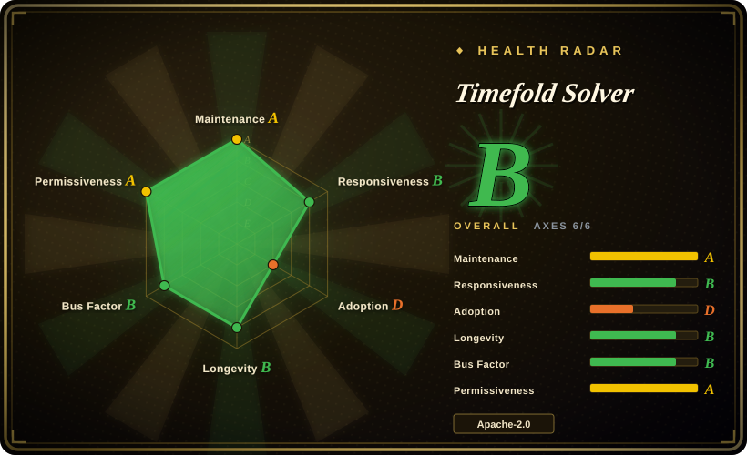
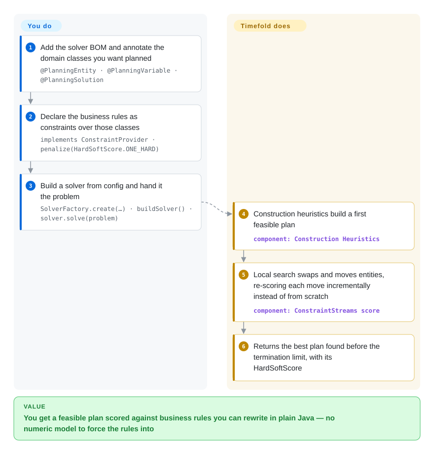

# Timefold Solver

The Java/Kotlin constraint solver by the original OptaPlanner team: annotate your domain model, express the business rules as constraints, and let construction heuristics plus local search find a good schedule, route or roster.

## When to use

You are building a JVM service that has to produce a *plan* — which employee works which shift, which vehicle takes which delivery, which lesson goes in which room, which job runs on which machine — and the rules that make a plan good are business rules your team keeps changing. You reach for Timefold because the model is your ordinary domain classes with annotations (`@PlanningEntity`, `@PlanningVariable`) and the rules are Java: a `ConstraintProvider` that says `forEachUniquePair(Lesson.class, Joiners.equal(Lesson::getTimeslot)).penalize(HardSoftScore.ONE_HARD)`, which a domain expert can argue about without reading solver internals. The deciding tradeoff against the rest of this category is rules-vs-arithmetic: [OR-Tools](or-tools.md) and [HiGHS](highs.md) want a numeric model and a batch solve, [Rebalancer](rebalancer.md) wants objects, containers and policy specs at very large scale, and Timefold wants a score function over annotated entities — which is what you want when the constraint list is long, soft, and politically negotiated, and when the plan must be re-solved incrementally while the service runs. What you accept in exchange is the JVM, and an open-core project where some capabilities live in the commercial Enterprise Edition.

## How it works

You describe the planning problem; Timefold searches the space of plans. Annotating the domain marks *what can vary* (`@PlanningVariable` on a lesson's timeslot and room) and `@PlanningSolution` marks the class that holds the whole problem plus its score. The `ConstraintProvider` is where your policy lives: it returns a set of named constraints, each a stream of matches that are penalized or rewarded with a `HardSoftScore`. From there the solver runs a fixed pipeline — construction heuristics build a first feasible plan, then local search repeatedly proposes moves (change a variable, swap two entities) and keeps the improving ones. The important mechanism detail is that the score is recalculated *incrementally* per move rather than from scratch, which is why the same constraint code stays affordable in a long-running solver. What stays on your side: writing constraints that are both correct and cheap, choosing the termination (`withTerminationSpentLimit`), and deciding when a solution is good enough — Timefold finds good plans, it does not prove optimality.

<!-- flow-steps:begin (generated from flows/timefold-solver.json by tools/flow_card.py — do not edit) -->

Text version of the flow

1. **You**: Add the solver BOM and annotate the domain classes you want planned — `@PlanningEntity · @PlanningVariable · @PlanningSolution`
2. **You**: Declare the business rules as constraints over those classes — `implements ConstraintProvider · penalize(HardSoftScore.ONE_HARD)`
3. **You**: Build a solver from config and hand it the problem — `SolverFactory.create(…) · buildSolver() · solver.solve(problem)`
4. **Timefold Solver**: Construction heuristics build a first feasible plan — component: `Construction Heuristics`
5. **Timefold Solver**: Local search swaps and moves entities, re-scoring each move incrementally instead of from scratch — component: `ConstraintStreams score`
6. **Timefold Solver**: Returns the best plan found before the termination limit, with its HardSoftScore

**Value**: You get a feasible plan scored against business rules you can rewrite in plain Java — no numeric model to force the rules into

<!-- flow-steps:end -->

## When NOT to use

- **Your stack is Python-first, or the solve is a batch job rather than a live plan.** Use [OR-Tools](or-tools.md): CP-SAT covers the same scheduling and routing shapes with a Python API, and you skip the JVM and the JVM-shaped domain model.
- **The model is a numeric LP/MIP/QP with no notion of "soft business rules".** Use [HiGHS](highs.md): if the constraints are linear expressions over a matrix, a score function over entities is the wrong abstraction, and an exact solver gives you a bound.
- **The problem is resource rebalancing over objects and containers at very large scale with simple policies.** Use [Rebalancer](rebalancer.md): policy specs plus a local search tuned for millions of objects will outperform a score-based planner whose incremental score calculation is the bottleneck.
- **You inherited an OptaPlanner 9.x application.** Do not start on [OptaPlanner](optaplanner.md) — that repository is archived and its code moved into Apache KIE Drools; Timefold is the fork by the original team, and its migration path is the one with a maintained release train.
- **You need every capability under a permissive licence, with no commercial tier at all.** Timefold is open-core: this repository is Apache-2.0, but the Enterprise Edition is a non-open-source commercial offering, so check which side of that line your required features fall on before committing. If nothing may be gated, [OR-Tools](or-tools.md) is a single-licence alternative.
- **You want proof of optimality on a small instance.** Timefold is a metaheuristic planner: it returns the best plan it found within the termination limit, not a certificate. For a provably optimal small model, write the LP/MIP and hand it to [HiGHS](highs.md) or [OR-Tools](or-tools.md).

## Comparison

| Alternative | In index | Our verdict | Tradeoff |
|---|---|---|---|
| [OptaPlanner](optaplanner.md) | ✅ | Choose Timefold for any new work: it is the same design lineage with a live release train, whereas OptaPlanner is archived and its code now lives inside Apache KIE Drools. | The annotation/ConstraintStreams model transfers almost unchanged, so the only reason to pick OptaPlanner is an existing 9.x codebase — and that reason argues for migrating, not for starting there. |
| [Rebalancer](rebalancer.md) | ✅ | Choose Rebalancer when the plan is really an assignment of objects to containers with numeric policies at shard/host scale; choose Timefold when the plan has to satisfy long lists of soft, negotiable rules over rich domain entities. | Rebalancer scales further and keeps everything in C++/Python with a policy DSL; Timefold keeps the rules in Java where the business can read them, and pays in JVM ops and an open-core licence boundary. |
| [OR-Tools](or-tools.md) | ✅ | Choose OR-Tools when the same service also needs non-planning optimization, or when Python/C#/.NET is the team's language; choose Timefold when planning is the product and the rules change often. | OR-Tools is broader, permissively licensed end-to-end and language-diverse; Timefold gives a score-based rules model with incremental recalculation, which is the harder thing to rebuild on top of a general solver. |
| [HiGHS](highs.md) | ✅ | Choose HiGHS when the model is linear/quadratic and written down as a matrix; choose Timefold when the model is a search over combinatorially many plans with soft scores. | They solve different problems: HiGHS gives an exact optimum with no notion of soft business rules, Timefold gives a good plan with no optimality certificate but far more expressive policy code. |
| Gurobi / FICO Xpress | 未收录 | Buy a commercial solver when the hard part is the linear/integer solve itself; choose Timefold when the hard part is expressing and maintaining the rules. | Commercial solvers are closed-source optimization engines with per-seat licensing; Timefold is a planning framework whose Enterprise Edition is commercial — different layers, and nothing prevents pairing them. |

## Tech stack

- **Language:** Java (README badges Java 21+) with a Kotlin integration; the build is Maven (`./mvnw clean install -Dquickly`) with Gradle supported in the quickstarts.
- **Artifacts:** published to Maven Central under `ai.timefold.solver`, consumed through the `timefold-solver-bom` (v2.6.0 at verification time).
- **Core abstractions:** `@PlanningEntity` / `@PlanningVariable` / `@PlanningSolution` annotations, `HardSoftScore` (and richer score types), `ConstraintProvider` with the ConstraintStreams API, `SolverFactory` / `SolverConfig` / `Solver`.
- **Sibling projects in the same org (not covered by this page):** a Python port (`TimefoldAI/timefold-solver-python`), quickstarts, benchmarks and notebooks.
- **Docs:** `docs.timefold.ai` for the getting-started guides and reference.

## Dependencies

- **Runtime:** a JVM (Java 21+) and the Maven/Gradle artifacts from Maven Central; no service, database or native toolchain is required for the community edition.
- **Build from source:** JDK 21+, Maven 3.9.11+, then `./mvnw clean install -Dquickly`.
- **Optional integrations:** Quarkus and Spring Boot modules ship in the same product line; the quickstarts include a Quarkus variant.
- **Enterprise Edition:** separately licensed artifacts — check whether the features you need are in the community repository or behind that licence.
- **Runtime infrastructure:** none beyond the JVM; solving is CPU-bound and can be terminated by score limit, time limit or unimproved-time limit.

## Ops difficulty

**Low to medium, and it is really JVM operations.** The solver is a library inside your application; there is no server to run. The real operational surface is the one you already have — heap sizing for large datasets, GC pauses during long solves, and the discipline of *not* blocking a request thread on a solve (the standard pattern is to solve asynchronously and expose the best solution so far). In exchange for that you get good termination controls, so a solve can be bounded by wall-clock time rather than guesses. The only genuinely project-specific operational risk is the licence boundary: because the Enterprise Edition is commercial, a feature you rely on can sit on the other side of an upgrade decision.

## Health & viability

- **Maintenance — A; Responsiveness — B; Longevity — B; Governance — B; Risk/licence — A; Adoption — D (measured 2026-09-22).** Overall **B (6/6)**. The project is pushed daily and released frequently (v2.5.0 and v2.6.0 within 2026-08 and 2026-09, alongside a v1.34.0 line), which is exactly what a team that took over a retired project has to demonstrate — and does.
- **Adoption — D, and the grade is worth reading carefully.** The radar scores adoption from package-registry and dependent-repository signals, and Timefold's signal is young rather than absent: it is a 2023 fork, so it does not have OptaPlanner's decade of StackOverflow and enterprise history behind the same artifact names. Treat this as "the ecosystem is still being rebuilt", not "nobody uses it". [推断]
- **Governance / bus factor.** The repository is owned by `TimefoldAI` (a company), and the project is explicitly run by the original OptaPlanner team rather than by a foundation. The README states the split plainly: Community Edition in this repo under Apache-2.0, Enterprise Edition non-open-source and commercial. Vendor ownership plus open-core is a coherent model for a solver, but it means the roadmap is a business decision.
- **Backing & longevity — a Lindy case with a discontinuity.** The *design* is old (it descends from OptaPlanner's 2011 codebase, and every source file is stated to have been modified in the 2023 fork), while the *repository* is four years old and the commercial entity behind it is the thing to evaluate. Unlike a foundation project, if Timefold the company changed direction, the code would still be Apache-2.0 and forkable — that is the mitigation.
- **Risk flags.** Open-core feature gating is the flag that matters most here, plus the provenance note that Timefold is a derivative work of OptaPlanner/OptaPy with copyrights of Red Hat Inc. and contributors — relevant if your legal review is picky about fork lineage. No relicense history, no CLA issue, and the community edition carries a permissive Apache-2.0 licence.

## Caveats (unverified)

- [未验证] Star (~1.8k), fork (~228) and open-issue (~108) counts are as of 2026-09-22.
- [未验证] Which specific capabilities are gated behind the Enterprise Edition was not enumerated; only the README's statement of the split is verified.
- [推断] The reading of the D adoption grade as "ecosystem being rebuilt rather than absent" is my interpretation of a grade computed from registry/dependent-repo signals; the underlying measurement was not inspected.
- [推断] The claim that Timefold is the migration target for OptaPlanner users follows from the README's fork statement plus the OptaPlanner repository's own archive notice ("OplaPlanner has moved to ... incubator-kie-drools"), not from an official migration guide.
- [未验证] Whether the v1.34.0 releases in the same repository are a maintained parallel line or an artifact of versioning was not determined.
- [未验证] The Python port (`TimefoldAI/timefold-solver-python`) is a separate repository with its own release train; it is referenced here as a sibling project and was not evaluated.
- [推断] The comparison rows against commercial solvers are reasoned from those products' public positioning, not benchmarked against Timefold Solver.
