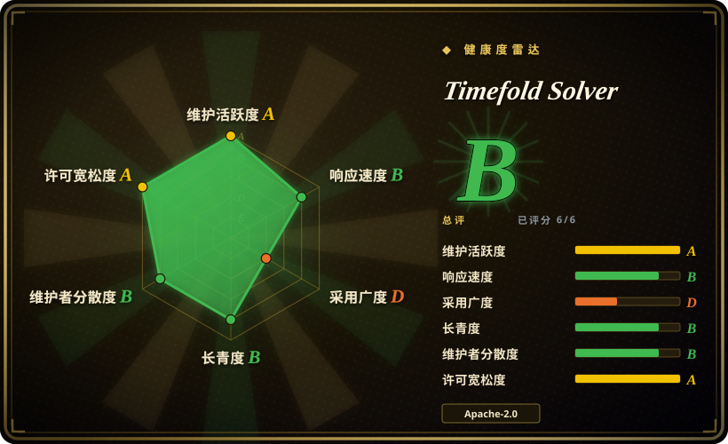
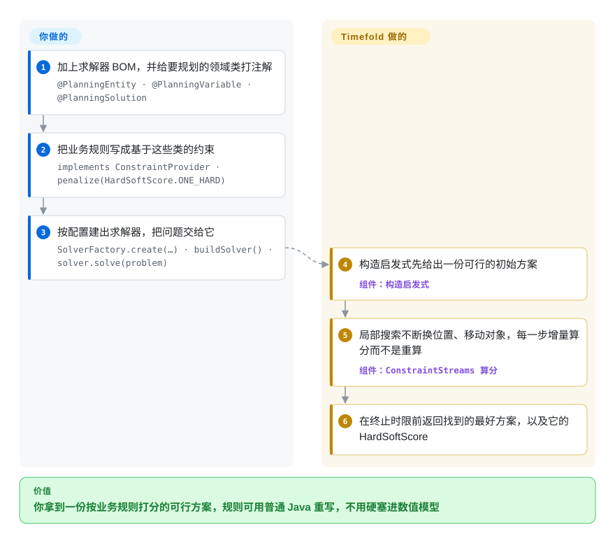

# Timefold Solver

由原 OptaPlanner 团队开发的 Java／Kotlin 约束求解器：给领域模型打注解，把业务规则写成约束，再由构造启发式加局部搜索找出可用的排班、路线或课表。

## 何时使用

你在做一个 JVM 服务，它的产出是一份**计划**——谁上哪个班、哪辆车跑哪单、哪节课在哪个教室、哪个作业在哪台机器——而让计划变好的那些规则，是团队会不断改的业务规则。你选 Timefold，是因为模型就是你平常的领域类加注解（`@PlanningEntity`、`@PlanningVariable`），规则也是 Java：一个 `ConstraintProvider` 里写 `forEachUniquePair(Lesson.class, Joiners.equal(Lesson::getTimeslot)).penalize(HardSoftScore.ONE_HARD)`，业务方不用读求解器内部就能就它争辩。相对本分类其他条目，决定性的取舍是「规则对算术」：[OR-Tools](or-tools.zh.md) 与 [HiGHS](highs.zh.md) 要的是数值模型加一次性求解，[Rebalancer](rebalancer.zh.md) 要的是对象、容器与策略 spec 在超大规模上的组合，而 Timefold 要的是「对带注解实体打分的函数」——当约束条目又长、又软、又需要谈判，且计划要在服务运行中增量重解时，这正是你要的那种东西。你换来的代价是 JVM，以及一个 open-core 项目：有些能力在商业版 Enterprise Edition 里。

## 怎么用起来

你描述规划问题，Timefold 去搜计划空间。打注解标出**什么可以变**（课程的时间槽与教室上是 `@PlanningVariable`），`@PlanningSolution` 标出承载整个问题与分数的那一类。`ConstraintProvider` 是你的策略所在：它返回一组具名约束，每条约束是一串匹配，用 `HardSoftScore` 去罚或奖。之后求解器跑一条固定流水线——构造启发式先给出一份可行计划，局部搜索不断提出改动（换一个变量、交换两个实体），保留能改进的那些。机制上要紧的细节是：分数是**增量重算**的，不是每次从头算，这正是同一份约束代码能在长时间求解里扛住的原因。留在你这边的是：把约束写得既正确又便宜、选择终止条件（`withTerminationSpentLimit`）、以及判断什么时候够好了——Timefold 找的是好计划，它不证明最优。

<!-- flow-steps:begin (generated from flows/timefold-solver.json by tools/flow_card.py — do not edit) -->

流程文字版

1. **你**：加上求解器 BOM，并给要规划的领域类打注解 — `@PlanningEntity · @PlanningVariable · @PlanningSolution`
2. **你**：把业务规则写成基于这些类的约束 — `implements ConstraintProvider · penalize(HardSoftScore.ONE_HARD)`
3. **你**：按配置建出求解器，把问题交给它 — `SolverFactory.create(…) · buildSolver() · solver.solve(problem)`
4. **Timefold Solver**：构造启发式先给出一份可行的初始方案 — 组件：`构造启发式`
5. **Timefold Solver**：局部搜索不断换位置、移动对象，每一步增量算分而不是重算 — 组件：`ConstraintStreams 算分`
6. **Timefold Solver**：在终止时限前返回找到的最好方案，以及它的 HardSoftScore

**价值**：你拿到一份按业务规则打分的可行方案，规则可用普通 Java 重写，不用硬塞进数值模型

<!-- flow-steps:end -->

## 何时不用

- **你的技术栈是 Python 优先，或者求解是一次批处理而不是在线计划。** 用 [OR-Tools](or-tools.zh.md)：CP-SAT 用 Python API 覆盖同样的排程与路径形状，还省掉 JVM 与 JVM 形状的领域模型。
- **模型是没有「软业务规则」概念的数值 LP／MIP／QP。** 用 [HiGHS](highs.zh.md)：约束若是矩阵上的线性表达式，「对实体打分」就是错的抽象，而精确求解器至少给你一个界。
- **问题是超大规模、策略简单的对象到容器资源重分配。** 用 [Rebalancer](rebalancer.zh.md)：策略 spec 加按百万级对象调过的局部搜索，会胜过一台增量算分成为瓶颈的打分式规划器。
- **你接手的是一个 OptaPlanner 9.x 应用。** 不要新起项目在 [OptaPlanner](optaplanner.zh.md) 上——那个仓库已归档，代码并入 Apache KIE Drools；Timefold 是原团队的 fork，它的迁移路径才是有维护发版列车的那个。
- **你要求所有能力都在宽松许可下，完全不接受商业档。** Timefold 是 open-core：本仓库是 Apache-2.0，但 Enterprise Edition 是非开源的商业产品，所以动手前先确认你要的功能落在线哪一边。如果什么都不允许被卡，[OR-Tools](or-tools.zh.md) 是单一许可的替代。
- **你要在小实例上拿到最优性证明。** Timefold 是元启发式规划器：它返回终止时限内找到的最好计划，而不是一张最优性证书。要可证明最优的小模型，就把 LP／MIP 写出来交给 [HiGHS](highs.zh.md) 或 [OR-Tools](or-tools.zh.md)。

## 横向对比

| 替代品 | 是否收录 | 我们的评价 | 取舍 |
|---|---|---|---|
| [OptaPlanner](optaplanner.zh.md) | ✅ | 任何新工作都选 Timefold：同一条设计血脉，但发版列车还在跑；OptaPlanner 已归档，代码现在住进 Apache KIE Drools。 | 注解与 ConstraintStreams 的模型几乎原样可迁移，所以选 OptaPlanner 的唯一理由是已有 9.x 代码库——而那个理由支持的是迁移，不是在它上面新起项目。 |
| [Rebalancer](rebalancer.zh.md) | ✅ | 计划实质是「对象到容器的分配 + 数值策略」、规模在分片／主机量级时选 Rebalancer；计划要在丰富的领域实体上满足一长串软的、可谈判的规则时选 Timefold。 | Rebalancer 撑得更大，而且全在 C++／Python 里配策略 DSL；Timefold 把规则留在 Java 里、业务方能读，代价是 JVM 运维与 open-core 的许可边界。 |
| [OR-Tools](or-tools.zh.md) | ✅ | 同一个服务还要做规划之外的优化、或团队语言是 Python／C#／.NET 时选 OR-Tools；规划本身就是产品、且规则常改时选 Timefold。 | OR-Tools 更广、端到端宽松许可、语言更多；Timefold 给的是打分式规则模型与增量算分，而那恰恰是「在通用求解器之上自己补」最难补的一块。 |
| [HiGHS](highs.zh.md) | ✅ | 模型是线性／二次、已经写成矩阵时选 HiGHS；模型是在组合爆炸的计划空间里按软分数搜索时选 Timefold。 | 两者解的是不同问题：HiGHS 给精确最优但没有软业务规则的概念，Timefold 给可用计划、没有最优性证书，却能表达丰富得多的策略代码。 |
| Gurobi／FICO Xpress | 未收录 | 难点在线性／整数求解本身时买商用求解器；难点在规则怎么表达与维护时选 Timefold。 | 商用求解器是闭源最优化引擎、按席位授权；Timefold 是规划框架、其 Enterprise Edition 是商业的——不同层次，且并不妨碍两者组合使用。 |

## 技术栈

- **语言：** Java（README 徽章标 Java 21+），另有 Kotlin 集成；构建是 Maven（`./mvnw clean install -Dquickly`），quickstarts 里也支持 Gradle。
- **制品：** 发布到 Maven Central，坐标前缀 `ai.timefold.solver`，通过 `timefold-solver-bom` 引入（核对时为 v2.6.0）。
- **核心抽象：** `@PlanningEntity`／`@PlanningVariable`／`@PlanningSolution` 注解、`HardSoftScore`（以及更丰富的分数类型）、基于 ConstraintStreams 的 `ConstraintProvider`、`SolverFactory`／`SolverConfig`／`Solver`。
- **同组织的兄弟项目（本页不覆盖）：** Python 移植（`TimefoldAI/timefold-solver-python`）、quickstarts、benchmark 与 notebook。
- **文档：** `docs.timefold.ai` 提供入门指南与参考。

## 依赖

- **运行时：** 一个 JVM（Java 21+）加 Maven Central 上的制品；社区版不需要服务、数据库或原生工具链。
- **从源码构建：** JDK 21+、Maven 3.9.11+，然后 `./mvnw clean install -Dquickly`。
- **可选集成：** 同一产品线里带 Quarkus 与 Spring Boot 模块；quickstarts 里有一个 Quarkus 变体。
- **Enterprise Edition：** 另行授权的制品——先确认你要的功能在社区仓库里，还是在那个许可之后。
- **运行时基础设施：** 除 JVM 之外没有；求解是 CPU 密集的，可以用分数上限、时间上限或「无改进时间」上限终止。

## 运维难度

**低到中，而且实质上是 JVM 运维。** 求解器是你应用里的一个库，没有要跑的服务器。真正的运维面就是你本来就有的那套——大数据集的堆大小、长时间求解中的 GC 停顿，以及「不要拿请求线程去等一次求解」的纪律（标准做法是异步求解、对外暴露当前最好的解）。作为交换，它给了不错的终止控制，一次求解可以用墙钟时间框住而不是靠猜。唯一属于项目自身的运维风险是许可边界：因为 Enterprise Edition 是商业的，你依赖的功能有可能落在一次升级决策的另一侧。

## 健康度与可持续性

- **维护 A、响应 B、长寿 B、治理 B、许可 A、采用 D（2026-09-22 实测）。** 总分 **B（6/6）**。项目每天有推送、发版频繁（2026-08 与 2026-09 内 v2.5.0 与 v2.6.0 相继发布，同时还并行一条 v1.34.0 线），这正是一个接手了已退役项目的团队必须证明、而且确实证明了的。
- **采用 D，这一档值得细读。** 雷达的采用分来自包注册表与依赖仓库信号，Timefold 的信号是「年轻」而不是「没有」：它是 2023 年的 fork，所以同名制品背后没有 OptaPlanner 那十年的 StackOverflow 与企业史。请把它读成「生态还在重建」，而不是「没人在用」。[推断]
- **治理与巴士因子。** 仓库归 `TimefoldAI`（一家公司）所有，项目明确由原 OptaPlanner 团队运营，而不是基金会。README 把切分写得很直白：本仓库的 Community Edition 是 Apache-2.0，Enterprise Edition 非开源、需商业许可。厂商自营加 open-core 对一个求解器来说是一种自洽的模式，但它意味着路线图是一个商业决定。
- **背书与长寿性——一个带断点的 Lindy 案例。** **设计**很老（血脉可追到 OptaPlanner 2011 年的代码库，且 fork 时声明每个源文件都被修改过），而**仓库**只有四年多，真正要评估的是它背后的商业实体。与基金会项目不同，如果 Timefold 这家公司改变方向，代码仍然是 Apache-2.0、仍然可 fork——这就是缓释手段。
- **风险信号。** 最重要的是 open-core 功能阉割；其次是来源声明：Timefold 是 OptaPlanner／OptaPy 的衍生作品，含 Red Hat Inc. 与贡献者的版权——如果你的法务对 fork 血统较真，这条相关。没有 relicense 历史，没有 CLA 问题，社区版是宽松的 Apache-2.0。

## 存疑（未验证）

- [未验证] star（约 1.8k）、fork（约 228）与 open issue（约 108）数截至 2026-09-22。
- [未验证] 具体哪些能力被 Enterprise Edition 卡住未逐条列举；此处只核实了 README 对切分的表述。
- [推断] 把采用分 D 读作「生态在重建而非不存在」，是我对一项由注册表／依赖仓库信号算出的评分的解释；底层测量未逐项查看。
- [推断] 「Timefold 是 OptaPlanner 用户的迁移目标」这一说法依据的是 README 的 fork 声明加上 OptaPlanner 仓库自己的归档通告（「OplaPlanner has moved to ... incubator-kie-drools」），并非来自官方迁移指南。
- [未验证] 同一仓库里的 v1.34.0 系列是并行的维护线，还是版本编号的产物，未查明。
- [未验证] Python 移植（`TimefoldAI/timefold-solver-python`）是另一个仓库、有自己的发版节奏；此处仅作为兄弟项目提及，未做评估。
- [推断] 与商用求解器那一行依据的是那些产品的公开定位，未与 Timefold Solver 做基准对比。
