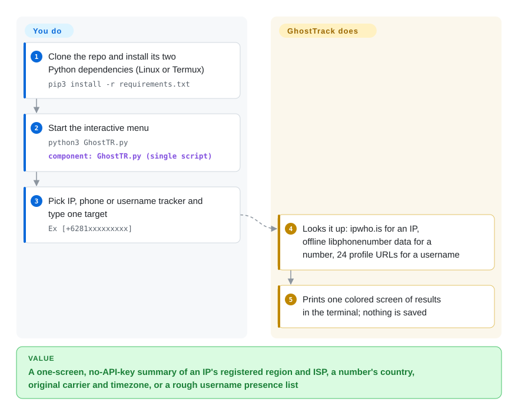

# GhostTrack

Someone hands you a phone number or an IP and you want to know "where it is" — GhostTrack's name promises tracking, but what it actually prints is the country, region, original carrier and timezone that public numbering-plan data and a free IP-geolocation API already know, plus a naive "does this username's profile URL load" check across 24 sites; it never finds a person's live position.

## When to use

You're learning OSINT on an Android phone with Termux, or you're running a workshop and want to show a room, in one screen, how much a bare number or IP gives away without any API key: type `+6281…` and see "Indonesia, Telkomsel, Asia/Jakarta, mobile"; type an IP and see the city, ASN and ISP that the geolocation database has on file. GhostTrack is a ~315-line single Python script with a four-item menu (IP Tracker, Show Your IP, Phone Number Tracker, Username Tracker), two dependencies (`requests`, `phonenumbers`) and nothing to configure, so it runs where heavier tools don't and the whole mechanism can be read in ten minutes.

You pick it over [Maigret](maigret.md) or [Sherlock](sherlock.md) only when the point is the demo or the reading exercise, not the result — those two check thousands of sites with per-site detection rules, while GhostTrack treats any HTTP 200 as "found". You pick it over PhoneInfoga (not indexed) when you want the zero-setup phone lookup and can live with metadata only; PhoneInfoga adds search-engine and API footprinting but needs scanner configuration. The deciding tradeoff: zero setup and total readability, paid for with shallow, partly wrong results, no license, and no maintainer.

## How it works

There is no tracking engine inside — each menu item is one function that asks an existing source and prints the answer. The IP tracker sends the address in plain HTTP to the free ipwho.is API (an IP-geolocation service: a database mapping address blocks to the region and ISP that registered them) and prints the JSON fields, plus a Google Maps link built from the latitude/longitude truncated to whole degrees. The phone tracker never goes online: it hands the number to Google's libphonenumber data (via the `phonenumbers` package), which knows which country, area and carrier each number *block* was allocated to, and prints that — with Indonesia as the default region and the place name in Indonesian. The username tracker fills your input into 24 hard-coded profile-URL templates (Facebook, Instagram, TikTok, GitHub…) and marks a site "found" whenever the page answers HTTP 200 — like deciding someone lives at an address because the street exists. What stays yours: getting a target identifier in the first place (the README suggests pairing it with Seeker, a fake-webpage tool that tricks a visitor into sharing GPS — a phishing technique), judging which lines are wrong, and saving anything, because output is only printed to the terminal.

<!-- flow-steps:begin (generated from flows/ghosttrack.json by tools/flow_card.py — do not edit) -->

Text version of the flow

1. **You**: Clone the repo and install its two Python dependencies (Linux or Termux) — `pip3 install -r requirements.txt`
2. **You**: Start the interactive menu — `python3 GhostTR.py` — component: `GhostTR.py (single script)`
3. **You**: Pick IP, phone or username tracker and type one target — `Ex [+6281xxxxxxxxx]`
4. **GhostTrack**: Looks it up: ipwho.is for an IP, offline libphonenumber data for a number, 24 profile URLs for a username
5. **GhostTrack**: Prints one colored screen of results in the terminal; nothing is saved

**Value**: A one-screen, no-API-key summary of an IP's registered region and ISP, a number's country, original carrier and timezone, or a rough username presence list

<!-- flow-steps:end -->

## When NOT to use

- **You need an actual person's or phone's current location.** Nothing here does that: phone results are allocation metadata (the carrier that *originally* owned the number block, per the `python-phonenumbers` docs — ported numbers show the wrong one), and IP geolocation points at the ISP's registered region. Real device location requires carrier/law-enforcement processes or the device owner's consent — not an OSINT script.
- **You need username results you can act on.** Use [Maigret](maigret.md) (3000+ sites, per-site detection rules, reports) or [Sherlock](sherlock.md) (480+ sites, community-maintained checks). On 2026-09-30 a made-up username got HTTP 200 from 5 of 12 sampled GhostTrack sites (Facebook, Instagram, TikTok, Telegram, Pinterest) — each would print as "found"; LinkedIn answered 999, so real accounts there print as "not found"; StumbleUpon and Periscope in its list are defunct.
- **You need a phone-number investigation beyond metadata.** Use PhoneInfoga (not indexed) for search-engine dorks, reputation and disposable-number checks; for the metadata alone, call `python-phonenumbers` (not indexed) directly — it is what GhostTrack wraps, maintained since 2011, Apache-2.0.
- **You need bulk or scripted IP lookups.** Use the `ipinfo` CLI (not indexed) or query an IP API from your own code: GhostTrack is an interactive menu with no arguments, no JSON output, and ipwho.is's keyless free tier is capped at 1,000 requests/day with "uptime not guaranteed" (ipwhois.io pricing page, checked 2026-09-30).
- **You want to reuse, fork or ship the code.** There is no LICENSE file (GitHub API `license: null`), so default copyright applies — all rights reserved; the source header additionally asks you to request permission before "recoding". Write your own 20 lines around `phonenumbers` and an IP API instead.
- **You lack the target's consent or a lawful engagement.** Looking up private individuals' numbers and IPs, and especially harvesting IPs via Seeker-style fake pages as the README suggests, can breach privacy, computer-misuse and anti-stalking laws in many jurisdictions; this page is selection guidance, not permission.
- **You need a maintained tool.** Last commit 2024-01-11; the owner has commented on exactly one thread in the repo's history; outstanding bug-fix PRs (e.g. #139 adding request timeouts, 2026-08) sit unmerged.

## Comparison

| Alternative | In index | Our verdict | Tradeoff |
|---|---|---|---|
| [Maigret](maigret.md) | ✅ | For username → account discovery you will act on, choose Maigret; use GhostTrack's username menu only to demonstrate why naive status-code checks mislead. | Maigret is heavier to install and slower on a full scan, but its per-site rules, ID extraction and reports produce results GhostTrack's "HTTP 200 = found" loop cannot. |
| [Sherlock](sherlock.md) | ✅ | When you want a light, battle-tested username checker, choose Sherlock over GhostTrack — it is the same kind of tool done properly. | Sherlock covers 480+ sites with community-maintained detection and an org behind it; GhostTrack covers 24 hard-coded URLs, two of them dead services. |
| PhoneInfoga | not indexed | When you need to go past number metadata (search-engine footprinting, reputation, disposable-number checks), choose PhoneInfoga; choose GhostTrack only for a zero-config metadata printout on Termux. | PhoneInfoga (GPL-3.0, Go, 18k stars) has a web UI and REST API but its README says "stable but unmaintained" and scanners need configuration; not added in this tab-intake batch. |
| python-phonenumbers | not indexed | If what you actually want is country/carrier/timezone for numbers inside your own code, call python-phonenumbers directly; GhostTrack adds only a menu and colored printing on top of it. | Apache-2.0, maintained since 2011 and still receiving commits in 2026-09, scriptable and batchable; you write the 10 lines of glue yourself. Not added in this tab-intake batch. |
| ipinfo CLI | not indexed | For repeatable or bulk IP geolocation, choose the ipinfo CLI; GhostTrack's IP menu is one interactive lookup at a time against a free API over plain HTTP. | The ipinfo CLI (Apache-2.0) does bulk lookups, summaries and maps but ties you to IPinfo's service and token for volume; not added in this tab-intake batch. |

## Tech stack

- **Language:** Python 3, one file (`GhostTR.py`, ~11.5 KB) plus README screenshots.
- **Libraries:** `requests` (HTTP) and `phonenumbers` (Python port of Google's libphonenumber: `carrier`, `geocoder`, `timezone` metadata). Both unpinned in `requirements.txt`.
- **External services:** `http://ipwho.is/<ip>` for IP geolocation, `https://api.ipify.org/` for "Show Your IP", and the 24 profile URLs for the username check.
- **UI:** ANSI-colored terminal menu driven by `input()`; no CLI arguments, no JSON/CSV output, no packaging (not on PyPI).

## Dependencies

- Python 3 and `pip3 install -r requirements.txt`; the README documents Debian-family Linux and Termux. On Python 3.12+ the banner string triggers a `SyntaxWarning: "\/" is an invalid escape sequence` (reported in issue #141).
- Outbound internet to ipwho.is (plain HTTP — the queried IP is visible on the path), ipify, and the 24 social sites. The phone lookup works offline.
- No API keys, no database, no daemon. ipwho.is's keyless tier: 1,000 requests/day (ipwhois.io pricing, 2026-09-30).

## Ops difficulty

**Low to run, and nothing to operate** — it is a one-shot interactive script. The real cost is epistemic: every username result needs manual confirmation, the maps link is only accurate to whole degrees (tens of kilometres off), and with no maintainer any site or API change breaks it until you patch your own copy — which the missing license makes legally awkward to share.

## Health & viability

- **Maintenance (2026-09-30):** 23 commits total, all between 2023-04-15 and 2024-01-11; no releases or tags ever. 107 issues and 45 PRs filed; recent ones go unanswered. Effectively abandoned.
- **Governance / bus factor:** single personal account (HunxByts, 22 of 23 commits; the other is a 2023-08 refactor PR by `bakaemon`). The owner's only comment in the repo's issue/PR history is on that PR.
- **Age × Lindy:** ~3.5 years old but inactive for ~2.7 of them — Lindy gives no credit to an abandoned single-file script.
- **Adoption:** 15.6k stars / 2.1k forks / 168 watchers — very high for a ~315-line script. The issue tracker is dominated by non-technical users posting raw phone numbers as titles (e.g. #146, #134) or asking it to "locate" a number, and #130 reports "wrong information on phone number search". Stars here signal virality among people who want to track someone, not code quality. [推断]
- **Risk flags:** no license (all rights reserved); a misleading name/tagline ("track location or mobile number"); a README that recommends pairing with a phishing-style location grabber; unpinned deps; dead sites in the username list; plaintext HTTP to the geolocation API.

## Caveats (unverified)

- [推断] The star count's origin (short-video / Termux-tutorial virality) is inferred from the issue tracker's content and repo topics (`termux-hacks`, `hacking-tool`, `fyp`); star history was not analysed.
- [未验证] The username false-positive sample (5 of 12 sites answering HTTP 200 for a made-up name) was measured once, from one network, with a `python-requests` user agent on 2026-09-30; sites vary responses by region, IP reputation and bot detection, so the exact set will differ.
- [推断] The repeated `main()` ↔ `execute_option()` calls recurse instead of looping, so a very long session could eventually hit Python's recursion limit; not reproduced.
- [未验证] Whether any of the ~2.1k forks is maintained or has fixed the username detection was not surveyed.
- [未验证] ipwho.is data accuracy for any particular IP was not tested; IP geolocation commonly resolves to the ISP's registered region rather than the device, per the Seeker README's own comparison and general practice.
