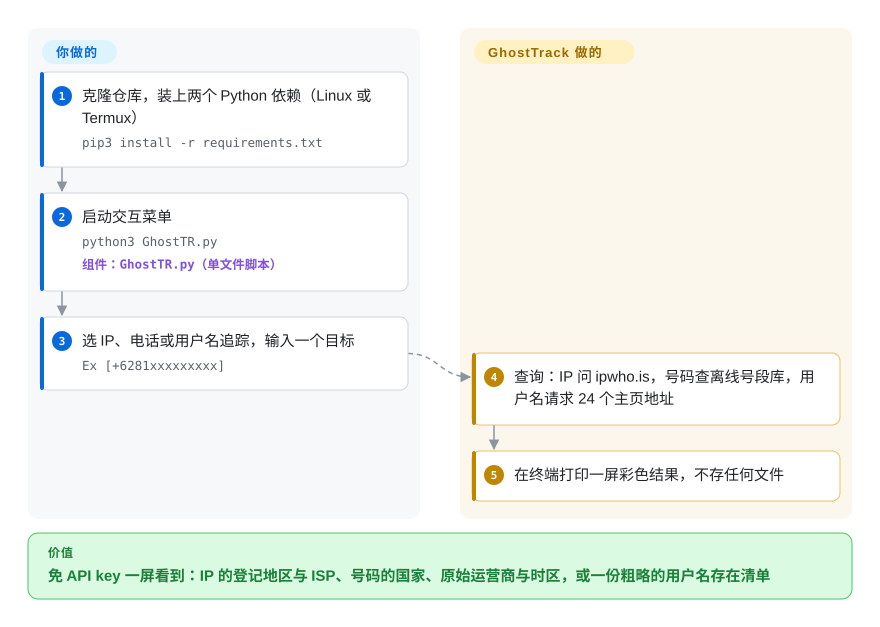

# GhostTrack

有人丢给你一个手机号或一个 IP，你想知道“它在哪”。GhostTrack 名字里写着“追踪”，实际打印的只是公开号段数据和一个免费 IP 定位接口本来就知道的国家、地区、原始运营商和时区，外加一个“这个用户名的主页地址能不能打开”的 24 站粗查；它找不到任何人的实时位置。

## 何时使用

你在安卓手机的 Termux 里学 OSINT（公开情报收集），或者在带一场培训，想让全场在一屏里看到：不用任何 API key，光凭一个号码或 IP 能暴露多少东西。输入 `+6281…`，屏幕上出现“印度尼西亚、Telkomsel、Asia/Jakarta、手机号”；输入一个 IP，看到地理库里登记的城市、ASN 和 ISP。GhostTrack 是一个约 315 行的单文件 Python 脚本，菜单只有四项（IP 追踪、显示本机 IP、电话号码追踪、用户名追踪），两个依赖（`requests`、`phonenumbers`），什么都不用配，所以在重型工具跑不起来的地方也能跑，而且十分钟就能把整个原理读完。

只有当目的是演示或读代码、而不是拿结果去用时，才选它而不选 [Maigret](maigret.zh.md) 或 [Sherlock](sherlock.zh.md)：那两个按每个站点单独写的判定规则查几千个站点，GhostTrack 把任何 HTTP 200 都当成“找到”。想要零配置的号码查询、只要元数据就够时，它比 PhoneInfoga（未收录）省事；PhoneInfoga 还能做搜索引擎和第三方接口的足迹排查，但要先配置扫描器。决定性的取舍：零配置、代码一眼看穿，代价是结果浅且部分是错的、没有许可证、没有维护者。

## 怎么用起来

里面没有什么追踪引擎——每个菜单项就是一个函数，去问一个现成的数据源，再把答案打印出来。IP 追踪用明文 HTTP 把地址发给免费的 ipwho.is 接口（IP 地理定位服务：一张“地址段 → 登记它的地区和运营商”的对照表），打印返回的 JSON 字段，再用截成整数度的经纬度拼一个 Google 地图链接。电话追踪根本不联网：它把号码交给 Google 的 libphonenumber 号段数据（通过 `phonenumbers` 包），这份数据只知道每个号码“段”当初分配给了哪个国家、地区和运营商；默认地区写死为印度尼西亚，地名用印尼语输出。用户名追踪把你的输入填进 24 个写死的主页地址模板（Facebook、Instagram、TikTok、GitHub……），只要页面回 HTTP 200 就标成“找到”——好比街道存在，就断定某人住在这个门牌号。留给你的：先得自己拿到目标标识（README 建议搭配 Seeker——一个用假网页骗访问者交出 GPS 的工具，属于钓鱼手法），自己判断哪几行是错的，以及自己保存结果，因为输出只打印在终端里。

<!-- flow-steps:begin (generated from flows/ghosttrack.json by tools/flow_card.py — do not edit) -->

流程文字版

1. **你**：克隆仓库，装上两个 Python 依赖（Linux 或 Termux） — `pip3 install -r requirements.txt`
2. **你**：启动交互菜单 — `python3 GhostTR.py` — 组件：`GhostTR.py（单文件脚本）`
3. **你**：选 IP、电话或用户名追踪，输入一个目标 — `Ex [+6281xxxxxxxxx]`
4. **GhostTrack**：查询：IP 问 ipwho.is，号码查离线号段库，用户名请求 24 个主页地址
5. **GhostTrack**：在终端打印一屏彩色结果，不存任何文件

**价值**：免 API key 一屏看到：IP 的登记地区与 ISP、号码的国家、原始运营商与时区，或一份粗略的用户名存在清单

<!-- flow-steps:end -->

## 何时不用

- **你要的是一个人或一部手机的当前位置。** 这里没有任何功能能做到：号码结果只是分配元数据（按 `python-phonenumbers` 文档，是“最初”拥有该号段的运营商——携号转网的号码会显示错的运营商），IP 定位指向的是 ISP 的登记地区。真实设备位置只能走运营商或执法流程，或者征得设备主人同意，靠 OSINT 脚本拿不到。
- **你要能据以行动的用户名结果。** 改用 [Maigret](maigret.zh.md)（3000+ 站点、逐站判定规则、可出报告）或 [Sherlock](sherlock.zh.md)（480+ 站点、社区维护的判定）。2026-09-30 用一个编造的用户名实测，GhostTrack 列表里抽查的 12 个站点有 5 个回了 HTTP 200（Facebook、Instagram、TikTok、Telegram、Pinterest）——每个都会被打印成“找到”；LinkedIn 回 999，所以那里真实存在的账号会被打成“未找到”；列表里的 StumbleUpon 和 Periscope 早已停运。
- **你要做号码元数据之外的调查。** 用 PhoneInfoga（未收录）做搜索引擎检索、信誉和一次性号码检查；如果只要元数据，直接调用 `python-phonenumbers`（未收录）——GhostTrack 包的就是它，2011 年起持续维护，Apache-2.0。
- **你要批量或脚本化查 IP。** 用 `ipinfo` 命令行（未收录），或在自己代码里调 IP 接口：GhostTrack 是交互菜单，不接受参数、不输出 JSON，而 ipwho.is 免 key 的免费档每天只有 1,000 次请求，且“不保证可用性”（ipwhois.io 价格页，2026-09-30 查看）。
- **你想复用、fork 或随产品分发这段代码。** 仓库没有 LICENSE 文件（GitHub API 返回 `license: null`），默认版权即“保留所有权利”；源码开头还写着“重写前请先征得许可”。不如自己围绕 `phonenumbers` 和一个 IP 接口写二十行。
- **你没有目标本人同意，也不在合法授权的项目里。** 查询普通个人的号码和 IP，尤其是照 README 的建议用 Seeker 式假网页套取 IP，在许多法域可能触犯隐私、计算机滥用和反跟踪骚扰方面的法律；本页只是选型参考，不是许可。
- **你需要有人维护的工具。** 最后一次提交在 2024-01-11；仓库历史上所有 issue/PR 里，所有者只留过一次评论；修 bug 的 PR（如 2026-08 给请求加超时的 #139）一直没人合并。

## 横向对比

| 替代品 | 是否收录 | 我们的评价 | 取舍 |
|---|---|---|---|
| [Maigret](maigret.zh.md) | ✅ | 要从用户名查出能据以行动的账号，选 Maigret；GhostTrack 的用户名菜单只适合用来演示“只看状态码为什么会误判”。 | Maigret 装起来更重、全量扫描更慢，但它的逐站规则、ID 提取和报告，是 GhostTrack“HTTP 200 就算找到”的循环给不出的结果。 |
| [Sherlock](sherlock.zh.md) | ✅ | 想要一个轻量、久经检验的用户名检查器，选 Sherlock 而不是 GhostTrack——同一类工具，Sherlock 才是做对了的那个。 | Sherlock 覆盖 480+ 站点、判定规则由社区维护、背后有组织；GhostTrack 只有 24 个写死的地址，其中两个服务已停运。 |
| PhoneInfoga | 未收录 | 要越过号码元数据（搜索引擎足迹、信誉、一次性号码检查），选 PhoneInfoga；只想在 Termux 上零配置打印元数据，才选 GhostTrack。 | PhoneInfoga（GPL-3.0、Go、1.8 万星）有网页界面和 REST API，但它的 README 写明“稳定但不再维护”，扫描器也要先配置；本批标签收录未连带新增。 |
| python-phonenumbers | 未收录 | 如果你真正要的是在自己代码里拿号码的国家、运营商和时区，直接调 python-phonenumbers；GhostTrack 只是在它上面加了菜单和彩色打印。 | Apache-2.0，2011 年起维护、2026-09 仍有提交，可脚本化、可批量；代价是那十行胶水代码要你自己写。本批标签收录未连带新增。 |
| ipinfo CLI | 未收录 | 要可重复或批量的 IP 定位，选 ipinfo 命令行；GhostTrack 的 IP 菜单一次只能交互查一个，还是用明文 HTTP 调免费接口。 | ipinfo 命令行（Apache-2.0）支持批量查询、汇总和地图，但查询量一大就绑定 IPinfo 的服务和 token；本批标签收录未连带新增。 |

## 技术栈

- **语言：** Python 3，单文件（`GhostTR.py`，约 11.5 KB），外加 README 截图。
- **库：** `requests`（HTTP）和 `phonenumbers`（Google libphonenumber 的 Python 移植：`carrier`、`geocoder`、`timezone` 元数据）。`requirements.txt` 里两个都没锁版本。
- **外部服务：** IP 定位用 `http://ipwho.is/<ip>`，“显示本机 IP”用 `https://api.ipify.org/`，用户名检查访问那 24 个主页地址。
- **界面：** 由 `input()` 驱动的 ANSI 彩色终端菜单；没有命令行参数，没有 JSON/CSV 输出，没有打包（不在 PyPI 上）。

## 依赖

- Python 3 加 `pip3 install -r requirements.txt`；README 只写了 Debian 系 Linux 和 Termux。Python 3.12 及以上会因横幅字符串报 `SyntaxWarning: "\/" is an invalid escape sequence`（见 issue #141）。
- 需要出网访问 ipwho.is（明文 HTTP——链路上能看到你查的是哪个 IP）、ipify 和那 24 个社交站点。号码查询离线可用。
- 不需要 API key、数据库或常驻进程。ipwho.is 免 key 档：每天 1,000 次请求（ipwhois.io 价格页，2026-09-30）。

## 运维难度

**运行成本低，也没什么可运维的**——它就是个一次性的交互脚本。真正的成本在“信不信”：每条用户名结果都得人工复核，地图链接只精确到整数度（偏差可达几十公里），而且没有维护者，任何站点或接口一变就坏，只能改你自己的副本——没有许可证又让这份副本不便分享。

## 健康度与可持续性

- **维护（2026-09-30）：** 总共 23 次提交，全部落在 2023-04-15 到 2024-01-11 之间；从未发过 release 或打过 tag。累计 107 个 issue、45 个 PR，近期的都没人回应。事实上已停止维护。
- **治理与巴士因子：** 单个个人账号（HunxByts，23 次提交占 22 次；另一次是 `bakaemon` 在 2023-08 提的重构 PR）。所有者在仓库 issue/PR 历史里唯一的一次评论就在那个 PR 上。
- **年龄与 Lindy：** 约 3.5 岁，其中约 2.7 年没有动静——Lindy 先验不给一个已废弃的单文件脚本加分。
- **采用度：** 1.56 万星、2.1k fork、168 人关注——对一个约 315 行的脚本来说高得离谱。issue 区大多是非技术用户直接把手机号当标题贴上来（如 #146、#134），或者请它“定位”某个号码；#130 反馈“号码查询给出错误信息”。这里的星数反映的是想追踪别人的人群里的传播热度，而不是代码质量。[推断]
- **风险信号：** 没有许可证（保留所有权利）；名字和简介（“追踪位置或手机号”）误导；README 推荐搭配钓鱼式定位工具；依赖不锁版本；用户名列表里有已停运站点；用明文 HTTP 调定位接口。

## 存疑（未验证）

- [推断] 星数主要来自短视频或 Termux 教程传播，是根据 issue 区内容和仓库 topics（`termux-hacks`、`hacking-tool`、`fyp`）推断的；没有分析 star 历史曲线。
- [未验证] 用户名误报抽样（编造的用户名在 12 个站点中有 5 个回 HTTP 200）只在 2026-09-30 从一个网络、用 `python-requests` 的 UA 测了一次；站点会按地区、IP 信誉和反爬策略返回不同结果，具体哪几个会误报会变。
- [推断] `main()` 与 `execute_option()` 互相调用，是递归而不是循环，所以会话足够长时理论上会撞到 Python 的递归上限；没有复现。
- [未验证] 约 2.1k 个 fork 里有没有持续维护、或修好了用户名判定的，没有调查。
- [未验证] 没有针对具体 IP 测过 ipwho.is 的准确度；IP 定位通常落在 ISP 的登记地区而不是设备所在处，这一点依据的是 Seeker README 自己的对比说明和一般经验。
