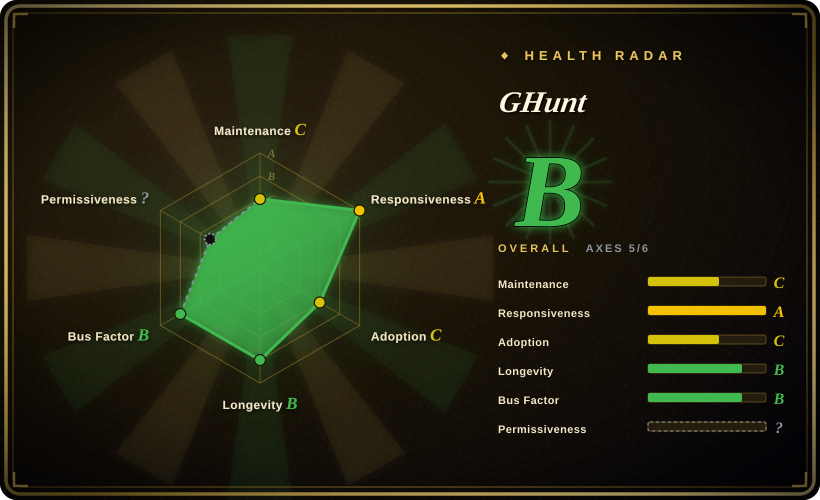

# GHunt

Offensive Google framework: uses **your authenticated Google session** (cookies) to investigate Gmail addresses, Gaia IDs, Drive files, and BSSIDs through Google's own endpoints — the only tool in this category that sees inside the Google ecosystem, and the one with the highest ToS/legal risk.

## When to use

You're running an explicitly authorized investigation where the target's Google presence matters — a phishing/scam trail behind a Gmail address, an OSINT engagement scoped to Google properties, or auditing your own account's exposure. You authenticate once (`ghunt login`, with the GHunt Companion browser extension feeding cookies), then `ghunt email target@gmail.com` returns what unauthenticated tools can't: Google-account profile data behind the address, with `--json` export; `gaia` pivots on the numeric Google ID, `drive` inspects file/folder metadata, `geolocate` resolves BSSIDs, and `spiderdal` finds assets via Digital Assets Links.

You pick GHunt over [holehe](holehe.md)/[socialscan](socialscan.md) when existence isn't enough — holehe's google module only says "account exists + obfuscated recovery hints", while GHunt works *inside* the authenticated Google surface. You pick it over [Maigret](maigret.md)/[Sherlock](sherlock.md) when the investigation is Google-centric rather than wide-username-centric. The tradeoff is structural: every query rides on your real Google session, so the tool's power and its risk are the same thing.

## When NOT to use

- **You need wide multi-service email/username sweeps.** Use [holehe](holehe.md) (forked/re-verified) or [socialscan](socialscan.md) for email existence and [Maigret](maigret.md)/[Sherlock](sherlock.md) for usernames — GHunt is Google-only depth, not breadth.
- **You can't risk the authenticating Google account.** Queries use your session against Google endpoints in ways the ToS do not sanction; account countermeasures (throttling, challenge, suspension) are plausible and unquantified. Use a dedicated throwaway account if the engagement permits, and get explicit authorization. [推断]
- **AGPL-3.0 conflicts with your product.** Network-use copyleft means embedding GHunt in a proprietary SaaS obliges you to publish modifications; the author's own commercial path is osint.industries (closed). For permissive licensing pick MIT [Maigret](maigret.md) or MPL-2.0 [socialscan](socialscan.md) instead.
- **You need a dependable maintained dependency.** Last GitHub release v2.2.0 is 2024-06 (master pyproject says 2.3.4, last push 2026-04) — maintenance is sporadic and the same author's attention sits with the commercial product, the pattern already seen with holehe.
- **Air-gapped or cookie-free environments.** GHunt is useless without a live authenticated Google session; there is no unauthenticated mode.
- **The target is a person and you have no legal basis.** Authenticated Google-ecosystem profiling of individuals is the sharpest dual-use edge in this category.

## Comparison

| Alternative | In index | Our verdict | Tradeoff |
|---|---|---|---|
| [holehe](holehe.md) | ✅ | Choose holehe-family tooling to cheaply test an email across 120+ services unauthenticated; choose GHunt when one of those services is Google and you need what's behind the account, not just its existence. | holehe is shallow-wide with zero credentials and abandoned; GHunt is deep-narrow, requires your Google session, and is sporadically maintained. |
| [Maigret](maigret.md) | ✅ | Choose Maigret for username dossiers across 3000+ public sites; choose GHunt for the Google-internal view no public scraper can reach. | Maigret needs no credentials and is MIT; GHunt needs your cookies and is AGPL-3.0 with higher legal exposure. |
| [Sherlock](sherlock.md) | ✅ | Choose Sherlock for quick public existence checks; choose GHunt only when the Google account itself is the investigation target. | Sherlock is org-governed, active, and unauthenticated; GHunt is solo, sporadic, and authenticated. |
| [socialscan](socialscan.md) | ✅ | Choose socialscan for registration-availability verdicts; choose GHunt for post-existence Google profiling. | socialscan answers "taken or not" on ~11 platforms without credentials; GHunt answers "what is behind this Gmail address" using yours. |
| osint.industries | not indexed | The same author's commercial SaaS is the maintained successor path for Google OSINT; choose it only if a closed hosted service is acceptable — it is not a repository, hence not indexable here. | You trade source auditability and AGPL obligations for maintained coverage and zero cookie plumbing. |

## Tech stack

- **Language:** Python ^3.11, poetry-managed; installed via pipx (`pipx install ghunt`).
- **Networking:** fully async httpx with HTTP/2 — queries ride authenticated Google endpoints using stored session cookies.
- **Modules:** `login` (cookie capture via GHunt Companion browser extension or manual paste), `email`, `gaia`, `drive`, `geolocate` (BSSID), `spiderdal` (Digital Assets Links); CLI plus importable Python library; `--json` export on investigation modules.
- **Data processing:** protobuf (Google wire formats), pillow + imagehash (profile-photo comparison), geopy (geo resolution), dnspython, beautifulsoup4; rich/beautifultable/alive-progress for CLI UX.

## Dependencies

- Python 3.11+; pipx install. No API keys — but a **live Google account session** is mandatory (cookies captured through the Companion extension for Firefox/Chrome or manual entry).
- Outbound HTTPS to Google endpoints; no database or self-hosted services.
- The GHunt Companion browser extension (separate distribution, Firefox/Chrome stores) for the smooth login path.

## Ops difficulty

**Medium.** Installation is one pipx command, but operations carry real weight: you must provision and protect an authenticated Google account (cookie storage is a credential-secrets problem), every run has ToS exposure, results depend on Google endpoint stability that sporadic maintenance may lag behind, and AGPL-3.0 obligations attach to any networked derivative. Treat cookie files as secrets and log usage for auditability in engagement contexts.

## Health & viability

- **Maintenance (2026-09):** sporadic — last release v2.2.0 (2024-06), master pyproject at 2.3.4, last push 2026-04-10, 76 open issues. Alive but not cadenced.
- **Governance / bus factor:** personal repo (mxrch), ~37 contributors, maintainer-dominated; the author runs the commercial osint.industries (linked at the top of the README) — the identical attention-drain pattern as his holehe. [推断]
- **Age × Lindy:** created 2020-10 (~6 years) with intermittent activity — age is decent but "still-active" is weak, so the Lindy signal is middling.
- **Adoption:** 19.6k stars / 1.7k forks; well known in OSINT circles; the commercial sibling suggests sustainable funding exists somewhere, just not necessarily for the OSS repo.
- **Risk flags:** AGPL-3.0 network copyleft (GitHub reports NOASSERTION due to the custom LICENSE.md header, but the file text is AGPL-3.0); authenticated-session ToS exposure; Google endpoint drift; open-core attention drain.

## Caveats (unverified)

- [未验证] Exactly which profile fields the `email`/`gaia` modules return today (photos, Maps/review traces, names, dates) was not live-tested for this entry; the module list is from the 2026-09 README.
- [推断] Google account countermeasures (throttling/challenge/suspension) against GHunt-style authenticated querying are plausible given ToS posture, but the actual incidence is unquantified.
- [未验证] The GHunt Companion extension's source/audit status was not reviewed.
- [推断] The author's commercial focus (osint.industries) makes OSS revival cadence unlikely, mirroring the holehe pattern.
- [未验证] Whether master (2.3.4) is stable relative to the last tagged release was not assessed.
