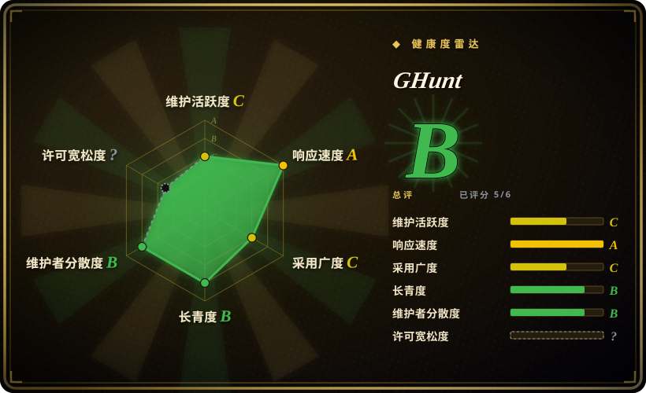

# GHunt

进攻性 Google 框架：用**你自己认证的 Google 会话**（cookies），经 Google 自家端点调查 Gmail 地址、Gaia ID、Drive 文件和 BSSID——本类目唯一能看进 Google 生态内部的工具，也是 ToS/法律风险最高的一个。

## 何时使用

你在执行一个明确授权的调查，且目标的 Google 存在是关键——一个 Gmail 地址背后的钓鱼/诈骗线索、限定在 Google 资产范围内的 OSINT 委托，或审计自己账户的暴露面。你认证一次（`ghunt login`，由 GHunt Companion 浏览器扩展喂 cookie），然后 `ghunt email target@gmail.com` 返回无认证工具拿不到的东西：地址背后的 Google 账户资料，支持 `--json` 导出；`gaia` 以数字 Google ID 做枢轴，`drive` 查文件/文件夹元数据，`geolocate` 解析 BSSID，`spiderdal` 通过 Digital Assets Links 找资产。

当「存在性」不够用时，你选 GHunt 而不是 [holehe](holehe.zh.md)/[socialscan](socialscan.zh.md)——holehe 的 google 模块只能说「账户存在＋打码恢复信息」，而 GHunt 在**认证后的** Google 表面之内工作。当调查以 Google 为中心而不是宽域用户名时，你选它而不是 [Maigret](maigret.zh.md)/[Sherlock](sherlock.zh.md)。代价是结构性的：每次查询都骑在你真实的 Google 会话上，工具的能力和风险是同一个东西。

## 何时不用

- **你需要宽域多服务的邮箱/用户名扫描。** 邮箱存在性用 [holehe](holehe.zh.md)（fork 并复验）或 [socialscan](socialscan.zh.md)，用户名用 [Maigret](maigret.zh.md)/[Sherlock](sherlock.zh.md)——GHunt 是 Google 单点的深度，不是广度。
- **你输不起用来认证的 Google 账户。** 查询用你的会话以 ToS 不认可的方式打 Google 端点；账户反制（限流、验证挑战、封禁）是合理可能且无量化数据的。委托允许的话用专用一次性账户，并取得明确授权。[推断]
- **AGPL-3.0 与你的产品冲突。** 网络使用的 copyleft 意味着把 GHunt 嵌进闭源 SaaS 就负有公开修改的义务；作者自己的商业路径是 osint.industries（闭源）。要宽松许可选 MIT 的 [Maigret](maigret.zh.md) 或 MPL-2.0 的 [socialscan](socialscan.zh.md)。
- **你需要可靠、有人维护的依赖。** 最后的 GitHub release v2.2.0 是 2024-06 的（master pyproject 是 2.3.4，最后 push 2026-04）——维护零星，且同一作者的注意力在商业产品上，这个模式在 holehe 上已经见过一遍。
- **气隙或无 cookie 环境。** 没有活的认证 Google 会话，GHunt 毫无用处；不存在无认证模式。
- **目标是个人且你没有法律依据。** 对个人的认证式 Google 生态画像，是本类目双刃性最锋利的一侧。

## 横向对比

| 替代品 | 是否收录 | 我们的评价 | 取舍 |
|---|---|---|---|
| [holehe](holehe.zh.md) | 已收录 | 要无认证地低成本测一个邮箱在 120+ 服务的存在性时选 holehe 系工具；当其中一个服务是 Google、且你需要账户背后的内容而不只是存在性时选 GHunt。 | holehe 浅而广、零凭据但已弃养；GHunt 深而窄、要你的 Google 会话且维护零星。 |
| [Maigret](maigret.zh.md) | 已收录 | 要跨 3000+ 公开站点的用户名档案时选 Maigret；要公开爬虫够不到的 Google 内部视角时选 GHunt。 | Maigret 无需凭据且 MIT；GHunt 要你的 cookie、AGPL-3.0，法律暴露更高。 |
| [Sherlock](sherlock.zh.md) | 已收录 | 要快速公开存在性核查时选 Sherlock；只有当 Google 账户本身是调查目标时才选 GHunt。 | Sherlock 组织治理、活跃、无认证；GHunt 单人、零星、认证式。 |
| [socialscan](socialscan.zh.md) | 已收录 | 要注册可用性判定时选 socialscan；要存在性之后的 Google 画像时选 GHunt。 | socialscan 无凭据回答约 11 个平台的「占没占」；GHunt 用你的凭据回答「这个 Gmail 地址背后是什么」。 |
| osint.industries | 未收录 | 同一作者的商业 SaaS 是 Google OSINT 的有人维护后继路径；只有当闭源托管服务可接受时才选它——它不是仓库，故不可收录。 | 你用源码可审计性和 AGPL 义务，换有人维护的覆盖和零 cookie 管道。 |

## 技术栈

- **语言：** Python ^3.11，poetry 管理；经 pipx 安装（`pipx install ghunt`）。
- **网络：** 全异步 httpx 带 HTTP/2——查询携带存储的会话 cookie 打认证 Google 端点。
- **模块：** `login`（经 GHunt Companion 浏览器扩展或手工粘贴捕获 cookie）、`email`、`gaia`、`drive`、`geolocate`（BSSID）、`spiderdal`（Digital Assets Links）；CLI 加可 import 的 Python 库；调查模块支持 `--json` 导出。
- **数据处理：** protobuf（Google 线格式）、pillow + imagehash（头像比对）、geopy（地理解析）、dnspython、beautifulsoup4；rich/beautifultable/alive-progress 做 CLI 体验。

## 依赖

- Python 3.11+；pipx 安装。无 API key——但**活的 Google 账户会话**是必需品（cookie 经 Firefox/Chrome 的 Companion 扩展或手工录入捕获）。
- 对 Google 端点的出站 HTTPS；无数据库、无自建服务。
- 顺畅登录路径需要 GHunt Companion 浏览器扩展（独立分发，Firefox/Chrome 商店）。

## 运维难度

**中等。** 安装是一条 pipx 命令，但运维有真实分量：你要自备并保护一个认证 Google 账户（cookie 存储就是凭据保密问题），每次运行都有 ToS 暴露，结果依赖 Google 端点稳定性而零星维护可能跟不上，任何网络化衍生作品都附带 AGPL-3.0 义务。把 cookie 文件当 secret 对待，并在委托场景记录使用日志以便审计。

## 健康度与可持续性

- **维护情况（2026-09）：** 零星——最后 release v2.2.0（2024-06），master pyproject 为 2.3.4，最后 push 2026-04-10，76 个 open issue。活着，但没有节奏。
- **治理 / bus factor：** 个人仓库（mxrch），约 37 个贡献者，维护者主导；作者经营商业版 osint.industries（README 顶部链接）——与他的 holehe 一模一样的注意力抽走模式。[推断]
- **年龄 × Lindy：** 创建于 2020-10（约 6 年），活动断续——年龄尚可但「仍活跃」偏弱，Lindy 信号中等。
- **采用信号：** 19.6k star / 1.7k fork；在 OSINT 圈知名度高；商业姊妹产品说明某处存在可持续资金，只是未必流向开源仓库。
- **风险标记：** AGPL-3.0 网络 copyleft（GitHub 因自定义 LICENSE.md 头部报 NOASSERTION，但文件正文就是 AGPL-3.0）；认证会话的 ToS 暴露；Google 端点漂移；open-core 注意力抽走。

## 存疑（未验证）

- [未验证] `email`/`gaia` 模块今天确切返回哪些资料字段（头像、地图/评论痕迹、姓名、日期）未实测；模块清单取自 2026-09 的 README。
- [推断] 依据 ToS 姿态，Google 对 GHunt 式认证查询的账户反制（限流/挑战/封禁）是合理可能，但实际发生率无量化。
- [未验证] 未审查 GHunt Companion 扩展的源码/审计状态。
- [推断] 作者的商业重心（osint.industries）使开源恢复发版节奏的可能性低，与 holehe 模式一致。
- [未验证] master（2.3.4）相对最后 tagged release 是否稳定，未评估。
