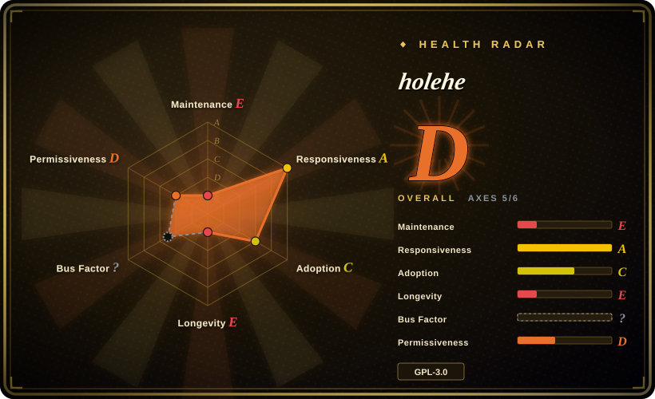

# holehe

Email→registered-account OSINT probe across 120+ sites using register / login / forgot-password endpoints, without alerting the target; unmaintained since 2024-09, so its durable value is the methodology and the site-module table rather than the aging code.

## When to use

You're a security researcher or red-teamer working an explicitly authorized engagement (your own footprint, or a client's rules of engagement permit OSINT), and you need to know which services an email address has touched. You run `holehe target@example.com`; it fans out async probes over 120+ site modules and returns, per site, whether an account exists plus any partially obfuscated recovery email / phone number the forgot-password flow leaks. No API keys, no target notification.

You pick holehe over [socialscan](socialscan.md) when breadth matters more than maintenance: 120+ email modules versus socialscan's ~7 email platforms. You pick it over [Maigret](maigret.md) / [Sherlock](sherlock.md) when your input is an email, not a username. Given the stall (last push 2024-09), the strongest 2026 use is as a **pattern source**: the per-site method table (register vs login vs password-recovery vs other, with rate-limit flags) is a reverse-engineered knowledge base you can re-implement against live endpoints, with holehe's uniform module contract (`{name, rateLimit, exists, emailrecovery, phoneNumber, others}`) as the schema.

## When NOT to use

- **You need a dependable, maintained email-existence checker.** Use [socialscan](socialscan.md) instead — narrower (~11 platforms) but still receiving commits (2026-08) and a 2024 release; or fork holehe and re-verify each module before trusting results.
- **Your input is a username, not an email.** Use [Maigret](maigret.md) for a full dossier (3000+ sites, ID extraction, recursion) or [Sherlock](sherlock.md) for a quick, simple check.
- **The target is a Google account and you need depth, not just existence.** Use [GHunt](ghunt.md) — holehe's google/office365 modules only report existence plus obfuscated recovery hints.
- **You need production-grade reliability.** The repo has no GitHub releases, no test suite (root tree has no tests directory), and 5 commits since 2024-01; site endpoints drift, so an unknown share of the 120+ modules is broken today. [推断]
- **You cannot rotate IPs.** Many modules are flagged "Frequent Rate Limit" in the README's own table; sustained runs need a proxy pool (see `proxy-pool` category) or results degrade silently to rate-limit noise.
- **GPL-3.0 conflicts with your distribution.** Use socialscan (MPL-2.0) or write your own probes from the module table instead of embedding holehe in a proprietary product.
- **You lack authorization for the target email.** Bulk-checking other people's emails is a legal/ToS minefield in most jurisdictions; this page is selection guidance, not permission.

## Comparison

| Alternative | In index | Our verdict | Tradeoff |
|---|---|---|---|
| [socialscan](socialscan.md) | ✅ | Choose socialscan when you need working, accurate available/taken verdicts on the major platforms today; choose holehe (or a fork of it) only when you need its 120+ site breadth or its recovery-info leakage methods. | socialscan trades coverage for maintained correctness (registration-endpoint queries on ~11 platforms); holehe trades maintenance for breadth. |
| [Maigret](maigret.md) | ✅ | Choose Maigret when the identifier you hold is a username and you want a full dossier with reports; choose holehe when all you have is an email and you want existence signals. | Maigret is actively maintained and far deeper, but it starts from usernames — holehe starts from emails and can surface recovery identifiers you could then feed back into Maigret. |
| [Sherlock](sherlock.md) | ✅ | Choose Sherlock for quick username checks across 480+ networks; choose holehe only for email-keyed probing. | Different input keys entirely; Sherlock is org-governed and active, holehe is solo and stalled. |
| [GHunt](ghunt.md) | ✅ | Choose GHunt for authenticated deep-dive into one Google account; choose holehe to cheaply test whether an email exists on Google/Office365 among 120+ others. | GHunt goes deep on one ecosystem with your session cookies (high ToS risk); holehe goes shallow-wide with no authentication. |

## Tech stack

- **Language:** Python 3 (README references Python 3.7-era downloads; no `python_requires` pin found in `setup.py`).
- **Async:** trio + httpx (`AsyncClient` shared across modules).
- **Parsing/probing:** BeautifulSoup (bs4) for HTML responses; per-site modules under `holehe/modules/` implement a uniform async function `(email, client, out)`.
- **CLI UX:** termcolor, colorama, tqdm progress.
- **Packaging:** setup.py → PyPI (`pip3 install holehe`), console-script entry point `holehe`, plus a Dockerfile.

## Dependencies

- Python 3 runtime; `pip3 install holehe` or Docker build. No database, no API keys, no external services you host.
- Unrestricted outbound HTTPS to 120+ third-party sites — corporate egress filtering will silently skew results. [推断]
- Practically: rotating proxies / multiple IPs for the rate-limit-prone modules (the tool itself only reports `rateLimit: true`).

## Ops difficulty

**Low to run, medium-to-high to keep useful.** One-shot usage is trivial (pip install, single CLI command, JSON-ish dict output embeddable in Python via trio). The burden is epistemic, not operational: with no maintainer since 2024-09, you own module health — expect to re-verify which of the 120+ probes still work before trusting any negative result, and to manage IP rotation yourself when rate limits hit.

## Health & viability

- **Maintenance (2026-09):** last push 2024-09-10; 5 commits since 2024-01; no GitHub releases ever (PyPI 1.61 is the artifact); 72 open issues and 46 open PRs unattended. Effectively abandoned.
- **Governance / bus factor:** single-maintainer personal repo (megadose, ~32 contributors historically but maintainer-dominated); the author publicly redirects to the commercial **osint.industries** service in the README header — the same author's GHunt follows the identical pattern. [推断] Revival of the OSS repo is unlikely while the commercial product exists.
- **Age × Lindy:** created 2020-06 (~6 years old) but **not** still-active — Lindy does not rescue an abandoned project; the 14.9k stars are a historical popularity signal, not a forward bet.
- **Adoption:** 14.9k stars / 1.9k forks; 69,959 PyPI downloads last month (measured 2026-09) despite the stall; widely cited in OSINT course material; a Maltego transform companion exists (holehe-maltego).
- **Risk flags:** module rot (site endpoints change), no tests, GPL-3.0 copyleft, open-core attention drain to osint.industries, and inherent legal/ToS exposure of email probing.

## Caveats (unverified)

- [未验证] "Does not alert the target email" (README claim, linked to issue #12) — plausible per-endpoint behavior, but not independently verified for all 120+ modules; some sites may log or notify on password-recovery attempts.
- [推断] An unknown fraction of modules is broken as of 2026-09 because site endpoints drift and the repo is stalled; the exact survival rate was not tested for this entry.
- [推断] The author's commercial focus (osint.industries, linked at the top of the README) is the reason for OSS stagnation.
- [未验证] Whether any fork (of the 1.9k) actively re-verifies modules was not surveyed.
