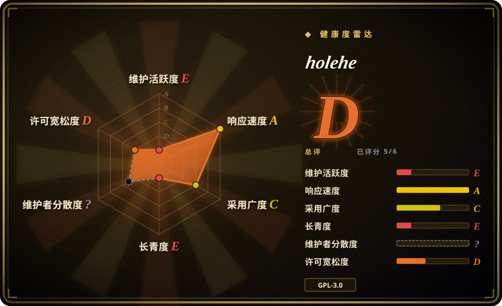

# holehe

通过注册/登录/找回密码端点，在不提醒目标的前提下探测一个邮箱在 120+ 站点是否注册过账户的 OSINT 工具；2024-09 起停止维护，它的耐久价值在方法论与站点模块表，而不是老化的代码。

## 何时使用

你是安全研究员或红队成员，正在执行一个明确授权的委托（查自己的数字足迹，或客户的交战规则允许 OSINT），需要知道一个邮箱地址碰过哪些服务。你运行 `holehe target@example.com`，它对 120+ 个站点模块做异步并发探测，逐站返回该邮箱是否有账户，以及找回密码流程泄露的打码恢复邮箱/手机号。不需要 API key，不会通知目标。

当广度比维护状态更重要时，你选 holehe 而不是 [socialscan](socialscan.zh.md)：120+ 个邮箱模块对 socialscan 的约 7 个邮箱平台。当你手里的输入是邮箱而不是用户名时，你选它而不是 [Maigret](maigret.zh.md) / [Sherlock](sherlock.zh.md)。鉴于项目已停滞（最后 push 是 2024-09），2026 年它最有价值的用法是当**模式来源**：那张逐站点方法表（register / login / password recovery / other，附限流标记）是一份逆向验证过的知识库，你可以照着它对活着的端点重写探测层，并用 holehe 统一的模块契约（`{name, rateLimit, exists, emailrecovery, phoneNumber, others}`）做 schema。

## 何时不用

- **你需要一个可靠、有人维护的邮箱存在性检查器。** 改用 [socialscan](socialscan.zh.md)——覆盖窄（约 11 个平台）但仍有提交（2026-08）和 2024 年的发版；或者 fork holehe，逐模块重新验证后再信任结果。
- **你的输入是用户名，不是邮箱。** 要完整档案用 [Maigret](maigret.zh.md)（3000+ 站点、ID 提取、递归），要快速核查用 [Sherlock](sherlock.zh.md)。
- **目标是 Google 账户且你需要深度信息，不只是存在性。** 用 [GHunt](ghunt.zh.md)——holehe 的 google/office365 模块只报存在性和打码恢复信息。
- **你需要生产级可靠性。** 仓库没有 GitHub release、没有测试套件（根目录树无 tests 目录）、2024-01 以来只有 5 个 commit；站点端点会漂移，今天 120+ 模块中有未知比例已失效。[推断]
- **你无法轮换 IP。** README 自己的表格里大量模块标了「Frequent Rate Limit」；持续跑需要代理池（见 `proxy-pool` 类目），否则结果会退化成限流噪声。
- **GPL-3.0 与你的分发方式冲突。** 改用 socialscan（MPL-2.0），或照模块表自写探测，不要把 holehe 嵌进闭源产品。
- **你没有目标邮箱的授权。** 批量核查他人邮箱在多数司法辖区是法律/ToS 雷区；本页是选型指引，不构成许可。

## 横向对比

| 替代品 | 是否收录 | 我们的评价 | 取舍 |
|---|---|---|---|
| [socialscan](socialscan.zh.md) | 已收录 | 今天就要在主流平台上拿到可用的「存在/不存在」准确判定时选 socialscan；只有需要 120+ 站点广度或恢复信息泄露方法时，才选 holehe（或其 fork）。 | socialscan 用覆盖面换维护中的正确性（约 11 个平台的注册端点直查）；holehe 用维护换广度。 |
| [Maigret](maigret.zh.md) | 已收录 | 手里的标识符是用户名、且要带报告的完整档案时选 Maigret；只有邮箱、只要存在性信号时选 holehe。 | Maigret 维护活跃且深得多，但从用户名出发——holehe 从邮箱出发，还能捞到恢复标识符，反过来喂给 Maigret。 |
| [Sherlock](sherlock.zh.md) | 已收录 | 要在 480+ 网络快速核查用户名时选 Sherlock；只有邮箱键控探测需求时才选 holehe。 | 输入键完全不同；Sherlock 是组织治理且活跃，holehe 是单人且停滞。 |
| [GHunt](ghunt.zh.md) | 已收录 | 要对单个 Google 账户做认证式深挖时选 GHunt；要低成本测一个邮箱在 Google/Office365 等 120+ 站点是否存在时选 holehe。 | GHunt 用你的会话 cookie 深挖单一生态（ToS 风险高）；holehe 无认证、浅而广。 |

## 技术栈

- **语言：** Python 3（README 引用 Python 3.7 时代的下载链接；`setup.py` 里未见 `python_requires` 版本钉）。
- **异步：** trio + httpx（各模块共享 `AsyncClient`）。
- **解析/探测：** BeautifulSoup（bs4）解析 HTML 响应；`holehe/modules/` 下逐站点模块实现统一的异步函数 `(email, client, out)`。
- **CLI 体验：** termcolor、colorama、tqdm 进度条。
- **打包：** setup.py → PyPI（`pip3 install holehe`），console-script 入口 `holehe`，另有 Dockerfile。

## 依赖

- Python 3 运行时；`pip3 install holehe` 或 Docker 构建。无数据库、无 API key、无需自建服务。
- 对 120+ 第三方站点的不受限出站 HTTPS——公司出口过滤会无声地扭曲结果。[推断]
- 实际使用中：为易限流模块准备轮换代理/多 IP（工具本身只报告 `rateLimit: true`）。

## 运维难度

**跑起来低，保持可用中高。** 一次性使用很简单（pip 安装、单条 CLI 命令、类 JSON 字典输出可经 trio 嵌入 Python）。负担在认知侧而非运维侧：2024-09 之后没有维护者，模块健康由你自己负责——信任任何「不存在」结论前，要先重新验证 120+ 探测器里哪些还活着；触发限流时 IP 轮换也要自己管。

## 健康度与可持续性

- **维护情况（2026-09）：** 最后 push 是 2024-09-10；2024-01 以来 5 个 commit；从未发过 GitHub release（产物只有 PyPI 1.61）；72 个 open issue、46 个 open PR 无人处理。实质已弃养。
- **治理 / bus factor：** 单人维护的个人仓库（megadose，历史约 32 个贡献者但由维护者主导）；作者在 README 头部公开导流到商业服务 **osint.industries**——同作者的 GHunt 是一模一样的模式。[推断] 商业版存在期间，开源仓库复活的可能性低。
- **年龄 × Lindy：** 创建于 2020-06（约 6 年）但**不再活跃**——Lindy 救不了被弃养的项目；14.9k star 是历史热度信号，不是对未来的赌注。
- **采用信号：** 14.9k star / 1.9k fork；尽管停滞，PyPI 上月下载 69,959 次（2026-09 实测）；在 OSINT 教学材料中被广泛引用；有 Maltego transform 伴生仓库（holehe-maltego）。
- **风险标记：** 模块腐化（站点端点变更）、无测试、GPL-3.0 copyleft、注意力被 osint.industries 抽走的 open-core 模式，以及邮箱探测固有的法律/ToS 暴露面。

## 存疑（未验证）

- [未验证] 「不提醒目标邮箱」（README 主张，链接 issue #12）——按端点行为看合理，但未对全部 120+ 模块独立验证；部分站点可能对找回密码请求做记录或通知。
- [推断] 截至 2026-09 有未知比例的模块已失效，因为站点端点会漂移而仓库停滞；本条目未实测存活率。
- [推断] 作者的商业重心（README 顶部链接的 osint.industries）是开源停滞的原因。
- [未验证] 未调查 1.9k 个 fork 中是否有活跃重新验证模块的分支。
