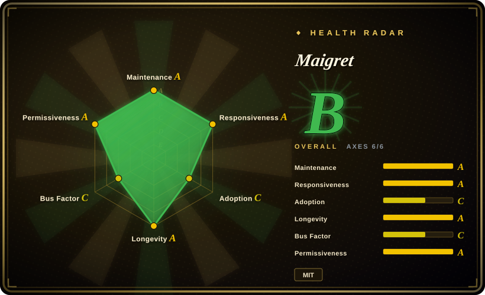

# Maigret

Username→dossier OSINT collector: checks 3000+ sites (no API keys), extracts every scrap of profile data and cross-account IDs, recurses on discovered identifiers, and ships HTML/PDF/XMind reports — the deepest and most actively maintained username tool in this category.

## When to use

You're an authorized investigator (journalist with consent, corporate security, red team under RoE, or checking your own handles) who holds one username and needs the full public footprint behind it. You run `maigret USERNAME`; the default pass hits the 500 highest-traffic sites, `socid-extractor` pulls IDs, names, and links to other accounts out of profile pages and site APIs, and Maigret recurses on what it finds. You get console output plus HTML/PDF/XMind reports and a graph web UI — a deliverable dossier, not just a hit list.

You pick Maigret over [Sherlock](sherlock.md) when depth beats simplicity: 3000+ sites vs 482, ID extraction and recursion vs a flat existence list, maintained releases (v0.6.6 on 2026-09-18) vs slower cadence. You pick it over [holehe](holehe.md)/[socialscan](socialscan.md) when your key is a username, not an email — and its auto-updating site database (fetched from GitHub every 24h, offline fallback built in) is the only self-healing data story in this category. Tor/I2P site support and domain checks come free.

## When NOT to use

- **Your only identifier is an email.** Use [holehe](holehe.md) (fork/re-verified) or [socialscan](socialscan.md) to turn the email into existence signals and recovery identifiers first, then feed discovered usernames back into Maigret.
- **You want a fast, minimal, low-dependency check.** Use [Sherlock](sherlock.md) — Maigret's poetry stack (aiohttp, lxml, networkx, xhtml2pdf, XMind, jinja2…) and full `-a` scan over 3000+ sites are heavy when you just need "does this handle exist on the big networks".
- **You need Google-account internals.** Use [GHunt](ghunt.md); Maigret only sees public profile surfaces.
- **You need guaranteed-quiet operation.** Maigret detects and *partially* bypasses blocks/CAPTCHA (its own README wording) — a full `-a` scan from one IP will still get rate-limited; pair it with a proxy pool (`proxy-pool` category) or narrow with `--tags`.
- **You can't accept an auto-updating remote database.** The site DB is fetched from GitHub each run (24h cache); air-gapped or supply-chain-sensitive environments must pin the built-in DB and disable updates.
- **No authorization for the target.** Building dossiers on people without a legal basis is exactly the misuse this tool's power enables — engagement scope first.

## Comparison

| Alternative | In index | Our verdict | Tradeoff |
|---|---|---|---|
| [Sherlock](sherlock.md) | ✅ | Choose Maigret when you need dossiers: ID extraction, recursion, reports, 3000+ sites, Tor/I2P; choose Sherlock when you need a quick, simple, heavily community-tested existence list across 482 sites. | Maigret buys depth with a heavy dependency stack and slower scans; Sherlock buys simplicity and speed with flat, coarser results. |
| [holehe](holehe.md) | ✅ | Choose holehe-family tooling when the input is an email; choose Maigret once you have usernames — they are complementary stages of one investigation, not substitutes. | holehe is email-keyed but abandoned (2024-09); Maigret is username-keyed and the most active repo here. |
| [socialscan](socialscan.md) | ✅ | Choose socialscan for registration-availability verdicts on ~11 platforms; choose Maigret for footprint discovery across 3000+. | socialscan answers "can I register this"; Maigret answers "where does this person already exist, and what did they leave there". |
| [GHunt](ghunt.md) | ✅ | Choose GHunt for authenticated deep-dive into a Google account; choose Maigret for broad unauthenticated username sweeps. | GHunt goes deep on one ecosystem using your session cookies (ToS risk); Maigret goes wide with no credentials at all. |

## Tech stack

- **Language:** Python ^3.10, poetry-managed.
- **Async networking:** aiohttp + aiohttp-socks (proxy/Tor), aiodns.
- **Extraction:** socid-extractor (account IDs from profiles/APIs), lxml/html5lib/soupsieve parsing, networkx for the link graph.
- **Reporting:** Jinja2 templates → HTML; xhtml2pdf → PDF; XMind mind-maps; graphml; plus a built-in web UI for graph browsing and report download.
- **Data:** auto-updated site database (JSON, fetched from GitHub every 24h with built-in fallback); `--ai` mode summarizes findings via any OpenAI-compatible API.
- **Distribution:** PyPI (`pip install maigret`), Windows standalone exe, Docker, community Telegram bot.

## Dependencies

- Python 3.10+ runtime; `pip install maigret` or the standalone exe. No API keys required for the core scan.
- Outbound internet to 3000+ sites; the site-DB auto-update needs GitHub reachability (disable for air-gapped use).
- Optional: proxies/Tor for rate-limit survival on full scans; an OpenAI-compatible API key only if you use `--ai`.

## Ops difficulty

**Low to start, medium at scale.** `pip install maigret USERNAME` works in minutes and the default top-500 scan is well-behaved. Scale is where ops appears: full `-a` scans are slow and rate-limit-prone (proxy rotation recommended), the auto-updating DB is a supply-chain surface to pin in sensitive environments, and report/web-UI outputs need handling rules because they aggregate personal data. Documentation (readthedocs) and an active issue tracker lower the burden.

## Health & viability

- **Maintenance (2026-09):** extremely active — v0.6.6 released 2026-09-18, nightly builds published, default branch pushed the same day; steady release line through 2025–2026.
- **Governance / bus factor:** personal repo dominated by soxoj, but ~87 contributors, published CHANGELOG/CONTRIBUTING/CODE_OF_CONDUCT, readthedocs, and a sponsor ecosystem — bus factor is real but mitigated by documentation and community.
- **Age × Lindy:** created 2020-06 (~6 years) and still shipping releases weekly-to-monthly — a strong age × active signal.
- **Adoption:** 37.7k stars / 2.9k forks; README lists professional OSINT products built on it; Telegram bot and Cloud Shell paths indicate broad casual adoption too.
- **Risk flags:** MIT license (no copyleft risk); README carries residential-proxy sponsor ads (funding signal, not a defect); dossier capability is dual-use with obvious misuse potential; site-DB auto-update is a remote-data dependency.

## Caveats (unverified)

- [未验证] The "3000+ sites" count is the project's own claim (sites.md); actual per-site module health was not tested for this entry.
- [未验证] CAPTCHA/block "partial bypass" effectiveness was not independently evaluated.
- [未验证] The commercial-use policy section of the README was not analyzed in depth; MIT licensing suggests freedom, but check the README's Commercial Use notes before reselling derived services.
- [推断] Full `-a` scans from a single IP will be substantially rate-limited based on the tool's own proxy/Tor documentation emphasis.
- [未验证] `--ai` analysis quality and cost depend on the user-supplied OpenAI-compatible endpoint; not evaluated.
