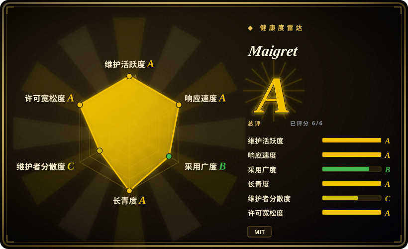

# Maigret

用户名→档案的 OSINT 收集器：核查 3000+ 站点（无需 API key），从个人页提取一切可得数据与跨站 ID，对发现的标识符递归搜索，并产出 HTML/PDF/XMind 报告——本类目里最深、维护最活跃的用户名工具。

## 何时使用

你是授权范围内的调查者（取得同意书的记者、企业安全、交战规则允许的红队，或核查自己的 handle），手里只有一个用户名，需要它背后的完整公开足迹。你运行 `maigret USERNAME`；默认一遍扫流量最高的 500 个站点，`socid-extractor` 从个人页和站点 API 里抽出 ID、姓名和指向其他账户的链接，Maigret 再对发现的东西递归。你拿到控制台输出加 HTML/PDF/XMind 报告和图状 web UI——一份可交付的档案，而不只是一张命中清单。

当深度胜过简单时，你选 Maigret 而不是 [Sherlock](sherlock.zh.md)：3000+ 站点对 482 站，ID 提取加递归对平铺的存在性清单，活跃发版（v0.6.6 于 2026-09-18）对更慢的节奏。当你的键是用户名而不是邮箱时，你选它而不是 [holehe](holehe.zh.md)/[socialscan](socialscan.zh.md)——而且它的自动更新站点数据库（每 24 小时从 GitHub 拉取，内置离线回退）是本类目唯一的自愈数据方案。Tor/I2P 站点支持和域名核查是白送的。

## 何时不用

- **你手里只有邮箱。** 先用 [holehe](holehe.zh.md)（fork 并复验）或 [socialscan](socialscan.zh.md) 把邮箱换成存在性信号和恢复标识符，再把发现的用户名喂回 Maigret。
- **你要快速、最小、低依赖的核查。** 用 [Sherlock](sherlock.zh.md)——当你只需要「这个 handle 在主流网络存不存在」时，Maigret 的 poetry 依赖栈（aiohttp、lxml、networkx、xhtml2pdf、XMind、jinja2……）和 3000+ 站点的全量 `-a` 扫描太重。
- **你需要 Google 账户内部信息。** 用 [GHunt](ghunt.zh.md)；Maigret 只能看到公开的个人页表面。
- **你需要保证安静的操作。** Maigret 检测并**部分**绕过封锁/CAPTCHA（其 README 原话）——单 IP 全量 `-a` 扫描仍会被限流；配合代理池（`proxy-pool` 类目）或用 `--tags` 收窄。
- **你不能接受自动更新的远程数据库。** 站点库每次运行从 GitHub 拉取（24h 缓存）；气隙或供应链敏感环境必须钉住内置库并关闭更新。
- **对目标没有授权。** 在没有法律依据的情况下给人建档案，正是这个工具的能力最典型的滥用——先明确委托范围。

## 横向对比

| 替代品 | 是否收录 | 我们的评价 | 取舍 |
|---|---|---|---|
| [Sherlock](sherlock.zh.md) | 已收录 | 需要档案（ID 提取、递归、报告、3000+ 站点、Tor/I2P）时选 Maigret；只需要跨 482 站点的快速、简单、社区充分验证的存在性清单时选 Sherlock。 | Maigret 用重依赖栈和更慢的扫描换深度；Sherlock 用平铺、更粗的结果换简单和速度。 |
| [holehe](holehe.zh.md) | 已收录 | 输入是邮箱时选 holehe 系工具；拿到用户名后选 Maigret——两者是同一次调查的互补阶段，不是替代品。 | holehe 以邮箱为键但已弃养（2024-09）；Maigret 以用户名为键，是这里最活跃的仓库。 |
| [socialscan](socialscan.zh.md) | 已收录 | 要在约 11 个平台拿注册可用性判定时选 socialscan；要跨 3000+ 站点做足迹发现时选 Maigret。 | socialscan 回答「这个能不能注册」；Maigret 回答「这个人已经存在于哪里、在那里留下了什么」。 |
| [GHunt](ghunt.zh.md) | 已收录 | 要对 Google 账户做认证式深挖时选 GHunt；要做无认证的宽域用户名扫描时选 Maigret。 | GHunt 用你的会话 cookie 深挖单一生态（ToS 风险）；Maigret 完全无凭据、宽而广。 |

## 技术栈

- **语言：** Python ^3.10，poetry 管理。
- **异步网络：** aiohttp + aiohttp-socks（代理/Tor）、aiodns。
- **提取：** socid-extractor（从个人页/API 提取账户 ID）、lxml/html5lib/soupsieve 解析、networkx 建链接图。
- **报告：** Jinja2 模板→HTML；xhtml2pdf→PDF；XMind 思维导图；graphml；另内置图浏览与报告下载的 web UI。
- **数据：** 自动更新站点数据库（JSON，每 24h 从 GitHub 拉取，带内置回退）；`--ai` 模式用任意 OpenAI 兼容 API 汇总发现。
- **分发：** PyPI（`pip install maigret`）、Windows 独立 exe、Docker、社区 Telegram bot。

## 依赖

- Python 3.10+ 运行时；`pip install maigret` 或独立 exe。核心扫描无需 API key。
- 对 3000+ 站点的出站网络；站点库自动更新需要可达 GitHub（气隙环境关闭）。
- 可选：全量扫描抗限流用的代理/Tor；仅 `--ai` 模式需要 OpenAI 兼容 API key。

## 运维难度

**起步低，规模化中等。** `pip install maigret USERNAME` 几分钟跑通，默认 top-500 扫描行为温和。规模上来运维才出现：全量 `-a` 扫描慢且易限流（建议代理轮换），自动更新库在敏感环境是需要钉住的供应链面，报告/web UI 产物聚合了个人数据、需要处置规则。readthedocs 文档和活跃的 issue 区降低了负担。

## 健康度与可持续性

- **维护情况（2026-09）：** 极度活跃——v0.6.6 于 2026-09-18 发布，nightly 构建持续发布，默认分支同日有 push；2025–2026 发版线稳定。
- **治理 / bus factor：** 个人仓库、soxoj 主导，但约 87 个贡献者，有 CHANGELOG/CONTRIBUTING/CODE_OF_CONDUCT、readthedocs 和赞助生态——bus factor 真实存在，但被文档和社区缓解。
- **年龄 × Lindy：** 创建于 2020-06（约 6 年）且仍保持周到月级发版——年龄×活跃的强信号。
- **采用信号：** 37.7k star / 2.9k fork；README 列出基于它构建的专业 OSINT 产品；Telegram bot 和 Cloud Shell 路径说明轻量用户面也广。
- **风险标记：** MIT 许可（无 copyleft 风险）；README 带住宅代理赞助广告（是资金信号，不是缺陷）；档案能力是双刃剑、滥用面明显；站点库自动更新是远程数据依赖。

## 存疑（未验证）

- [未验证] 「3000+ 站点」是项目自报数字（sites.md）；本条目未实测逐站模块健康度。
- [未验证] CAPTCHA/封锁「部分绕过」的实际效果未独立评估。
- [未验证] 未深入分析 README 的 Commercial Use 小节；MIT 许可意味着自由，但转售衍生服务前请核对原文。
- [推断] 依据工具自身对代理/Tor 文档的强调，单 IP 全量 `-a` 扫描会被大量限流。
- [未验证] `--ai` 分析的质量与成本取决于用户自备的 OpenAI 兼容端点；未评估。
