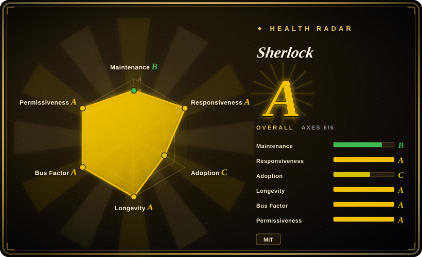

# Sherlock

The classic username hunter: checks a handle across 482 social networks via profile-page probes, with Tor/proxy support and CSV/XLSX/JSON output — the simplest, most community-battle-tested entry point to username OSINT, at the cost of coarser signals than dossier tools.

## When to use

You're doing authorized recon — red-team footprint mapping under RoE, brand/handle-squatting checks, or auditing your own online presence — and you need a quick answer to "where does this username exist?". You run `sherlock user1 user2`, it probes its 482-site database (a declarative `data.json` of per-site URL patterns and error messages), and prints found accounts with links, exportable to CSV/XLSX/JSON. `--tor`/`--unique-tor` and `--proxy` are built in for rate-limit survival.

You pick Sherlock over [Maigret](maigret.md) when simplicity, speed, and a minimal dependency footprint (requests + a JSON file) beat dossier depth — Sherlock tells you *where* a handle exists; it does not extract profile content, IDs, or cross-links. You pick it over [holehe](holehe.md)/[socialscan](socialscan.md) when your key is a username and you want the widest maintained site list with org-level governance (3 named maintainers, ~314 contributors, releases through 2026) rather than a solo repo. It is also the natural teaching example: the site database is a single readable JSON file showing exactly how username-existence probing works.

## When NOT to use

- **You need a dossier, not a hit list.** Use [Maigret](maigret.md) — ID extraction (socid-extractor), recursive search, HTML/PDF/XMind reports, 3000+ sites. Sherlock stops at "account found".
- **False positives are unacceptable.** Sherlock's profile-page heuristics (HTTP status / error-text matching) misfire on reserved names and deleted/banned accounts — the exact critique socialscan's registration-endpoint method was built to fix. For available/taken verdicts on the ~11 platforms it covers, use [socialscan](socialscan.md); for existence elsewhere, cross-check Maigret's results against Sherlock's.
- **Your input is an email.** Use [socialscan](socialscan.md) or a re-verified [holehe](holehe.md) fork first.
- **You need Google-ecosystem depth.** Use [GHunt](ghunt.md).
- **You expect quiet, unattended bulk scanning from one IP.** Sherlock has no auto-updating site DB and no block-bypass machinery beyond Tor/proxy flags; heavy runs need a proxy pool (`proxy-pool` category) and 347 open issues show site-breakage reports queue up.
- **No authorization for the target handle.** Same legal/ToS boundary as the whole category.

## Comparison

| Alternative | In index | Our verdict | Tradeoff |
|---|---|---|---|
| [Maigret](maigret.md) | ✅ | Choose Maigret when the deliverable is a dossier (extracted IDs, recursion, reports, 3000+ sites, Tor/I2P); choose Sherlock when the deliverable is a fast, simple, auditable existence list across 482 sites. | Maigret pays for depth with a heavy poetry stack and slower scans; Sherlock pays for simplicity with coarser profile-page signals and no extraction. |
| [socialscan](socialscan.md) | ✅ | Choose socialscan when you need registration-grade available/taken accuracy on ~11 platforms; choose Sherlock for breadth-first existence checks across 482. | socialscan's registration-endpoint method eliminates Sherlock's false-positive classes but covers 40× fewer sites. |
| [holehe](holehe.md) | ✅ | Choose holehe-family tooling when the identifier is an email; choose Sherlock when it is a username — complementary stages, not substitutes. | holehe is email-keyed and abandoned (2024-09); Sherlock is username-keyed, org-governed, and actively released. |
| [GHunt](ghunt.md) | ✅ | Choose GHunt for authenticated Google-account investigation; choose Sherlock for unauthenticated wide sweeps. | GHunt sees inside one ecosystem with your cookies (ToS risk); Sherlock sees only public profile surfaces across many. |

## Tech stack

- **Language:** Python ^3.9, poetry-core build; published to PyPI as `sherlock-project`.
- **Networking:** synchronous requests (with certifi, PySocks for SOCKS/Tor) — no async stack, which keeps the code small and readable.
- **Site database:** declarative `data.json` (482 entries as of 2026-09) mapping each site to a profile URL pattern, error-message matchers, and metadata; contributors extend it via PR.
- **Output:** console, `--csv`, `--xlsx`, `--json`, per-site folder output; `--browse` opens found profiles.
- **Governance:** GitHub Organization (sherlock-project) with 3 named maintainers in pyproject; homepage sherlockproject.xyz.

## Dependencies

- Python 3.9+; `pipx install sherlock-project` or `pip install sherlock-project`. Runtime deps are minimal (requests, colorama, PySocks, certifi, openpyxl-family for xlsx).
- Outbound HTTPS to 482 sites; optional Tor daemon for `--tor`/`--unique-tor`; optional HTTP/SOCKS proxy via `--proxy`.
- No API keys, no database server, no self-hosted services.

## Ops difficulty

**Low.** Single-command runs, trivial dependency set, and a site database that is one JSON file you can audit or pin. Ongoing cost is result hygiene: profile-page heuristics need human verification of hits (false positives), site modules break as platforms change (watch the issue queue), and Tor/proxy paths need their own runtime setup. There is no auto-update mechanism for the site DB — you get fixes by upgrading the package.

## Health & viability

- **Maintenance (2026-09):** active — v0.16.2 released 2026-09-08, default branch pushed 2026-09-18; yearly-ish minor releases since 2024 (v0.15.0 2024-07, v0.16.0 2025-09).
- **Governance / bus factor:** the strongest in this category — GitHub Organization ownership, 3 named maintainers, ~314 contributors, documented contribution flow. No single-person bus factor.
- **Age × Lindy:** created 2018-12 (~7.7 years) and still actively released — the best age × active signal in the category.
- **Adoption:** 92k stars / 10.8k forks — the reference tool most username-OSINT material is written against; packaged in security distros. [未验证]
- **Risk flags:** MIT license; 347 open issues (largly site-breakage reports) indicate triage backlog despite active releases; synchronous design limits scan speed at scale; heuristic method has structural false-positive/negative classes.

## Caveats (unverified)

- [未验证] "Packaged in security distros" (e.g. Kali) was not verified against distro package lists for this entry.
- [未验证] The 482-site count is from `data.json` on master as of 2026-09-18; per-site module health was not live-tested.
- [推断] False-positive rate on reserved/deleted names is structural to the profile-page method per socialscan's documented critique; Sherlock's exact current error rate was not measured.
- [未验证] Whether the open-issue backlog materially delays site-database fixes was not assessed.
