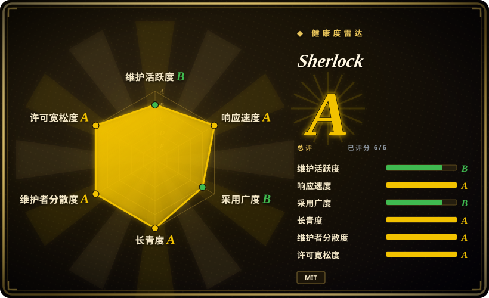

# Sherlock

经典用户名猎手：通过个人页探测核查一个 handle 在 482 个社交网络上的存在性，内置 Tor/代理支持和 CSV/XLSX/JSON 导出——用户名 OSINT 最简单、社区验证最充分的入口，代价是信号比档案类工具更粗。

## 何时使用

你在做授权侦察——交战规则内的红队足迹测绘、品牌/handle 抢注检查，或审计自己的在线存在——需要快速回答「这个用户名存在于哪里」。你运行 `sherlock user1 user2`，它探测其 482 站点数据库（一个声明式的 `data.json`，逐站记录 URL 模式和错误信息匹配），打印找到的账户及链接，可导出 CSV/XLSX/JSON。`--tor`/`--unique-tor` 和 `--proxy` 内建，用于抗限流。

当简单、速度和最小依赖面（requests + 一个 JSON 文件）胜过档案深度时，你选 Sherlock 而不是 [Maigret](maigret.zh.md)——Sherlock 告诉你 handle **在哪里**存在，但不提取个人页内容、ID 或交叉链接。当你的键是用户名、且你想要组织级治理（3 位具名维护者、约 314 个贡献者、发版持续到 2026）而不是个人仓库时，你选它而不是 [holehe](holehe.zh.md)/[socialscan](socialscan.zh.md)。它也是天然的教学样例：站点数据库就是一个可读的 JSON 文件，把用户名存在性探测的原理摊开给你看。

## 何时不用

- **你要的是档案，不是命中清单。** 用 [Maigret](maigret.zh.md)——ID 提取（socid-extractor）、递归搜索、HTML/PDF/XMind 报告、3000+ 站点。Sherlock 到「找到账户」为止。
- **不能容忍假阳性。** Sherlock 的个人页启发式（HTTP 状态码/错误文本匹配）在保留名和被删/被封账户上会失手——这正是 socialscan 的注册端点方法要修的问题。要在其覆盖的约 11 个平台拿「可用/已占用」判定，用 [socialscan](socialscan.zh.md)；查其他站点的存在性，用 Maigret 的结果和 Sherlock 交叉验证。
- **你的输入是邮箱。** 先用 [socialscan](socialscan.zh.md) 或复验过的 [holehe](holehe.zh.md) fork。
- **你需要 Google 生态深度。** 用 [GHunt](ghunt.zh.md)。
- **你指望单 IP 安静地无人值守批量扫描。** Sherlock 没有自动更新的站点库，除了 Tor/代理参数外没有绕封锁机制；重度使用需要代理池（`proxy-pool` 类目），且 347 个 open issue 说明站点失效报告会排队。
- **对目标 handle 没有授权。** 与全类目相同的法律/ToS 边界。

## 横向对比

| 替代品 | 是否收录 | 我们的评价 | 取舍 |
|---|---|---|---|
| [Maigret](maigret.zh.md) | 已收录 | 交付物是档案（提取的 ID、递归、报告、3000+ 站点、Tor/I2P）时选 Maigret；交付物是跨 482 站点快速、简单、可审计的存在性清单时选 Sherlock。 | Maigret 用重 poetry 依赖栈和更慢的扫描换深度；Sherlock 用更粗的个人页信号和零提取换简单。 |
| [socialscan](socialscan.zh.md) | 已收录 | 需要在约 11 个平台拿注册级「可用/已占用」准确度时选 socialscan；要 482 站点的广度优先存在性核查时选 Sherlock。 | socialscan 的注册端点方法消除了 Sherlock 的假阳性类别，但覆盖站点少 40 倍。 |
| [holehe](holehe.zh.md) | 已收录 | 标识符是邮箱时选 holehe 系工具；是用户名时选 Sherlock——互补阶段，不是替代品。 | holehe 以邮箱为键且已弃养（2024-09）；Sherlock 以用户名为键、组织治理、发版活跃。 |
| [GHunt](ghunt.zh.md) | 已收录 | 要做认证式 Google 账户调查时选 GHunt；要做无认证宽域扫描时选 Sherlock。 | GHunt 用你的 cookie 看进单一生态内部（ToS 风险）；Sherlock 只看多站点的公开个人页表面。 |

## 技术栈

- **语言：** Python ^3.9，poetry-core 构建；以 `sherlock-project` 发布到 PyPI。
- **网络：** 同步 requests（配 certifi、PySocks 走 SOCKS/Tor）——没有异步栈，代码小而可读。
- **站点数据库：** 声明式 `data.json`（截至 2026-09 共 482 条），逐站记录个人页 URL 模式、错误信息匹配器和元数据；贡献者通过 PR 扩展。
- **输出：** 控制台、`--csv`、`--xlsx`、`--json`、逐站文件夹输出；`--browse` 打开找到的个人页。
- **治理：** GitHub 组织（sherlock-project），pyproject 里 3 位具名维护者；主页 sherlockproject.xyz。

## 依赖

- Python 3.9+；`pipx install sherlock-project` 或 `pip install sherlock-project`。运行时依赖极少（requests、colorama、PySocks、certifi、xlsx 用的 openpyxl 系）。
- 对 482 个站点的出站 HTTPS；`--tor`/`--unique-tor` 需要 Tor daemon；`--proxy` 需要 HTTP/SOCKS 代理。
- 无 API key、无数据库服务、无自建服务。

## 运维难度

**低。** 单命令运行、依赖集琐碎、站点库是一个可审计可钉住的 JSON 文件。持续成本在结果卫生：个人页启发式的命中需要人工复核（假阳性），平台变更会弄坏站点模块（盯 issue 队列），Tor/代理路径需要自己的运行时配置。站点库没有自动更新机制——修站点靠升级包。

## 健康度与可持续性

- **维护情况（2026-09）：** 活跃——v0.16.2 于 2026-09-08 发布，默认分支 2026-09-18 有 push；2024 年以来大约每年一个 minor（v0.15.0 2024-07、v0.16.0 2025-09）。
- **治理 / bus factor：** 本类目最强——GitHub 组织所有、3 位具名维护者、约 314 个贡献者、有文档化的贡献流程。不存在单人 bus factor。
- **年龄 × Lindy：** 创建于 2018-12（约 7.7 年）且仍在活跃发版——类目内最好的年龄×活跃信号。
- **采用信号：** 92k star / 10.8k fork——多数用户名 OSINT 教学材料以它为参照；被安全发行版打包。[未验证]
- **风险标记：** MIT 许可；347 个 open issue（多为站点失效报告）说明尽管发版活跃仍有分诊积压；同步设计限制了大规模扫描速度；启发式方法有结构性的假阳/假阴类别。

## 存疑（未验证）

- [未验证] 「被安全发行版打包」（如 Kali）未对照发行版软件包列表核实。
- [未验证] 482 站点数取自 2026-09-18 master 分支的 `data.json`；未实测逐站模块健康度。
- [推断] 依据 socialscan 文档化的批评，保留名/被删名上的假阳性是个人页方法的结构性问题；Sherlock 当前确切错误率未测量。
- [未验证] open issue 积压是否实质拖慢站点库修复，未评估。
