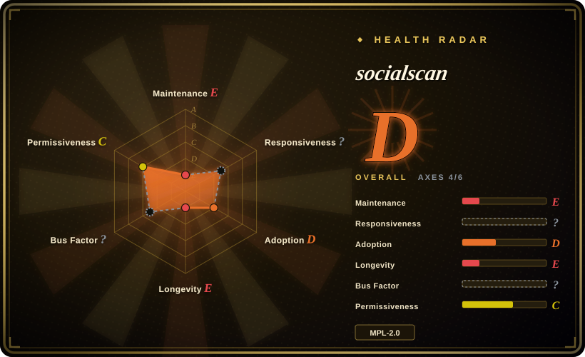

# socialscan

Async email/username availability checker that queries platform **registration endpoints** directly (CSRF tokens, headers, cookies) instead of scraping profile pages — the cleanest available/taken signal in this category, at the cost of covering only ~11 platforms.

## When to use

You're doing brand protection, handle-squatting checks, or authorized OSINT, and you need a *trustworthy* verdict on whether an email or username is already taken on the major platforms. You run `socialscan user@example.com somehandle` (or import it as a Python library), and it concurrently queries each platform's registration flow, returning AVAILABLE / TAKEN / INVALID per query. Because it talks to the same endpoint a real signup form uses, it avoids the classic profile-page false positives (reserved names like `admin` show as taken; deleted/banned handles show correctly).

You pick socialscan over [holehe](holehe.md) when correctness-on-life-support matters more than breadth: holehe covers 120+ email sites but has been unmaintained since 2024-09, while socialscan still receives commits (last push 2026-08) and its narrow platform list is easier to re-verify. You pick it over [Sherlock](sherlock.md)/[Maigret](maigret.md) when your real question is "is this identifier *registrable*", not "where does this person already exist" — and its MPL-2.0 is the most permissive license in this category.

## When NOT to use

- **You need broad coverage.** ~11 platforms total (email: Instagram, Twitter, GitHub, Tumblr, Lastfm, Pinterest, Firefox; username adds Snapchat, GitLab, Reddit, Yahoo). For 120+ email sites use a re-verified [holehe](holehe.md) fork; for 3000+ username sites use [Maigret](maigret.md).
- **You're building a person-dossier, not checking availability.** Use [Maigret](maigret.md) — it extracts profile data, IDs, and cross-links; socialscan only answers taken/available.
- **You need deep Google-ecosystem intel.** Use [GHunt](ghunt.md); socialscan has no Google module.
- **You need a guaranteed-maintained dependency.** Last release v2.0.1 is from 2024-01 and the contributor base is ~7 people; commits are sporadic. Pin the version and re-verify modules before production use. [推断]
- **You expect the "100% accuracy" claim to be a contract.** That is the author's README claim for the registration-endpoint method; registration flows change and any module can silently rot — treat per-platform results as testable hypotheses, not guarantees.
- **You lack authorization for the identifiers you're checking.** Bulk email-checking third parties raises the same legal/ToS issues as every tool in this category.

## Comparison

| Alternative | In index | Our verdict | Tradeoff |
|---|---|---|---|
| [holehe](holehe.md) | ✅ | Choose socialscan when you need maintained, accurate verdicts on the ~11 platforms it covers; choose holehe (forked and re-verified) only when you need its 120+ site breadth or recovery-info leakage. | socialscan: narrow but clean-signal and MPL-2.0; holehe: wide but abandoned since 2024-09 and GPL-3.0. |
| [Maigret](maigret.md) | ✅ | Choose Maigret when you hold a username and want a full dossier across 3000+ sites; choose socialscan when the question is purely "can I register this identifier". | Maigret answers "where does this person exist" with heavy machinery; socialscan answers "is it taken" with minimal deps (aiohttp, tqdm, colorama). |
| [Sherlock](sherlock.md) | ✅ | Choose Sherlock for existence checks across 480+ networks; choose socialscan when false positives from profile-page heuristics are unacceptable on the platforms it covers. | Sherlock is broader and community-tested but coarser; socialscan is narrower but registration-endpoint accurate and also handles emails. |
| [GHunt](ghunt.md) | ✅ | Choose GHunt for authenticated Google-account investigation; choose socialscan for unauthenticated multi-platform availability. | GHunt needs your Google session cookies and carries ToS risk; socialscan needs nothing but network access to signup forms. |

## Tech stack

- **Language:** Python (setup.py declares `python_requires>=3.6`; CI matrices historically covered newer versions).
- **Async:** asyncio + aiohttp — all platform queries run concurrently (~100 queries in ~4s per author's benchmark).
- **Probing method:** per-platform modules replicate the registration flow — fetch CSRF token, set headers/cookies, submit the identifier, classify the response as available/taken/invalid.
- **Interfaces:** CLI (`socialscan` console script with `--platforms`, `--view-by`, `--available-only`) and importable Python API.
- **Quality infra:** tests directory + tox/flake8 config (rare in this category); legacy Travis CI config.

## Dependencies

- Python runtime; `pip install socialscan`. Runtime deps are minimal: aiohttp, tqdm, colorama.
- Outbound HTTPS to ~11 platform signup endpoints; no API keys, no database, no self-hosted services.
- No proxy support documented — sustained bulk runs from one IP will hit platform rate limits.

## Ops difficulty

**Low.** Pip-installable, no configuration, stateless one-shot runs, and a small module surface (~11 platforms) that a team can re-verify by hand in an afternoon. The only ongoing burden is the category-wide one: platforms change their signup flows, so schedule periodic re-verification and pin your version; there is no auto-updating site database like Maigret's.

## Health & viability

- **Maintenance (2026-09):** not archived; last push 2026-08-03 but last release v2.0.1 dates to 2024-01 — sporadic commits without release cadence. Alive, coasting.
- **Governance / bus factor:** personal repo (iojw), ~7 contributors; effectively solo-maintained. No org or commercial backing found.
- **Age × Lindy:** created 2019-02 (~7.5 years) and still receiving commits — a decent age × active signal, weaker than Maigret/Sherlock because activity is sporadic.
- **Adoption:** 1.8k stars / 221 forks; 15,470 PyPI downloads last month (measured 2026-09); far smaller community than Sherlock (92k) or Maigret (37.7k).
- **Risk flags:** MPL-2.0 is file-level copyleft (mildest in category); no proxy/rotation story; platform-module rot risk; "100% accuracy" is an unverified author claim.

## Caveats (unverified)

- [未验证] The "100% accuracy" and "~100 queries in ~4 seconds" figures are author-reported in the README; not independently reproduced for this entry.
- [未验证] Current per-platform module health was not live-tested; the platform list is from the README as of 2026-09 and flows may have changed since v2.0.1 (2024-01).
- [推断] The 2026-08 push without a release suggests maintenance is reactive (dependency bumps/ small fixes) rather than feature development.
- [推断] Absence of documented proxy support means bulk usage will be rate-limited or IP-banned by platforms.
