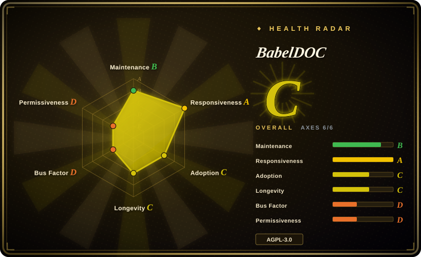
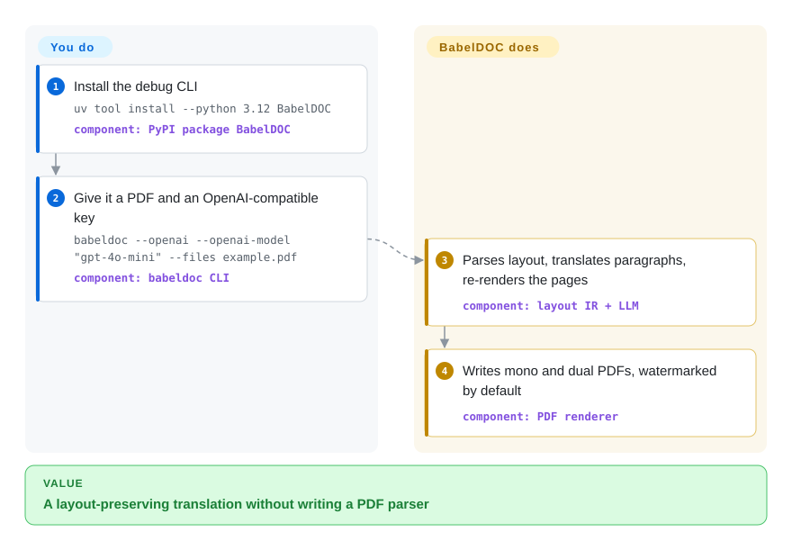

# BabelDOC

You want the layout-preserving PDF translation *engine* that Immersive Translate and PDFMathTranslate sit on — not another end-user app. BabelDOC parses the PDF, sends paragraphs to an OpenAI-compatible LLM, and re-renders a translated PDF plus a bilingual comparison; its authors tell you not to call the Python API.

## When to use

You are embedding layout-preserving scientific-PDF translation into another program, or you are debugging the kernel that [PDFMathTranslate](pdfmathtranslate.md) 2.0 wraps. The documented install is `uv tool install --python 3.12 BabelDOC`, then `babeldoc --openai --openai-model "gpt-4o-mini" … --files example.pdf`. That CLI exists; the README also says it is for debugging, that end users should use Immersive Translate's hosted BabelDOC or PDFMathTranslate 2.0, and that **every BabelDOC Python API is internal**.

You pick it over PDFMathTranslate 1.x when you need the current 0.6 kernel: 1.x pins `babeldoc>=0.1.22,<0.3.0` in its own `pyproject.toml`, so `pip install pdf2zh` cannot see this repo's v0.6.4. You pick PDFMathTranslate instead when you want Google/DeepL/Ollama, a Gradio UI, Docker, Zotero, or MCP — this library talks to OpenAI-compatible LLMs only, and is tested primarily English-to-Chinese.

## Q&A

**Q: Should I `import babeldoc` from my app?**
No. The README: "All APIs of BabelDOC should be considered as internal APIs, and any direct use of BabelDOC is not supported." The recommended Python call is `high_level.do_translate_async_stream` on PDFMathTranslate-next (未收录), not this package.

**Q: How does this relate to PDFMathTranslate?**
This is the engine. PDFMathTranslate 1.x is the user-facing product and still depends on an *old* BabelDOC major (`<0.3.0`). PDFMathTranslate-next is the 2.0 fork BabelDOC names for self-hosting. Immersive Translate hosts this engine as SaaS.

## How it works

You supply a PDF, an OpenAI-compatible endpoint, and language codes (default `en` → `zh`). BabelDOC parses the file into an intermediate layout representation — text blocks, images, tables — translates the paragraphs through the LLM (with optional glossary CSV), and renders a mono PDF plus a dual PDF. Formula-like runs are skipped by font/character patterns; table text is off unless you pass `--translate-table-text`. Assets (fonts, ONNX layout model) download from HuggingFace on first use, or you pre-pack them with `--generate-offline-assets`. You own the key, the QPS cap (`--qps`, default 4), and the decision to ignore the "do not call us" warning; it owns parse, translate, and re-render.

<!-- flow-steps:begin (generated from flows/babeldoc.json by tools/flow_card.py — do not edit) -->

Text version of the flow

1. **You**: Install the debug CLI — `uv tool install --python 3.12 BabelDOC` — component: `PyPI package BabelDOC`
2. **You**: Give it a PDF and an OpenAI-compatible key — `babeldoc --openai --openai-model "gpt-4o-mini" --files example.pdf` — component: `babeldoc CLI`
3. **BabelDOC**: Parses layout, translates paragraphs, re-renders the pages — component: `layout IR + LLM`
4. **BabelDOC**: Writes mono and dual PDFs, watermarked by default — component: `PDF renderer`

**Value**: A layout-preserving translation without writing a PDF parser

<!-- flow-steps:end -->

## When NOT to use

- **You just want to translate a paper on your machine.** Use [PDFMathTranslate](pdfmathtranslate.md) instead — CLI, GUI, Docker, many translators, and an upstream that actually supports end users.
- **You need Google, DeepL, Bing, or Ollama as the translator.** BabelDOC's CLI only exposes `--openai`. PDFMathTranslate's `-s` table covers those; this engine tells you to use PDFMathTranslate-next (未收录) for more services.
- **You cannot accept AGPL-3.0, or you cannot treat the API as unstable.** Embedding this in a networked product is copyleft; the README freezes the API as internal. Use a permissive paragraph tool like [Bilingual Book Maker](../reading-tools/bilingual-book-maker.md) for non-PDF files, or a commercial PDF translator (非仓库).
- **The job is an EPUB/txt book, not a PDF whose layout must survive.** Use Bilingual Book Maker.
- **You need Markdown/JSON for RAG.** Use [Docling](../document-parsing/docling.md) — BabelDOC re-renders PDFs, it does not linearize documents.
- **The language pair is not English→Chinese (or basic English output).** Upstream: "this project mainly focuses on English-to-Chinese translation, and other scenarios have not been tested yet." Known issues also skip large pages, drop caps, and lines, and merge author/reference sections.

## Comparison

| Alternative | In index | Our verdict | Tradeoff |
|---|---|---|---|
| [PDFMathTranslate](pdfmathtranslate.md) | ✅ | When you are an end user or you need many translation backends, pick PDFMathTranslate; pick BabelDOC only to debug or embed the current 0.6 engine, knowing its Python API is unsupported. | PDFMathTranslate 1.x is the product but pins `babeldoc<0.3.0`; this repo is v0.6.4, OpenAI-only, maintainer-led. |
| PDFMathTranslate-next | 未收录 | When you want self-hosted 2.0 with WebUI and more translators on top of current BabelDOC, that fork is the path BabelDOC's README names; this page stays the engine. | Separate org/repo (`PDFMathTranslate-next/PDFMathTranslate-next`, ~3k stars); skipped this batch because indexing was scoped to BabelDOC plus PDFMathTranslate 1.x. |
| [Bilingual Book Maker](../reading-tools/bilingual-book-maker.md) | ✅ | When the file is a book you will read as EPUB/txt, pick Bilingual Book Maker; pick BabelDOC when the output must remain a laid-out PDF. | BBM is MIT and layout-blind; BabelDOC is AGPL, ONNX-heavy, and PDF-native. |
| Immersive Translate hosted PDF translator | 非仓库 | When you want the engine without operating ONNX, fonts, or an API key, use the hosted quota; pick this repo when the PDF cannot leave your machine. | Hosted SaaS at `app.immersivetranslate.com/babel-doc/` — funstory-ai's commercial front door, not a repository. |

## Tech stack

- **Python** package `BabelDOC` (Hatchling); CLI entry `babeldoc = babeldoc.main:cli`; requires `>=3.10,<3.14`
- **PDF I/O:** PyMuPDF, vendored pdfminer, pikepdf-adjacent cleaning
- **Layout / vision:** ONNX Runtime, OpenCV headless, scikit-image, DocLayout-style detection (HuggingFace assets)
- **Translation:** `openai` Python SDK only (any OpenAI-compatible base URL); optional glossary CSV
- **Heavy native extras:** hyperscan, uharfbuzz, scipy, scikit-learn, freetype-py
- **Org:** funstory-ai (Immersive Translate)

## Dependencies

- **Python 3.10–3.13** and a working ONNX Runtime (CPU default; extras `cuda` / `directml`)
- **HuggingFace Hub** for fonts and the layout model, unless you restore an offline-assets zip
- **An OpenAI-compatible API key** — there is no Google/DeepL path in this CLI
- **Disk for `~/.cache/babeldoc/`** working files; `--debug` dumps intermediates there

## Ops difficulty

**Medium-high.** The CLI is one command, but the runtime is an ML stack (ONNX, OpenCV, scipy, hyperscan) plus a mandatory LLM endpoint. First run downloads hashed fonts/models; air-gapped installs need `--generate-offline-assets` on a networked machine first. Default output is watermarked. QPS defaults to 4. Embedding it means you accept AGPL §13 (network copyleft) and an API the authors call internal. For anything you will actually operate, PDFMathTranslate or the hosted Immersive Translate service is the lower-ops door.

## Health & viability

- **Maintenance:** Created 2024-11-13; latest release v0.6.4 on 2026-07-16 (layout pixel-budget + CJK line-spacing). Last push 2026-08-05 ("update pdf2zh-next url") — about seven weeks before this page, so recent but quieter than PDFMathTranslate 1.x. 89 open issues+PRs. Explicit maintainer-led mode: behavior changes want an issue first.
- **Governance / bus factor:** Org-owned (funstory-ai). GitHub contributors: awwaawwa 1701, then a steep drop (pppppop65 30, lalawuu 23). Commercial vendor (Immersive Translate) is the backer, which is stronger than a hobbyist solo — and also means the hosted SaaS is the product they care about.
- **Backing & longevity (Lindy):** ~22 months old, still releasing in 2026 — weak Lindy, still-active holds. Hiring page on the README. Pride+semver (`0.MAJOR.MINOR`); compatibility is defined against pdf2zh_next.
- **Adoption:** 9.6k stars, 803 forks, PyPI `BabelDOC` 0.6.4 (as of 2026-09-27). Downstream: PDFMathTranslate 1.x (old pin), PDFMathTranslate-next, Immersive Translate hosted, two Zotero plugins named in the README.
- **Risk flags:** AGPL-3.0. Python API declared unsupported. CLI "no technical support." Default watermark. EN→ZH-first. Table translation still experimental.

## Caveats (unverified)

- [未验证] Translation quality, layout-error rate, and the 1.0 roadmap targets ("layout error <1%") were not reproduced; they are README/roadmap claims.
- [未验证] Known issues (merged author/reference sections, no lines, no drop caps, skipped large pages) are README-listed; not re-checked on sample PDFs.
- [未验证] Whether PDFMathTranslate-next actually calls this 0.6.4 tree (versus a submodule snapshot) was not traced in source.
- [未验证] Offline-assets zip size, and whether every font/model is covered, was not generated here.
- [推断] Immersive Translate's hosted quota and the open repo can diverge in features; the SaaS is not a git tag.
