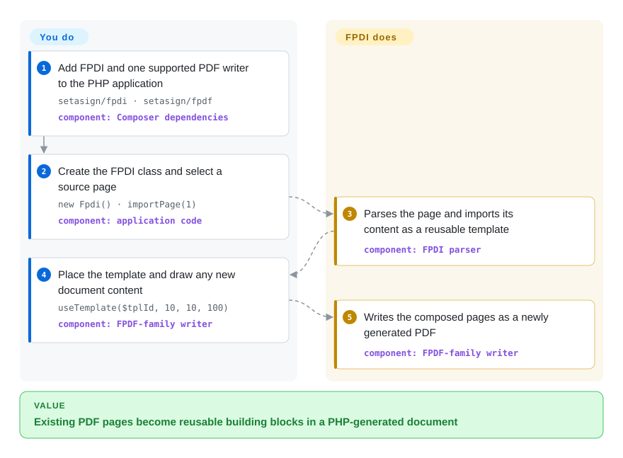

# FPDI

A PHP library that imports pages from existing PDFs as reusable templates in documents produced with FPDF, TCPDF, or tFPDF.

## When to use

You maintain a PHP application that already creates PDFs with FPDF, TCPDF, or tFPDF, and now a supplied PDF must become a letterhead, background, cover, or page in a newly composed document. Choose FPDI when the decisive requirement is to reuse an existing page through the same PHP drawing API, without deploying a PDF service or switching the application to another language.

The fit is narrow but useful: FPDI reads the source page, turns its content into a form XObject, and lets the chosen generation library place that template alongside newly drawn content. That is simpler than adopting a general PDF object editor when the output is a new composition rather than an in-place preservation of the source document.

## How it works

You install FPDI plus one supported PDF generation library, create its matching FPDI class, and open a source PDF. FPDI parses the selected page and imports its content as a reusable template; you decide which pages to import, where to place them, and what new content to draw. The underlying FPDF, TCPDF, or tFPDF writer creates the output document, while FPDI handles source-page reading, sizing, resource copying, and template placement. The result is a newly generated PDF, not an incremental edit of the original file.

<!-- flow-steps:begin (generated from flows/fpdi.json by tools/flow_card.py — do not edit) -->

Text version of the flow

1. **You**: Add FPDI and one supported PDF writer to the PHP application — `setasign/fpdi · setasign/fpdf` — component: `Composer dependencies`
2. **You**: Create the FPDI class and select a source page — `new Fpdi() · importPage(1)` — component: `application code`
3. **FPDI**: Parses the page and imports its content as a reusable template — component: `FPDI parser`
4. **You**: Place the template and draw any new document content — `useTemplate($tplId, 10, 10, 100)` — component: `FPDF-family writer`
5. **FPDI**: Writes the composed pages as a newly generated PDF — component: `FPDF-family writer`

**Value**: Existing PDF pages become reusable building blocks in a PHP-generated document

<!-- flow-steps:end -->

## When NOT to use

- **Your input uses compressed cross-reference/object streams or encryption.** Preprocess it with [qpdf](qpdf.md), or license Setasign's commercial FPDI PDF-Parser add-on; the free parser explicitly rejects these structures and encrypted documents.
- **You must preserve existing signatures, revisions, or the original object graph.** Choose [SAPP](sapp.md) for PHP-side incremental object work, because FPDI imports page content into a newly generated document rather than appending an incremental revision.
- **You need form fields, general annotations, bookmarks, layers, or document-level actions to survive import.** Choose [pdf-lib](pdf-lib.md) for programmatic form and document manipulation, or a fuller PDF SDK; FPDI's form-XObject model cannot carry most dynamic or document-level content. URI link annotations are a limited opt-in exception.
- **You need rendering, text extraction, search, or broad batch analysis.** Choose [PyMuPDF](pymupdf.md); FPDI is a page-import bridge for PHP generators, not a viewer or extraction engine.
- **You are not already using an FPDF-family writer.** Choose [pdf-lib](pdf-lib.md) for JavaScript runtimes or [PyMuPDF](pymupdf.md) for Python rather than adding PHP and a separate generation library solely for FPDI.

## Comparison

| Alternative | In index | Our verdict | Tradeoff |
|---|---|---|---|
| [SAPP](sapp.md) | ✅ | Choose FPDI when a PHP generator should reuse pages as templates; choose SAPP when preserving revisions, signatures, and access to the original PDF object graph is the actual requirement. | FPDI offers the shorter composition workflow and a permissive license, but rebuilding the document discards revision semantics that SAPP's incremental model retains. |
| [pdf-lib](pdf-lib.md) | ✅ | Choose FPDI for server-side PHP applications already built around FPDF/TCPDF; choose pdf-lib when creation and modification must run in JavaScript, including a browser. | FPDI integrates with established PHP writers but has a narrower import model; pdf-lib broadens runtime and editing options while moving the application to a different API ecosystem. |
| [PyMuPDF](pymupdf.md) | ✅ | Choose FPDI for a small PHP page-template workflow; choose PyMuPDF when Python-side rendering, extraction, analysis, and broader manipulation matter more than FPDF compatibility. | FPDI is purpose-built glue for FPDF-family output; PyMuPDF covers more PDF tasks but introduces Python and its own licensing constraints. |
| [qpdf](qpdf.md) | ✅ | Choose qpdf to decrypt permitted inputs, normalize structures, repair files, or perform document-level transformations; choose FPDI when PHP code must place an imported page into newly drawn output. | qpdf is a robust CLI/native preprocessing boundary but is not an FPDF template API; FPDI embeds directly in PHP but its free parser accepts fewer PDF structures. |

## Tech stack

- **Language and distribution:** PHP with PSR-4 autoloading under `setasign\Fpdi\`, distributed as Composer package `setasign/fpdi`.
- **Generation adapters:** concrete integrations extend FPDF, TCPDF, or tFPDF; the repository intentionally declares none of them as a fixed runtime dependency.
- **Parsing:** an in-process tokenizer, cross-reference reader, PDF value model, stream filters, page reader, and form-XObject template layer.
- **Input forms:** file paths, PHP stream resources, and in-memory strings are supported by the version 2 reader.
- **Testing:** the repository includes unit, functional, and visual suites across FPDF, TCPDF, and tFPDF integrations.

## Dependencies

- **Runtime:** PHP `>=7.2 <=8.6.99999` and `ext-zlib`, as declared in `composer.json` on 2026-09-22.
- **PDF writer:** install FPDF, TCPDF, or tFPDF separately; FPDI does not create a usable output stack without one of these compatible base libraries.
- **Infrastructure:** no database, daemon, native binary, or external service is required for the open-source parser.
- **Commercial boundary:** compressed cross-reference/object streams and encrypted/protected inputs require preprocessing or the separately licensed FPDI PDF-Parser add-on; that add-on is not part of the MIT repository.

## Ops difficulty

**Low for supported inputs; medium when input PDFs are uncontrolled.** FPDI runs inside the PHP process and adds no service to deploy, so installation and scaling follow the host application. Production work still needs input-size limits, representative compatibility fixtures, exception handling for unsupported or malformed structures, and a policy for rejecting, preprocessing, or commercially parsing unsupported PDFs. Pin FPDI and the chosen base writer together because compatibility spans both packages. [推断]

## Health & viability

- **Maintenance:** Grade B — the latest commit was 21 days before scoring, with activity in 2 of the previous 13 weeks; the repository is not archived, and v2.6.8 was released on 2026-06-11.
- **Responsiveness:** Not scored — the sampled window had activity but no qualifying issue or pull-request response signal.
- **Adoption:** Grade A — the scorer recorded 5,723 dependent repositories and volume tier A. Its raw field is `downloads_last_month=170998789`; Packagist's direct stats endpoint instead reported 6,244,768 monthly and 171,313,863 total downloads on 2026-09-22, so the field-name mismatch needs tooling review.
- **Longevity:** Grade A — the repository was 4,155 days old with a commit 21 days before scoring; that age-plus-activity combination is a strong Lindy signal for this specialized PHP library. [推断]
- **Governance:** Grade B — 3 active maintainers were measured in the last 12 months, with the top contributor at 54.4% and the top three at 100% of measured contributions. Setasign organization ownership and the commercial add-on provide vendor backing, but contribution remains concentrated.
- **Risk / license:** Grade A — GitHub reports MIT, `composer.json` declares MIT, and `LICENSE.txt` contains the MIT terms, with no relicense detected in the measured 36-month window. The open-core boundary is functional: encrypted PDFs and compressed xref/object streams are gated behind a separately licensed parser.

## Caveats (unverified)

- [推断] “Low” versus “medium” operations difficulty depends on how controlled the input PDFs are; no workload or failure-rate benchmark was run.
- [推断] The strong Lindy verdict combines repository/package age with current commit and release activity; it is a selection prior, not a prediction of future maintenance.
- [推断] Contributor concentration is based on GitHub activity measured by the health scorer and does not establish Setasign's internal staffing or succession plan.
