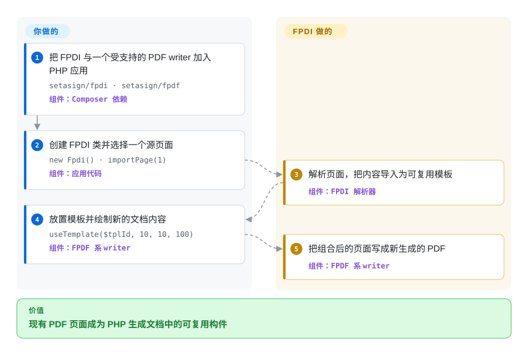

# FPDI

一个 PHP library：把现有 PDF 的页面导入为可复用模板，再由 FPDF、TCPDF 或 tFPDF 生成新文档。

## 何时使用

你维护一个已经用 FPDF、TCPDF 或 tFPDF 生成 PDF 的 PHP 应用，现在需要把外部 PDF 作为信纸、背景、封面或新文档中的页面。当决定性需求是沿用同一套 PHP 绘图 API 复用既有页面，同时不部署 PDF 服务、不切换语言时，选 FPDI。

它的适用面窄但明确：FPDI 读取源页面，把内容变成 form XObject，再让所选生成 library 将模板与新绘制内容放在一起。如果输出目标是重新组合一份文档，而不是原位保留源文件，那么它比引入通用 PDF 对象编辑器更直接。

## 怎么用起来

你安装 FPDI 与一个受支持的 PDF 生成 library，创建对应的 FPDI 类，再打开源 PDF。FPDI 解析所选页面并把内容导入成可复用模板；导入哪些页、放在哪里、另外绘制什么内容由你决定。底层 FPDF、TCPDF 或 tFPDF writer 负责生成输出文档，FPDI 负责读取源页面、取得尺寸、复制资源与放置模板。结果是一份新生成的 PDF，并非对原文件做增量编辑。

<!-- flow-steps:begin (generated from flows/fpdi.json by tools/flow_card.py — do not edit) -->

流程文字版

1. **你**：把 FPDI 与一个受支持的 PDF writer 加入 PHP 应用 — `setasign/fpdi · setasign/fpdf` — 组件：`Composer 依赖`
2. **你**：创建 FPDI 类并选择一个源页面 — `new Fpdi() · importPage(1)` — 组件：`应用代码`
3. **FPDI**：解析页面，把内容导入为可复用模板 — 组件：`FPDI 解析器`
4. **你**：放置模板并绘制新的文档内容 — `useTemplate($tplId, 10, 10, 100)` — 组件：`FPDF 系 writer`
5. **FPDI**：把组合后的页面写成新生成的 PDF — 组件：`FPDF 系 writer`

**价值**：现有 PDF 页面成为 PHP 生成文档中的可复用构件

<!-- flow-steps:end -->

## 何时不用

- **输入使用压缩 cross-reference/object streams 或加密。** 先用 [qpdf](qpdf.zh.md) 预处理，或购买 Setasign 的商业 FPDI PDF-Parser add-on；免费解析器明确拒绝这些结构与加密文档。
- **必须保留既有签名、修订或原始对象图。** 需要 PHP 侧增量对象操作时选 [SAPP](sapp.zh.md)，因为 FPDI 会把页面内容导入新生成的文档，而不是追加增量修订。
- **表单字段、一般 annotations、书签、图层或文档级 actions 必须随页面保留。** 需要程序化表单和文档操作时选 [pdf-lib](pdf-lib.zh.md)，或选更完整的 PDF SDK；FPDI 的 form XObject 模型无法携带多数动态内容与文档级内容。URI link annotations 只是有限的显式启用例外。
- **你需要渲染、文本提取、搜索或大范围批处理分析。** 选 [PyMuPDF](pymupdf.zh.md)；FPDI 是 PHP generator 的页面导入桥梁，不是 viewer 或提取引擎。
- **你原本并未使用 FPDF 系 writer。** JavaScript runtime 选 [pdf-lib](pdf-lib.zh.md)，Python 选 [PyMuPDF](pymupdf.zh.md)；不要只为 FPDI 额外引入 PHP 与独立生成 library。

## 横向对比

| 替代品 | 是否收录 | 我们的评价 | 取舍 |
|---|---|---|---|
| [SAPP](sapp.zh.md) | ✅ | PHP generator 要把页面复用为模板时选 FPDI；真正需要保留修订、签名与原始 PDF 对象图时选 SAPP。 | FPDI 的组合流程更短且许可宽松，但重建文档会放弃 SAPP 增量模型保留的修订语义。 |
| [pdf-lib](pdf-lib.zh.md) | ✅ | 已围绕 FPDF/TCPDF 构建的服务端 PHP 应用选 FPDI；创建与修改必须运行在 JavaScript，尤其是浏览器中时选 pdf-lib。 | FPDI 接入成熟 PHP writer，但导入模型更窄；pdf-lib 扩大 runtime 与编辑范围，代价是切换 API 生态。 |
| [PyMuPDF](pymupdf.zh.md) | ✅ | 小型 PHP 页面模板流程选 FPDI；Python 侧渲染、提取、分析与更广的操作能力比 FPDF 兼容性更重要时选 PyMuPDF。 | FPDI 是为 FPDF 系输出定制的桥接层；PyMuPDF 覆盖更多 PDF 任务，但会引入 Python 与它自身的许可约束。 |
| [qpdf](qpdf.zh.md) | ✅ | 需要在许可范围内解密输入、规范化结构、修复文件或做文档级转换时选 qpdf；PHP 代码要把导入页放进新绘制输出时选 FPDI。 | qpdf 是稳健的 CLI/native 预处理边界，但不是 FPDF 模板 API；FPDI 直接嵌入 PHP，免费解析器能接受的 PDF 结构更少。 |

## 技术栈

- **语言与分发：** PHP，以 `setasign\Fpdi\` 命名空间做 PSR-4 autoload，通过 Composer 包 `setasign/fpdi` 分发。
- **生成适配：** 具体 integration 扩展 FPDF、TCPDF 或 tFPDF；仓库有意不把其中任何一个声明为固定 runtime dependency。
- **解析：** 进程内 tokenizer、cross-reference reader、PDF value model、stream filters、page reader 与 form XObject 模板层。
- **输入形式：** version 2 reader 支持文件路径、PHP stream resource 与内存字符串。
- **测试：** 仓库包含覆盖 FPDF、TCPDF 与 tFPDF integration 的 unit、functional 和 visual suites。

## 依赖

- **运行时：** 截至 2026-09-22，`composer.json` 声明 PHP `>=7.2 <=8.6.99999` 与 `ext-zlib`。
- **PDF writer：** FPDF、TCPDF 或 tFPDF 需要另行安装；没有其中一个兼容 base library，FPDI 本身不能组成可用的输出栈。
- **基础设施：** 开源解析器不需要数据库、daemon、native binary 或外部服务。
- **商业边界：** 压缩 cross-reference/object streams 与加密或受保护输入需要先预处理，或使用另行许可的 FPDI PDF-Parser add-on；该 add-on 不属于 MIT 仓库。

## 运维难度

**输入受控时低，输入不可控时中等。** FPDI 在 PHP 进程内运行，不增加待部署服务，因此安装与扩缩容跟随宿主应用。生产环境仍需设置输入大小限制、准备有代表性的兼容性 fixtures、处理不支持或结构异常时的 exceptions，并明确拒绝、预处理或商业解析不支持 PDF 的策略。FPDI 与所选 base writer 应一起锁定版本，因为兼容性横跨两个包。[推断]

## 健康度与可持续性

- **维护：** Grade B——评分时最近提交距今 21 天，过去 13 周中有 2 周活跃；仓库未归档，v2.6.8 发布于 2026-06-11。
- **响应速度：** 未评分——抽样窗口有活动，但没有符合条件的 issue 或 pull request 首次响应信号。
- **采用广度：** Grade A——评分器记录了 5,723 个依赖仓库与 volume tier A。其原始字段是 `downloads_last_month=170998789`；Packagist 直接 stats endpoint 在 2026-09-22 则返回月下载 6,244,768、累计下载 171,313,863，因此字段名差异需要 tooling review。
- **长青度：** Grade A——仓库已创建 4,155 天，评分时最近提交距今 21 天；年龄与活跃度的组合对这一专用 PHP library 是很强的 Lindy 信号。[推断]
- **治理：** Grade B——过去 12 个月测得 3 名活跃维护者，头部一人占所测贡献的 54.4%，前三人占 100%。Setasign 组织所有权与商业 add-on 提供 vendor 支持，但贡献仍然集中。
- **风险与许可：** Grade A——GitHub 返回 MIT，`composer.json` 声明 MIT，`LICENSE.txt` 也包含 MIT 条款，评分所测 36 个月内未发现 relicense。open-core 边界是功能边界：加密 PDF 与压缩 xref/object streams 由另行许可的 parser 提供。

## 存疑（未验证）

- [推断] 运维难度是“低”还是“中等”取决于输入 PDF 的可控程度；本次未运行 workload 或失败率 benchmark。
- [推断] 强 Lindy 判断结合了仓库与 package 年龄、当前提交和发版活动；它是选型先验，不是对未来维护的预测。
- [推断] 贡献集中度来自健康评分器测得的 GitHub 活动，不能说明 Setasign 内部的人员配置或接班计划。
