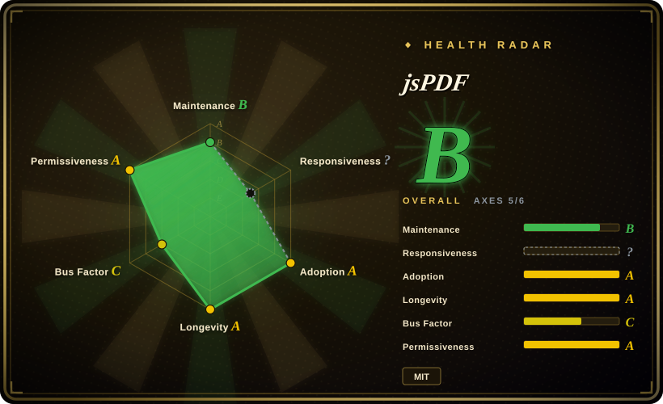
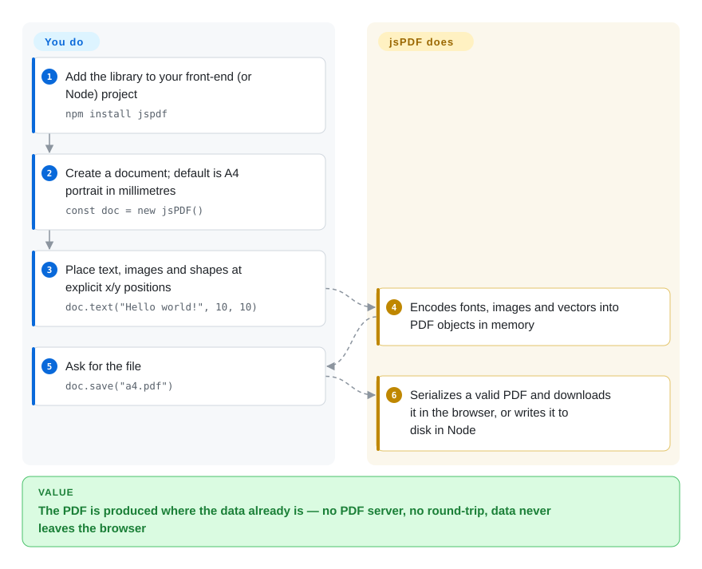

# jsPDF

Your web app needs a "Download PDF" button for an invoice or a ticket, and the obvious fix — a server endpoint that renders PDFs — means another service, a round-trip, and customer data leaving the browser. jsPDF builds the PDF file in JavaScript right where the data already is: you place text, images and shapes on a page by coordinates and it hands the user a finished file.

## When to use

You're a front-end developer on a SaaS dashboard, and support keeps asking for "a PDF version" of things the page already shows: an order receipt, a shipping label, a certificate, a one-page summary. Spinning up a headless-Chrome endpoint for that means a new service, a cold start of a few seconds on every click, and invoice data travelling to a server you now have to secure. With jsPDF the whole thing is `const doc = new jsPDF(); doc.text("Invoice #1042", 10, 10); doc.save("invoice.pdf")` in the click handler — the file is built in the tab and downloaded, offline-capable, with no backend.

It is the pick over its JS neighbours when the document is *drawn* rather than *laid out*: fixed-position labels, tickets, receipts, forms you design on a grid. It has the longest track record in the space (since 2009) and by far the largest install base, and the same code runs in Node for batch jobs. If you need automatic flowing layout, pdfmake or react-pdf fit better; if you need to edit an existing PDF, pdf-lib does.

## How it works

jsPDF is a PDF writer with a drawing API: you create a document (A4 portrait in millimetres by default) and call methods such as `text`, `addImage`, `line`, `rect` with explicit x/y positions — like drawing on graph paper, nothing moves unless you move it. **What it does for you:** encode text in the 14 standard PDF fonts or a TrueType font you register, embed JPEG/PNG/WebP/GIF/BMP images, write vectors, links, outlines, AcroForm fields and metadata, and serialize all of it into a valid PDF that `save()` downloads (in the browser) or writes to disk (in Node). **What stays yours:** layout — line breaks (`splitTextToSize` helps), page breaks, tables (the third-party `jspdf-autotable` plugin is the usual answer), and embedding a TTF font yourself for any non-Latin text such as Chinese. The optional `html()` method is the shortcut: html2canvas walks a DOM element and its drawing calls are replayed onto jsPDF's canvas-like `context2d`, so you get a PDF of an on-screen block without hand-placing it, at html2canvas's level of CSS fidelity.

<!-- flow-steps:begin (generated from flows/jspdf.json by tools/flow_card.py — do not edit) -->

Text version of the flow

1. **You**: Add the library to your front-end (or Node) project — `npm install jspdf`
2. **You**: Create a document; default is A4 portrait in millimetres — `const doc = new jsPDF()`
3. **You**: Place text, images and shapes at explicit x/y positions — `doc.text("Hello world!", 10, 10)`
4. **jsPDF**: Encodes fonts, images and vectors into PDF objects in memory
5. **You**: Ask for the file — `doc.save("a4.pdf")`
6. **jsPDF**: Serializes a valid PDF and downloads it in the browser, or writes it to disk in Node

**Value**: The PDF is produced where the data already is — no PDF server, no round-trip, data never leaves the browser

<!-- flow-steps:end -->

## When NOT to use

- **You need to edit, merge or fill an existing PDF.** jsPDF only writes new documents. Use [pdf-lib](pdf-lib.md) to modify PDFs in JS (note its repo has been quiet since mid-2024), or [FPDI](fpdi.md) on PHP, or a server-side tool such as [qpdf](../pdf-transform-signing/qpdf.md).
- **You want "print this web page" fidelity.** `html()` is limited to what html2canvas understands; modern CSS layouts, web fonts and long multi-page content drift. Use [Playwright](../../web-automation/playwright-family/playwright.md) or [Puppeteer](../../web-automation/browser-driver-frameworks/puppeteer.md) `page.pdf()` — a real browser engine — on a server.
- **Your document flows: long reports, tables that break across pages, headers/footers.** Hand-placing coordinates gets painful fast. Use pdfmake (not indexed; declarative document definition with automatic page breaks) or react-pdf (not indexed; React components with a flexbox layout engine), or typeset server-side with [Typst](../../typesetting/typst.md).
- **The text is Chinese, Japanese, Arabic or anything outside Latin-1, and you can't ship a font.** The standard fonts only cover ASCII-range glyphs; you must embed a TTF (often several MB for CJK) via `addFont`, otherwise you get garbled characters.
- **You are pinned to jsPDF < 4.2.1.** Ten security advisories were published between January and March 2026 (path traversal in the Node build, PDF/JavaScript injection via AcroForm and `addJS`, HTML injection in output methods, DoS via malformed images), all fixed in 4.x. If you can't upgrade, don't feed it untrusted input; v4.0.0 also restricts Node file-system reads by default, which can break existing server code.
- **You need to read or extract from PDFs.** It is write-only; use [PDF.js](../pdf-reading/pdfjs.md) in the browser, or [PyMuPDF](../pdf-reading/pymupdf.md) / [pdfplumber](../pdf-reading/pdfplumber.md) in Python.

## Comparison

| Alternative | In index | Our verdict | Tradeoff |
|---|---|---|---|
| [pdf-lib](pdf-lib.md) | ✅ | When you must open and change existing PDFs (stamp, merge, fill forms) in JS, pick pdf-lib; for generating new documents from scratch with the largest ecosystem, pick jsPDF. | pdf-lib adds modification and a typed API but its upstream repo has been quiet since 2024-07; jsPDF is write-only but actively patched (4.2.1, 2026-03). |
| pdfmake (`bpampuch/pdfmake`) | not indexed | When the document is a flowing report with tables, columns and automatic page breaks, pick pdfmake; pick jsPDF when you position elements yourself on fixed-layout pages. | pdfmake's declarative JSON layout saves you the coordinate math but gives less low-level drawing control; jsPDF is the reverse. |
| react-pdf (`diegomura/react-pdf`) | not indexed | In a React codebase that wants PDFs written as components with flexbox styling, pick react-pdf; pick jsPDF for framework-agnostic code or drawn, fixed layouts. | react-pdf brings a real layout engine and JSX but ties you to React and a heavier runtime; jsPDF is framework-free but leaves layout to you. |
| [Playwright](../../web-automation/playwright-family/playwright.md) | ✅ | When the PDF must look exactly like a styled web page, render it server-side with Playwright's `page.pdf()`; pick jsPDF when the PDF must be built client-side with no server. | A headless browser gives full CSS fidelity at the cost of a server, a Chromium binary and per-request latency; jsPDF costs nothing to run but has limited HTML fidelity. |
| [Typst](../../typesetting/typst.md) | ✅ | When documents are typeset (long text, math, consistent styles) and generated in a backend or CLI, pick Typst; pick jsPDF when generation happens in the user's browser. | Typst gives real typography and automatic layout but is a compiler you run outside the page (or as WASM); jsPDF is a small JS dependency with manual layout. |

## Tech stack

- **Language:** JavaScript with bundled TypeScript typings; shipped as ES module, UMD and a dedicated Node build (`dist/jspdf.node.*.js`).
- **Core modules:** text and standard-font metrics, TTF embedding (`ttfsupport`, virtual file system `addFileToVFS`), image codecs (JPEG, PNG via `fast-png`, WebP, GIF, BMP), compression via `fflate`, AcroForm, annotations, outlines, XMP metadata, and a canvas-like `context2d` API.
- **API modes:** a default "compat" API matching the original MrRio API (plugin-compatible) and an "advanced" API (transformation matrices, patterns, FormObjects) from the merged yWorks fork, switched with `doc.advancedAPI(...)`.
- **HTML path:** `html()` lazy-loads `html2canvas` (and `dompurify` for string input) and replays the rendering through `context2d`.

## Dependencies

- **Runtime:** a modern browser or Node.js; v3.0 dropped Internet Explorer (polyfills still available for older browsers).
- **Install:** `npm install jspdf` (or the unpkg UMD build). Hard deps are small: `@babel/runtime`, `fflate`, `fast-png`.
- **Optional, loaded on demand:** `html2canvas` and `dompurify` for `html()`, `canvg` for SVG, `core-js` for polyfills. Mark unused ones as bundler externals to avoid extra chunks.
- **Plugins are separate projects:** tables usually come from `jspdf-autotable` (a different repo and maintainer).
- **Fonts:** any non-Latin text needs a TTF you supply (via `addFont` or the upstream font converter).

## Ops difficulty

**Low.** No service, no datastore — it is a library in your bundle or Node process. The real work is (1) keeping it current, because 2026 brought a burst of security fixes and one breaking change (Node file-system reads off by default in 4.0); (2) bundle weight when you add custom fonts and the optional html2canvas/dompurify chunks; and (3) in Node, granting file access deliberately via `node --permission --allow-fs-read=...` (recommended upstream) or `jsPDF.allowFsRead`.

## Health & viability

- **Maintenance (2026-10-08):** coasting but alive — 4.0 → 4.2.1 shipped January–March 2026 as security releases, and since then only docs and process commits (latest 2026-09-13). It fixes reported vulnerabilities quickly; new features are rare.
- **Governance & backing:** created by James Hall (MrRio) and now co-maintained by yWorks GmbH, whose fork was merged in; a handful of maintainers do almost all commits (governance is the weakest axis on the radar). A company co-maintaining it is a better backstop than pure volunteers, but the bus factor is small.
- **Age / Lindy:** repo created December 2009 — about 17 years old and still releasing. Older than pdfmake (2014), react-pdf (2016) and pdf-lib (2017), so the strongest Lindy signal among JS PDF generators.
- **Adoption:** ~31k stars, 62,913,711 npm downloads in the last month and 21,994 dependent repos; the de-facto default for client-side PDF generation.
- **Risk flags:** MIT, no relicense history. The 2026 advisory cluster (including critical ones) shows the attack surface is real when user input reaches it — stay on the latest 4.x and sanitize input, as the README itself advises.

## Caveats (unverified)

- [推断] "Coasting" is inferred from commit history after 2026-03 (docs/process only); maintainers may have unreleased work on other branches.
- [推断] The yWorks role ("co-maintained") is taken from the README; how much paid time yWorks commits is not public.
- [未验证] html2canvas CSS gaps (modern layout, web fonts, very long content) are community-reported; exact failures depend on the page and browser.
- [未验证] The claim that CJK TTF fonts add several MB to the bundle depends on the font and any subsetting you do.
- [未验证] Star, download and dependent-repo counts are a 2026-10-08 snapshot from the GitHub API, npm and the health scorer.
