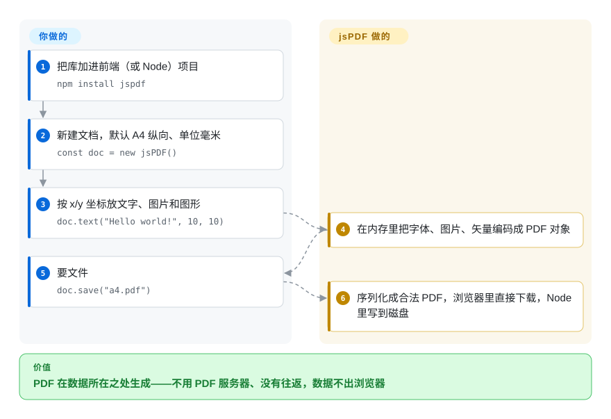

# jsPDF

Web 应用要给发票、票据加一个“下载 PDF”按钮，顺手的做法是在服务端起一个渲染 PDF 的接口——于是多一个服务、多一次往返，客户数据还得离开浏览器。jsPDF 直接在数据所在的 JavaScript 里把 PDF 文件拼出来：你按坐标把文字、图片、图形放到页面上，它交给用户一个成品文件。

## 何时使用

你是一个 SaaS 仪表盘的前端开发，客服老来要页面上已有内容的“PDF 版”：订单收据、快递面单、证书、一页纸摘要。为此起一个无头 Chrome 接口，意味着多一个服务、每次点击都可能有几秒冷启动，发票数据还要传到一台你得负责安全的服务器上。用 jsPDF，整件事就是点击回调里的 `const doc = new jsPDF(); doc.text("Invoice #1042", 10, 10); doc.save("invoice.pdf")`——文件在标签页里生成并下载，离线也能用，不需要后端。

当文档是“画”出来而不是“排”出来的——固定位置的标签、票据、收据、你在网格上设计好的表单——它比其他 JS 方案更合适。它是这个领域历史最长（2009 年起）、装机量最大的库，同一份代码也能在 Node 里跑批量任务。要自动流式排版，pdfmake 或 react-pdf 更合适；要改已有 PDF，用 pdf-lib。

## 怎么用起来

jsPDF 是一个带绘图 API 的 PDF 写入器：你新建一个文档（默认 A4 纵向、单位毫米），用明确的 x/y 坐标调用 `text`、`addImage`、`line`、`rect` 之类的方法——像在方格纸上画图，你不挪，东西就不会动。**它替你做的：**用 14 种 PDF 标准字体或你注册的 TrueType 字体编码文字，嵌入 JPEG/PNG/WebP/GIF/BMP 图片，写入矢量图形、链接、书签、AcroForm 表单域和元数据，再把这一切序列化成合法的 PDF，由 `save()` 在浏览器里触发下载、在 Node 里写到磁盘。**留给你的：**排版——换行（`splitTextToSize` 能帮忙）、分页、表格（通常用第三方插件 `jspdf-autotable`），以及为中文等非拉丁文字自己嵌入 TTF 字体。可选的 `html()` 是捷径：html2canvas 遍历一个 DOM 元素，它的绘制调用被回放到 jsPDF 类似 canvas 的 `context2d` 上，于是不用手动摆放就能把屏幕上的一块内容变成 PDF，还原度取决于 html2canvas 对 CSS 的支持。

<!-- flow-steps:begin (generated from flows/jspdf.json by tools/flow_card.py — do not edit) -->

流程文字版

1. **你**：把库加进前端（或 Node）项目 — `npm install jspdf`
2. **你**：新建文档，默认 A4 纵向、单位毫米 — `const doc = new jsPDF()`
3. **你**：按 x/y 坐标放文字、图片和图形 — `doc.text("Hello world!", 10, 10)`
4. **jsPDF**：在内存里把字体、图片、矢量编码成 PDF 对象
5. **你**：要文件 — `doc.save("a4.pdf")`
6. **jsPDF**：序列化成合法 PDF，浏览器里直接下载，Node 里写到磁盘

**价值**：PDF 在数据所在之处生成——不用 PDF 服务器、没有往返，数据不出浏览器

<!-- flow-steps:end -->

## 何时不用

- **你要编辑、合并或填写已有 PDF。** jsPDF 只写新文档。JS 里改 PDF 用 [pdf-lib](pdf-lib.zh.md)（注意它的仓库自 2024 年年中起就很安静），PHP 用 [FPDI](fpdi.zh.md)，服务端可用 [qpdf](../pdf-transform-signing/qpdf.zh.md)。
- **你要“打印这个网页”级别的还原度。** `html()` 受限于 html2canvas 能理解的 CSS；现代布局、网页字体、超长多页内容都会走样。到服务端用真正的浏览器引擎：[Playwright](../../web-automation/playwright-family/playwright.zh.md) 或 [Puppeteer](../../web-automation/browser-driver-frameworks/puppeteer.zh.md) 的 `page.pdf()`。
- **你的文档是流式的：长报告、跨页表格、页眉页脚。** 手算坐标很快就会失控。用 pdfmake（未收录，声明式文档定义，自动分页）或 react-pdf（未收录，React 组件加 flexbox 排版引擎），或者在服务端用 [Typst](../../typesetting/typst.zh.md) 排版。
- **文本是中文、日文、阿拉伯文等 Latin-1 以外的文字，而你没法带字体。** 标准字体只覆盖 ASCII 范围的字形；必须用 `addFont` 嵌入 TTF（中日韩字体常常有几 MB），否则就是乱码。
- **你被锁在 jsPDF 4.2.1 以下。** 2026 年 1–3 月一口气发布了十个安全通告（Node 构建的路径穿越、通过 AcroForm 和 `addJS` 的 PDF/JavaScript 注入、输出方法里的 HTML 注入、畸形图片导致的拒绝服务），都在 4.x 修复。升级不了就别把不可信输入喂给它；另外 v4.0.0 默认禁止 Node 读文件系统，可能打断现有的服务端代码。
- **你要读取或抽取 PDF 内容。** 它只写不读；浏览器里用 [PDF.js](../pdf-reading/pdfjs.zh.md)，Python 里用 [PyMuPDF](../pdf-reading/pymupdf.zh.md) / [pdfplumber](../pdf-reading/pdfplumber.zh.md)。

## 横向对比

| 替代品 | 是否收录 | 我们的评价 | 取舍 |
|---|---|---|---|
| [pdf-lib](pdf-lib.zh.md) | ✅ | 必须在 JS 里打开并修改已有 PDF（盖章、合并、填表）时，选 pdf-lib；从零生成新文档、要最大的生态时，选 jsPDF。 | pdf-lib 多了修改能力和类型化 API，但上游仓库自 2024-07 起很安静；jsPDF 只能写，但仍在积极打补丁（4.2.1，2026-03）。 |
| pdfmake（`bpampuch/pdfmake`） | 未收录 | 文档是带表格、分栏、自动分页的流式报告时，选 pdfmake；元素由你在固定版式页面上自己定位时，选 jsPDF。 | pdfmake 的声明式 JSON 排版省掉坐标计算，但底层绘图控制更少；jsPDF 正好相反。 |
| react-pdf（`diegomura/react-pdf`） | 未收录 | 在 React 代码库里想用组件加 flexbox 样式写 PDF 时，选 react-pdf；代码不绑框架、版式是“画”出来的固定布局时，选 jsPDF。 | react-pdf 带来真正的排版引擎和 JSX，但绑定 React、运行时更重；jsPDF 不依赖框架，但排版全靠你。 |
| [Playwright](../../web-automation/playwright-family/playwright.zh.md) | ✅ | PDF 必须和带样式的网页一模一样时，在服务端用 Playwright 的 `page.pdf()` 渲染；PDF 必须在客户端生成、不能有服务器时，选 jsPDF。 | 无头浏览器给你完整的 CSS 还原度，代价是一台服务器、一个 Chromium 二进制和每次请求的延迟；jsPDF 运行零成本，但 HTML 还原度有限。 |
| [Typst](../../typesetting/typst.zh.md) | ✅ | 文档需要排版（长文本、公式、统一样式）且在后端或命令行生成时，选 Typst；生成发生在用户浏览器里时，选 jsPDF。 | Typst 有真正的排版和自动布局，但它是在页面之外运行的编译器（或 WASM）；jsPDF 是个小小的 JS 依赖，排版手动。 |

## 技术栈

- **语言：** JavaScript，自带 TypeScript 类型；发布 ES module、UMD 和专门的 Node 构建（`dist/jspdf.node.*.js`）。
- **核心模块：** 文本与标准字体度量、TTF 嵌入（`ttfsupport`，虚拟文件系统 `addFileToVFS`）、图片编解码（JPEG、经 `fast-png` 的 PNG、WebP、GIF、BMP）、经 `fflate` 的压缩、AcroForm、注释、书签、XMP 元数据，以及类似 canvas 的 `context2d` API。
- **API 模式：** 默认的 “compat” 模式与 MrRio 原版 API 一致（兼容插件）；“advanced” 模式来自并入的 yWorks 分支（变换矩阵、图案、FormObject），用 `doc.advancedAPI(...)` 切换。
- **HTML 路径：** `html()` 按需加载 `html2canvas`（字符串输入时还有 `dompurify`），再经 `context2d` 回放渲染。

## 依赖

- **运行时：** 现代浏览器或 Node.js；v3.0 起不再支持 Internet Explorer（旧浏览器仍可用 polyfill）。
- **安装：** `npm install jspdf`（或 unpkg 的 UMD 构建）。硬依赖很少：`@babel/runtime`、`fflate`、`fast-png`。
- **按需加载的可选依赖：** `html()` 用 `html2canvas` 和 `dompurify`，SVG 用 `canvg`，polyfill 用 `core-js`。用不到的在打包器里标成 external，免得多出代码块。
- **插件是独立项目：** 表格通常来自 `jspdf-autotable`（另一个仓库、另一位维护者）。
- **字体：** 任何非拉丁文字都要你自己提供 TTF（用 `addFont` 或上游的字体转换器）。

## 运维难度

**低。** 没有服务、没有数据库——它只是你打包产物或 Node 进程里的一个库。真正的工作是：（1）跟上版本，因为 2026 年来了一波安全修复，还有一个破坏性变更（4.0 默认关闭 Node 文件系统读取）；（2）加了自定义字体和可选的 html2canvas/dompurify 代码块后的包体积；（3）在 Node 里有意识地授予文件访问——上游推荐 `node --permission --allow-fs-read=...`，或用 `jsPDF.allowFsRead`。

## 健康度与可持续性

- **维护（2026-10-08）：** 低速运转但还活着——2026 年 1–3 月以安全版本形式发布了 4.0 → 4.2.1，之后只有文档和流程类提交（最近一次 2026-09-13）。报告的漏洞修得快，新功能很少。
- **治理与背书：** 由 James Hall（MrRio）创建，现由 yWorks GmbH 共同维护，其分支已并入主线；几位维护者包揽了几乎全部提交（雷达上治理是最弱的一轴）。有公司共同维护比纯志愿者更有兜底，但 bus factor 小。
- **年龄与林迪：** 仓库创建于 2009 年 12 月——约 17 年，仍在发版。比 pdfmake（2014）、react-pdf（2016）、pdf-lib（2017）都早，是 JS PDF 生成库里林迪信号最强的。
- **采用度：** 约 31k star，近一个月 npm 下载 62,913,711 次，21,994 个依赖仓库；客户端生成 PDF 的事实默认选项。
- **风险信号：** MIT，无改许可证历史。2026 年那一串通告（含严重级）说明用户输入一旦进入它，攻击面是真实的——保持在最新 4.x，并按 README 的建议先清洗输入。

## 存疑（未验证）

- [推断] “低速运转”是根据 2026-03 之后的提交历史（只有文档和流程）推断的；维护者可能在其他分支上有未发布的工作。
- [推断] yWorks 的角色（“共同维护”）取自 README；yWorks 实际投入多少有偿工时并不公开。
- [未验证] html2canvas 的 CSS 缺口（现代布局、网页字体、超长内容）来自社区报告；具体失败情况取决于页面和浏览器。
- [未验证] “中日韩 TTF 字体给包体积增加几 MB”取决于字体本身以及你是否做了子集化。
- [未验证] star、下载量和依赖仓库数是 2026-10-08 从 GitHub API、npm 和健康度评分器取的快照。
