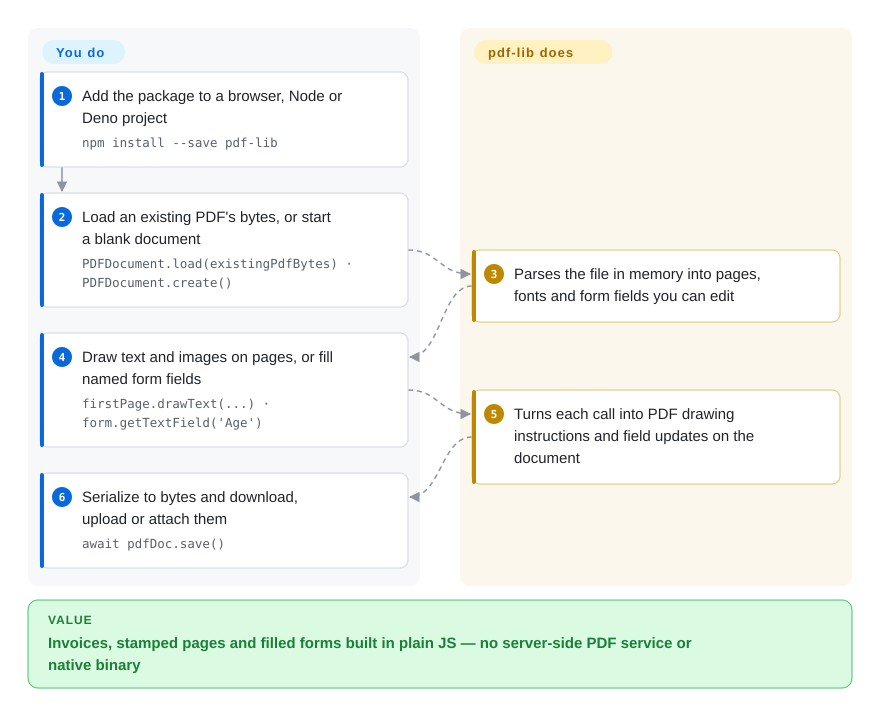

# pdf-lib

A pure JavaScript/TypeScript library for creating and modifying PDFs in the browser, Node.js, Deno, and React Native — zero native dependencies, focused on the "write side" of PDFs (not rendering or viewing).

## When to use

You're a full-stack developer building a web app where users need to generate downloadable PDFs — invoices, shipping labels, certificates, or filled government forms — without a round-trip to a server-side PDF service. Your stack is TypeScript on both ends, and you want the same code to run in the browser and in Node.js. You need to create documents from scratch, stamp them with text, images, and vector graphics, merge multiple PDFs into one, and programmatically fill interactive form fields (checkboxes, text inputs, dropdowns). You reach for pdf-lib because it is a pure JS/TS library with no native dependencies, so it works anywhere JavaScript runs — browser, Node, Deno, even React Native — and it exposes a typed, programmatic API for drawing content, embedding custom fonts, and manipulating page structure directly at the PDF object level. You don't need a headless browser or a server-side PDF engine; the document is built and serialized in-process and delivered as bytes.

The same library is your tool when you need to surgically modify existing PDFs client-side: add a watermark, append an extra page, flatten a form, or extract and recombine pages — all without leaving the JS runtime.

## How it works

pdf-lib reads and writes the PDF file format itself, in plain JavaScript: a PDF is a tree of objects (pages, fonts, images, form fields) plus "content streams" — lists of drawing instructions such as "put this text at x, y". **You call its API from your own code; it does the format work** — parsing an existing file into that object tree, turning your `drawText` / `drawImage` / form-field calls into the right objects and instructions, and serializing everything back into bytes with `save()`. Nothing leaves your process: there is no server, headless browser or native binary, which is why the same code runs in a browser tab, Node, Deno or React Native. What it will not do is lay content out for you — you place every string at coordinates you compute, and it cannot render a page to pixels.

<!-- flow-steps:begin (generated from flows/pdf-lib.json by tools/flow_card.py — do not edit) -->

Text version of the flow

1. **You**: Add the package to a browser, Node or Deno project — `npm install --save pdf-lib`
2. **You**: Load an existing PDF's bytes, or start a blank document — `PDFDocument.load(existingPdfBytes) · PDFDocument.create()`
3. **pdf-lib**: Parses the file in memory into pages, fonts and form fields you can edit
4. **You**: Draw text and images on pages, or fill named form fields — `firstPage.drawText(...) · form.getTextField('Age')`
5. **pdf-lib**: Turns each call into PDF drawing instructions and field updates on the document
6. **You**: Serialize to bytes and download, upload or attach them — `await pdfDoc.save()`

**Value**: Invoices, stamped pages and filled forms built in plain JS — no server-side PDF service or native binary

<!-- flow-steps:end -->

## When NOT to use

- **You need to render or view PDFs.** pdf-lib creates and edits PDFs; it does not display them. For rendering in the browser or Node, use [PDF.js](../pdf-reading/pdfjs.md).
- **You need HTML-to-PDF conversion.** pdf-lib has no built-in HTML-to-PDF engine; you work directly with the PDF API. For HTML-to-PDF, reach for Puppeteer/Playwright (headless browser) or server-side tools like WeasyPrint.
- **Bundle size is a hard constraint.** The browser bundle is ~500KB+ minified; for a single tiny PDF or a bandwidth-sensitive app, the payload may outweigh the benefit.
- **You need server-side batch processing at scale.** Python libraries like PyMuPDF or pdfplumber are typically faster and lighter for back-end batch extraction, rendering, and heavy manipulation.
- **You need a maintained library — the headline caution.** The default branch has had no commit since 2021-11-12 (v1.17.1); recent PRs (2026-04 to 2026-08) were closed without merging, so bug and security fixes do not land upstream. If you need fixes or new features, use the maintained fork `@cantoo/pdf-lib` (v2.11.1 on npm as of 2026-09, 未收录) as a near drop-in, or [jsPDF](jspdf.md) if you only generate simple documents.
- **You need layout-aware structured parsing for AI/RAG.** pdf-lib manipulates PDF structures but does not extract reading order, tables, or semantic document structure — for that, use [Docling](../../document-parsing/docling.md).
- **You need a project with strong governance and a committed roadmap.** Governance is informal community maintenance with no foundation or corporate backing; the bus factor is low. [推断]

## Comparison

| Alternative | In index | Our verdict | Tradeoff |
|---|---|---|---|
| [PDF.js](../pdf-reading/pdfjs.md) | ✅ | Choose PDF.js when you need to render or read PDFs in the browser/Node; choose pdf-lib when you need to create or modify them. | Renders and reads PDFs in the browser/Node — complementary, not a substitute; pdf-lib is the write side, PDF.js is the read side. |
| [jsPDF](jspdf.md) | ✅ | Choose jsPDF for simpler client-side PDF generation with a smaller API surface and bundle; choose pdf-lib for deeper PDF manipulation (forms, merging, embedded fonts, low-level object access). | Client-side PDF generation from JS; lighter and simpler, but less capable for complex document surgery and font handling. |
| [PyMuPDF](../pdf-reading/pymupdf.md) / [pdfplumber](../pdf-reading/pdfplumber.md) | ✅ | Choose PyMuPDF / pdfplumber for fast Python server-side PDF manipulation and text/table extraction; choose pdf-lib when you must stay in JS/TS. | Python libraries for server-side render + text/table extraction; faster for batch jobs, but not available in the browser. |
| [Docling](../../document-parsing/docling.md) | ✅ | Choose Docling when you need layout-aware document parsing for AI/RAG; choose pdf-lib when you need to programmatically create or edit PDFs. | Layout-aware document parser producing structured Markdown/JSON for AI ingestion; different goal — semantic extraction, not document authoring. |
| Native `<embed>` / browser PDF plugin | 未收录 | Use the native plugin for zero-effort viewing; use pdf-lib when you need programmatic control over PDF creation or modification. | Zero-dependency and built into the browser, but only for viewing — no creation, editing, or programmatic access. |

## Tech stack

- **Language:** TypeScript (compiled to JavaScript), with a strongly typed, promise-based API.
- **Execution model:** pure JS/TS library — runs in-browser (via bundler), Node.js, Deno, and React Native. No native dependencies, no WASM, no C++ bindings.
- **Distribution:** npm package (`pdf-lib`) with ES module and CommonJS builds; UMD bundle available for direct browser inclusion.
- **PDF internals:** operates directly on PDF object streams, cross-reference tables, and content streams — low-level PDF spec compliance rather than a high-level abstraction.

## Dependencies

- **Runtime:** a JavaScript environment — any modern browser, Node.js, Deno, or React Native. No external services, no database, no native binary.
- **Install:** `npm install pdf-lib` (or equivalent); the library is self-contained.
- **Font bundling:** standard 14 PDF fonts are available without embedding; custom fonts must be loaded as ArrayBuffers and embedded into the document. [推断]
- **Image support:** embeds PNG and JPEG images directly; other formats must be converted before embedding. [推断]

## Ops difficulty

**Low.** pdf-lib is an in-process library — there is no service to deploy, no datastore, no clustering. "Ops" is essentially dependency management: keeping the npm package current, budgeting the ~500KB+ browser bundle into your build pipeline, and handling occasional breaking changes between versions (the API has shifted over time). Since it is pure JS/TS, there are no platform-specific compilation or deployment concerns. The main operational watch-item is that upstream is frozen: if you hit a spec edge-case or a bug, you patch it yourself or move to a maintained fork.

## Health & viability

- **Maintenance (as of 2026-10-08) — grade E, frozen.** Last default-branch commit 2021-11-12 (1791 days ago); last release v1.17.1 (2021-11-06). Recent PRs are closed without merging. This is not slow community maintenance — upstream has stopped.
- **Governance / bus factor.** A single `User`-owned repo (Hopding) with no foundation or vendor; the owner holds the only merge rights and has not used them since 2021. [推断]
- **Age × Lindy — longevity grade E.** Created 2017-09 (3321 days, ~9 years), but the "still-active" half has been missing for ~4 years: old-and-abandoned, which Lindy does not rescue.
- **Adoption — grade A, very wide.** 57272378 npm downloads in the last month and ~8.7k stars — it is load-bearing for a large part of the JS ecosystem, which is likely why a maintained fork (`@cantoo/pdf-lib`) exists. [推断]
- **Risk flags — license grade A.** MIT, no relicense, no open-core or CLA. The real risk is unpatched bugs and security reports in a dependency this widely installed.

## Caveats (unverified)

- [未验证] ~8.7k stars and the "frozen since 2021-11" status are a snapshot as of 2026-10-08; star counts are noisy and the situation may shift if the owner hands over the repo.
- [未验证] `@cantoo/pdf-lib` as the maintained successor: seen as an active fork (pushed 2026-09, npm v2.11.1); its API compatibility with upstream v1.17.1 and its own governance were not reviewed here.
- [未验证] Browser bundle size (~500KB+) is an approximate figure from published build artifacts; your bundler may tree-shake differently depending on which features you import.
- [未验证] Support for Deno and React Native is documented but not personally verified in this review; runtime compatibility depends on the specific environment and version.
- [推断] Which fork is most used is inferred from GitHub/npm activity, not an audit of fork download metrics.
- [推断] The claim that PyMuPDF / pdfplumber are "faster and lighter" for server-side batch work is an inference from their native/C++ implementations, not a head-to-head benchmark against pdf-lib for any specific workload.
