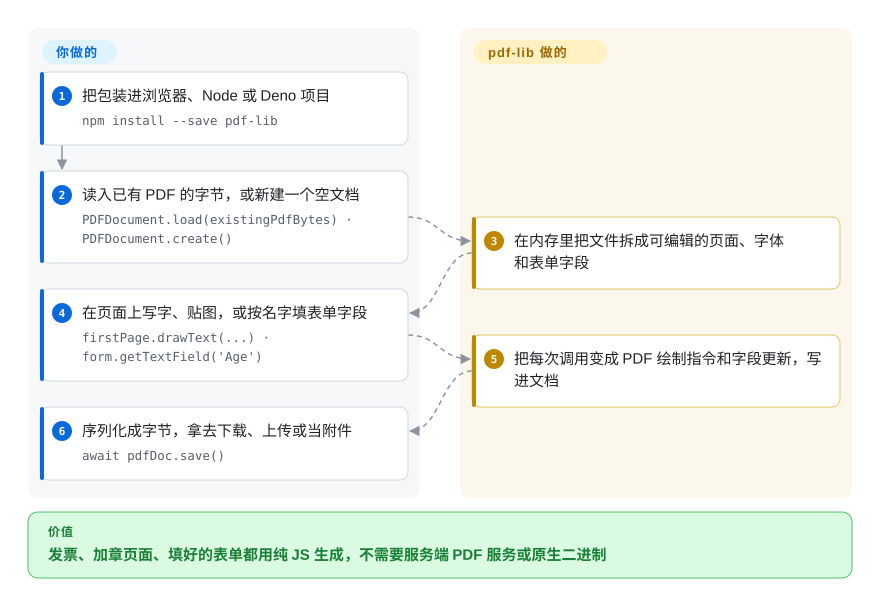

# pdf-lib

一款纯 JavaScript/TypeScript 的 PDF 创建与修改库，可在浏览器、Node.js、Deno 和 React Native 中运行——零原生依赖，专注 PDF 的「写」端（不渲染、不查看）。

## 何时使用

你是一名全栈开发者，正在构建一个 Web 应用，用户需要生成可下载的 PDF——发票、物流标签、证书或已填写的政府表单——而不想往返调用服务端 PDF 服务。你的技术栈两端都是 TypeScript，希望同一份代码能在浏览器和 Node.js 里跑。你需要从零创建文档，打上文字、图片和矢量图形，把多份 PDF 合并成一份，还要程序化填写交互式表单字段（复选框、文本框、下拉框）。你选用 pdf-lib，因为它是纯 JS/TS 库、零原生依赖，所以只要 JavaScript 能跑的地方它都能跑——浏览器、Node、Deno，甚至 React Native——而且暴露了一套带类型的程序化 API，可以直接在 PDF 对象层面绘制内容、嵌入自定义字体、操控页面结构。你不需要 headless 浏览器或服务端 PDF 引擎；文档在进程内构建、序列化，并以字节流形式交付。

同样的场景也适用于你需要在客户端对现有 PDF 做外科手术式修改：加水印、追加额外页面、压平表单，或提取并重组页面——全部不离开 JS 运行时。

## 怎么用起来

pdf-lib 用纯 JavaScript 自己读写 PDF 文件格式：一个 PDF 是一棵对象树（页面、字体、图片、表单字段），加上“内容流”——一串绘制指令，比如“在坐标 x、y 处写这行字”。**你在自己的代码里调它的 API，格式层面的活归它**：把已有文件解析成这棵对象树，把你的 `drawText`、`drawImage`、表单字段调用变成对应的对象和指令，最后用 `save()` 把整份文档序列化回字节。全程不出你的进程：没有服务端、无头浏览器或原生二进制，所以同一份代码能跑在浏览器标签页、Node、Deno 或 React Native 里。它不替你排版——每一行字放在哪个坐标得你自己算；它也不能把页面渲染成图片。

<!-- flow-steps:begin (generated from flows/pdf-lib.json by tools/flow_card.py — do not edit) -->

流程文字版

1. **你**：把包装进浏览器、Node 或 Deno 项目 — `npm install --save pdf-lib`
2. **你**：读入已有 PDF 的字节，或新建一个空文档 — `PDFDocument.load(existingPdfBytes) · PDFDocument.create()`
3. **pdf-lib**：在内存里把文件拆成可编辑的页面、字体和表单字段
4. **你**：在页面上写字、贴图，或按名字填表单字段 — `firstPage.drawText(...) · form.getTextField('Age')`
5. **pdf-lib**：把每次调用变成 PDF 绘制指令和字段更新，写进文档
6. **你**：序列化成字节，拿去下载、上传或当附件 — `await pdfDoc.save()`

**价值**：发票、加章页面、填好的表单都用纯 JS 生成，不需要服务端 PDF 服务或原生二进制

<!-- flow-steps:end -->

## 何时不用

- **你需要渲染或查看 PDF。** pdf-lib 用于创建和编辑 PDF，不能显示它。若要在浏览器或 Node 里渲染，请用 [PDF.js](../pdf-reading/pdfjs.zh.md)。
- **你需要 HTML 转 PDF。** pdf-lib 没有内置 HTML 转 PDF 引擎，你得直接操作 PDF API。如需 HTML 转 PDF，请用 Puppeteer/Playwright（headless 浏览器）或 WeasyPrint 等服务端工具。
- **包体积是硬约束。** 浏览器构建产物约 500KB+（minified）；若只是生成一份极小的 PDF，或应用对带宽极度敏感，这个体积可能得不偿失。
- **你需要大规模服务端批处理。** Python 库如 PyMuPDF 或 pdfplumber 通常在服务端批量提取、渲染和重度修改时更快、更轻。
- **你需要有人维护的库——首要提醒。** 默认分支自 2021-11-12（v1.17.1）起没有提交；最近的 PR（2026-04 到 2026-08）都没合并就关闭了，所以 bug 和安全修复进不了上游。需要修复或新功能，请改用有人维护的 fork `@cantoo/pdf-lib`（截至 2026-09 npm 上为 v2.11.1，未收录），它基本可以直接替换；只生成简单文档的话，用 [jsPDF](jspdf.zh.md)。
- **你需要版面感知的结构化解析（供 AI/RAG 使用）。** pdf-lib 操控 PDF 结构，但不提取阅读顺序、表格或语义文档结构——如需这些，请用 [Docling](../../document-parsing/docling.zh.md)。
- **你需要治理健全、路线图明确的项目。** 治理模式为非正式的社区维护，无基金会或企业背书，bus factor 较低。[推断]

## 横向对比

| 替代品 | 是否收录 | 我们的评价 | 取舍 |
|---|---|---|---|
| [PDF.js](../pdf-reading/pdfjs.zh.md) | ✅ | 需在浏览器/Node 里渲染或读取 PDF 时选 PDF.js；需要创建或修改 PDF 时选 pdf-lib。 | 在浏览器/Node 里渲染和读取 PDF——与 pdf-lib 互补而非替代；pdf-lib 是「写」端，PDF.js 是「读」端。 |
| [jsPDF](jspdf.zh.md) | ✅ | 需要更简单、API 更轻、包更小的客户端 PDF 生成时选 jsPDF；需要做深度 PDF 操控（表单、合并、嵌入字体、底层对象访问）时选 pdf-lib。 | 客户端 JS PDF 生成；更轻更简单，但复杂文档手术和字体处理能力较弱。 |
| [PyMuPDF](../pdf-reading/pymupdf.zh.md) / [pdfplumber](../pdf-reading/pdfplumber.zh.md) | ✅ | 需要快速的 Python 服务端 PDF 操控和文本/表格提取时选 PyMuPDF / pdfplumber；必须留在 JS/TS 生态时选 pdf-lib。 | Python 服务端渲染 + 文本/表格提取库；批量任务更快，但无法在浏览器里使用。 |
| [Docling](../../document-parsing/docling.zh.md) | ✅ | 需要版面感知的文档解析（供 AI/RAG）时选 Docling；需要程序化创建或编辑 PDF 时选 pdf-lib。 | 版面感知解析器，输出结构化 Markdown/JSON 供 AI 消费——目标不同，侧重语义提取而非文档创作。 |
| 原生 `<embed>` / 浏览器 PDF 插件 | 未收录 | 零成本查看 PDF 时用原生插件；需要程序化控制 PDF 创建或修改时用 pdf-lib。 | 零依赖、浏览器内置，但仅限查看——无法创建、编辑或程序化访问。 |

## 技术栈

- **语言：** TypeScript（编译为 JavaScript），API 为强类型、基于 Promise 的设计。
- **执行模型：** 纯 JS/TS 库——可在浏览器（通过打包工具）、Node.js、Deno 和 React Native 中运行。无原生依赖、无 WASM、无 C++ 绑定。
- **分发：** npm 包（`pdf-lib`），提供 ES module 和 CommonJS 构建；另有 UMD 包可直接在浏览器中引入。
- **PDF 内部机制：** 直接操作 PDF 对象流、交叉引用表和内容流——属于底层 PDF spec 兼容，而非高层抽象。

## 依赖

- **运行时：** JavaScript 环境——任意现代浏览器、Node.js、Deno 或 React Native。无需外部服务、数据库或原生二进制文件。
- **安装：** `npm install pdf-lib`（或等价命令）；库自包含，无额外依赖。
- **字体嵌入：** 14 种标准 PDF 字体无需嵌入即可使用；自定义字体需以 ArrayBuffer 形式加载并嵌入文档。[推断]
- **图片支持：** 直接嵌入 PNG 和 JPEG 图片；其他格式需先转换再嵌入。[推断]

## 运维难度

**低。** pdf-lib 是一个进程内库——无需部署服务、数据库或集群。「运维」本质上就是依赖管理：保持 npm 包版本最新、把约 500KB+ 的浏览器构建产物纳入打包管线预算、并处理版本间偶尔的破坏性变更（API 历年来有过调整）。由于是纯 JS/TS，没有平台相关的编译或部署顾虑。主要的运维注意点是上游已冻结：遇到 spec 边缘情况或 bug，要么自己打补丁，要么换到有人维护的 fork。

## 健康度与可持续性

- **维护（截至 2026-10-08）——评级 E，已冻结。** 默认分支最后一次提交在 2021-11-12（距今 1791 天）；最后一个 release 是 v1.17.1（2021-11-06）。最近的 PR 都没合并就关闭了。这不是社区慢慢维护，而是上游停了。
- **治理 / bus factor。** 单个 `User` 持有的仓库（Hopding），没有基金会或厂商；只有作者有合并权，而他自 2021 年起就没再用过。[推断]
- **年龄 × Lindy——长青度评级 E。** 2017-09 创建（3321 天，约 9 年），但“仍活跃”那一半已经缺席约 4 年：这是老而废弃，Lindy 救不回来。
- **采用度——评级 A，用得极广。** 上个月 npm 下载 57272378 次、约 8.7k star——JS 生态里有一大片东西压在它身上，这大概也是会冒出有人维护的 fork（`@cantoo/pdf-lib`）的原因。[推断]
- **风险标记——许可评级 A。** MIT，没有改许可、没有 open-core 或 CLA。真正的风险是：一个装得这么广的依赖，bug 和安全报告没人修。

## 存疑（未验证）

- [未验证] 约 8.7k star 和“自 2021-11 起冻结”的状态是截至 2026-10-08 的快照；star 数波动大，若作者移交仓库，情况可能改变。
- [未验证] `@cantoo/pdf-lib` 作为有人维护的继任者：看到的是一个活跃 fork（2026-09 有推送、npm 上 v2.11.1）；它与上游 v1.17.1 的 API 兼容性和它自己的治理，此处未审阅。
- [未验证] 浏览器构建产物体积（约 500KB+）来自已发布构建产物的近似值；你的打包器按实际导入功能做 tree-shaking 后结果可能不同。
- [未验证] Deno 和 React Native 的支持在文档中有声明，但本次审核未亲自验证；运行时兼容性取决于具体环境和版本。
- [推断] 哪个 fork 用得最多，是从 GitHub 和 npm 的活动推断的，并未审计各 fork 的下载量。
- [推断] 「PyMuPDF / pdfplumber 在服务端批量任务中更快更轻」这一说法是从它们的原生/C++ 实现推断而来，并非针对特定负载与 pdf-lib 的 head-to-head 基准测试。
