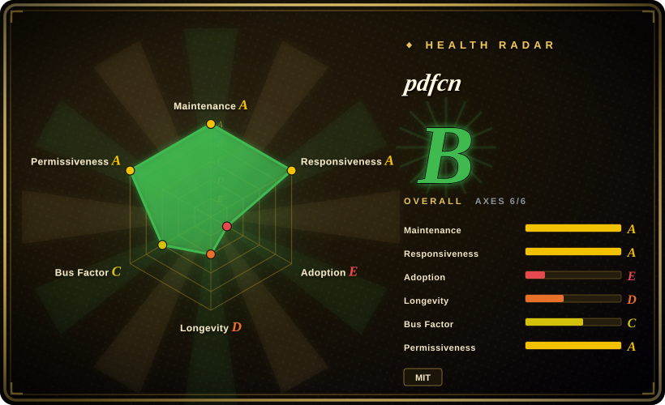
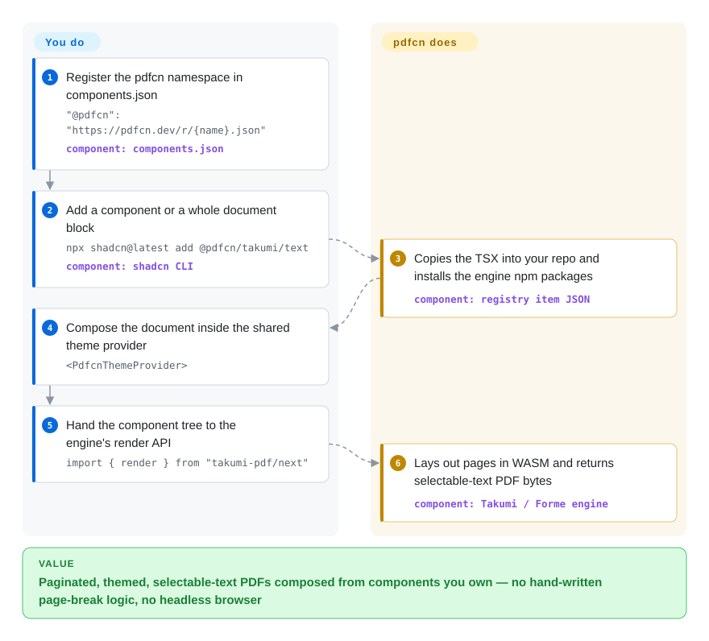

# pdfcn

Your React app has to emit invoices, packing slips, and reports as PDFs, and every one of them is rebuilt from scratch in renderer primitives — font scales, table padding, page-break hacks. pdfcn is a copy-paste registry of themed React PDF components (25 components, ~20 document blocks, 9 themes) that the shadcn CLI installs into your project on top of two Rust→WASM PDF engines, Takumi or Forme.

## When to use

You're building a React or Next.js product that generates operational paperwork — invoices, shipping labels, meeting minutes, lesson plans, financial reports — and you don't want to hand-author each document against a PDF engine's raw primitives. You register one URL in `components.json`, run `npx shadcn@latest add @pdfcn/takumi/invoice-minimal`, and get TSX files copied into your repo plus a shared theme provider, with the engine npm packages installed for you. Like shadcn/ui itself, there is no runtime package to depend on: you own the code and can edit every prop.

Choose this over a raw engine (Takumi or Forme directly) or the older react-pdf ecosystem when the deciding factor is *starting from finished, themed document layouts instead of blank primitives*: the same component API works across both engines, and blocks are complete documents you can fork. Choose it over client-side rasterizers (jsPDF's `html` path) when you need selectable-text, paginated documents with page-break and keep-together semantics rather than a flattened screenshot of DOM.

## How it works

Each registry item is a small JSON manifest (built from the repo into `apps/web/public/r/*.json` and served from pdfcn.dev) that names the TSX files to copy, the npm `dependencies` to install (`takumi-pdf` + `@takumi-rs/helpers` for the Takumi base, `@formepdf/react` + `@formepdf/core` for Forme), and the `registryDependencies` that pull in the shared pieces — installing any component transitively installs `@pdfcn/takumi/utils`, which carries the primitives (`Document`/`Page`), the `PdfcnThemeProvider`, and a default theme. You then compose `<Document><Page size="A4"><PdfcnThemeProvider>…</PdfcnThemeProvider></Page></Document>` in your own code and hand the tree to the engine's render API; the engine — Rust compiled to WASM (WebAssembly, so no headless Chrome and no server binary) — does the page breaking and text layout and returns PDF bytes with selectable text (the output is real text runs, not a flattened image). What you own after install: the component source and the theme tokens. What stays upstream: the two layout engines, and the registry endpoint you pulled from. The Forme base is entered the same way under the `forme/` namespace with `Document`/`Page` imported from `@formepdf/react` — same component API, different engine underneath.

<!-- flow-steps:begin (generated from flows/pdfcn.json by tools/flow_card.py — do not edit) -->

Text version of the flow

1. **You**: Register the pdfcn namespace in components.json — `"@pdfcn": "https://pdfcn.dev/r/{name}.json"` — component: `components.json`
2. **You**: Add a component or a whole document block — `npx shadcn@latest add @pdfcn/takumi/text` — component: `shadcn CLI`
3. **pdfcn**: Copies the TSX into your repo and installs the engine npm packages — component: `registry item JSON`
4. **You**: Compose the document inside the shared theme provider — `<PdfcnThemeProvider>`
5. **You**: Hand the component tree to the engine's render API — `import { render } from "takumi-pdf/next"`
6. **pdfcn**: Lays out pages in WASM and returns selectable-text PDF bytes — component: `Takumi / Forme engine`

**Value**: Paginated, themed, selectable-text PDFs composed from components you own — no hand-written page-break logic, no headless browser

<!-- flow-steps:end -->

## When NOT to use

- **You need the "official" shadcn project's guarantees.** pdfcn lives under the `shadcn-labs` GitHub org (created 2026-04, profile: India), which is separate from the `shadcn-ui` org that runs shadcn/ui; it implements the shadcn registry format but this index found no evidence it is run by or affiliated with the shadcn-ui maintainers [推断: org metadata + member list checked 2026-09-29, no link verified]. If your org's tooling policy whitelists only official shadcn surfaces, this fails it.
- **You need a mature, versioned supply chain.** The repo has no GitHub releases and no npm distribution (the `pdfcn` npm name is a 0.0.0 placeholder published by its main contributor) as of 2026-09-29 — there is nothing to pin, no changelog for the copied code, and re-pulling an updated item over your edits is manual merge work. If you need semver and upgrade paths, react-pdf (not indexed) is the older, released ecosystem.
- **You must edit, merge, sign, or fill existing PDFs.** pdfcn generates new documents only. For opening and modifying PDFs in JS use [pdf-lib](pdf-lib.md); for signing/PAdES use [pyHanko](../pdf-transform-signing/pyhanko.md).
- **Your stack isn't React, or the PDF is a one-off browser download.** Everything here is TSX executed by a JS-embedded engine. For plain-JS client-side generation without a component model, [jsPDF](jspdf.md) is lighter to adopt.
- **You need faithful conversion of arbitrary existing HTML/CSS.** pdfcn's components reimplement layouts in engine-specific primitives; they don't take your web page and print it. For pixel fidelity of arbitrary DOM, a headless-browser pipeline (Puppeteer/Playwright, not indexed) remains the standard — both engines here exist precisely to avoid that dependency, at the cost of not replicating open-web CSS.
- **You need a low-risk bet today.** The Forme base rides a 200-star engine created 2026-02; the Takumi base is better anchored (its author contributes to pdfcn). For compliance-grade documents, weigh the ~7-week age of this registry itself against more established options.

## Comparison

| Alternative | In index | Our verdict | Tradeoff |
|---|---|---|---|
| react-pdf (`diegomura/react-pdf`) | 未收录 | When you need JSX-driven PDF generation with a decade-old, release-versioned ecosystem, pick react-pdf; pick pdfcn when you want ready-made themed documents/blocks and a two-engine abstraction and can accept a young registry. Not added in this tab-intake batch. | Maturity, semver, huge community (16.8k stars, created 2016, MIT) vs. pdfcn's copy-paste components + themes but no releases. Note: pdfcn's README credits `pdfx` as the react-pdf-based version of the same idea. |
| Takumi (`kane50613/takumi`) | 未收录 | When you want the layout engine without an opinionated component layer — or need features the registry doesn't expose — use Takumi directly. Not added in this tab-intake batch. | Raw control and a smaller dependency surface vs. writing every document from primitives; pdfcn's Takumi components sit on top of it. |
| Forme (`danmolitor/forme`) | 未收录 | Choose Forme directly when you specifically want its print-CSS/HTML path (render existing HTML as paginated PDF) — pdfcn only exposes its React component path through the registry. Not added in this tab-intake batch. | pdfcn's `forme/` namespace gives you the themed component API but adds its own layer over a 200-star, 7-month-old engine. |
| [jsPDF](jspdf.md) | ✅ | Pick jsPDF for quick imperative PDFs in any JS environment without React; pick pdfcn when documents are React-composed, themed, and need real pagination/selectable text rather than manual `text()` calls. | Simple API, no engine WASM payload, huge npm footprint — but no component model, and its HTML capture path rasterizes. |
| [pdf-lib](pdf-lib.md) | ✅ | Pick pdf-lib when the job is manipulating existing PDFs (merge, forms, stamps) alongside generation; pdfcn doesn't open existing documents at all. | Low-level object-graph editing, no layout engine — complementary to, not a replacement for, a document composer. |

## Tech stack

- **Language:** TypeScript/TSX (React 19 peer surface; components are plain function components styled via `class-variance-authority`-style variants and a theme provider).
- **Engines:** Takumi (`takumi-pdf` + `@takumi-rs/helpers/jsx`, Rust→WASM, `render(<Demo/>)` returns PDF bytes) and Forme (`@formepdf/react` + `@formepdf/core`, Rust→WASM document engine).
- **Distribution:** shadcn registry format — static JSON items (`$schema: https://ui.shadcn.com/schema/registry-item.json`) generated by `apps/web/scripts/build-registry.mts` from the source manifest `apps/web/registry.json`, served from `https://pdfcn.dev/r/{name}.json`.
- **The docs site itself** (same monorepo, `apps/web`): Next.js 16 + Fumadocs + Tailwind v4, live previews via the engines and `pdfjs-dist`; it also ships agent-facing endpoints (`llms.txt`/`llms-full.txt`, `openapi.json`, `.well-known/agent-skills`, in-page web-mcp tools) and an internal `.agents/skills/launch-shadcn-registry` skill for launching sibling registries.

## Dependencies

- **Your runtime:** a React app that can execute the chosen engine's WASM package — installed automatically by the shadcn CLI when you add an item (each item declares its `dependencies`; e.g. `takumi/table` → `takumi-pdf`, `@takumi-rs/helpers`).
- **Shared layer:** every Takumi component transitively pulls `@pdfcn/takumi/utils` (primitives, theme provider, default theme) — no extra setup beyond the CLI.
- **Fonts and images:** the engines need font/image assets handed in (the docs site's render route passes logo bytes via `images.sources`); exact per-engine font configuration is not covered here. [未验证]
- **Registry fetch:** `shadcn add` hits pdfcn.dev unless you point `components.json` at vendored JSON files; after install your code has no calls home.

## Ops difficulty

Low at runtime — there is no server to operate; the copied components and bundled WASM are just your app's dependencies. The burden is *maintenance drift*: with no releases or version pinning, upstream fixes to components you've already copied (and possibly edited) must be re-pulled and hand-merged, and your pipeline's health is tied to whether Takumi or Forme keeps its rendering promises — you own every copied file's bugs.

## Health & viability

- **Maintenance:** created 2026-08-11, still active — daily merges of community PRs through 2026-09-24; but no GitHub releases ever, so the "version" is the `main` snapshot. Dated 2026-09-29.
- **Backstory is hype-shaped, not Lindy:** ~2.3k stars in ~7 weeks with only 2 watcher subscriptions; the age × still-active test simply hasn't started yet. Treat popularity as exposure, not durability. Dated 2026-09-29.
- **Governance / bus factor:** top contributor `Aniket-508` (111 of ~160 commits as of 2026-09-29); the org has one public member and runs a registry factory (termcn, emailcn, ogimagecn, agentcn — 24 public repos). Encouragingly, Takumi's author (`kane50613`) and Forme's author (`danmolitor`) both have merged PRs here; discouragingly, nothing here is foundation-backed.
- **Upstream bet:** the page's value is contingent on two young engines — Takumi (3.0k stars, created 2025-06, pushed 2026-09-29) is healthy; Forme (200 stars, created 2026-02, pushed 2026-09-19) is the fragile half.
- **Risk flags:** brand-adjacent naming (`shadcn-labs` ≠ `shadcn-ui`) that reads as official until you check the org — verify affiliation before standardizing on it; docs site carries sponsored ads and a sponsor page (monetized by a small team); MIT license (read 2026-09-29), CODE_OF_CONDUCT/SECURITY/CONTRIBUTING/DCO and CI all present.

## Caveats (unverified)

- `[推断]` No affiliation with the official shadcn-ui project — based on GitHub org metadata (created 2026-04-21, location "India", one public member) and the absence of any cross-reference; an undisclosed relationship could exist and I could not check org private access.
- `[未验证：npm registry 与仓库均查不到版本化产物]` "No releases/no npm distribution" was verified via GitHub Releases API (empty) and `npm view pdfcn` (0.0.0 placeholder by the main contributor, likely name-reserve); a private or alternate registry channel would change the versioning story.
- `[未验证：docs 页面未读全]` Whether the `form`/`signature` components produce interactive AcroForm fillable fields or only printed form layout — the docs describe "labeled form groups for PDF inputs" without stating AcroForm support; needs an engine-level check before choosing it for fillable forms.
- `[未验证：未做测量]` WASM bundle weight and first-render latency of takumi-pdf/Forme in a real app — never measured here; the engines' own docs claim in-process rendering but not its size cost.
- `[未验证：字体配置需按引擎文档实测]` CJK and custom-font rendering across both bases — font provisioning in WASM engines is documented at the engine level, but I did not render a CJK sample through pdfcn components.
- `[推断]` Vendoring the registry (serving `public/r/*.json` from your own host) works because the JSON has no server-side logic — inferred from the static-file layout, not from a tested self-host run.
- `[未验证：repobeats/星标增速无法独立复核]` The star-growth spike (~2.3k in 7 weeks) is taken from the GitHub API count as of 2026-09-29; how much is durable adoption vs. launch hype cannot be measured yet.
