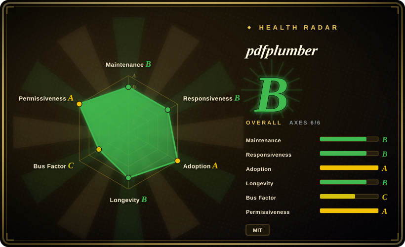
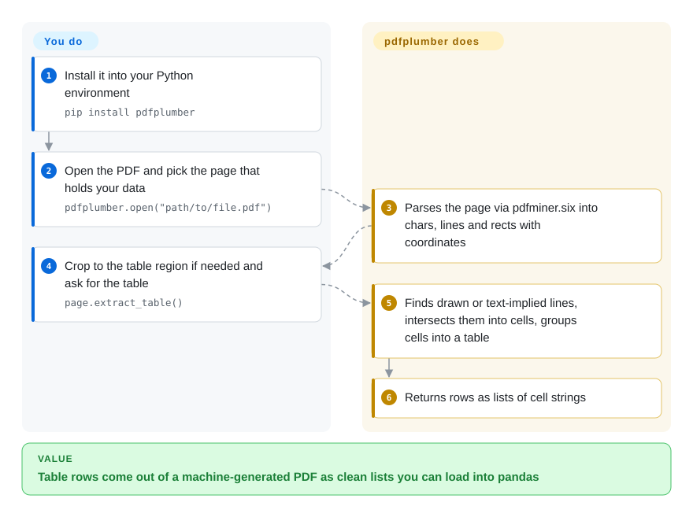

# pdfplumber

You run a PDF report through a text extractor and the table comes back as one long line of numbers with no idea where each column starts — and when it goes wrong, you can't see why. pdfplumber exposes every character, line and rectangle on the page with its exact coordinates, finds tables from those positions, and draws what it detected on an image of the page so you can tune it until the rows come out right.

## When to use

You're a data journalist or analyst, and the numbers you need are locked in machine-generated PDFs: a state's monthly layoff notices, a regulator's quarterly filings, a vendor's price list. `pdftotext` gives you `Acme Corp 03/14/2026 Oakland 120` with the columns smeared together, and the next page has a merged header that shifts everything. With pdfplumber you open the page in Jupyter, call `page.to_image().debug_tablefinder()` to *see* the red ruling lines and blue cells it found, crop to the table's bounding box, switch the strategy from drawn lines to text alignment if the table has no borders, and `page.extract_table()` returns clean `row -> cell` lists you can drop into pandas.

Pick it over PyMuPDF when you want an MIT license and a pure-Python stack that is easy to inspect, and when the job is *precise* extraction from a few awkward layouts rather than raw throughput. Pick it over table-only tools like Camelot when you also need the characters, words, lines and their positions for custom logic — for example, reading fixed-width reports or locating a value by what sits next to it.

## How it works

Underneath, pdfplumber uses `pdfminer.six` to parse each page into primitive objects — characters, lines, rectangles, curves, images — each a Python dict with its position (`x0`, `top`, `x1`, `bottom`), font and size. Everything else is built on those lists. Text extraction stitches characters into words and lines using distance tolerances (and can try to keep the visual layout). Table extraction follows a published method: find the lines that are drawn on the page or implied by how words line up, merge near-duplicates, take their intersections, form the smallest cells, and group adjacent cells into tables. **What it does for you:** the parsing, the geometry, the table finder, and visual debugging — rendering a page (via `pypdfium2`) with detected objects overlaid. **What stays yours:** choosing the page region (`crop`), the strategy and tolerances in `table_settings`, and the cleanup afterwards; there is no OCR and no layout model, so a scanned page yields nothing. There is also a `pdfplumber` CLI that dumps every object as CSV or JSON.

<!-- flow-steps:begin (generated from flows/pdfplumber.json by tools/flow_card.py — do not edit) -->

Text version of the flow

1. **You**: Install it into your Python environment — `pip install pdfplumber`
2. **You**: Open the PDF and pick the page that holds your data — `pdfplumber.open("path/to/file.pdf")`
3. **pdfplumber**: Parses the page via pdfminer.six into chars, lines and rects with coordinates
4. **You**: Crop to the table region if needed and ask for the table — `page.extract_table()`
5. **pdfplumber**: Finds drawn or text-implied lines, intersects them into cells, groups cells into a table
6. **pdfplumber**: Returns rows as lists of cell strings

**Value**: Table rows come out of a machine-generated PDF as clean lists you can load into pandas

<!-- flow-steps:end -->

## When NOT to use

- **The PDF is scanned (an image of text).** pdfplumber has no OCR and its README says it works best on machine-generated PDFs. Add a text layer first with [OCRmyPDF](../pdf-transform-signing/ocrmypdf.md), or use a layout-model parser such as [Docling](../../document-parsing/docling.md) or [Marker](../../document-parsing/marker.md).
- **Throughput matters: thousands of PDFs, or long ones.** It sits on pure-Python `pdfminer.six`, and its own README says PyMuPDF is "substantially faster". For bulk extraction or page rendering use [PyMuPDF](pymupdf.md) — if its AGPL license works for you.
- **You want Markdown for an LLM / RAG pipeline, not coordinates.** pdfplumber gives you raw material and leaves reading order, headings and multi-column flow to you. [Docling](../../document-parsing/docling.md), [Marker](../../document-parsing/marker.md) or [Unstructured](../../document-parsing/unstructured.md) produce structured documents directly.
- **You need to create, edit, merge or sign PDFs.** It only reads. Use [PyMuPDF](pymupdf.md) or [qpdf](../pdf-transform-signing/qpdf.md) to modify, [pyHanko](../pdf-transform-signing/pyhanko.md) to sign.
- **Tables are the only thing you need and pdfplumber's finder struggles.** Its README itself points to Camelot and tabula-py (not indexed) as sometimes better suited for particular tables; try them before writing heavy custom settings.
- **You need a vendor-backed dependency.** It is essentially one maintainer's project (see Health); if that is a policy blocker, PyMuPDF has a company behind it.

## Comparison

| Alternative | In index | Our verdict | Tradeoff |
|---|---|---|---|
| [PyMuPDF](pymupdf.md) | ✅ | For high-volume extraction, rendering, or anything that also edits PDFs, pick PyMuPDF; pick pdfplumber when an MIT license and object-level inspection with visual debugging matter more than speed. | PyMuPDF is much faster and does far more (it has its own `find_tables()` now) but is AGPL or paid; pdfplumber is slower and read-only but permissive and easy to inspect. |
| Camelot (`camelot-dev/camelot`) | not indexed | When the job is purely tables from bordered or well-aligned PDFs and you want ready-made lattice/stream modes, try Camelot; pick pdfplumber when you also need characters, words and coordinates for custom logic. | Camelot is table-specialized with fewer knobs to learn; pdfplumber is general-purpose and more manual but covers text, geometry and tables in one API. |
| pdfminer.six (`pdfminer/pdfminer.six`) | not indexed | When you only need text and layout analysis with the fewest dependencies, use pdfminer.six directly; add pdfplumber when you want tables, cropping and visual debugging on top. | pdfminer.six is the parsing foundation pdfplumber pins to; going direct drops Pillow/pypdfium2 but loses every higher-level helper. |
| [Docling](../../document-parsing/docling.md) | ✅ | When the goal is a whole document turned into structured Markdown/JSON for RAG, including scans, pick Docling; pick pdfplumber for surgical, rule-based extraction of specific values or tables. | Docling uses layout and table models (heavier install, GPU helps) and decides structure for you; pdfplumber is lightweight and deterministic but needs your rules. |
| [OCRmyPDF](../pdf-transform-signing/ocrmypdf.md) | ✅ | When the input is scanned, run OCRmyPDF first to add a text layer, then extract with pdfplumber; it is a complement, not a replacement. | OCRmyPDF makes scanned PDFs searchable but extracts nothing structured; pdfplumber extracts structure but cannot read pixels. |

## Tech stack

- **Language:** pure Python; `setup.py` allows Python ≥ 3.8, CI tests 3.10–3.14.
- **Parsing:** `pdfminer.six` (pinned to an exact release, `==20260107` in v0.11.10) supplies objects and layout analysis.
- **Rendering:** `pypdfium2` (Python bindings to Google's PDFium) plus `Pillow` for `to_image()` visual debugging; renders natively in Jupyter.
- **Surface:** `pdfplumber.open()` → `PDF.pages` → `Page` with `.chars/.lines/.rects/.curves/.images`, `crop/within_bbox/filter`, `extract_text/extract_words/search`, `find_tables/extract_tables/debug_tablefinder`, form-value extraction; CLI `pdfplumber file.pdf --format csv|json|text`.

## Dependencies

- **Runtime:** `pip install pdfplumber` → `pdfminer.six`, `Pillow>=12.2.0`, `pypdfium2>=5.9.0`; all ship wheels, no system packages needed.
- **No external services.** Everything runs in-process.
- **Not included:** OCR engine, layout/vision models.

## Ops difficulty

**Low.** It's a library: pin it, call it. Two practical costs: (1) memory on big documents — pages cache their parsed objects, so call `page.close()` (or process page by page) for large PDFs; (2) the exact `pdfminer.six` pin means upgrading pdfplumber also moves your pdfminer version, and table settings tuned on one release can shift on another — keep regression samples for each document family you parse.

## Health & viability

- **Maintenance (2026-10-08):** slow, steady cadence — v0.11.10 on 2026-06-15, three to four releases a year since 2025, mostly dependency bumps and fixes; no commits on `stable` in the last 13 weeks. It reads as a mature library being kept current rather than a growing one.
- **Governance & bus factor:** effectively a one-person project — Jeremy Singer-Vine (`jsvine`) wrote well over 90% of the commits and owns the roadmap under his personal account, with no organization or company behind it. This is the main risk; the radar's weakest axis is governance.
- **Age / Lindy:** created August 2015, ~11 years and still releasing — a solid Lindy signal, tempered by the single-maintainer dependency. Still versioned 0.x after a decade, but the API has been stable since the v0.5 table redesign.
- **Adoption:** ~10.8k stars, 40,689,748 PyPI downloads in the last month, 1,210 dependent repos; the mainstream choice for rule-based PDF table extraction in Python.
- **Risk flags:** MIT, no relicense history, no open-core. If upstream stalls, the codebase is small, pure Python and forkable.

## Caveats (unverified)

- [推断] "Mature library kept current" is inferred from the release log and recent commit messages (dependency upgrades, linter fixes).
- [推断] The comparison claims about Camelot's fit for specific tables come from pdfplumber's own README, not from a side-by-side test.
- [未验证] Relative speed against PyMuPDF is stated by both projects' READMEs; no benchmark was run for this page.
- [未验证] Star, download and dependent-repo counts are a 2026-10-08 snapshot from the GitHub API, PyPI and the health scorer.
