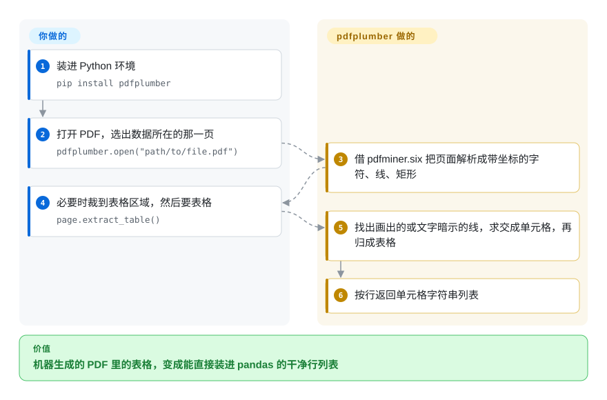

# pdfplumber

把一份 PDF 报表丢给文本提取工具，表格回来变成一长串数字，分不清每一列从哪开始——出了错你还看不到原因。pdfplumber 把页面上每个字符、每条线、每个矩形连同精确坐标都交给你，据此找出表格，还会把它识别到的东西画在页面截图上，让你调到每一行都对为止。

## 何时使用

你是数据记者或分析师，需要的数字锁在机器生成的 PDF 里：某个州每月的裁员通告、监管机构的季度报表、供应商的价目表。`pdftotext` 给你的是 `Acme Corp 03/14/2026 Oakland 120`，列全挤在一起，下一页还有个合并表头把所有东西都挤歪了。用 pdfplumber，你在 Jupyter 里打开这一页，调用 `page.to_image().debug_tablefinder()`，**亲眼看到**它找到的红色线和浅蓝单元格；裁到表格所在区域，表格没有边框就把策略从“画出来的线”换成“文字对齐”，然后 `page.extract_table()` 返回干净的“行 → 单元格”列表，直接丢进 pandas。

想要 MIT 许可证、想要一个容易看懂的纯 Python 栈，而且活儿是从少量别扭版式里**精确**抽数据、不是拼吞吐量时，选它而不是 PyMuPDF。除了表格还需要字符、单词、线条及其位置来写自定义逻辑时——比如读定宽报表，或按“旁边是什么”来定位一个值——选它而不是 Camelot 这类只管表格的工具。

## 怎么用起来

pdfplumber 底层用 `pdfminer.six` 把每一页解析成基本对象——字符、线、矩形、曲线、图片——每个都是一个带位置（`x0`、`top`、`x1`、`bottom`）、字体和字号的 Python 字典，其余功能都建在这些列表上。文本提取按距离容差把字符拼成单词和行（也可以尽量保留视觉版式）。表格提取遵循一套公开的方法：找出页面上画出来的线，或由文字对齐“暗示”出来的线，合并几乎重合的线，求交点，组成最小单元格，再把相邻单元格归成表格。**它替你做的：**解析、几何计算、找表格，以及可视化调试——借 `pypdfium2` 把页面渲染出来，再叠上识别到的对象。**留给你的：**选页面区域（`crop`）、在 `table_settings` 里定策略和容差，以及事后清洗；它没有 OCR、也没有版面模型，扫描页什么都抽不出来。另有一个 `pdfplumber` 命令行，可以把所有对象导出成 CSV 或 JSON。

<!-- flow-steps:begin (generated from flows/pdfplumber.json by tools/flow_card.py — do not edit) -->

流程文字版

1. **你**：装进 Python 环境 — `pip install pdfplumber`
2. **你**：打开 PDF，选出数据所在的那一页 — `pdfplumber.open("path/to/file.pdf")`
3. **pdfplumber**：借 pdfminer.six 把页面解析成带坐标的字符、线、矩形
4. **你**：必要时裁到表格区域，然后要表格 — `page.extract_table()`
5. **pdfplumber**：找出画出的或文字暗示的线，求交成单元格，再归成表格
6. **pdfplumber**：按行返回单元格字符串列表

**价值**：机器生成的 PDF 里的表格，变成能直接装进 pandas 的干净行列表

<!-- flow-steps:end -->

## 何时不用

- **PDF 是扫描件（文字其实是图片）。** pdfplumber 没有 OCR，README 也说它最适合机器生成的 PDF。先用 [OCRmyPDF](../pdf-transform-signing/ocrmypdf.zh.md) 加一层文字，或者改用带版面模型的解析器，如 [Docling](../../document-parsing/docling.zh.md) 或 [Marker](../../document-parsing/marker.zh.md)。
- **吞吐量要紧：成千上万份 PDF，或者很长的 PDF。** 它建在纯 Python 的 `pdfminer.six` 上，它自己的 README 都说 PyMuPDF “快得多”。批量提取或渲染页面用 [PyMuPDF](pymupdf.zh.md)——前提是你能接受它的 AGPL。
- **你要的是给 LLM / RAG 用的 Markdown，不是坐标。** pdfplumber 只给原材料，阅读顺序、标题、多栏排版都得你自己处理。[Docling](../../document-parsing/docling.zh.md)、[Marker](../../document-parsing/marker.zh.md) 或 [Unstructured](../../document-parsing/unstructured.zh.md) 直接产出结构化文档。
- **你要创建、编辑、合并或签名 PDF。** 它只读。修改用 [PyMuPDF](pymupdf.zh.md) 或 [qpdf](../pdf-transform-signing/qpdf.zh.md)，签名用 [pyHanko](../pdf-transform-signing/pyhanko.zh.md)。
- **你只要表格，而 pdfplumber 的找表算法搞不定。** 它的 README 自己就指出 Camelot 和 tabula-py（均未收录）对某些表格可能更合适；在写一大堆自定义参数之前先试试它们。
- **你需要有厂商背书的依赖。** 它基本上是一个人的项目（见健康度）；如果这触碰你的合规底线，PyMuPDF 背后有公司。

## 横向对比

| 替代品 | 是否收录 | 我们的评价 | 取舍 |
|---|---|---|---|
| [PyMuPDF](pymupdf.zh.md) | ✅ | 大批量提取、渲染，或者还要编辑 PDF 时，选 PyMuPDF；MIT 许可证和带可视化调试的对象级检查比速度更重要时，选 pdfplumber。 | PyMuPDF 快得多、能做的事多得多（现在也有自己的 `find_tables()`），但要么 AGPL 要么付费；pdfplumber 更慢、只读，但许可宽松、容易看懂。 |
| Camelot（`camelot-dev/camelot`） | 未收录 | 活儿纯粹是从有边框或对齐良好的 PDF 里抽表格、想要现成的 lattice/stream 模式时，试 Camelot；还需要字符、单词和坐标写自定义逻辑时，选 pdfplumber。 | Camelot 专攻表格，要学的参数更少；pdfplumber 是通用库、更需要手动调，但一个 API 覆盖文本、几何和表格。 |
| pdfminer.six（`pdfminer/pdfminer.six`） | 未收录 | 只要文本和版面分析、依赖越少越好时，直接用 pdfminer.six；想在其上加表格、裁剪和可视化调试时，再加 pdfplumber。 | pdfminer.six 是 pdfplumber 锁定的解析底座；直接用能省掉 Pillow/pypdfium2，但失去所有高层辅助功能。 |
| [Docling](../../document-parsing/docling.zh.md) | ✅ | 目标是把整份文档（包括扫描件）转成结构化 Markdown/JSON 给 RAG 用时，选 Docling；要按规则精准抽取特定数值或表格时，选 pdfplumber。 | Docling 用版面和表格模型（安装更重，有 GPU 更好）并替你决定结构；pdfplumber 轻量、结果确定，但规则得你来写。 |
| [OCRmyPDF](../pdf-transform-signing/ocrmypdf.zh.md) | ✅ | 输入是扫描件时，先用 OCRmyPDF 加文字层，再用 pdfplumber 提取；它是搭档，不是替代品。 | OCRmyPDF 让扫描 PDF 可搜索，但不抽取任何结构；pdfplumber 能抽结构，却读不了像素。 |

## 技术栈

- **语言：** 纯 Python；`setup.py` 允许 Python ≥ 3.8，CI 测试 3.10–3.14。
- **解析：** `pdfminer.six`（锁定到确切版本，v0.11.10 中是 `==20260107`）提供对象和版面分析。
- **渲染：** `pypdfium2`（Google PDFium 的 Python 绑定）加 `Pillow`，用于 `to_image()` 可视化调试；在 Jupyter 里直接显示。
- **接口：** `pdfplumber.open()` → `PDF.pages` → `Page`，带 `.chars/.lines/.rects/.curves/.images`、`crop/within_bbox/filter`、`extract_text/extract_words/search`、`find_tables/extract_tables/debug_tablefinder`，以及表单值提取；命令行 `pdfplumber file.pdf --format csv|json|text`。

## 依赖

- **运行时：** `pip install pdfplumber` → `pdfminer.six`、`Pillow>=12.2.0`、`pypdfium2>=5.9.0`；都有预编译 wheel，不需要系统包。
- **无外部服务：** 全部在进程内运行。
- **不包含：** OCR 引擎、版面或视觉模型。

## 运维难度

**低。** 它是个库：锁版本、直接调用。两项实际成本：（1）大文档的内存——页面会缓存解析出的对象，处理大 PDF 时调用 `page.close()`（或逐页处理）；（2）对 `pdfminer.six` 的精确锁定意味着升级 pdfplumber 也会挪动 pdfminer 版本，在一个版本上调好的表格参数到另一个版本可能变样——为每类要解析的文档留好回归样本。

## 健康度与可持续性

- **维护（2026-10-08）：** 节奏慢而稳——2026-06-15 发布 v0.11.10，2025 年以来每年三四个版本，主要是依赖升级和修复；`stable` 分支最近 13 周没有提交。看起来是一个保持更新的成熟库，而不是在扩张的项目。
- **治理与 bus factor：** 实际上是一个人的项目——Jeremy Singer-Vine（`jsvine`）写了九成以上的提交，并以个人账号掌握路线图，背后没有组织或公司。这是主要风险；雷达上最弱的一轴就是治理。
- **年龄与林迪：** 2015 年 8 月创建，约 11 年，仍在发版——林迪信号扎实，但被单人维护打了折扣。十年了还是 0.x 版本号，不过自 v0.5 重做表格提取以来 API 一直稳定。
- **采用度：** 约 10.8k star，近一个月 PyPI 下载 40,689,748 次，1,210 个依赖仓库；Python 里按规则抽取 PDF 表格的主流选择。
- **风险信号：** MIT，无改许可证历史，没有 open-core。即使上游停滞，代码量小、纯 Python，可以 fork。

## 存疑（未验证）

- [推断] “保持更新的成熟库”是根据发布记录和最近的提交信息（依赖升级、修 linter）推断的。
- [推断] 关于 Camelot 更适合某些表格的说法来自 pdfplumber 自己的 README，不是并排实测。
- [未验证] 与 PyMuPDF 的相对速度是两个项目 README 的说法；本页没有跑基准。
- [未验证] star、下载量和依赖仓库数是 2026-10-08 从 GitHub API、PyPI 和健康度评分器取的快照。
