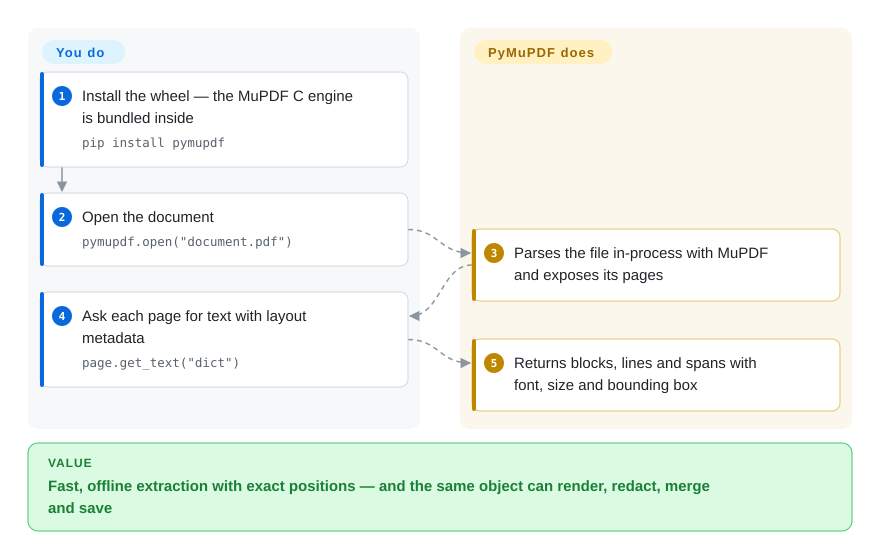

# PyMuPDF

Your document pipeline crawls through a backlog of PDFs, and you are stitching together one library to read text, another to render page images, a third to merge or redact. PyMuPDF puts Artifex's MuPDF C engine behind one pip-installable Python package that does all of it, fast and fully offline — under the AGPL unless you buy a commercial license.

## When to use

You're a backend engineer building document ingestion: a few hundred thousand contracts, invoices and reports have to become searchable text with positions, page thumbnails for a review UI, and redacted copies with account numbers blacked out. A pure-Python reader takes seconds per long document and can't render pages at all, so you'd be running three tools and a headless renderer. With PyMuPDF it is one import: `pymupdf.open(path)`, then per page `get_text("dict")` for spans with font, size and bounding box, `find_tables()` for tables, `get_pixmap(dpi=150)` for an image, `add_redact_annot` + `apply_redactions` to remove text for real, `insert_pdf` to merge — all in-process on the C engine.

Pick it over pdfplumber or pypdf when volume, rendering or editing matter, and over cloud document APIs or model-based parsers when documents must not leave the machine and you don't want a GPU. The deciding question is the license: it fits when your code is open source under AGPL-compatible terms, stays internal, or your company buys Artifex's commercial license.

## How it works

MuPDF is a compact C library for parsing and rendering PDF, XPS, EPUB and similar formats, written by Artifex (the company behind Ghostscript); PyMuPDF compiles it into the Python wheel, so `pip install pymupdf` brings the whole engine with no system packages. You open a `Document`, iterate its `Page` objects, and ask each page for what you need: plain text, or a `"dict"` tree of blocks → lines → spans with fonts and coordinates; tables; a `Pixmap` (a raster image of the page at any DPI); links, annotations, form fields. **What it does for you:** parsing, text and table detection, rendering, and writing — new pages, merged or split documents, annotations, redactions that physically remove content, encryption — then `save()`. **What stays yours:** deciding reading order and structure for downstream use (or adding the separate `pymupdf4llm` package for Markdown output), installing Tesseract language data if you want OCR, and the license decision. Office formats (DOCX, XLSX, PPTX, HWP) are not in the open-source build; they need the paid PyMuPDF Pro add-on.

<!-- flow-steps:begin (generated from flows/pymupdf.json by tools/flow_card.py — do not edit) -->

Text version of the flow

1. **You**: Install the wheel — the MuPDF C engine is bundled inside — `pip install pymupdf`
2. **You**: Open the document — `pymupdf.open("document.pdf")`
3. **PyMuPDF**: Parses the file in-process with MuPDF and exposes its pages
4. **You**: Ask each page for text with layout metadata — `page.get_text("dict")`
5. **PyMuPDF**: Returns blocks, lines and spans with font, size and bounding box

**Value**: Fast, offline extraction with exact positions — and the same object can render, redact, merge and save

<!-- flow-steps:end -->

## When NOT to use

- **You ship closed-source software or a SaaS and won't buy a license.** PyMuPDF is AGPL-3.0 or Artifex commercial — the AGPL's network clause reaches hosted services. Use [pdfplumber](pdfplumber.md) (MIT) for extraction or pypdf (BSD, not indexed) for split/merge/forms, and accept less speed; or budget for the commercial license.
- **You need to process Word, Excel or PowerPoint files.** That is PyMuPDF Pro, a paid add-on (without a key: first 3 pages only, time-limited). For open-source Office ingestion use [Docling](../../document-parsing/docling.md) or convert to PDF with LibreOffice first.
- **You want a document's meaning, not its glyphs: reading order across columns, headings, figures, scanned pages.** PyMuPDF gives precise low-level output; a model-based parser such as [Docling](../../document-parsing/docling.md) or [Marker](../../document-parsing/marker.md) decides structure for you and handles scans better, at the cost of heavier installs.
- **The code runs in a browser or Node.** It is a Python binding to a C engine; use [PDF.js](pdfjs.md) to read and render or [pdf-lib](../pdf-generation/pdf-lib.md) to modify PDFs in JavaScript.
- **You need legally valid digital signatures (PAdES, timestamps, validation).** Use [pyHanko](../pdf-transform-signing/pyhanko.md); signing and signature validation are not among PyMuPDF's documented features.
- **Your platform has no prebuilt wheel.** Wheels cover Windows, macOS (x86_64/arm64) and manylinux/musllinux mainstream targets for Python 3.10–3.14; anything else compiles MuPDF from source with a C/C++ toolchain.

## Comparison

| Alternative | In index | Our verdict | Tradeoff |
|---|---|---|---|
| [pdfplumber](pdfplumber.md) | ✅ | When an MIT license and fine-grained, visually debuggable table extraction matter more than speed, pick pdfplumber; for volume, rendering or any editing, pick PyMuPDF. | pdfplumber is permissive and transparent but pure-Python-slow and read-only; PyMuPDF is far faster and does everything, but under AGPL or a paid license. |
| pypdf (`py-pdf/pypdf`) | not indexed | When you only split, merge, rotate, encrypt or fill forms and need a BSD-licensed pure-Python dependency, pick pypdf; pick PyMuPDF when you also render pages or extract text with layout at scale. | pypdf installs anywhere with no compiled code and a permissive license, but has no rendering and weaker extraction; PyMuPDF trades that for a C engine and copyleft. |
| [Docling](../../document-parsing/docling.md) | ✅ | When the goal is structured Markdown/JSON of whole documents for RAG — including Office files and scans — pick Docling; pick PyMuPDF for fast, deterministic, CPU-only page-level extraction and manipulation. | Docling's layout models give better structure but need more RAM/compute and time per page; PyMuPDF is lightweight and exact but leaves structure decisions to you. |
| [PDF.js](pdfjs.md) | ✅ | When parsing and rendering must happen in the browser, pick PDF.js; when it runs in a Python backend, pick PyMuPDF. | PDF.js is Apache-2.0 JavaScript with a ready viewer but no editing; PyMuPDF is a Python/C engine with editing, unusable in the browser. |

## Tech stack

- **Engine:** MuPDF (C), bundled into the wheel; PyMuPDF is the Python binding (SWIG-generated layer plus a Python API), maintained by Artifex alongside MuPDF.
- **Language / versions:** Python 3.10–3.14 (as of v1.27+); `import pymupdf` (the old `import fitz` alias still works).
- **Inputs:** PDF, XPS, EPUB, CBZ, MOBI, FB2, SVG, TXT, Markdown and common images; Office/HWP only with PyMuPDF Pro.
- **Outputs:** PDF, SVG, raster images, plain text/HTML/XML/dict/JSON, Markdown and JSON via `pymupdf4llm`.
- **Capabilities:** text with fonts and positions, `find_tables()`, rendering, annotations, true redaction, AcroForm read/fill, page insert/delete/merge/split, encryption (RC4/AES), bookmarks, metadata, Tesseract-backed OCR.

## Dependencies

- **Runtime:** `pip install pymupdf` — no mandatory Python or system dependencies on platforms with wheels.
- **Optional:** `pymupdf4llm` (Markdown/JSON for LLMs; pulls `pymupdf_layout`), `pymupdf-fonts` (extra fonts), Tesseract language data (`tessdata`, via the `tesseract` package or `TESSDATA_PREFIX`) for OCR, `pymupdfpro` + license key for Office formats.
- **Network:** none after install — no telemetry or license callbacks, per the README FAQ.

## Ops difficulty

**Low technically, medium legally.** It is a library with self-contained wheels and no services. The real ops items are (1) the license review — confirm whether your use triggers AGPL obligations or needs the commercial license *before* it is load-bearing; (2) memory and CPU when rendering at high DPI in parallel workers; (3) upgrades — releases arrive every few weeks and follow MuPDF versions, so pin and run regression samples for extraction output; (4) OCR, which needs Tesseract data installed and discoverable on every worker.

## Health & viability

- **Maintenance (2026-10-08):** very active — commits in every one of the last 13 weeks, v1.28.2 on 2026-08-06 after 1.28.0 in June, issue first responses typically within a day.
- **Governance & backing:** owned by Artifex Software, which also owns MuPDF and Ghostscript and sells the commercial licenses — a vendor with a long track record and a revenue reason to keep it alive. Commits are concentrated in a few Artifex engineers (the original author Jorj McKie and Julian Smith account for most), which is why governance is the radar's weakest-scoring axis after license.
- **Age / Lindy:** created October 2012, ~14 years and releasing every month or two — a strong Lindy signal.
- **Adoption:** ~10.9k stars, 83,199,606 PyPI downloads in the last month, 1,798 dependent repos; a common backbone of Python RAG/document stacks.
- **Risk flags:** the license is the flag — AGPL-3.0 with a commercial dual license (the radar's license axis is D for strong network copyleft). The open-core edge is real: Office support lives in paid Pro, and the LLM add-on `pymupdf4llm` is under the same dual license.

## Caveats (unverified)

- [推断] "Common backbone of Python RAG stacks" is inferred from download volume and README positioning, not from a dependent survey.
- [未验证] The README's speed claims (10–50× faster text extraction than pure-Python libraries) were not benchmarked for this page.
- [未验证] Whether a given deployment triggers AGPL obligations is a legal question; this page does not give legal advice.
- [未验证] Star, download and dependent-repo counts are a 2026-10-08 snapshot from the GitHub API, PyPI and the health scorer.
