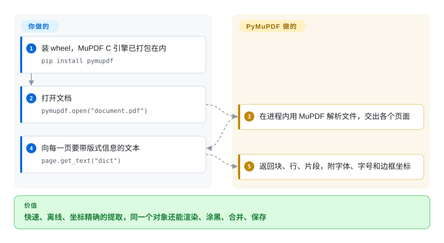

# PyMuPDF

文档处理流水线啃一堆积压的 PDF 啃得很慢，你还得拼三个库：一个读文本、一个把页面渲染成图、一个合并或涂黑敏感信息。PyMuPDF 把 Artifex 的 MuPDF C 引擎包进一个 `pip` 就能装的 Python 包，这些事它全做，又快又完全离线——但除非你买商业许可，它是 AGPL。

## 何时使用

你是后端工程师，在做文档入库：几十万份合同、发票和报告，要变成带位置的可搜索文本，要给审阅界面生成页面缩略图，还要出一份把账号涂黑的脱敏副本。纯 Python 的读取库处理一份长文档要好几秒，而且根本不能渲染页面，于是你得跑三个工具外加一个无头渲染器。用 PyMuPDF 就是一个 import：`pymupdf.open(path)`，然后逐页 `get_text("dict")` 拿到带字体、字号和边框坐标的文本片段，`find_tables()` 拿表格，`get_pixmap(dpi=150)` 拿图片，`add_redact_annot` 加 `apply_redactions` 真正删除文字，`insert_pdf` 合并——全在进程内、跑在 C 引擎上。

当量大、要渲染或要编辑时，选它而不是 pdfplumber 或 pypdf；当文档不能离开本机、你又不想上 GPU 时，选它而不是云端文档 API 或基于模型的解析器。决定性的问题是许可证：你的代码以兼容 AGPL 的方式开源、只在内部使用，或者公司买了 Artifex 的商业许可，它才合适。

## 怎么用起来

MuPDF 是 Artifex（Ghostscript 背后的公司）写的一个精简 C 库，用来解析和渲染 PDF、XPS、EPUB 等格式；PyMuPDF 把它编译进 Python wheel，所以 `pip install pymupdf` 就带上整个引擎，不需要任何系统包。你打开一个 `Document`，遍历它的 `Page` 对象，向每一页要你需要的东西：纯文本，或者“块 → 行 → 片段”的 `"dict"` 树（带字体和坐标）；表格；`Pixmap`（任意 DPI 下页面的位图）；链接、注释、表单域。**它替你做的：**解析、文本和表格识别、渲染，以及写入——新建页面、合并或拆分文档、加注释、真正抹掉内容的涂黑、加密——最后 `save()`。**留给你的：**为下游决定阅读顺序和结构（或者另装 `pymupdf4llm` 输出 Markdown）；要 OCR 就装好 Tesseract 语言数据；还有许可证决策。Office 格式（DOCX、XLSX、PPTX、HWP）不在开源版里，需要付费的 PyMuPDF Pro 扩展。

<!-- flow-steps:begin (generated from flows/pymupdf.json by tools/flow_card.py — do not edit) -->

流程文字版

1. **你**：装 wheel，MuPDF C 引擎已打包在内 — `pip install pymupdf`
2. **你**：打开文档 — `pymupdf.open("document.pdf")`
3. **PyMuPDF**：在进程内用 MuPDF 解析文件，交出各个页面
4. **你**：向每一页要带版式信息的文本 — `page.get_text("dict")`
5. **PyMuPDF**：返回块、行、片段，附字体、字号和边框坐标

**价值**：快速、离线、坐标精确的提取，同一个对象还能渲染、涂黑、合并、保存

<!-- flow-steps:end -->

## 何时不用

- **你发布闭源软件或做 SaaS，又不打算买许可。** PyMuPDF 是 AGPL-3.0 或 Artifex 商业许可二选一——AGPL 的网络条款连托管服务也覆盖。提取用 [pdfplumber](pdfplumber.zh.md)（MIT），拆分/合并/表单用 pypdf（BSD，未收录），接受速度慢一些；或者把商业许可的钱列进预算。
- **你要处理 Word、Excel 或 PowerPoint。** 那是付费扩展 PyMuPDF Pro（没有许可证密钥时只能读前 3 页，且有时限）。开源的 Office 文档入库用 [Docling](../../document-parsing/docling.zh.md)，或者先用 LibreOffice 转成 PDF。
- **你要的是文档的含义，而不是字形：跨栏的阅读顺序、标题、图表、扫描页。** PyMuPDF 给的是精确的底层输出；[Docling](../../document-parsing/docling.zh.md) 或 [Marker](../../document-parsing/marker.zh.md) 这类基于模型的解析器替你判断结构、对扫描件更友好，代价是安装更重。
- **代码跑在浏览器或 Node 里。** 它是 C 引擎的 Python 绑定；JavaScript 里读和渲染用 [PDF.js](pdfjs.zh.md)，改 PDF 用 [pdf-lib](../pdf-generation/pdf-lib.zh.md)。
- **你需要具备法律效力的数字签名（PAdES、时间戳、验签）。** 用 [pyHanko](../pdf-transform-signing/pyhanko.zh.md)；签名和验签不在 PyMuPDF 文档列出的功能里。
- **你的平台没有预编译 wheel。** wheel 覆盖 Windows、macOS（x86_64/arm64）以及主流 manylinux/musllinux 目标，Python 3.10–3.14；其他平台要用 C/C++ 工具链从源码编译 MuPDF。

## 横向对比

| 替代品 | 是否收录 | 我们的评价 | 取舍 |
|---|---|---|---|
| [pdfplumber](pdfplumber.zh.md) | ✅ | MIT 许可证和可视化调试的细粒度表格提取比速度更重要时，选 pdfplumber；量大、要渲染或要编辑时，选 PyMuPDF。 | pdfplumber 许可宽松、过程透明，但纯 Python 慢且只读；PyMuPDF 快得多、什么都能做，但要么 AGPL 要么付费。 |
| pypdf（`py-pdf/pypdf`） | 未收录 | 只做拆分、合并、旋转、加密或填表，且需要 BSD 许可的纯 Python 依赖时，选 pypdf；还要渲染页面或大规模做带版式的文本提取时，选 PyMuPDF。 | pypdf 没有编译代码、哪里都能装、许可宽松，但不能渲染、提取能力较弱；PyMuPDF 用 C 引擎和 copyleft 换掉这些短板。 |
| [Docling](../../document-parsing/docling.zh.md) | ✅ | 目标是把整份文档（含 Office 文件和扫描件）转成结构化 Markdown/JSON 给 RAG 用时，选 Docling；要快速、确定、只用 CPU 的页面级提取和操作时，选 PyMuPDF。 | Docling 的版面模型给出更好的结构，但每页要更多内存、算力和时间；PyMuPDF 轻量且精确，但结构判断留给你。 |
| [PDF.js](pdfjs.zh.md) | ✅ | 解析和渲染必须在浏览器里完成时，选 PDF.js；跑在 Python 后端时，选 PyMuPDF。 | PDF.js 是 Apache-2.0 的 JavaScript，自带查看器但不能编辑；PyMuPDF 是能编辑的 Python/C 引擎，进不了浏览器。 |

## 技术栈

- **引擎：** MuPDF（C），打包进 wheel；PyMuPDF 是它的 Python 绑定（SWIG 生成的底层加一层 Python API），由 Artifex 与 MuPDF 一起维护。
- **语言与版本：** Python 3.10–3.14（v1.27 起）；`import pymupdf`（旧别名 `import fitz` 仍可用）。
- **输入：** PDF、XPS、EPUB、CBZ、MOBI、FB2、SVG、TXT、Markdown 及常见图片；Office/HWP 只能靠 PyMuPDF Pro。
- **输出：** PDF、SVG、位图、纯文本/HTML/XML/dict/JSON，经 `pymupdf4llm` 可输出 Markdown 和 JSON。
- **能力：** 带字体与位置的文本、`find_tables()`、渲染、注释、真正的涂黑、AcroForm 读取/填写、页面插入/删除/合并/拆分、加密（RC4/AES）、书签、元数据、基于 Tesseract 的 OCR。

## 依赖

- **运行时：** `pip install pymupdf`——在有 wheel 的平台上没有任何必需的 Python 或系统依赖。
- **可选：** `pymupdf4llm`（给 LLM 的 Markdown/JSON，会带上 `pymupdf_layout`）、`pymupdf-fonts`（更多字体）、OCR 所需的 Tesseract 语言数据（`tessdata`，装 `tesseract` 或设 `TESSDATA_PREFIX`）、Office 格式所需的 `pymupdfpro` 加许可证密钥。
- **网络：** 装好之后不需要——按 README 常见问题的说法，没有遥测，也没有许可证回调。

## 运维难度

**技术上低，法务上中。** 它是个库，wheel 自带一切，不需要任何服务。真正的运维事项是：（1）许可证审查——在它变成关键依赖**之前**，确认你的用法是否触发 AGPL 义务、是否需要商业许可；（2）多 worker 并行高 DPI 渲染时的内存和 CPU；（3）升级——每隔几周发版，并跟随 MuPDF 版本，务必锁版本，并用回归样本盯住提取结果；（4）OCR 要求每个 worker 上都装好并能找到 Tesseract 数据。

## 健康度与可持续性

- **维护（2026-10-08）：** 非常活跃——近 13 周每周都有提交，6 月发 1.28.0 之后 2026-08-06 又发了 v1.28.2，issue 的首次回复通常在一天之内。
- **治理与背书：** 归 Artifex Software 所有，它同时拥有 MuPDF 和 Ghostscript，并出售商业许可——一家记录悠久、且有营收理由让它活下去的厂商。提交集中在几位 Artifex 工程师手里（原作者 Jorj McKie 和 Julian Smith 占了大头），所以治理是雷达上除许可证外得分最低的一轴。
- **年龄与林迪：** 2012 年 10 月创建，约 14 年，每一两个月发一次版——林迪信号很强。
- **采用度：** 约 10.9k star，近一个月 PyPI 下载 83,199,606 次，1,798 个依赖仓库；是 Python RAG / 文档处理栈的常见底座。
- **风险信号：** 许可证就是那面旗——AGPL-3.0 加商业双许可（雷达的许可证轴因强网络 copyleft 得 D）。open-core 的边界是实打实的：Office 支持在付费 Pro 里，给 LLM 用的 `pymupdf4llm` 也是同样的双许可。

## 存疑（未验证）

- [推断] “Python RAG 栈的常见底座”是根据下载量和 README 的定位推断的，没有做依赖方调查。
- [未验证] README 里的速度说法（文本提取比纯 Python 库快 10–50 倍）本页没有跑基准验证。
- [未验证] 某个具体部署是否触发 AGPL 义务是法律问题；本页不构成法律意见。
- [未验证] star、下载量和依赖仓库数是 2026-10-08 从 GitHub API、PyPI 和健康度评分器取的快照。
