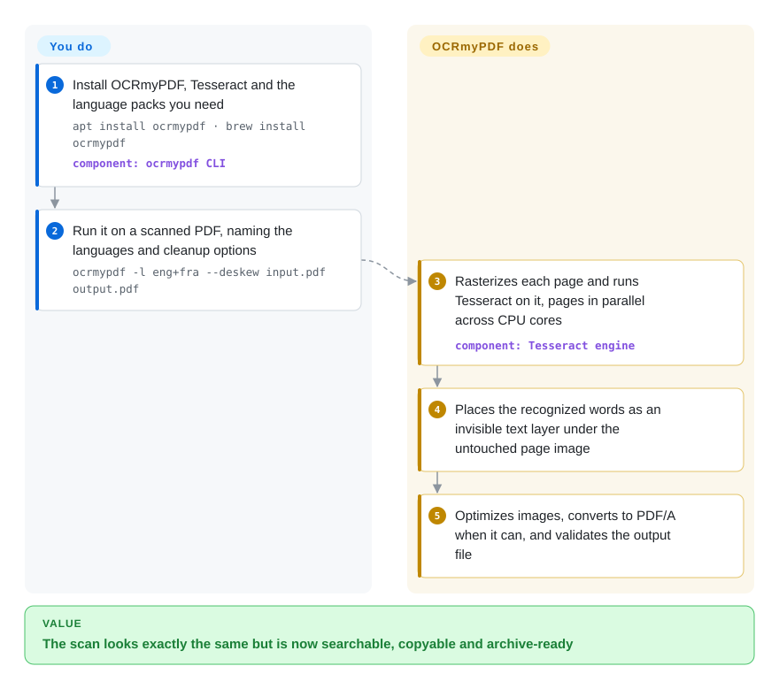

# OCRmyPDF

A scanned PDF is just pictures of pages: Ctrl+F finds nothing, copy-paste grabs nothing, and your search index sees an empty file. OCRmyPDF runs OCR on each page and slides an invisible, correctly positioned text layer under the original image, so the file looks the same but becomes searchable and copyable.

## When to use

You run the back office for a small firm, a lab or a household archive, and a scanner drops hundreds of PDFs a week into a shared folder. Someone asks for "the 2024 lease with the parking clause" and `grep`, Spotlight and your document search all come back empty, because every page is a JPEG wrapped in a PDF. You want the same files — same look, same page images, ideally archival PDF/A — but with real text behind them, produced unattended by a cron job or a watched folder.

That is the exact job OCRmyPDF was built for: `ocrmypdf -l eng+deu in.pdf out.pdf` and the output is the original page images with an OCR text layer placed underneath, optimized and validated. Pick it over calling Tesseract directly because Tesseract only reads images — OCRmyPDF does the PDF work around it (rasterizing pages, keeping image resolution, skipping or redoing pages that already have text, PDF/A conversion, multi-core page parallelism). Pick it over Docling or Marker when the deliverable is still a *PDF* a human opens, not Markdown for an LLM pipeline; pick it over paperless-ngx when you only need the OCR step, not a whole document-management web app (paperless-ngx calls OCRmyPDF internally anyway).

## How it works

OCRmyPDF is a Python pipeline around external engines: it splits the PDF into pages, rasterizes each page to an image (with pypdfium2 or Ghostscript — the renderer that turns a PDF page into pixels), and hands that image to Tesseract, the OCR engine that turns pixels into words with positions. It then writes those words in an invisible "glyphless" font exactly under where they appear in the image, grafts that text layer onto the *original* page, so the visible image is untouched, and optionally converts the result to PDF/A (the ISO archival flavour of PDF). Pages run in parallel across CPU cores. You choose the languages, the mode for pages that already contain text (`--mode skip`, `redo` or `force`; the default stops with an error), and cleanup options like `--deskew`; you must install Tesseract and the language packs yourself. There is also a Python API, `ocrmypdf.ocr(...)`, which the docs recommend calling from a child process because it forks workers and runs subprocesses.

<!-- flow-steps:begin (generated from flows/ocrmypdf.json by tools/flow_card.py — do not edit) -->

Text version of the flow

1. **You**: Install OCRmyPDF, Tesseract and the language packs you need — `apt install ocrmypdf · brew install ocrmypdf` — component: `ocrmypdf CLI`
2. **You**: Run it on a scanned PDF, naming the languages and cleanup options — `ocrmypdf -l eng+fra --deskew input.pdf output.pdf`
3. **OCRmyPDF**: Rasterizes each page and runs Tesseract on it, pages in parallel across CPU cores — component: `Tesseract engine`
4. **OCRmyPDF**: Places the recognized words as an invisible text layer under the untouched page image
5. **OCRmyPDF**: Optimizes images, converts to PDF/A when it can, and validates the output file

**Value**: The scan looks exactly the same but is now searchable, copyable and archive-ready

<!-- flow-steps:end -->

## When NOT to use

- **You want text or Markdown out, not a searchable PDF.** OCRmyPDF's product is a PDF with a hidden text layer; it does not reconstruct tables, headings or reading order. For LLM/RAG ingestion use [Docling](../../document-parsing/docling.md) or [Marker](../../document-parsing/marker.md) instead.
- **The PDF is born-digital (already has a text layer).** There is nothing to recognize; by default OCRmyPDF exits with an error on a page that already has text. To extract text use [pdfplumber](../pdf-reading/pdfplumber.md) or [PyMuPDF](../pdf-reading/pymupdf.md); to restructure the file use [qpdf](qpdf.md).
- **Handwriting, degraded photos or complex non-Latin layouts.** The default engine is Tesseract, which is weak on handwriting and camera photos. Use a deep-learning engine such as [PaddleOCR](../../ocr/paddleocr.md) (there is a community OCRmyPDF-PaddleOCR plugin, GPU strongly advised) or a vision-model pipeline like [olmOCR](../../document-parsing/olmocr.md) instead.
- **You need a document archive with users, tags and full-text search.** OCRmyPDF is one CLI step; use [paperless-ngx](../../document-management/paperless-ngx.md), which embeds OCRmyPDF and adds ingestion, storage and a search UI.
- **You cannot install native binaries (serverless, locked-down hosts).** Tesseract (and, for some PDF/A paths, Ghostscript) must be installed outside pip. Run the official Docker image, or call a hosted OCR API (not a repo) instead.
- **Licensing of a bundled distribution matters.** OCRmyPDF itself is MPL-2.0, but if your PDF/A path falls back to Ghostscript, that engine is AGPL-3.0 (commercial licence from Artifex). Pin `--pdfa-backend internal` or `--output-type pdf` to keep Ghostscript out, or use [Tesseract](../../ocr/tesseract.md) directly with your own PDF assembly.

## Comparison

| Alternative | In index | Our verdict | Tradeoff |
|---|---|---|---|
| [Tesseract](../../ocr/tesseract.md) | ✅ | Use Tesseract alone when your input is images and you only need text or hOCR; pick OCRmyPDF when the input and output are PDFs, because it handles rasterizing, text-layer placement and PDF/A for you. | Tesseract is one dependency fewer and gives full engine control; OCRmyPDF adds the PDF plumbing, page parallelism and validation that you would otherwise write yourself. |
| [paperless-ngx](../../document-management/paperless-ngx.md) | ✅ | Choose paperless-ngx when people need to browse, tag and search a document archive; choose OCRmyPDF when OCR is one step in your own script or pipeline. | paperless-ngx gives a full web app (database, workers, UI) built on OCRmyPDF; OCRmyPDF is just the CLI/library with no storage or UI to operate. |
| [Docling](../../document-parsing/docling.md) | ✅ | When the goal is structured text (Markdown, JSON, tables) for LLMs or RAG, pick Docling; when the goal is a searchable PDF that looks identical to the scan, pick OCRmyPDF. | Docling reconstructs layout and tables but does not give you back the original PDF; OCRmyPDF preserves the document but leaves structure extraction to you. |
| [PaddleOCR](../../ocr/paddleocr.md) | ✅ | For handwriting, photos or dense CJK where Tesseract accuracy is not enough, use PaddleOCR (optionally via the OCRmyPDF-PaddleOCR plugin); otherwise OCRmyPDF's default Tesseract path is simpler to run. | PaddleOCR is more accurate on hard inputs but brings a deep-learning stack and ideally a GPU; Tesseract runs on any CPU with small language packs. |
| Stirling-PDF | 未收录 | Pick Stirling-PDF when non-technical users want OCR among many PDF tools in a self-hosted web UI; pick OCRmyPDF for headless batch jobs and scripting. | Stirling-PDF wraps many PDF operations behind a browser UI; OCRmyPDF is a single-purpose CLI that is easier to automate and audit. |

## Tech stack

- **Language:** Python ≥ 3.11 (pure Python package `ocrmypdf`, built with hatchling), v17.13.0 as of 2026-09-28.
- **PDF internals:** pikepdf (the maintainer's Python binding to qpdf) for structure and PDF/A repair/validation, pypdfium2 for rasterizing, fpdf2 + uharfbuzz for rendering the invisible text layer, pdfminer.six for text detection, img2pdf and Pillow for images.
- **Engines:** Tesseract OCR (default, 100+ languages) via subprocess; Ghostscript optional for rasterizing and fallback PDF/A conversion.
- **Extensibility:** a pluggy-based plugin interface; the `--ocr-engine` option and community plugins swap in EasyOCR, PaddleOCR or Apple Vision.
- **Distribution:** PyPI, most Linux/BSD package managers, Homebrew, and Docker images for x64 and ARM.

## Dependencies

- **Required native binary:** Tesseract 4.1.1+ on `PATH`, plus a Tesseract language pack for every language you pass with `-l`.
- **Optional native binary:** Ghostscript — needed only when the internal PDF/A path cannot produce a valid file, or when you request a Ghostscript-only option; v17 made it optional.
- **Python packages:** pulled in by pip (pikepdf with the `pdfa` extra, pypdfium2, fpdf2, pdfminer.six, Pillow, pydantic, pluggy, rich, uharfbuzz).
- **Optional extras:** `heic` (bundles GPLv2 x265 — opt-in), `watcher` (watch-folder service), `webservice` (Streamlit demo UI).
- **No external services:** OCR runs locally; documents do not leave the machine.

## Ops difficulty

**Low for a single machine, medium at volume.** Installing is one package-manager command or a Docker pull; the main friction is getting the right Tesseract language packs and keeping native versions compatible — the v17 release notes are full of Ghostscript-version-specific workarounds. At volume, CPU is the cost: OCR is per-page and CPU-bound, so throughput scales with cores and `--jobs`. Embedding the Python API in a long-running service needs care, because it forks workers and spawns subprocesses; the docs recommend running each job in a child process. There is no daemon, database or state to operate unless you use the optional watcher.

## Health & viability

- **Maintenance (2026-10-08): very active.** Releases roughly every two weeks (v17.10 → v17.13 between 2026-08-05 and 2026-09-28), commits within the last day, and issue first responses typically within a day.
- **Governance: single-maintainer risk.** James R. Barlow (`jbarlow83`) authored ~97% of commits; the GitHub org and paid consulting are the only visible backing. The roadmap and release process depend on one person.
- **Age / Lindy: strong.** Started in 2013 and actively maintained for ~13 years through several major versions — old *and* still active, the best case for the Lindy prior.
- **Adoption: broad (radar B).** 1,217,669 PyPI downloads in the last month and 108 dependent repos on the registry graph; packaged by Debian, Fedora, Homebrew and the BSDs, and embedded in paperless-ngx.
- **Risk flags:** MPL-2.0 (file-level copyleft: publish changes to OCRmyPDF's own files); Ghostscript fallback is AGPL-3.0; v17 brought breaking changes to the plugin API and removed lossy JBIG2. No relicensing found.

## Caveats (unverified)

- [推断] The README's "Requirements" section still says Ghostscript is required, while the v17.0.0 and v17.13.0 release notes say it is optional; this page follows the release notes.
- [未验证] Accuracy claims ("battle-tested on millions of PDFs", handles thousands of pages) are the upstream's own statements; not benchmarked here.
- [未验证] The OCRmyPDF-PaddleOCR and OCRmyPDF-AppleOCR plugins are third-party repositories named in the README; their maintenance and compatibility with v17 were not checked.
- [推断] OCR quality on CJK and mixed-script documents depends mainly on Tesseract and its language data, not OCRmyPDF; v17 improved text-layer font handling for CJK/Devanagari/Arabic but not recognition itself.
