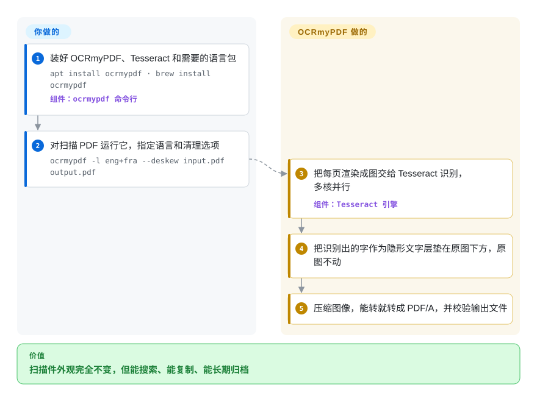

# OCRmyPDF

扫描出来的 PDF 其实只是一页页图片：Ctrl+F 搜不到字，复制粘贴什么也拿不到，搜索引擎看它就是空文件。OCRmyPDF 对每一页做文字识别，在原图下面垫一层看不见、但位置对齐的文字，文件外观不变，却能搜索、能复制。

## 何时使用

你在一家小公司、实验室或家里管文档，扫描仪每周往共享目录里吐几百个 PDF。有人问“2024 年那份带车位条款的租约在哪”，`grep`、Spotlight、文档搜索全都查不到，因为每一页都是包在 PDF 里的 JPEG。你想要的还是这些文件——外观不变、页面图像不变，最好是适合长期归档的 PDF/A——只是背后多一层真实文字，并且能由定时任务或监控目录无人值守地完成。

这正是 OCRmyPDF 要干的活：`ocrmypdf -l eng+deu in.pdf out.pdf`，输出就是原始页面图像加上一层垫在下面的 OCR 文字，并经过压缩和校验。不直接调 Tesseract，是因为 Tesseract 只认图片，PDF 层面的活（把页面渲染成图、保持图像分辨率、跳过或重做已经有文字的页、转 PDF/A、按 CPU 核并行处理页面）都得 OCRmyPDF 来做。不选 Docling 或 Marker，是因为你要交付的仍是给人打开的 *PDF*，不是喂给大模型的 Markdown；不选 paperless-ngx，是因为你只需要 OCR 这一步，而不是一整套文档管理网站（paperless-ngx 内部本来就调用 OCRmyPDF）。

## 怎么用起来

OCRmyPDF 是一条围绕外部引擎搭起来的 Python 流水线：先把 PDF 拆成页，把每页渲染成图片（用 pypdfium2 或 Ghostscript，也就是把 PDF 页面画成像素的渲染器），再交给 Tesseract——把像素认成带坐标文字的 OCR 引擎。随后它用一种不可见的“无字形”字体，把这些字精确写在图片中对应位置的下方，并把这层文字嫁接回*原始*页面，可见图像一个像素都不动；需要的话再转成 PDF/A（ISO 标准的归档版 PDF）。页面按 CPU 核并行处理。你要做的是：选语言，决定遇到已有文字的页怎么办（`--mode skip`、`redo` 或 `force`；默认直接报错退出），按需加 `--deskew` 这类清理选项；Tesseract 和语言包要你自己装。它也有 Python API `ocrmypdf.ocr(...)`，但因为它会派生工作进程、调用子进程，文档建议放在子进程里调用。

<!-- flow-steps:begin (generated from flows/ocrmypdf.json by tools/flow_card.py — do not edit) -->

流程文字版

1. **你**：装好 OCRmyPDF、Tesseract 和需要的语言包 — `apt install ocrmypdf · brew install ocrmypdf` — 组件：`ocrmypdf 命令行`
2. **你**：对扫描 PDF 运行它，指定语言和清理选项 — `ocrmypdf -l eng+fra --deskew input.pdf output.pdf`
3. **OCRmyPDF**：把每页渲染成图交给 Tesseract 识别，多核并行 — 组件：`Tesseract 引擎`
4. **OCRmyPDF**：把识别出的字作为隐形文字层垫在原图下方，原图不动
5. **OCRmyPDF**：压缩图像，能转就转成 PDF/A，并校验输出文件

**价值**：扫描件外观完全不变，但能搜索、能复制、能长期归档

<!-- flow-steps:end -->

## 何时不用

- **你要的是文本或 Markdown，而不是可搜索的 PDF。** OCRmyPDF 的产物是带隐藏文字层的 PDF，不会还原表格、标题和阅读顺序。给大模型或 RAG 入库用，请改用 [Docling](../../document-parsing/docling.zh.md) 或 [Marker](../../document-parsing/marker.zh.md)。
- **PDF 本来就是电子版（已经有文字层）。** 没有东西可识别；默认模式下 OCRmyPDF 遇到已有文字的页会报错退出。只想抽文字用 [pdfplumber](../pdf-reading/pdfplumber.zh.md) 或 [PyMuPDF](../pdf-reading/pymupdf.zh.md)；想重组文件结构用 [qpdf](qpdf.zh.md)。
- **手写体、质量很差的照片或复杂的非拉丁版式。** 默认引擎 Tesseract 对手写和手机拍照很弱。改用深度学习引擎如 [PaddleOCR](../../ocr/paddleocr.zh.md)（社区有 OCRmyPDF-PaddleOCR 插件，强烈建议配 GPU），或 [olmOCR](../../document-parsing/olmocr.zh.md) 这类视觉模型流水线。
- **你需要带用户、标签和全文检索的文档库。** OCRmyPDF 只是一个命令行步骤；请用 [paperless-ngx](../../document-management/paperless-ngx.zh.md)，它内嵌 OCRmyPDF，并补上入库、存储和搜索界面。
- **你装不了原生二进制（serverless、锁死的主机）。** Tesseract（以及部分 PDF/A 路径下的 Ghostscript）必须在 pip 之外单独安装。改用官方 Docker 镜像，或调用托管 OCR API（非仓库）。
- **你要分发打包好的产品，且在意许可证。** OCRmyPDF 本身是 MPL-2.0，但 PDF/A 一旦回落到 Ghostscript，那个引擎是 AGPL-3.0（Artifex 另售商业许可）。用 `--pdfa-backend internal` 或 `--output-type pdf` 把 Ghostscript 排除在外，或者直接用 [Tesseract](../../ocr/tesseract.zh.md) 自己拼 PDF。

## 横向对比

| 替代品 | 是否收录 | 我们的评价 | 取舍 |
|---|---|---|---|
| [Tesseract](../../ocr/tesseract.zh.md) | ✅ | 输入是图片、只要文字或 hOCR 时，单用 Tesseract；输入输出都是 PDF 时选 OCRmyPDF，因为渲染页面、摆放文字层和转 PDF/A 它都替你做了。 | 单用 Tesseract 少一个依赖、对引擎控制更细；OCRmyPDF 补上 PDF 处理、按页并行和校验，这些你本来要自己写。 |
| [paperless-ngx](../../document-management/paperless-ngx.zh.md) | ✅ | 需要让人浏览、打标签、搜索文档库时选 paperless-ngx；OCR 只是你自己脚本或流水线里的一步时选 OCRmyPDF。 | paperless-ngx 是建立在 OCRmyPDF 之上的完整网站（数据库、后台任务、界面）；OCRmyPDF 只是命令行和库，没有存储和界面要运维。 |
| [Docling](../../document-parsing/docling.zh.md) | ✅ | 目标是给大模型或 RAG 用的结构化文本（Markdown、JSON、表格）时选 Docling；目标是一份和扫描件长得一样、但能搜索的 PDF 时选 OCRmyPDF。 | Docling 能还原版面和表格，但不把原 PDF 还给你；OCRmyPDF 保住原文档，结构抽取留给你自己。 |
| [PaddleOCR](../../ocr/paddleocr.zh.md) | ✅ | 手写、拍照或密集中日韩文本让 Tesseract 精度不够时，用 PaddleOCR（可通过 OCRmyPDF-PaddleOCR 插件接入）；否则 OCRmyPDF 默认的 Tesseract 路径更省事。 | PaddleOCR 在难样本上更准，但要带一整套深度学习栈，最好有 GPU；Tesseract 任何 CPU 都能跑，语言包也小。 |
| Stirling-PDF | 未收录 | 非技术用户想在自托管网页里把 OCR 和一堆 PDF 工具一起用时选 Stirling-PDF；无界面批处理和脚本化选 OCRmyPDF。 | Stirling-PDF 把大量 PDF 操作包进浏览器界面；OCRmyPDF 是单一用途的命令行，更容易自动化和审计。 |

## 技术栈

- **语言：** Python ≥ 3.11（纯 Python 包 `ocrmypdf`，用 hatchling 构建），截至 2026-09-28 为 v17.13.0。
- **PDF 内部处理：** pikepdf（维护者本人写的 qpdf Python 绑定）负责结构和 PDF/A 修复、校验；pypdfium2 负责渲染页面；fpdf2 + uharfbuzz 负责绘制不可见文字层；pdfminer.six 负责检测已有文字；img2pdf 和 Pillow 处理图像。
- **引擎：** 默认通过子进程调用 Tesseract OCR（100 多种语言）；Ghostscript 可选，用于渲染和 PDF/A 回退转换。
- **扩展性：** 基于 pluggy 的插件接口；`--ocr-engine` 选项和社区插件可换成 EasyOCR、PaddleOCR 或 Apple Vision。
- **分发：** PyPI、多数 Linux/BSD 包管理器、Homebrew，以及 x64 和 ARM 的 Docker 镜像。

## 依赖

- **必需的原生程序：** `PATH` 上要有 Tesseract 4.1.1+，并为 `-l` 里的每种语言装好对应语言包。
- **可选的原生程序：** Ghostscript——只在内置 PDF/A 路径产不出合格文件、或你用了只有 Ghostscript 才实现的选项时需要；v17 起已改为可选。
- **Python 包：** pip 自动拉取（带 `pdfa` 扩展的 pikepdf、pypdfium2、fpdf2、pdfminer.six、Pillow、pydantic、pluggy、rich、uharfbuzz）。
- **可选扩展：** `heic`（会带入 GPLv2 的 x265，需主动开启）、`watcher`（监控目录服务）、`webservice`（Streamlit 演示界面）。
- **不依赖外部服务：** OCR 全在本机跑，文档不出机器。

## 运维难度

**单机低，量大时中等。** 安装就是一条包管理器命令或拉一个 Docker 镜像；主要麻烦在于装对 Tesseract 语言包、让原生程序版本彼此兼容——v17 的发布说明里满是针对特定 Ghostscript 版本的绕行处理。量大时成本在 CPU：OCR 按页计算、吃 CPU，吞吐随核数和 `--jobs` 增长。把 Python API 嵌进常驻服务要小心，因为它会派生工作进程、调用子进程；文档建议每个任务放进子进程跑。除非用可选的 watcher，否则没有守护进程、数据库或状态需要运维。

## 健康度与可持续性

- **维护（2026-10-08）：非常活跃。** 大约两周一个版本（2026-08-05 到 2026-09-28 从 v17.10 发到 v17.13），一天内就有提交，issue 首次响应通常在一天内。
- **治理：单人维护风险。** James R. Barlow（`jbarlow83`）贡献了约 97% 的提交；可见的支撑只有 GitHub 组织和付费咨询。路线图和发版都系于一人。
- **年龄 / Lindy：很强。** 2013 年开始，持续维护约 13 年、跨过多个大版本——既老又仍活跃，是 Lindy 先验最理想的情形。
- **采用：广（雷达 B）。** PyPI 近一个月下载量 1,217,669 次，注册表依赖图上有 108 个依赖仓库；Debian、Fedora、Homebrew 和各 BSD 都有打包，并被 paperless-ngx 内嵌使用。
- **风险信号：** MPL-2.0（文件级 copyleft：改了 OCRmyPDF 自己的文件需公开修改）；Ghostscript 回退路径是 AGPL-3.0；v17 对插件 API 有破坏性变更，并移除了有损 JBIG2。未发现改协议历史。

## 存疑（未验证）

- [推断] README 的 “Requirements” 一节仍写着必须安装 Ghostscript，而 v17.0.0 和 v17.13.0 的发布说明都说它已可选；本页以发布说明为准。
- [未验证] “在数百万份 PDF 上实战检验”“可处理数千页”等准确性与规模说法来自上游自述，本页未做基准测试。
- [未验证] OCRmyPDF-PaddleOCR、OCRmyPDF-AppleOCR 插件是 README 里提到的第三方仓库，未核查其维护状况和与 v17 的兼容性。
- [推断] 中日韩和混合文字文档的识别质量主要取决于 Tesseract 及其语言数据，而不是 OCRmyPDF；v17 改进的是中日韩、天城文、阿拉伯文的文字层字体处理，不是识别本身。
