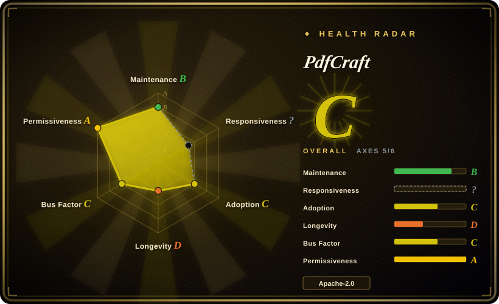
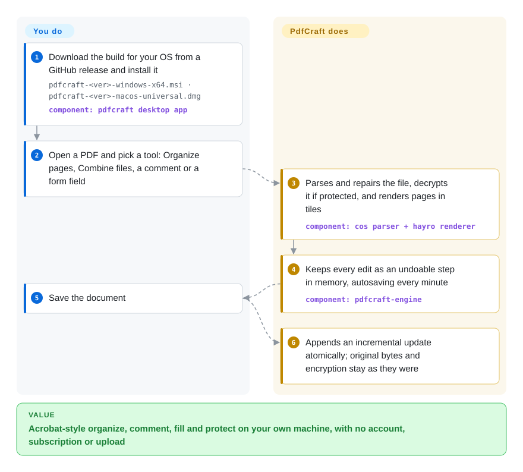

# PdfCraft

You have a stack of PDFs to merge, fill, comment on, redact or password-protect, and the one tool that does all of it in one window is a per-seat Acrobat subscription that wants an account — while free viewers stop at reading, and Linux or FreeBSD users get no Acrobat at all. PdfCraft is a native desktop app (plus a CLI and an opt-in MCP server for agents) that already covers viewing, page organizing, comments, forms, passwords, redaction and basic signing offline, saving every change as an append-only update; it is nine days old and still borrows its page renderer.

## When to use

You look after the laptops of a small office — a few Macs, a few Windows machines, one Linux workstation. Every week someone needs to drop pages 12–14 from `contract-v3.pdf`, combine it with an appendix, fill its 13 form fields, add a "Sign Here" stamp and send it password-protected, and the only way today is to borrow the one Acrobat Pro seat or upload the file to a web PDF site you would rather not trust with contracts. You want one free, installable app that does these jobs on the machine itself, on every OS you have, without an account.

PdfCraft is that app: download the MSI, DMG, AppImage, Flatpak, `.deb`, `.rpm` or FreeBSD tarball from a release, open the file, and use Organize pages, Combine files, the comment tools, the Fields panel and Protect. Pick it over Stirling-PDF when you want a native app on each desk rather than a server everyone uploads to; over Okular when you need form authoring, redaction and signing, not only reading and annotating; over qpdf when the people doing the work need a GUI rather than a command line. The same engine is reachable from `pdfcraft-cli` and an opt-in MCP server, so a coding agent can highlight a phrase or fill a form field in a PDF confined to one directory (`--root`). What you accept in exchange is a nine-day-old, pre-1.0 project whose own roadmap rates its foundations "weakest" — use it for everyday office PDFs you can re-check, not yet for anything where a mis-rendered page costs money.

## How it works

PdfCraft treats a PDF the way the file format itself does: as a graph of numbered objects (pages, fonts, images, form fields) plus an index that says where each sits in the file. Its own parser (`pdfcraft-cos`) reads that graph, repairs damaged indexes and decrypts protected files; drawing the pages on screen is still delegated to `hayro`, a separate open-source Rust renderer that PdfCraft carries in a locally patched copy until its own renderer lands. Every edit you make — rotate, delete, comment, fill a field — becomes one step in an undo history held in memory; nothing touches the file until you save, and then PdfCraft appends the changes to the end of the file (an "incremental update") through a temporary copy that is swapped in, so the original bytes survive byte for byte and an encrypted file stays encrypted. You choose the operations; the app does the parsing, repairing, appearance drawing for comments and fields, and the safe write. Think of a notary who never erases a line in the ledger — every correction is a new, dated entry appended at the bottom. The CLI (`pdfcraft-cli run`) and the MCP server (`pdfcraft-cli mcp`) call the same table of 120-odd JSON-Schema-described tools as the GUI, so scripted and agent-driven edits follow the same save rules.

<!-- flow-steps:begin (generated from flows/pdfcraft.json by tools/flow_card.py — do not edit) -->

Text version of the flow

1. **You**: Download the build for your OS from a GitHub release and install it — `pdfcraft-<ver>-windows-x64.msi · pdfcraft-<ver>-macos-universal.dmg` — component: `pdfcraft desktop app`
2. **You**: Open a PDF and pick a tool: Organize pages, Combine files, a comment or a form field
3. **PdfCraft**: Parses and repairs the file, decrypts it if protected, and renders pages in tiles — component: `cos parser + hayro renderer`
4. **PdfCraft**: Keeps every edit as an undoable step in memory, autosaving every minute — component: `pdfcraft-engine`
5. **You**: Save the document
6. **PdfCraft**: Appends an incremental update atomically; original bytes and encryption stay as they were

**Value**: Acrobat-style organize, comment, fill and protect on your own machine, with no account, subscription or upload

<!-- flow-steps:end -->

## When NOT to use

- **Anything where rendering fidelity is contractual (print production, legal exhibits, archival).** The project's roadmap (2026-10-05) says fidelity against Acrobat is "unmeasured", pages are drawn by the borrowed `hayro` crate, and fuzzing "still turns up crashes and hangs on hostile files"; users report pages rendering blank that Acrobat shows (issue #538) and blurrier text than Acrobat (#350). Use Adobe Acrobat (not a repo) where the output must match what the sender saw, or check output with [PDF.js](../pdf-reading/pdfjs.md) / [PyMuPDF](../pdf-reading/pymupdf.md) renders before trusting it.
- **Editing existing text, especially CJK, or converting to/from Office.** The README lists "reliable editing of existing text (especially CJK)", Office import/export, XFA forms and PDF/A/X/UA preflight as thin or missing. Use Acrobat for those; for PDF/A validation use veraPDF (not indexed).
- **Long-term signatures and enterprise PKI.** Signing is PAdES B-B only: no timestamps (B-T), no LTV (DSS/OCSP/CRL), no smart cards or PKCS #11. Use [pyHanko](pyhanko.md) when signatures must stay verifiable for years.
- **OCR of non-Latin scans.** OCR is Latin-script only and produces a searchable image layer, not editable text. Use [OCRmyPDF](ocrmypdf.md) with the Tesseract language packs you need.
- **Embedding the engine in your own program.** The engine crates are not on crates.io (`pdfcraft-engine` returns "does not exist", checked 2026-10-09), and the render/inspect layers are slated for replacement (ADR-0004), so expect API churn. In Rust, use `hayro` or `lopdf` directly (not indexed); in other languages use [qpdf](qpdf.md) for structural edits or [PyMuPDF](../pdf-reading/pymupdf.md) (AGPL) for render-plus-edit.
- **Team-wide batch processing behind one web UI.** PdfCraft is a per-machine desktop app; for a shared self-hosted service people upload to, Stirling-PDF (not indexed) is built for that, and for unattended scripts [qpdf](qpdf.md) is smaller and two decades older.
- **Machines without a working GPU path.** The desktop UI runs on `wgpu`; an iMac reports `Error: Wgpu(RequestDeviceError … Device(Lost))` even with `--safe-gpu` on 0.4.0 (#461). On such machines read PDFs with [PDF.js](../pdf-reading/pdfjs.md) in a browser or Okular (not indexed).
- **Shipping a rebranded fork.** The ArtCraft name and logos in `docs/brand/` are trademarks under a separate non-open licence; forks must remove them. The code itself is MIT OR Apache-2.0.

## Comparison

| Alternative | In index | Our verdict | Tradeoff |
|---|---|---|---|
| Adobe Acrobat Pro | not a repo | Keep Acrobat where output fidelity, existing-text editing, LTV signatures, preflight or XFA are requirements; try PdfCraft for organize/comment/fill/protect on machines where a paid seat or an account is the blocker. | Acrobat is a closed, subscription product with decades of rendering fidelity and the full Pro workflow set; PdfCraft is free, offline and cross-platform (incl. Linux/FreeBSD/web) but covers ~half the offline feature list and its fidelity is unmeasured. |
| Stirling-PDF | not indexed | Choose Stirling-PDF when a team wants one self-hosted web service for merge/split/convert/OCR; choose PdfCraft when each person should edit locally with no server and no upload. Not added in this tab batch. | Stirling-PDF is a mature, very popular server app (MIT core, with proprietary directories carved out in its LICENSE); PdfCraft is a native desktop app with incremental saves but a nine-day track record. |
| Okular | not indexed | Choose Okular for a long-lived, KDE-governed viewer with annotations on Linux; choose PdfCraft when the same desk also needs form authoring, redaction, password protection and signing. Not added in this tab batch. | Okular has a decade-plus of maintenance under KDE but is built around viewing and annotating; PdfCraft does far more per window and pays for it in immaturity and a single-vendor roadmap. |
| [qpdf](qpdf.md) | ✅ | In scripts and pipelines that merge, split, encrypt or repair, pick qpdf; pick PdfCraft when a person needs to see the pages and click through organize/comment/fill. | qpdf is a ~20-year-old Apache-2.0 CLI/library with no GUI and no rendering; PdfCraft adds a full GUI, comments, forms and signing on top of a much younger parser. |
| [PyMuPDF](../pdf-reading/pymupdf.md) | ✅ | For a Python pipeline that renders, extracts and edits at volume, use PyMuPDF; for an interactive desktop editor or an agent driving MCP tools without writing Python, use PdfCraft. | PyMuPDF wraps MuPDF's proven C renderer but is AGPL-or-commercial; PdfCraft is permissive and GUI-first, with a borrowed renderer and no published library crates. |

## Tech stack

- **Language:** Rust (edition 2024, `rust-version = "1.90"`), a Cargo workspace of 30 `pdfcraft-*` crates plus the `pdfcraft`, `pdfcraft-cli` and `pdfcraft-web` apps; `unsafe_code = "forbid"` workspace-wide.
- **PDF core:** own crates for filters, crypt (RC4/AES, revisions 2–6), COS object layer with repair and incremental writing, organize, annotations, forms, redaction, signing, optimize, accessibility checker; rendering through a vendored, patched `hayro` 0.7 and inspection through a vendored, patched `lopdf` 0.45 (both slated for replacement, ADR-0004).
- **UI:** egui / eframe 0.36 on `wgpu`, with AccessKit; the same code compiles to WebAssembly for the browser build.
- **Other engines:** `boa_engine` 0.22 for sandboxed form JavaScript; `ocrs` + `rten` for Latin OCR; RustCrypto plus `aws-lc-rs` (which builds the C library aws-lc) for RSA signing on native targets.
- **Agent surface:** `pdfcraft-automation` — a headless tool table exposed as `pdfcraft-cli run`, a stdio MCP server (`pdfcraft-cli mcp`, optional `--compact` and `--root`), and a token-authenticated loopback UI control channel (`pdfcraft --control`).

## Dependencies

- **End users:** none beyond the OS — signed/notarized macOS DMG, code-signed Windows MSI/portable zip (x64, x86, ARM64), Linux AppImage/Flatpak/`.deb`/`.rpm`/tarball (x86_64, aarch64), FreeBSD tarball, and a static web build. A GPU path usable by `wgpu` is needed for the desktop UI.
- **Network:** none at runtime; "Check for updates" is a manual, single HTTPS request to GitHub.
- **Building from source:** a Rust toolchain ≥ 1.90; optional `CRAFT_FONTS_DIR` pointing at a clone of `storytold/craft-fonts` for Japanese fonts (release builds include them); `cargo xtask demo-pdf` additionally needs Chrome and downloads Google Fonts.
- **For the MCP server:** an MCP-capable agent configured to launch `pdfcraft-cli mcp`; it opens no network port.

## Ops difficulty

**Low to install, medium to trust.** Installing is a normal desktop install or portable zip per machine, with silent MSI deployment documented (`msiexec /i … /qn INSTALLDESKTOPSHORTCUT=0`). There is no server. The real burden is version churn: four tagged releases in the first eight days (0.1.0 → 0.4.0), a product rename from PrintCraft to PdfCraft between 0.2.1 and 0.4.0, and no automatic updater by design (AppImage `.zsync` aside), so someone has to roll new builds out and re-check that saved files still open correctly elsewhere. Keep a known-good copy of anything you edit until fidelity is measured.

## Health & viability

- **Maintenance (2026-10-09): extremely active.** ~445 commits since the repo was created on 2026-09-30, 227 merged PRs, 4 releases (v0.1.0 2026-10-02 → v0.4.0 2026-10-08), CI green on `main` at check time. This is day-nine velocity, not a cadence that has been sustained.
- **Governance / bus factor: one vendor, one lead, agent-written.** Owned by the ArtCraft organization (`storytold`, GitHub org since 2021, 42 public repos). One maintainer authored ~269 of the commits; the ROADMAP measures progress in "wall-clock hours of agent work (Claude Opus 5.5 coding continuously)" against a local-only plan (`plan/` is gitignored), and most commits carry a `Co-authored-by: Claude` trailer. About 58 other contributors have landed commits, but the roadmap and the plan stay with the vendor.
- **Age / Lindy: none yet.** Nine days old; the Lindy prior gives it no credit. The ArtCraft org has shipped long-lived repos before (its `artcraft` app since 2022), but this "Crafting Apps" family — PhotoCraft, LightCraft, VectorCraft, DesignCraft, EffectCraft, DeckCraft and more, all created 2026-09-30 to 10-07 — is a new bet.
- **Adoption: real users, unusual star curve.** ~5.7k stars and ~2.0k forks in nine days; v0.4.0 assets show ~90k downloads within a day of release (≈40k of them the Windows x64 MSI), and 168 open issues come from many distinct users with concrete bug reports. Whether the star velocity is organic could not be checked (the stargazers API returned 404).
- **Risk flags:** pre-1.0 with self-reported robustness "early beta"; the "clean-room" claim is about Adobe's code — the renderer is the third-party `hayro` and the clean-room process lives in an unpublished plan; ArtCraft trademarks are not open; MIT OR Apache-2.0 is the real license (GitHub's badge shows only Apache-2.0).

## Caveats (unverified)

- [未验证：上游自报] "983 pdf.js test files, 963 render cleanly, 0 crashes" and "958 round trips succeed" are the project's own corpus numbers; not reproduced.
- [未验证：上游自报] Parity percentages (51% of 806 features, 88% of P0) come from `cargo xtask parity` over the project's own feature list; the list itself was not audited.
- [未验证：计划目录未公开] The clean-room process (no Acrobat code read, black-box observation only) rests on `plan/README.md` and `plan/adr/0001`, which are gitignored and not public.
- [未验证：stargazers API 返回 404] Whether the ~5.7k stars in nine days are organic; the stargazers endpoint returned 404 at check time, so stargazer account ages could not be sampled.
- [推断] "Code written by Claude Opus agents" is inferred from the ROADMAP's "agent-hours" estimates, the CLAUDE.md autonomous-operation protocol and `Co-authored-by: Claude` trailers on most commits; how much human review each change gets is not stated.
- [未验证] Download counts are GitHub release-asset counters on 2026-10-09 and include automated fetches.
- [未验证] Silent-install, code-signing and notarization claims are from the README; signatures on the release binaries were not checked.
