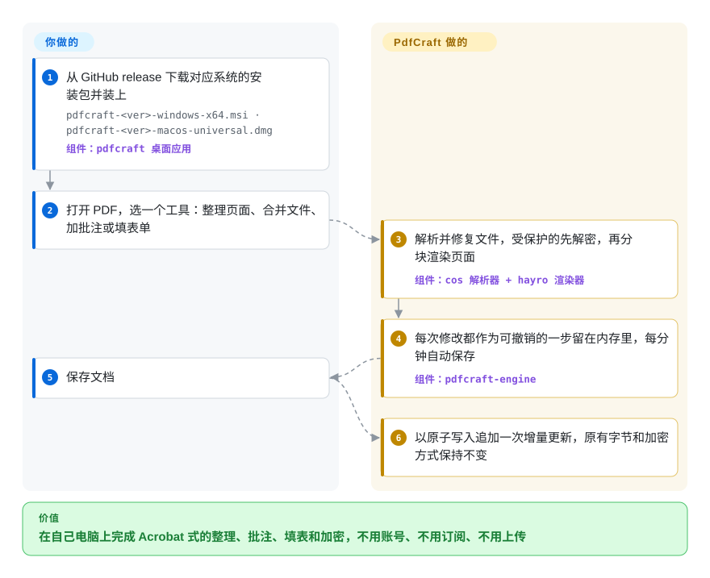

# PdfCraft

手上一摞 PDF 要合并、填表、批注、涂黑或加密码，能在一个窗口里全做完的只有按席位收费、还要登录账号的 Acrobat；免费阅读器只管看，Linux 和 FreeBSD 用户连 Acrobat 都没有。PdfCraft 是一个原生桌面应用（另带命令行和给 agent 用的可选 MCP 服务），离线就能看、整理页面、批注、填表、加密、涂黑和做基础签名，每次保存都只在文件末尾追加；但它才诞生九天，页面渲染还是借别人的。

## 何时使用

你负责一个小办公室的电脑：几台 Mac、几台 Windows、一台 Linux 工作站。每周都有人要把 `contract-v3.pdf` 的第 12–14 页删掉、和附件拼在一起、填好 13 个表单域、盖一个“Sign Here”图章，再加密发出去。现在的办法要么是借用唯一那个 Acrobat Pro 席位，要么把文件传到一个你并不放心交合同的在线 PDF 网站。你想要的是一个免费、能装在每台机器上、所有系统都能用、不用注册账号、在本机就把这些活干完的应用。

PdfCraft 就是这个应用：从 release 下载 MSI、DMG、AppImage、Flatpak、`.deb`、`.rpm` 或 FreeBSD 压缩包，打开文件，用“整理页面”“合并文件”、批注工具、表单域面板和“保护”功能完成工作。想让每张桌子上都有原生应用、而不是搭一台大家都往上传文件的服务器时，选它而不是 Stirling-PDF；除了阅读和批注还要做表单制作、涂黑和签名时，选它而不是 Okular；干活的人需要图形界面而不是命令行时，选它而不是 qpdf。同一套引擎也能经 `pdfcraft-cli` 和可选的 MCP 服务调用，所以编程 agent 可以在限定目录（`--root`）里给 PDF 高亮一句话或填一个表单域。代价是：这是一个九天大、尚未 1.0 的项目，它自己的路线图把“基础”评为“最弱”——拿它处理你能复核的日常办公 PDF，别用在一页渲染错就要赔钱的场合。

## 怎么用起来

PdfCraft 按 PDF 格式本身的样子看待文件：一张由编号对象（页、字体、图片、表单域）组成的图，加一张记录每个对象在文件里位置的索引表。它自己的解析器（`pdfcraft-cos`）读这张图、修复损坏的索引、解密受保护的文件；而把页面画到屏幕上这件事，目前仍交给 `hayro`——另一个开源 Rust 渲染器，PdfCraft 带着一份打过本地补丁的副本，等自研渲染器做好再替换。你做的每个修改——旋转、删页、批注、填表——都成为内存里撤销历史中的一步；保存之前文件一个字节都不动，保存时 PdfCraft 把改动追加到文件末尾（即“增量更新”），先写临时副本再整体换上，所以原始字节逐字节保留，加密的文件仍然是加密的。做哪些操作由你决定；解析、修复、为批注和表单域画外观、安全写盘由它包办。像一位从不擦掉账本旧行的公证员——每次更正都是在末尾追加一条新的、带日期的记录。命令行（`pdfcraft-cli run`）和 MCP 服务（`pdfcraft-cli mcp`）调用的是和图形界面同一张、一百二十来个用 JSON Schema 描述的工具表，所以脚本和 agent 做的修改遵守同样的保存规则。

<!-- flow-steps:begin (generated from flows/pdfcraft.json by tools/flow_card.py — do not edit) -->

流程文字版

1. **你**：从 GitHub release 下载对应系统的安装包并装上 — `pdfcraft-<ver>-windows-x64.msi · pdfcraft-<ver>-macos-universal.dmg` — 组件：`pdfcraft 桌面应用`
2. **你**：打开 PDF，选一个工具：整理页面、合并文件、加批注或填表单
3. **PdfCraft**：解析并修复文件，受保护的先解密，再分块渲染页面 — 组件：`cos 解析器 + hayro 渲染器`
4. **PdfCraft**：每次修改都作为可撤销的一步留在内存里，每分钟自动保存 — 组件：`pdfcraft-engine`
5. **你**：保存文档
6. **PdfCraft**：以原子写入追加一次增量更新，原有字节和加密方式保持不变

**价值**：在自己电脑上完成 Acrobat 式的整理、批注、填表和加密，不用账号、不用订阅、不用上传

<!-- flow-steps:end -->

## 何时不用

- **渲染保真度写进合同的场合（印刷生产、法律证据、归档）。** 项目路线图（2026-10-05）自己写着：与 Acrobat 的保真度“尚未测量”，页面由借来的 `hayro` 绘制，模糊测试“仍会在恶意文件上发现崩溃和卡死”；用户报告有 Acrobat 能显示而它显示为空白的页面（issue #538），以及比 Acrobat 更糊的文字（#350）。输出必须与发件人所见一致时用 Adobe Acrobat（非仓库），或者先用 [PDF.js](../pdf-reading/pdfjs.zh.md)／[PyMuPDF](../pdf-reading/pymupdf.zh.md) 渲染核对后再信它。
- **编辑已有文字（尤其中日韩文字），或与 Office 互转。** README 把“可靠地编辑已有文字（尤其 CJK）”、Office 导入导出、XFA 表单、PDF/A/X/UA 预检列为薄弱或缺失。这些用 Acrobat；要验证 PDF/A 用 veraPDF（未收录）。
- **长期有效的签名与企业 PKI。** 签名只到 PAdES B-B：没有时间戳（B-T）、没有 LTV（DSS／OCSP／CRL）、不支持智能卡和 PKCS #11。签名要多年后仍可验证时用 [pyHanko](pyhanko.zh.md)。
- **非拉丁文字的扫描件 OCR。** OCR 只支持拉丁字母，产出的是可搜索的图像层而非可编辑文字。用 [OCRmyPDF](ocrmypdf.zh.md) 配上你需要的 Tesseract 语言包。
- **把引擎嵌进你自己的程序。** 引擎 crate 没发布到 crates.io（2026-10-09 查询 `pdfcraft-engine` 返回“does not exist”），渲染与检查层又计划被替换（ADR-0004），API 会变。Rust 里直接用 `hayro` 或 `lopdf`（均未收录）；其他语言做结构修改用 [qpdf](qpdf.zh.md)，要渲染加编辑用 [PyMuPDF](../pdf-reading/pymupdf.zh.md)（AGPL）。
- **全团队共用一个网页做批处理。** PdfCraft 是装在每台机器上的桌面应用；要一个大家都往上传文件的自托管服务，Stirling-PDF（未收录）就是为此设计的；要无人值守的脚本，[qpdf](qpdf.zh.md) 更小，也老了二十年。
- **没有可用 GPU 路径的机器。** 桌面界面跑在 `wgpu` 上；有 iMac 用户在 0.4.0 上即使加 `--safe-gpu` 也报 `Error: Wgpu(RequestDeviceError … Device(Lost))`（#461）。这类机器上用浏览器里的 [PDF.js](../pdf-reading/pdfjs.zh.md) 或 Okular（未收录）看 PDF。
- **发布改了牌子的分支。** `docs/brand/` 里的 ArtCraft 名称和标志是商标，适用单独的非开源许可，分支必须移除；代码本身是 MIT OR Apache-2.0。

## 横向对比

| 替代品 | 是否收录 | 我们的评价 | 取舍 |
|---|---|---|---|
| Adobe Acrobat Pro | 非仓库 | 输出保真、编辑已有文字、LTV 签名、预检或 XFA 是硬要求时留着 Acrobat；付费席位或账号是障碍、只需整理／批注／填表／加密的机器上，试 PdfCraft。 | Acrobat 是闭源订阅产品，有几十年的渲染保真和完整的 Pro 工作流；PdfCraft 免费、离线、跨平台（含 Linux、FreeBSD、网页），但只覆盖约一半离线功能，保真度也没测过。 |
| Stirling-PDF | 未收录 | 团队想要一个自托管网页服务统一做合并／拆分／转换／OCR 时选 Stirling-PDF；希望每个人在本机编辑、不经服务器、不用上传时选 PdfCraft。本批次未收录。 | Stirling-PDF 是成熟且非常流行的服务端应用（MIT 核心，LICENSE 里划出了若干专有目录）；PdfCraft 是带增量保存的原生桌面应用，但只有九天的记录。 |
| Okular | 未收录 | 在 Linux 上要一个由 KDE 长期维护、带批注的阅读器时选 Okular；同一台机器还要做表单制作、涂黑、加密和签名时选 PdfCraft。本批次未收录。 | Okular 在 KDE 下维护了十多年，但主要围绕阅读和批注；PdfCraft 一个窗口能做的事多得多，代价是不成熟、路线图握在单一厂商手里。 |
| [qpdf](qpdf.zh.md) | ✅ | 在脚本和流水线里合并、拆分、加密、修复，选 qpdf；需要人看着页面点选整理／批注／填表时，选 PdfCraft。 | qpdf 是约 20 年历史的 Apache-2.0 命令行工具和库，没有界面也不渲染；PdfCraft 在一个年轻得多的解析器上加了完整界面、批注、表单和签名。 |
| [PyMuPDF](../pdf-reading/pymupdf.zh.md) | ✅ | Python 流水线要大批量渲染、抽取和编辑时用 PyMuPDF；要交互式桌面编辑器，或让 agent 不写 Python 直接调 MCP 工具时用 PdfCraft。 | PyMuPDF 封装了久经考验的 MuPDF C 渲染器，但许可是 AGPL 或商业授权；PdfCraft 许可宽松、以界面为先，渲染器是借的，也没有发布库 crate。 |

## 技术栈

- **语言：** Rust（edition 2024，`rust-version = "1.90"`），Cargo 工作区含 30 个 `pdfcraft-*` crate，外加 `pdfcraft`、`pdfcraft-cli`、`pdfcraft-web` 三个应用；全工作区 `unsafe_code = "forbid"`。
- **PDF 核心：** 自研 crate 覆盖过滤器、加密（RC4／AES，修订版 2–6）、带修复和增量写入的 COS 对象层、页面整理、批注、表单、涂黑、签名、优化、无障碍检查；渲染走打过补丁的内置 `hayro` 0.7，文档检查走打过补丁的内置 `lopdf` 0.45（两者都计划被替换，ADR-0004）。
- **界面：** egui／eframe 0.36，跑在 `wgpu` 上，带 AccessKit；同一份代码编译成 WebAssembly 即为浏览器版。
- **其他引擎：** `boa_engine` 0.22 执行沙箱化的表单 JavaScript；`ocrs` + `rten` 做拉丁文 OCR；RustCrypto 加 `aws-lc-rs`（会编译 C 库 aws-lc）在原生平台做 RSA 签名。
- **Agent 接口：** `pdfcraft-automation`——一张无界面工具表，以 `pdfcraft-cli run`、stdio MCP 服务（`pdfcraft-cli mcp`，可选 `--compact` 和 `--root`）以及带令牌认证的本机回环界面控制通道（`pdfcraft --control`）三种方式暴露。

## 依赖

- **最终用户：** 除操作系统外无需其他东西——已签名并公证的 macOS DMG，已代码签名的 Windows MSI／便携 zip（x64、x86、ARM64），Linux AppImage／Flatpak／`.deb`／`.rpm`／压缩包（x86_64、aarch64），FreeBSD 压缩包，以及静态网页版。桌面界面需要一条 `wgpu` 能用的 GPU 路径。
- **网络：** 运行时不联网；“检查更新”是手动触发、向 GitHub 发一次 HTTPS 请求。
- **从源码构建：** Rust 工具链 ≥ 1.90；可选 `CRAFT_FONTS_DIR` 指向 `storytold/craft-fonts` 的克隆以带上日文字体（release 构建已包含）；`cargo xtask demo-pdf` 还需要 Chrome，并会下载 Google Fonts。
- **MCP 服务：** 一个配置为启动 `pdfcraft-cli mcp` 的 MCP agent；它不开任何网络端口。

## 运维难度

**安装容易，信任它要花功夫（中）。** 每台机器正常安装或解压便携包即可，静默安装 MSI 的命令也有文档（`msiexec /i … /qn INSTALLDESKTOPSHORTCUT=0`）。没有服务端。真正的负担在版本更替：头八天打了四个 release（0.1.0 → 0.4.0），0.2.1 到 0.4.0 之间产品名从 PrintCraft 改成 PdfCraft，而且按设计没有自动更新（AppImage 的 `.zsync` 除外），所以得有人去推新版本，并复核保存过的文件在别的阅读器里还能正常打开。在保真度被测量之前，编辑过的文件都留一份已知完好的副本。

## 健康度与可持续性

- **维护（2026-10-09）：极度活跃。** 仓库 2026-09-30 创建以来约 445 次提交、227 个已合并 PR、4 个 release（v0.1.0 2026-10-02 → v0.4.0 2026-10-08），检查时 `main` 的 CI 为绿。这是第九天的速度，不是已经持续下来的节奏。
- **治理／巴士因子：单一厂商、单一主导者、由 agent 编写。** 归属 ArtCraft 组织（`storytold`，2021 年起的 GitHub 组织，42 个公开仓库）。一位维护者贡献了约 269 次提交；ROADMAP 用“agent 工作的挂钟小时数（Claude Opus 5.5 连续编码）”衡量进度，所依据的计划只在本地（`plan/` 被 gitignore），多数提交带 `Co-authored-by: Claude` 尾注。约 58 位其他贡献者有提交合入，但路线图和计划仍握在厂商手里。
- **年龄／Lindy：尚无。** 九天大，Lindy 先验给不了它任何分。ArtCraft 组织此前有过长期维护的仓库（自 2022 年起的 `artcraft` 应用），但这个“Crafting Apps”家族——PhotoCraft、LightCraft、VectorCraft、DesignCraft、EffectCraft、DeckCraft 等，都创建于 2026-09-30 至 10-07——是一次新的下注。
- **采用：真实用户，星标曲线异常。** 九天约 5.7k star、约 2.0k fork；v0.4.0 的安装包在发布一天内累计约 9 万次下载（其中约 4 万是 Windows x64 MSI），168 个未关闭 issue 来自许多不同用户、带具体的缺陷报告。星标增速是否自然无法核实（stargazers API 返回 404）。
- **风险信号：** 尚未 1.0，自评健壮性为“早期 beta”；“clean-room”指的是不碰 Adobe 的代码——渲染器是第三方 `hayro`，clean-room 流程写在未公开的计划里；ArtCraft 商标不开源；实际许可是 MIT OR Apache-2.0（GitHub 徽章只显示 Apache-2.0）。

## 存疑（未验证）

- [未验证：上游自报] “pdf.js 的 983 个测试文件中 963 个渲染干净、0 崩溃”和“958 次往返编辑成功”是项目自己的语料数据，未复现。
- [未验证：上游自报] 功能对齐百分比（806 项中 51%，P0 达 88%）来自 `cargo xtask parity` 对项目自定功能清单的统计，清单本身未审核。
- [未验证：计划目录未公开] clean-room 流程（不读 Acrobat 代码、只做黑盒观察）依据的是 `plan/README.md` 和 `plan/adr/0001`，二者被 gitignore，未公开。
- [未验证：stargazers API 返回 404] 九天约 5.7k star 是否自然增长；检查时 stargazers 接口返回 404，无法抽样星标账号的注册时间。
- [推断] “代码由 Claude Opus agent 编写”是从 ROADMAP 的“agent 工作小时”估算、CLAUDE.md 的自主运行协议和多数提交的 `Co-authored-by: Claude` 尾注推出的；每次改动经过多少人工审查，项目没有说明。
- [未验证] 下载数是 2026-10-09 的 GitHub release 资产计数，包含自动化抓取。
- [未验证] 静默安装、代码签名和公证的说法来自 README，未核验 release 二进制上的签名。
