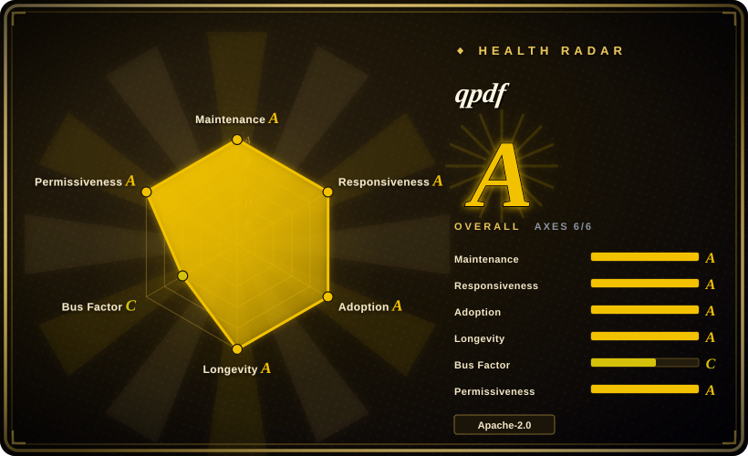
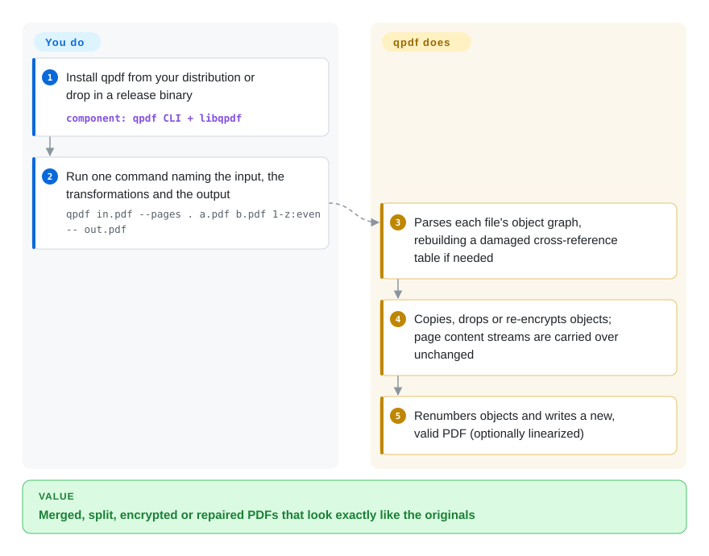

# qpdf

You need to merge, split, reorder, encrypt or repair PDFs in a script, and most tools that "edit" a PDF quietly re-render it — fonts get substituted, images recompressed, form fields or signatures lost. qpdf rewrites the file's internal structure (pages, objects, encryption, layout) while copying the page content itself byte for byte, so what you see does not change.

## When to use

You maintain a back-end job that assembles customer statements: a cover page from one system, a contract from another, appendices from a third, all PDFs. Your first attempt went through a "print to PDF" path and the output came back three times larger, with blurry images and a broken form field. Another day, a vendor sends a file that half your readers refuse to open — `Error: xref table damaged`. What you want is a command-line tool you can call from any language that will concatenate, pick page ranges, decrypt or encrypt, linearize for fast web viewing, and fix broken cross-reference tables, without touching how pages look.

qpdf is that tool: `qpdf in.pdf --pages . a.pdf b.pdf 1-z:even -- out.pdf` appends pages at the object level instead of re-rendering them. Pick it over Ghostscript-style pipelines when visual fidelity and file size must stay put; over PDFtk because qpdf is actively maintained, permissively licensed, also a C++ library, and has much deeper structural options (JSON dump/update, QDF inspection mode, repair). If you work in Python, you usually reach it through pikepdf, its official-recommended binding.

## How it works

A PDF is internally a graph of numbered objects (pages, fonts, images, content streams — the drawing instructions for a page) plus a cross-reference table that says where each object sits in the file. qpdf parses that graph — reconstructing the cross-reference table when it is damaged — applies the transformations you ask for at the object level (copy these pages, drop those, add or remove encryption, regroup objects), and writes a new, valid file. It does not render pages or extract text, and it does not edit what is drawn on a page; the content streams are carried over unchanged unless you explicitly ask to normalize or recompress them. You decide the operations with command-line flags (or the C++/C API, or a QPDFJob JSON spec); qpdf takes care of renumbering objects, rewriting references and producing a consistent file. Like a bookbinder, it can re-collate, re-cover and lock the book, but never redraws a page.

<!-- flow-steps:begin (generated from flows/qpdf.json by tools/flow_card.py — do not edit) -->

Text version of the flow

1. **You**: Install qpdf from your distribution or drop in a release binary — component: `qpdf CLI + libqpdf`
2. **You**: Run one command naming the input, the transformations and the output — `qpdf in.pdf --pages . a.pdf b.pdf 1-z:even -- out.pdf`
3. **qpdf**: Parses each file's object graph, rebuilding a damaged cross-reference table if needed
4. **qpdf**: Copies, drops or re-encrypts objects; page content streams are carried over unchanged
5. **qpdf**: Renumbers objects and writes a new, valid PDF (optionally linearized)

**Value**: Merged, split, encrypted or repaired PDFs that look exactly like the originals

<!-- flow-steps:end -->

## When NOT to use

- **You need to render pages or extract text.** qpdf does neither by design. Use [PyMuPDF](../pdf-reading/pymupdf.md) or [PDF.js](../pdf-reading/pdfjs.md) to render, [pdfplumber](../pdf-reading/pdfplumber.md) to extract text and tables.
- **You need to draw new content (text, stamps, charts) or fill forms from code.** qpdf only supports creating content "if you supply all the content yourself". Use [pdf-lib](../pdf-generation/pdf-lib.md) in JavaScript, or [PyMuPDF](../pdf-reading/pymupdf.md) in Python, which have high-level drawing APIs.
- **You want Pythonic objects instead of shelling out.** Use pikepdf (not indexed), the Python binding the qpdf manual recommends — same engine, native objects.
- **Scanned PDFs that need to become searchable.** qpdf does no OCR. Use [OCRmyPDF](ocrmypdf.md), which uses pikepdf/qpdf internally for the PDF plumbing.
- **Digital signatures.** qpdf can preserve existing structure but does not create or validate signatures. Use [pyHanko](pyhanko.md) (Python, PAdES/LTV) or [SAPP](sapp.md) (PHP).
- **Compression of image-heavy files.** qpdf can recompress streams and pack objects, but it does not downsample images; for aggressive size reduction use Ghostscript (not indexed; AGPL) — accepting the re-render tradeoff.

## Comparison

| Alternative | In index | Our verdict | Tradeoff |
|---|---|---|---|
| pikepdf | not indexed | In a Python codebase, use pikepdf for page manipulation and metadata; use the qpdf CLI from shell scripts or non-Python languages. | pikepdf is the same qpdf engine with Python objects and MPL-2.0 licensing; the CLI needs no Python but you script it with flags and subprocesses. |
| PDFtk | not indexed | Pick qpdf for new automation that needs merge/split/encrypt; keep PDFtk only for existing scripts that already depend on its command syntax. | PDFtk Server has familiar `cat`/`burst` verbs and form-fill shortcuts; qpdf is more actively maintained, Apache-2.0 rather than GPL, and exposes far more structural control. |
| pdfcpu | not indexed | Choose pdfcpu when you want a pure-Go library or single static binary in a Go service; choose qpdf for the widest repair/linearization coverage and C/C++ embedding. | pdfcpu avoids C/C++ dependencies and adds stamping/watermark commands; qpdf has a longer track record on malformed files and a richer low-level object model. |
| [PyMuPDF](../pdf-reading/pymupdf.md) | ✅ | Use PyMuPDF when one Python library must render, extract text and edit pages together; use qpdf when you only restructure files and want no rendering engine in the dependency tree. | PyMuPDF bundles MuPDF's renderer and high-level editing but is AGPL or commercial; qpdf is narrower, Apache-2.0, and never re-renders content. |
| [pdf-lib](../pdf-generation/pdf-lib.md) | ✅ | In browser or Node code that must add content or fill forms, pick pdf-lib; for server-side batch merging, encryption and repair of untrusted files, pick qpdf. | pdf-lib runs in JavaScript with no native binary and can draw; qpdf needs a native install but handles encryption, linearization and damaged files that pdf-lib does not attempt. |

## Tech stack

- **Language:** C++ (C++20 to build, C++17 to link), with a C API (`qpdf/qpdf-c.h`) for other languages; v12.4.2 as of 2026-09-26.
- **Build:** CMake; `pkg-config` package `libqpdf`, CMake package `qpdf`.
- **Interfaces:** `qpdf` CLI, `libqpdf` C++ library, QPDFJob (drive the CLI's operations from JSON or code), JSON export/import of a whole file (`--json`, `--json-input`, `--update-from-json`), and `fix-qdf` / `zlib-flate` helper tools.
- **Crypto:** selectable providers — `gnutls`, `openssl`, or `native` (no external dependency).
- **Bindings (third-party):** pikepdf (Python).

## Dependencies

- **Required libraries:** zlib and libjpeg (or libjpeg-turbo) — present on every Linux distribution.
- **Optional:** GnuTLS or OpenSSL as crypto provider; zopfli for slower but smaller flate compression (`QPDF_ZOPFLI`).
- **No services:** a single binary/library; no daemon, network access or database.
- **Distribution:** packaged in most Linux distributions; GitHub releases ship Windows, Linux (including AppImage and arm64) and, since 12.4.2, unsigned macOS binaries, signed with cosign.

## Ops difficulty

**Low.** Install from your distribution or drop in a release binary, then call it from scripts; there is nothing to run or monitor. Two things need care: pin the version in reproducible pipelines (12.4.2 changed linearization output for some files and rejected malformed numeric option values that earlier versions accepted), and treat untrusted input as untrusted — qpdf parses hostile files routinely and ships frequent hardening fixes, so keep it patched. The library is thread-safe only per object instance.

## Health & viability

- **Maintenance (2026-10-08): active.** Three releases in Aug–Sep 2026 (12.4.0 → 12.4.2), commits within the last two weeks, and new binary platforms in 12.4.2.
- **Governance: two-person core.** Jay Berkenbilt (original author since 2005) and Manfred Holger together account for ~94% of commits (top-1 ~74%), and both are listed release signers — better than a single maintainer, but still a small bus factor.
- **Age / Lindy: very strong.** The copyright line dates the project to 2005 and the GitHub repo to 2012; ~20 years and still releasing every few weeks.
- **Adoption: broad.** Shipped in most Linux distributions, ~2.2M release-asset downloads, and the engine under pikepdf and therefore OCRmyPDF.
- **Risk flags:** Apache-2.0 (relicensed from Artistic-2.0 at version 7; both permissive). No open-core split, no CLA found. Security exposure is inherent to parsing untrusted PDFs.

## Caveats (unverified)

- [未验证] Release-asset download counts and "most Linux distributions" packaging are taken from the health scorer and the manual's download page, not audited per distribution.
- [未验证] The comparative claims about PDFtk (maintenance level, GPL licensing) and pdfcpu (repair coverage) were not re-checked against their repositories in this pass.
- [推断] "Content streams are carried over unchanged" holds for default options; flags such as `--normalize-content`, `--recompress-flate` or `--qdf` deliberately rewrite stream data.
