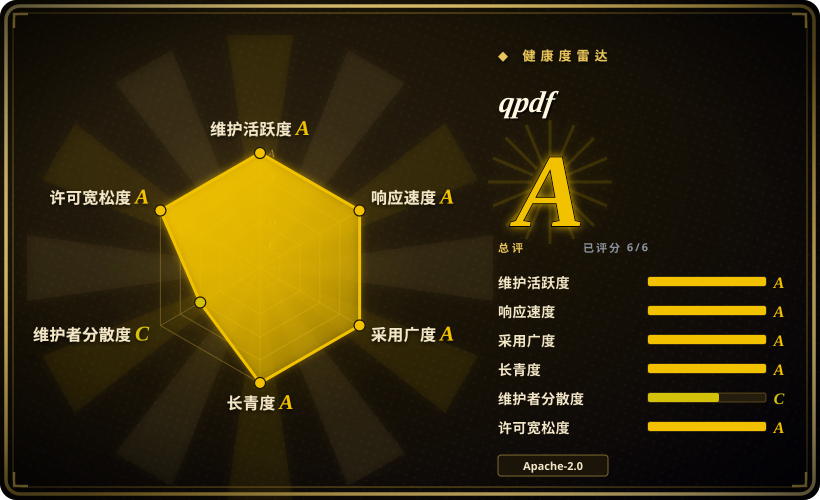
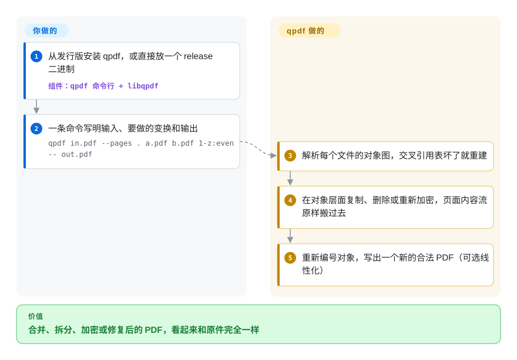

# qpdf

你要在脚本里合并、拆分、重排、加密或修复 PDF，可多数“编辑” PDF 的工具其实悄悄把文件重新渲染了一遍——字体被替换、图片被重新压缩、表单域或签名丢失。qpdf 只改文件的内部结构（页、对象、加密、排布），页面内容原样逐字节搬过去，所以看到的东西一点不变。

## 何时使用

你维护一个拼装客户对账单的后台任务：封面来自一个系统，合同来自另一个，附件来自第三个，全是 PDF。第一版走了“打印成 PDF”的路子，结果文件大了三倍、图片发糊、有个表单域坏了。又有一天，供应商发来一个一半阅读器都打不开的文件——`Error: xref table damaged`。你要的是一个任何语言都能调用的命令行工具：能拼接、按页码范围挑页、解密或加密、做网页快速打开用的线性化、修好损坏的交叉引用表，同时完全不碰页面长什么样。

qpdf 就是这个工具：`qpdf in.pdf --pages . a.pdf b.pdf 1-z:even -- out.pdf` 在对象层面追加页面，而不是重新渲染。视觉保真和文件大小必须保持不变时，选它而不是 Ghostscript 那类流水线；选它而不是 PDFtk，是因为 qpdf 仍在积极维护、许可证宽松、同时提供 C++ 库，结构层面的选项也深得多（JSON 导出与回写、QDF 检查模式、修复）。如果你写 Python，通常经由 qpdf 手册推荐的绑定 pikepdf 来用它。

## 怎么用起来

PDF 内部是一张由编号对象（页、字体、图片、内容流——也就是描述一页怎么画的绘图指令）组成的图，外加一张交叉引用表，记录每个对象在文件里的位置。qpdf 先解析这张图——交叉引用表损坏时会重建——然后在对象层面执行你要求的变换（复制这些页、删掉那些、加密或解密、重新组织对象），最后写出一个新的、合法的文件。它不渲染页面、不抽取文字，也不改页面上画的东西；除非你明确要求规范化或重新压缩，内容流都原样带过去。你用命令行参数（或 C++/C API、QPDFJob 的 JSON 描述）决定做哪些操作；对象重新编号、改写引用、产出自洽文件这些活由 qpdf 包办。它像个装订匠：能重新配页、换封面、上锁，但从不重画任何一页。

<!-- flow-steps:begin (generated from flows/qpdf.json by tools/flow_card.py — do not edit) -->

流程文字版

1. **你**：从发行版安装 qpdf，或直接放一个 release 二进制 — 组件：`qpdf 命令行 + libqpdf`
2. **你**：一条命令写明输入、要做的变换和输出 — `qpdf in.pdf --pages . a.pdf b.pdf 1-z:even -- out.pdf`
3. **qpdf**：解析每个文件的对象图，交叉引用表坏了就重建
4. **qpdf**：在对象层面复制、删除或重新加密，页面内容流原样搬过去
5. **qpdf**：重新编号对象，写出一个新的合法 PDF（可选线性化）

**价值**：合并、拆分、加密或修复后的 PDF，看起来和原件完全一样

<!-- flow-steps:end -->

## 何时不用

- **你需要渲染页面或抽取文字。** qpdf 按设计两样都不做。渲染用 [PyMuPDF](../pdf-reading/pymupdf.zh.md) 或 [PDF.js](../pdf-reading/pdfjs.zh.md)，抽文字和表格用 [pdfplumber](../pdf-reading/pdfplumber.zh.md)。
- **你要用代码画新内容（文字、印章、图表）或填表单。** qpdf 只支持“内容全由你自己提供”的创建方式。JavaScript 里用 [pdf-lib](../pdf-generation/pdf-lib.zh.md)，Python 里用 [PyMuPDF](../pdf-reading/pymupdf.zh.md)，它们有高层绘图 API。
- **你想要 Python 对象而不是调子进程。** 用 qpdf 手册推荐的 Python 绑定 pikepdf（未收录）——同一个引擎，原生对象。
- **扫描版 PDF 要变成可搜索。** qpdf 不做 OCR。用 [OCRmyPDF](ocrmypdf.zh.md)，它内部正是用 pikepdf/qpdf 处理 PDF 结构。
- **数字签名。** qpdf 能保住已有结构，但不创建也不验证签名。用 [pyHanko](pyhanko.zh.md)（Python，支持 PAdES/LTV）或 [SAPP](sapp.zh.md)（PHP）。
- **压缩图片很多的大文件。** qpdf 能重新压缩流、打包对象，但不降采样图片；要大幅缩小体积请用 Ghostscript（未收录，AGPL），并接受它会重新渲染的代价。

## 横向对比

| 替代品 | 是否收录 | 我们的评价 | 取舍 |
|---|---|---|---|
| pikepdf | 未收录 | 在 Python 代码库里操作页面和元数据，用 pikepdf；在 shell 脚本或非 Python 语言里，用 qpdf 命令行。 | pikepdf 是同一个 qpdf 引擎套上 Python 对象，许可证是 MPL-2.0；命令行不需要 Python，但你得靠参数和子进程来写脚本。 |
| PDFtk | 未收录 | 新写的合并、拆分、加密自动化选 qpdf；只有已经依赖 PDFtk 命令语法的老脚本才继续用 PDFtk。 | PDFtk Server 有顺手的 `cat`/`burst` 动词和填表快捷方式；qpdf 维护更活跃，是 Apache-2.0 而非 GPL，结构控制也多得多。 |
| pdfcpu | 未收录 | Go 服务里想要纯 Go 库或单个静态二进制，选 pdfcpu；要最广的修复与线性化覆盖、或嵌进 C/C++，选 qpdf。 | pdfcpu 不依赖 C/C++，还带盖章、水印命令；qpdf 处理畸形文件的履历更长，底层对象模型更丰富。 |
| [PyMuPDF](../pdf-reading/pymupdf.zh.md) | ✅ | 一个 Python 库要同时渲染、抽文字、编辑页面时用 PyMuPDF；只重组文件、不想在依赖里引入渲染引擎时用 qpdf。 | PyMuPDF 自带 MuPDF 渲染器和高层编辑能力，但许可证是 AGPL 或商业授权；qpdf 更窄，Apache-2.0，从不重新渲染内容。 |
| [pdf-lib](../pdf-generation/pdf-lib.zh.md) | ✅ | 浏览器或 Node 代码里要加内容、填表单，选 pdf-lib；服务端批量合并、加密、修复不可信文件，选 qpdf。 | pdf-lib 纯 JavaScript、不需要原生二进制，还能绘图；qpdf 需要原生安装，但能处理加密、线性化和损坏文件，这些 pdf-lib 都不涉及。 |

## 技术栈

- **语言：** C++（构建要 C++20，链接只需 C++17），另有 C API（`qpdf/qpdf-c.h`）供其他语言调用；截至 2026-09-26 为 v12.4.2。
- **构建：** CMake；`pkg-config` 包名 `libqpdf`，CMake 包名 `qpdf`。
- **接口：** `qpdf` 命令行、`libqpdf` C++ 库、QPDFJob（用 JSON 或代码驱动命令行能做的操作）、整文件 JSON 导出与导入（`--json`、`--json-input`、`--update-from-json`），以及 `fix-qdf` / `zlib-flate` 辅助工具。
- **加密实现：** 可选 `gnutls`、`openssl`，或无外部依赖的 `native`。
- **绑定（第三方）：** pikepdf（Python）。

## 依赖

- **必需的库：** zlib 和 libjpeg（或 libjpeg-turbo）——每个 Linux 发行版都有。
- **可选：** GnuTLS 或 OpenSSL 作为加密实现；zopfli 用于更慢但更小的 flate 压缩（`QPDF_ZOPFLI`）。
- **不依赖服务：** 单个二进制或库；没有守护进程、网络访问或数据库。
- **分发：** 多数 Linux 发行版自带；GitHub release 提供 Windows、Linux（含 AppImage 和 arm64），12.4.2 起还有未签 Apple 开发者证书的 macOS 二进制，发布物用 cosign 签名。

## 运维难度

**低。** 从发行版安装或直接放一个 release 二进制，然后在脚本里调用；没有需要运行或监控的东西。两件事要注意：可复现流水线里要锁版本（12.4.2 改变了部分文件的线性化输出，并开始拒绝旧版会默默接受的畸形数值参数）；把输入当作不可信——qpdf 日常就在解析恶意文件，加固修复发得很勤，所以要及时打补丁。库只在“每个对象实例单线程使用”的前提下线程安全。

## 健康度与可持续性

- **维护（2026-10-08）：活跃。** 2026 年 8–9 月连发三个版本（12.4.0 → 12.4.2），近两周内有提交，12.4.2 还新增了多个二进制平台。
- **治理：两人核心。** Jay Berkenbilt（2005 年起的原作者）和 Manfred Holger 合计约 94% 的提交（第一贡献者约 74%），两人都是登记的发布签名人——比单人维护好，但 bus factor 仍然小。
- **年龄 / Lindy：非常强。** 版权行把项目追溯到 2005 年，GitHub 仓库建于 2012 年；约 20 年仍每隔几周发版。
- **采用：广。** 多数 Linux 发行版自带，release 资产下载约 220 万次，并且是 pikepdf、进而是 OCRmyPDF 的底层引擎。
- **风险信号：** Apache-2.0（第 7 版起由 Artistic-2.0 改来，两者都宽松）。没有开源核心拆分，未发现 CLA。解析不可信 PDF 本身就带安全暴露面。

## 存疑（未验证）

- [未验证] release 资产下载量和“多数 Linux 发行版自带”来自健康度评分器和手册下载页，未逐个发行版核对。
- [未验证] 关于 PDFtk（维护程度、GPL 许可）和 pdfcpu（修复覆盖面）的对比说法，本次未回到它们的仓库复核。
- [推断] “内容流原样带过去”只在默认选项下成立；`--normalize-content`、`--recompress-flate`、`--qdf` 等参数会有意改写流数据。
