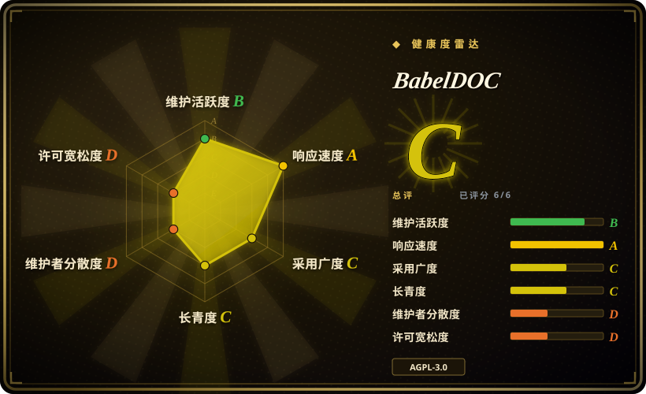
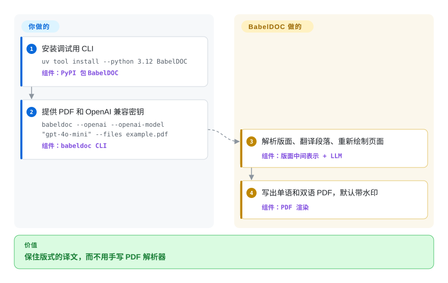

# BabelDOC

你要的是沉浸式翻译和 PDFMathTranslate 底下那层「保留排版的 PDF 翻译引擎」，不是再装一个面向用户的软件。BabelDOC 拆开 PDF、把段落交给 OpenAI 兼容模型、再画出译文和对照页；作者明确说 Python API 是内部接口，不要直接调。

## 何时使用

你要把保留排版的科研 PDF 翻译嵌进另一个程序，或在调试 [PDFMathTranslate](pdfmathtranslate.zh.md) 2.0 所包的那颗内核。文档里的安装是 `uv tool install --python 3.12 BabelDOC`，然后 `babeldoc --openai --openai-model "gpt-4o-mini" … --files example.pdf`。这条 CLI 存在；README 同时写着它只供调试、终端用户该用沉浸式翻译托管的 BabelDOC 或 PDFMathTranslate 2.0，以及**所有 BabelDOC 的 Python API 都算内部接口**。

你选它而不是 PDFMathTranslate 1.x，是因为你要当前 0.6 内核：1.x 自己的 `pyproject.toml` 钉着 `babeldoc>=0.1.22,<0.3.0`，所以 `pip install pdf2zh` 看不到本仓库的 v0.6.4。你要 Google/DeepL/Ollama、Gradio 界面、Docker、Zotero 或 MCP 时，改选 PDFMathTranslate——本库只接 OpenAI 兼容 LLM，测试也主要是英译中。

## 快问快答

**问：我该在应用里 `import babeldoc` 吗？**
不该。README 原文：“All APIs of BabelDOC should be considered as internal APIs, and any direct use of BabelDOC is not supported.”推荐的 Python 调用是 [PDFMathTranslate-next](pdfmathtranslate-next.zh.md) 上的 `high_level.do_translate_async_stream`，不是这个包。

**问：它和 PDFMathTranslate 是什么关系？**
这是引擎。PDFMathTranslate 1.x 是面向用户的成品，依赖的仍是*旧*的 BabelDOC 主版本（`<0.3.0`）。PDFMathTranslate-next 是 BabelDOC 点名用来自托管的 2.0 fork。沉浸式翻译把这台引擎做成 SaaS。

## 怎么用起来

你提供一份 PDF、一个 OpenAI 兼容接口，以及语言代码（默认 `en` → `zh`）。BabelDOC 把文件解析成中间版面表示——文本块、图、表——用 LLM 翻译段落（可选 glossary CSV），再渲染出单语 PDF 和双语 PDF。像公式的片段按字体/字符模式跳过；表内文字默认不译，除非加上 `--translate-table-text`。字体和 ONNX 版面模型第一次从 HuggingFace 下载，也可以用 `--generate-offline-assets` 预先打包。密钥、QPS 上限（`--qps`，默认 4）以及要不要理会「别直接调我们」的警告，是你的事；解析、翻译、重绘是它的事。

<!-- flow-steps:begin (generated from flows/babeldoc.json by tools/flow_card.py — do not edit) -->

流程文字版

1. **你**：安装调试用 CLI — `uv tool install --python 3.12 BabelDOC` — 组件：`PyPI 包 BabelDOC`
2. **你**：提供 PDF 和 OpenAI 兼容密钥 — `babeldoc --openai --openai-model "gpt-4o-mini" --files example.pdf` — 组件：`babeldoc CLI`
3. **BabelDOC**：解析版面、翻译段落、重新绘制页面 — 组件：`版面中间表示 + LLM`
4. **BabelDOC**：写出单语和双语 PDF，默认带水印 — 组件：`PDF 渲染`

**价值**：保住版式的译文，而不用手写 PDF 解析器

<!-- flow-steps:end -->

## 何时不用

- **你只是想在自己电脑上译一篇论文。** 改用 [PDFMathTranslate](pdfmathtranslate.zh.md)——有 CLI、GUI、Docker、多种翻译器，而且上游真正支持终端用户。
- **翻译后端必须是 Google、DeepL、Bing 或 Ollama。** BabelDOC 的 CLI 只暴露 `--openai`。PDFMathTranslate 的 `-s` 表覆盖那些；本引擎让你去 [PDFMathTranslate-next](pdfmathtranslate-next.zh.md) 找更多服务。
- **你不能接受 AGPL-3.0，或不能接受 API 不稳定。** 嵌进联网产品会带上 copyleft；README 把 API 冻成内部接口。非 PDF 文件用宽松许可的段落工具如 [Bilingual Book Maker](../../reading-tools/bilingual-book-maker.zh.md)，或买商业 PDF 翻译（非仓库）。
- **任务是 EPUB/txt 书，不是必须保住版式的 PDF。** 用 Bilingual Book Maker。
- **你要给 RAG 用的 Markdown/JSON。** 用 [Docling](../../document-parsing/docling.zh.md)——BabelDOC 重绘 PDF，不把文档拉直。
- **语言对不是英译中（或基本的英文输出）。** 上游原文：本项目主要关注英译中，其它场景尚未测试。已知问题还会跳过大页面、首字下沉和线条，并把作者/参考文献段并成一段。

## 横向对比

| 替代品 | 是否收录 | 我们的评价 | 取舍 |
|---|---|---|---|
| [PDFMathTranslate](pdfmathtranslate.zh.md) | 已收录 | 你是终端用户，或需要多种翻译后端时，选 PDFMathTranslate；只有调试或嵌入当前 0.6 引擎时才选 BabelDOC，并接受它的 Python API 不受支持。 | PDFMathTranslate 1.x 是成品，但钉死 `babeldoc<0.3.0`；本仓库是 v0.6.4，只接 OpenAI，维护者主导。 |
| [PDFMathTranslate-next](pdfmathtranslate-next.zh.md) | 已收录 | 要在当前 BabelDOC 上自托管 2.0（带 WebUI、更多翻译器）时选那个包装；本页只当引擎。 | 官方 BabelDOC 调用方（`babeldoc>=0.6.2,<0.7.0`）；最后推送 2026-05，默认硅基流动免费通道。 |
| [Bilingual Book Maker](../../reading-tools/bilingual-book-maker.zh.md) | 已收录 | 文件是一本将以 EPUB/txt 阅读的书，选 Bilingual Book Maker；产物必须仍是排好版的 PDF 时选 BabelDOC。 | BBM 是 MIT、无视版式；BabelDOC 是 AGPL、ONNX 很重、PDF 原生。 |
| 沉浸式翻译托管服务 | 非仓库 | 想用这台引擎、却不想自己运 ONNX、字体和 API key，走托管额度；PDF 不能离开本机时选本仓库。 | 托管 SaaS，地址 `app.immersivetranslate.com/babel-doc/`——funstory-ai 的商业前门，不是仓库。 |

## 技术栈

- **Python** 包 `BabelDOC`（Hatchling）；CLI 入口 `babeldoc = babeldoc.main:cli`；要求 `>=3.10,<3.14`
- **PDF 读写：** PyMuPDF、内嵌 pdfminer、接近 pikepdf 的清理
- **版面 / 视觉：** ONNX Runtime、OpenCV headless、scikit-image、DocLayout 风格检测（HuggingFace 资源）
- **翻译：** 只走 `openai` Python SDK（任意 OpenAI 兼容 base URL）；可选 glossary CSV
- **较重的原生依赖：** hyperscan、uharfbuzz、scipy、scikit-learn、freetype-py
- **组织：** funstory-ai（沉浸式翻译）

## 依赖

- **Python 3.10–3.13** 以及能跑的 ONNX Runtime（默认 CPU；extra 有 `cuda` / `directml`）
- **HuggingFace Hub** 拉字体和版面模型，除非你还原 offline-assets zip
- **一个 OpenAI 兼容的 API key**——这条 CLI 没有 Google/DeepL 路径
- **磁盘上的 `~/.cache/babeldoc/`** 工作文件；`--debug` 会把中间结果倒在那里

## 运维难度

**中高。** CLI 是一条命令，但运行时是一套 ML 栈（ONNX、OpenCV、scipy、hyperscan）外加强制的 LLM 接口。首次运行下载带哈希的字体和模型；断网安装要先在有网的机器上 `--generate-offline-assets`。默认输出带水印。QPS 默认 4。嵌入它等于接受 AGPL 第 13 条（网络 copyleft），以及作者称为内部的 API。真正要运维的东西，更低成本的入口是 PDFMathTranslate 或沉浸式翻译的托管服务。

## 健康度与可持续性

- **维护：** 2024-11-13 建仓；最新发行 v0.6.4 在 2026-07-16（版面像素预算 + CJK 行距）。最后一次推送 2026-08-05（“update pdf2zh-next url”）——写本页前大约七周，比 PDFMathTranslate 1.x 安静。89 个未关 issue+PR。明确的维护者主导模式：改解析/渲染/翻译行为要先开 issue。
- **治理 / 巴士因子：** 组织持有（funstory-ai）。GitHub 贡献者：awwaawwa 1701，随后骤降（pppppop65 30、lalawuu 23）。商业厂商（沉浸式翻译）做后盾，比业余单人强——也意味着他们真正在意的产品是托管 SaaS。
- **背书与寿命（林迪）：** 大约 22 个月，2026 年仍在发版——林迪偏弱，「仍在活跃」成立。README 上有招聘。Pride+semver（`0.MAJOR.MINOR`）；兼容性以 pdf2zh_next 为准。
- **采用：** 9.6k star、803 fork、PyPI `BabelDOC` 0.6.4（截至 2026-09-27）。下游：PDFMathTranslate 1.x（旧钉死）、PDFMathTranslate-next、沉浸式翻译托管、README 点名的两个 Zotero 插件。
- **风险旗：** AGPL-3.0。Python API 声明不受支持。CLI「不提供技术支持」。默认水印。英译中优先。表格翻译仍是实验。

## 存疑（未验证）

- [未验证] 翻译质量、版面错误率和 1.0 路线图目标（「版面错误小于 1%」）未复现；它们是 README/路线图主张。
- [未验证] 已知问题（作者/参考文献段被合并、不支持线条、不支持首字下沉、跳过大页面）来自 README 列表；未在样例 PDF 上复核。
- [未验证] PDFMathTranslate-next 是否真的调用这棵 0.6.4 树（而不是子模块快照），未在源码里追踪。
- [未验证] offline-assets zip 的体积、以及是否覆盖全部字体/模型，此处未生成。
- [推断] 沉浸式翻译的托管额度和这个开源仓库在功能上可能分叉；SaaS 不是一个 git tag。
