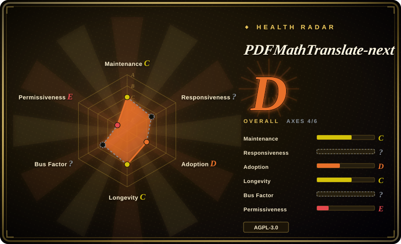
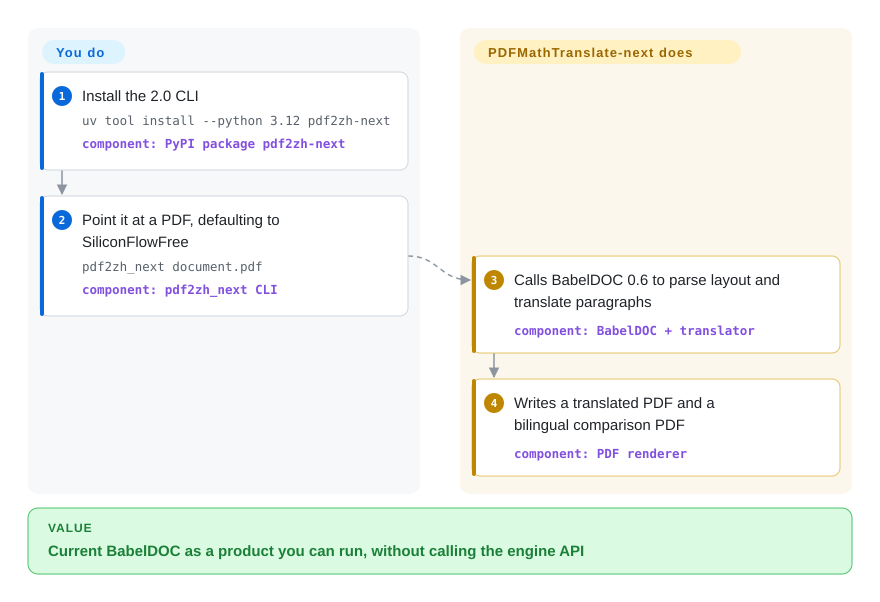

# PDFMathTranslate-next

You want the current BabelDOC kernel as something you can actually run — CLI, WebUI, Docker — not the debug CLI the engine authors refuse to support. PDFMathTranslate-next is that wrapper: official reference implementation for calling BabelDOC, defaulting to SiliconFlow's free GLM rather than Google.

## When to use

You already decided layout-preserving PDF translation is the job, and you need BabelDOC 0.6 (the pin in this repo is `babeldoc>=0.6.2,<0.7.0`) plus more translators than BabelDOC's OpenAI-only CLI. You install `pdf2zh-next` (`uv tool install --python 3.12 pdf2zh-next`) and run `pdf2zh_next document.pdf`. Default engine in source is SiliconFlowFree — text goes to the maintainer's server, then SiliconFlow, currently `THUDM/GLM-4-9B-0414`. Or you pass `--openai` / `--siliconflow` / `--ollama` / `--deepl` and your own key. WebUI is `pdf2zh_next --gui`. Windows EXE and Docker (`awwaawwa/pdfmathtranslate-next`) are the documented first choices for those platforms.

You pick it over [PDFMathTranslate](pdfmathtranslate.md) 1.x when the 0.6 kernel, glossary extraction, and the supported-engine list (SiliconFlowFree first; Google/Bing deprecated) matter more than 1.x still landing commits in 2026. You pick it over [BabelDOC](babeldoc.md) when you are an end user or you need the documented `do_translate_async_stream` Python API — BabelDOC's own README points here.

## Q&A

**Q: Whose model does the translation?**
Not this project's. Default is SiliconFlowFree: GLM-4-9B-0414 on SiliconFlow, proxied through maintainer `@awwaawwa`. Layout still uses BabelDOC's HuggingFace ONNX assets. Bring your own OpenAI/DeepSeek/Ollama/DeepL if you do not want that proxy. 1.x instead defaults to Google and has no SiliconFlowFree path.

**Q: Is 1.x dead?**
No. This 2.0 repo's last GitHub push is 2026-05-15; 1.x was still pushing on 2026-09-27. Pick 2.0 for the kernel, 1.x for a tree that is still moving.

## How it works

You give it a PDF and a translator flag (or accept SiliconFlowFree). It calls BabelDOC to parse layout, skip formulas/figures, send paragraphs to the chosen engine, and write mono plus dual PDFs. Your side of the line is install, the file, and credentials (or consent to the free proxy). Its side is BabelDOC plus the translator adapters. The Python hook BabelDOC recommends is here: `from pdf2zh_next.high_level import do_translate_async_stream`.

<!-- flow-steps:begin (generated from flows/pdfmathtranslate-next.json by tools/flow_card.py — do not edit) -->

Text version of the flow

1. **You**: Install the 2.0 CLI — `uv tool install --python 3.12 pdf2zh-next` — component: `PyPI package pdf2zh-next`
2. **You**: Point it at a PDF, defaulting to SiliconFlowFree — `pdf2zh_next document.pdf` — component: `pdf2zh_next CLI`
3. **PDFMathTranslate-next**: Calls BabelDOC 0.6 to parse layout and translate paragraphs — component: `BabelDOC + translator`
4. **PDFMathTranslate-next**: Writes a translated PDF and a bilingual comparison PDF — component: `PDF renderer`

**Value**: Current BabelDOC as a product you can run, without calling the engine API

<!-- flow-steps:end -->

## When NOT to use

- **You want a tree that still ships in 2026 Q3.** Last push 2026-05-15, latest tag v2.9.0 the same day. Use [PDFMathTranslate](pdfmathtranslate.md) 1.x instead if recency of commits is the constraint — knowing 1.x pins BabelDOC `<0.3.0`.
- **You cannot send PDF text through the maintainer's server.** SiliconFlowFree does exactly that. Use `--openai` / `--ollama` / `--deepl` on this tool, or 1.x's default Google path, or [BabelDOC](babeldoc.md) with your own OpenAI-compatible key.
- **You need Google or Bing as the translator.** Both are deprecated in 2.0. Stay on 1.x, where Google is still the default.
- **You cannot accept AGPL-3.0, or you need usage support.** README: as-is, no usage assistance, off-template issues closed. Same copyleft as BabelDOC.
- **The file is an EPUB/txt book, not a layout-sensitive PDF.** Use [Bilingual Book Maker](../../reading-tools/bilingual-book-maker.md).

## Comparison

| Alternative | In index | Our verdict | Tradeoff |
|---|---|---|---|
| [PDFMathTranslate](pdfmathtranslate.md) | ✅ | When you need BabelDOC 0.6 and SiliconFlowFree/OpenAI-class engines, pick this 2.0 wrapper; pick 1.x when you want Google-by-default and a repo still pushed in 2026-09. | 2.0 wraps current BabelDOC and deprecates Google/Bing; 1.x is older kernel, more recently committed. |
| [BabelDOC](babeldoc.md) | ✅ | When you are an end user or need a supported Python stream API, pick this; pick BabelDOC only to debug the engine, because its authors declare the API internal. | This is the official BabelDOC caller (`babeldoc>=0.6.2,<0.7.0`); BabelDOC is OpenAI-only at the CLI. |
| [Bilingual Book Maker](../../reading-tools/bilingual-book-maker.md) | ✅ | When the artifact must remain a laid-out PDF, pick this; pick Bilingual Book Maker for EPUB/txt bilingual books. | MIT and layout-blind versus AGPL and PDF-native. |
| Immersive Translate hosted PDF translator | 非仓库 | When you want BabelDOC quality without operating ONNX or a proxy, use the hosted quota; pick this repo when the PDF must stay local or you must choose the engine. | Hosted SaaS at `app.immersivetranslate.com/babel-doc/` — not a repository. |

## Tech stack

- **Python** package `pdf2zh-next` (Hatchling); CLI entries `pdf2zh_next` / `pdf2zh2` / `pdf2zh`
- **Engine:** BabelDOC `>=0.6.2,<0.7.0`
- **UI:** Gradio (`gradio<5.36`), FastAPI/Uvicorn
- **Default translator:** SiliconFlowFree (GLM-4-9B-0414 via maintainer proxy)
- **Other adapters:** OpenAI, AliyunDashScope, DeepSeek, SiliconFlow, Zhipu, OpenAICompatible (Tier 1); Ollama, DeepL, Gemini, and more as community (Tier 2); Google and Bing deprecated

## Dependencies

- **Python 3.10–3.13** (`requires-python >=3.10,<3.14`); uv docs still say 3.10–3.12
- **BabelDOC assets** from HuggingFace on first run (same layout/font download as the engine)
- **A translator:** none extra for SiliconFlowFree (traffic leaves your machine); API keys or a local Ollama for the others

## Ops difficulty

**Medium.** One CLI command, but first run pulls BabelDOC models, and the zero-config path ships PDF text to `@awwaawwa` then SiliconFlow. Docker and Windows EXE hide the Python pin. Maintainers say they will not help with usage. Serving `--gui` on 7860 is the same Gradio surface as 1.x.

## Health & viability

- **Maintenance:** Created 2025-06-04; last GitHub push 2026-05-15 (`v2.9.0`, Windows zip bundles BabelDOC v0.6.2). About four months quiet as of 2026-09-27. README warns maintainers do not use the project regularly.
- **Governance / bus factor:** Org `PDFMathTranslate-next`; author/maintainer awwaawwa (funstory.ai). Contributors: awwaawwa 705, Byaidu 429, hellofinch 186, pppppop65 135. Same people as 1.x/BabelDOC, different repo.
- **Backing & longevity (Lindy):** ~15 months old, last release May 2026 — weak Lindy and the still-active test is currently failing. SiliconFlow sponsors the free LLM path; Immersive Translate sponsors contributor codes.
- **Adoption:** 3.0k stars, PyPI `pdf2zh-next` 2.9.0, Docker `awwaawwa/pdfmathtranslate-next` (as of 2026-09-27). Named by BabelDOC as the self-host product.
- **Risk flags:** AGPL-3.0. Default path is a third-party proxy. Google/Bing removed. No usage support. Quiet since May 2026.

## Caveats (unverified)

- [未验证] Translation quality versus 1.x was not A/B tested here.
- [未验证] Whether SiliconFlowFree still serves `THUDM/GLM-4-9B-0414` today was not probed; that name is from the project's SiliconFlow doc.
- [未验证] `pip install pdf2zh-next` resolving BabelDOC 0.6.4 (upper bound `<0.7.0`) versus the Windows zip's 0.6.2 was not installed here.
- [推断] Four months without a push while 1.x keeps moving means 2.0 may stay the kernel wrapper and 1.x the living product, unless a new 2.x tag appears.
