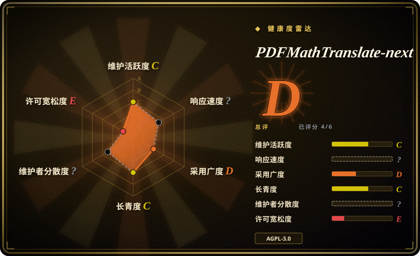
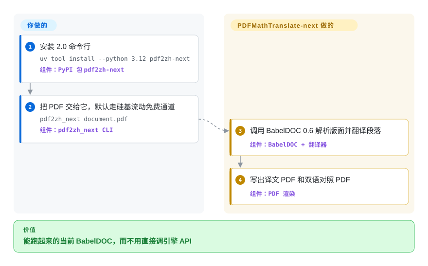

# PDFMathTranslate-next

你要的是能真正跑起来的当前 BabelDOC 内核——CLI、网页界面、Docker——不是引擎作者拒绝支持的调试命令。PDFMathTranslate-next 就是这层包装：官方参考实现，默认走硅基流动的免费 GLM，而不是 Google。

## 何时使用

你已经认定任务是保留排版的 PDF 翻译，并且需要 BabelDOC 0.6（本仓库钉死 `babeldoc>=0.6.2,<0.7.0`），翻译后端还要比 BabelDOC 那条只接 OpenAI 的 CLI 更多。你安装 `pdf2zh-next`（`uv tool install --python 3.12 pdf2zh-next`），跑 `pdf2zh_next document.pdf`。源码里的默认引擎是 SiliconFlowFree——正文先到维护者服务器，再转发硅基流动，当前模型是 `THUDM/GLM-4-9B-0414`。也可以 `--openai` / `--siliconflow` / `--ollama` / `--deepl` 加自己的密钥。网页界面是 `pdf2zh_next --gui`。Windows EXE 和 Docker（`awwaawwa/pdfmathtranslate-next`）是文档给这两个平台的首选。

你选它而不是 [PDFMathTranslate](pdfmathtranslate.zh.md) 1.x，是因为 0.6 内核、术语抽取、以及受支持引擎表（SiliconFlowFree 排第一；Google/Bing 已弃用）比 1.x 仍在 2026 年提交更重要。你选它而不是 [BabelDOC](babeldoc.zh.md)，是因为你是终端用户，或需要文档里的 `do_translate_async_stream` Python API——BabelDOC 自己的 README 把人指到这里。

## 快问快答

**问：翻译用的是谁的模型？**
不是本项目自己的。默认 SiliconFlowFree：硅基流动上的 GLM-4-9B-0414，经维护者 `@awwaawwa` 转发。版面仍用 BabelDOC 从 HuggingFace 拉的 ONNX 资源。不想走这条代理就自己带 OpenAI/DeepSeek/Ollama/DeepL。1.x 默认是 Google，没有 SiliconFlowFree。

**问：1.x 死了吗？**
没有。这个 2.0 仓库最后一次 GitHub 推送是 2026-05-15；1.x 在 2026-09-27 还在推。要内核选 2.0，要仍在动的树选 1.x。

## 怎么用起来

你交给它一份 PDF 和一个翻译器开关（或不传，接受 SiliconFlowFree）。它调用 BabelDOC 解析版面、跳过公式和图、把段落送给选定引擎，再写出单语和双语 PDF。你负责安装、文件和凭据（或同意免费代理）；它负责 BabelDOC 和翻译适配。BabelDOC 推荐的 Python 入口在这里：`from pdf2zh_next.high_level import do_translate_async_stream`。

<!-- flow-steps:begin (generated from flows/pdfmathtranslate-next.json by tools/flow_card.py — do not edit) -->

流程文字版

1. **你**：安装 2.0 命令行 — `uv tool install --python 3.12 pdf2zh-next` — 组件：`PyPI 包 pdf2zh-next`
2. **你**：把 PDF 交给它，默认走硅基流动免费通道 — `pdf2zh_next document.pdf` — 组件：`pdf2zh_next CLI`
3. **PDFMathTranslate-next**：调用 BabelDOC 0.6 解析版面并翻译段落 — 组件：`BabelDOC + 翻译器`
4. **PDFMathTranslate-next**：写出译文 PDF 和双语对照 PDF — 组件：`PDF 渲染`

**价值**：能跑起来的当前 BabelDOC，而不用直接调引擎 API

<!-- flow-steps:end -->

## 何时不用

- **你要一棵 2026 年第三季度仍在发货的树。** 最后一次推送 2026-05-15，最新标签 v2.9.0 同一天。提交新鲜度是硬约束时改用 [PDFMathTranslate](pdfmathtranslate.zh.md) 1.x——并接受 1.x 钉死 BabelDOC `<0.3.0`。
- **你不能把 PDF 正文送到维护者服务器。** SiliconFlowFree 就是这样做的。在本工具上用 `--openai` / `--ollama` / `--deepl`，或走 1.x 默认的 Google，或用 [BabelDOC](babeldoc.zh.md) 加你自己的 OpenAI 兼容密钥。
- **翻译后端必须是 Google 或 Bing。** 2.0 里两者都已弃用。留在 1.x，Google 仍是默认。
- **你不能接受 AGPL-3.0，或需要使用支持。** README：按原样提供、不提供使用帮助、不合模板的 issue 直接关。copyleft 与 BabelDOC 相同。
- **文件是 EPUB/txt 书，不是对版式敏感的 PDF。** 用 [Bilingual Book Maker](../../reading-tools/bilingual-book-maker.zh.md)。

## 横向对比

| 替代品 | 是否收录 | 我们的评价 | 取舍 |
|---|---|---|---|
| [PDFMathTranslate](pdfmathtranslate.zh.md) | 已收录 | 需要 BabelDOC 0.6 以及 SiliconFlowFree/OpenAI 这类引擎时选这个 2.0 包装；要默认 Google、且仓库在 2026-09 仍在推时选 1.x。 | 2.0 包当前 BabelDOC，并弃用 Google/Bing；1.x 内核更旧，提交更新。 |
| [BabelDOC](babeldoc.zh.md) | 已收录 | 你是终端用户，或需要受支持的 Python 流式 API 时选本页；只有调试引擎时才选 BabelDOC，因为它的作者把 API 标成内部。 | 本页是官方 BabelDOC 调用方（`babeldoc>=0.6.2,<0.7.0`）；BabelDOC 的 CLI 只接 OpenAI。 |
| [Bilingual Book Maker](../../reading-tools/bilingual-book-maker.zh.md) | 已收录 | 产物必须仍是排好版的 PDF 时选本页；双语 EPUB/txt 书选 Bilingual Book Maker。 | MIT、无视版式，对上 AGPL、PDF 原生。 |
| 沉浸式翻译托管服务 | 非仓库 | 要 BabelDOC 质量、却不想自己运 ONNX 或代理，走托管额度；PDF 必须留在本机或必须自选引擎时选本仓库。 | 托管 SaaS，地址 `app.immersivetranslate.com/babel-doc/`——不是仓库。 |

## 技术栈

- **Python** 包 `pdf2zh-next`（Hatchling）；CLI 入口 `pdf2zh_next` / `pdf2zh2` / `pdf2zh`
- **引擎：** BabelDOC `>=0.6.2,<0.7.0`
- **界面：** Gradio（`gradio<5.36`）、FastAPI/Uvicorn
- **默认翻译器：** SiliconFlowFree（GLM-4-9B-0414，经维护者代理）
- **其它适配：** OpenAI、AliyunDashScope、DeepSeek、SiliconFlow、Zhipu、OpenAICompatible（第一档）；Ollama、DeepL、Gemini 等为社区档（第二档）；Google 和 Bing 已弃用

## 依赖

- **Python 3.10–3.13**（`requires-python >=3.10,<3.14`）；uv 文档仍写 3.10–3.12
- **首次运行要从 HuggingFace 拉 BabelDOC 资源**（与引擎相同的版面/字体下载）
- **一个翻译后端：** SiliconFlowFree 不用额外密钥（流量会离开本机）；其它需要 API key 或本地 Ollama

## 运维难度

**中。** 一条 CLI，但首次运行要拉 BabelDOC 模型，零配置路径会把 PDF 正文送到 `@awwaawwa` 再转发硅基流动。Docker 和 Windows EXE 能躲过 Python 版本钉死。维护者声明不提供使用帮助。`--gui` 开在 7860，和 1.x 同一套 Gradio。

## 健康度与可持续性

- **维护：** 2025-06-04 建仓；最后一次 GitHub 推送 2026-05-15（`v2.9.0`，Windows zip 捆绑 BabelDOC v0.6.2）。截至 2026-09-27 大约四个月安静。README 写维护者并不经常使用本项目。
- **治理 / 巴士因子：** 组织 `PDFMathTranslate-next`；作者/维护者 awwaawwa（funstory.ai）。贡献者：awwaawwa 705、Byaidu 429、hellofinch 186、pppppop65 135。和 1.x/BabelDOC 同一批人，另一个仓库。
- **背书与寿命（林迪）：** 大约 15 个月，最近发行 2026 年 5 月——林迪偏弱，而且「仍在活跃」目前不成立。硅基流动赞助免费 LLM 通道；沉浸式翻译给贡献者发 Pro 兑换码。
- **采用：** 3.0k star、PyPI `pdf2zh-next` 2.9.0、Docker `awwaawwa/pdfmathtranslate-next`（截至 2026-09-27）。BabelDOC 点名的自托管成品。
- **风险旗：** AGPL-3.0。默认路径是第三方代理。Google/Bing 已撤。无使用支持。自 2026 年 5 月起安静。

## 存疑（未验证）

- [未验证] 相对 1.x 的翻译质量此处未做 A/B。
- [未验证] SiliconFlowFree 今天是否仍在提供 `THUDM/GLM-4-9B-0414` 未探测；该名称来自项目的硅基流动文档。
- [未验证] `pip install pdf2zh-next` 解析到的 BabelDOC 是不是 0.6.4（上限 `<0.7.0`）而不是 Windows zip 里的 0.6.2，此处未安装。
- [推断] 四个月不推、而 1.x 还在动，意味着 2.0 可能停在内核包装、1.x 才是活着的成品——除非再出现新的 2.x 标签。
