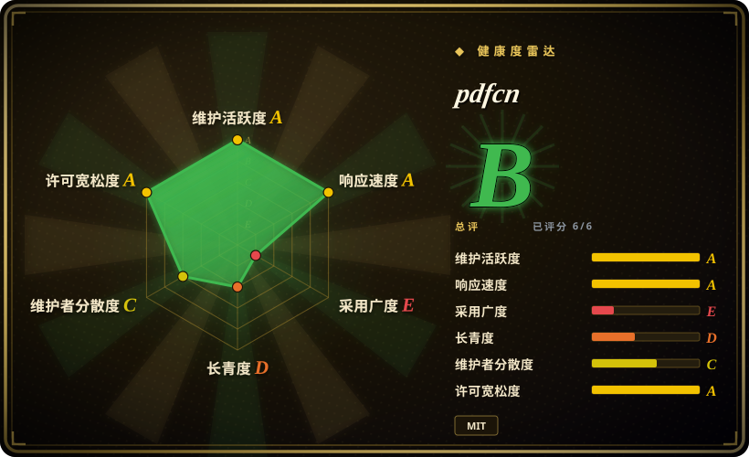
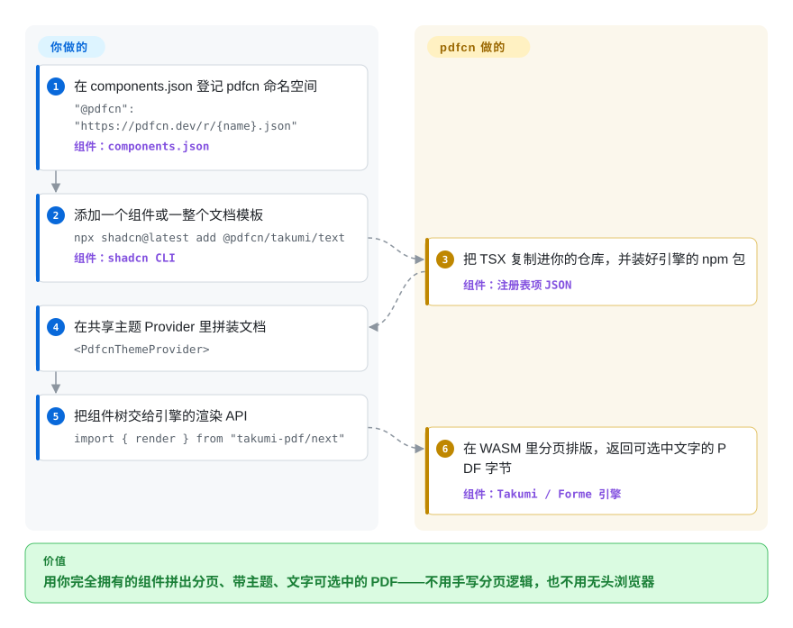

# pdfcn

你的 React 应用要产出发票、装箱单、报告这类 PDF，而每一份都在渲染引擎的原语上从零重排——字号、表格边距、分页 hack 一遍遍重写。pdfcn 是一个复制粘贴式的 React PDF 组件注册表（25 个组件、约 20 套整页模板、9 个主题），用 shadcn CLI 装进你的项目，底下跑两个 Rust 编译成 WASM 的 PDF 引擎：Takumi 或 Forme。

## 何时使用

你在做 React 或 Next.js 产品，需要生成发票、面单、会议纪要、教案、财务报告这类业务单据，又不想每份文档都在 PDF 引擎的原语上手写排版。你在 `components.json` 里登记一个 URL，跑 `npx shadcn@latest add @pdfcn/takumi/invoice-minimal`，TSX 源码连同共享主题 Provider 就复制进你的仓库，引擎的 npm 依赖由 CLI 顺手装好。和 shadcn/ui 本身一样：没有运行时要引的包，代码归你，每个 prop 都能改。

和裸用引擎（直接用 Takumi 或 Forme）或更老的 react-pdf 生态相比，决定选它的理由是*从成品化、带主题的文档布局起步，而不是从空白原语起步*：同一套组件 API 在两个引擎间通用，模板块是可以直接改的整页文档。和客户端截图式方案（jsPDF 的 `html` 路线）相比，要的是可选中文字、真正分页、有 page-break 与 keep-together 语义的文档，而不是把 DOM 压平成的图片。

## 怎么用起来

每个注册表项是一份小 JSON 清单（由仓库脚本构建出 `apps/web/public/r/*.json`，从 pdfcn.dev 提供下载），它声明要复制哪些 TSX 文件、要安装哪些 npm `dependencies`（Takumi 基座是 `takumi-pdf` 加 `@takumi-rs/helpers`，Forme 基座是 `@formepdf/react` 加 `@formepdf/core`），以及用 `registryDependencies` 拉进共享件——装任何组件都会传递性地装上 `@pdfcn/takumi/utils`，里面是文档原语（`Document`/`Page`）、`PdfcnThemeProvider` 和一套默认主题。之后你在自己的代码里拼 `<Document><Page size="A4"><PdfcnThemeProvider>…</PdfcnThemeProvider></Page></Document>`，把组件树交给引擎的渲染 API；引擎（Rust 编译成 WASM，即 WebAssembly，所以不需要无头 Chrome，也没有服务端二进制）负责分页和文字排版，吐出可选中文字的 PDF（输出是真实文本流，不是压平的图片）。装完之后归你的是组件源码和主题 token；留在上游的是两个排版引擎，以及你拉取用的注册表站点。Forme 基座走 `forme/` 命名空间，用法一致，只是 `Document`/`Page` 改从 `@formepdf/react` 导入——组件 API 不变，底下换引擎。

<!-- flow-steps:begin (generated from flows/pdfcn.json by tools/flow_card.py — do not edit) -->

流程文字版

1. **你**：在 components.json 登记 pdfcn 命名空间 — `"@pdfcn": "https://pdfcn.dev/r/{name}.json"` — 组件：`components.json`
2. **你**：添加一个组件或一整个文档模板 — `npx shadcn@latest add @pdfcn/takumi/text` — 组件：`shadcn CLI`
3. **pdfcn**：把 TSX 复制进你的仓库，并装好引擎的 npm 包 — 组件：`注册表项 JSON`
4. **你**：在共享主题 Provider 里拼装文档 — `<PdfcnThemeProvider>`
5. **你**：把组件树交给引擎的渲染 API — `import { render } from "takumi-pdf/next"`
6. **pdfcn**：在 WASM 里分页排版，返回可选中文字的 PDF 字节 — 组件：`Takumi / Forme 引擎`

**价值**：用你完全拥有的组件拼出分页、带主题、文字可选中的 PDF——不用手写分页逻辑，也不用无头浏览器

<!-- flow-steps:end -->

## 何时不用

- **你要的是“官方” shadcn 项目的背书。** pdfcn 挂在 `shadcn-labs` 组织下（GitHub 组织建于 2026-04，资料页写印度），和运营 shadcn/ui 的 `shadcn-ui` 组织是两个主体；它实现了 shadcn 注册表格式，但本索引查不到它由 shadcn/ui 维护者运营或与其有关联的证据 [推断：2026-09-29 核对过组织元数据与成员列表，未能确认任何链接]。如果你的工具链白名单只收官方 shadcn 面，它过不了。
- **你需要成熟、可锁版本的供应链。** 截至 2026-09-29，仓库没有任何 GitHub Release，也不走 npm 分发（npm 上的 `pdfcn` 包只是主要贡献者注册的 0.0.0 占位）——没有可 pin 的版本、没有针对已复制代码的变更日志，重新拉取更新项覆盖你的改动只能手工合并。需要 semver 和升级路径，就选 react-pdf（未收录），它是更老、有正式发布节奏的生态。
- **你要编辑、合并、签署或填表已有 PDF。** pdfcn 只生成新文档。JS 里改既有 PDF 用 [pdf-lib](pdf-lib.zh.md)；签名与 PAdES 用 [pyHanko](pyhanko.zh.md)。
- **技术栈不是 React，或只是浏览器端一次性下载。** 这里的一切都是要由 JS 内嵌引擎执行的 TSX。不依赖组件模型的纯 JS 客户端生成，[jsPDF](jspdf.zh.md) 上手更轻。
- **你要把现成的 HTML/CSS 页面原样转成 PDF。** pdfcn 的组件是用引擎专有原语重排版式，不会拿你的网页直接打印。追求任意 DOM 的像素级还原，无头浏览器管线（Puppeteer/Playwright，未收录）仍是标准——这两个引擎存在的理由恰是绕开它，代价是不复刻开放网页 CSS。
- **你今天就要一个低风险赌注。** Forme 基座押在一个 200 星、2026-02 才创建的引擎上；Takumi 基座锚点更稳（其作者本人在此提 PR）。合规级文档请把这个注册表自身约 7 周的年龄，与更成熟的方案放在天平上称。

## 横向对比

| 替代品 | 是否收录 | 我们的评价 | 取舍 |
|---|---|---|---|
| react-pdf（`diegomura/react-pdf`） | 未收录 | 需要十年沉淀、有正式发布版本的 JSX 生成 PDF 生态时选 react-pdf；想要成品化的主题组件与整页模板、能接受年轻注册表时选本页。本批 tab-intake 未收录。 | 成熟度、semver、大社区（16.8k 星，2016 年建库，MIT）换 pdfcn 的复制式组件加主题但没有版本可锁；pdfcn 的 README 也承认 `pdfx` 是同一思路的 react-pdf 版本。 |
| Takumi（`kane50613/takumi`） | 未收录 | 要排版引擎本身、不要一层有主张的组件，或需要注册表没暴露的能力时，直接用 Takumi。本批 tab-intake 未收录。 | 控制力强、依赖面小，代价是每份文档都得自己从原语搭；pdfcn 的 Takumi 组件就坐在它上面。 |
| Forme（`danmolitor/forme`） | 未收录 | 专要它的 print-CSS/HTML 路线（把既有 HTML 渲成分页 PDF）时直接用 Forme；pdfcn 只通过注册表暴露其 React 组件路线。本批 tab-intake 未收录。 | `forme/` 命名空间给你主题化组件 API，但在一个 200 星、7 个月大的引擎上又加了一层。 |
| [jsPDF](jspdf.zh.md) | ✅ | 任何 JS 环境里要快速的命令式 PDF、不需要 React 时选 jsPDF；文档由 React 组件拼装、要真分页与可选中文字而非手工 `text()` 摆位时选 pdfcn。 | API 简单、不背 WASM 引擎包、npm 装机量巨大——但没有组件模型，其 HTML 抓取路线会栅格化。 |
| [pdf-lib](pdf-lib.zh.md) | ✅ | 活儿是伴随生成去操作既有 PDF（合并、表单、盖章）时选 pdf-lib；pdfcn 完全不开既有文档。 | 低层对象图编辑、无排版引擎——与文档排布器互补而非互替。 |

## 技术栈

- **语言：** TypeScript/TSX（React 19 的 peer 面；组件是普通函数组件，样式走 `class-variance-authority` 风格的变体加主题 Provider）。
- **引擎：** Takumi（`takumi-pdf` 加 `@takumi-rs/helpers/jsx`，Rust→WASM，`render(<Demo/>)` 返回 PDF 字节）与 Forme（`@formepdf/react` 加 `@formepdf/core`，Rust→WASM 文档引擎）。
- **分发：** shadcn 注册表格式——由 `apps/web/scripts/build-registry.mts` 从源清单 `apps/web/registry.json` 构建出静态 JSON 项（`$schema: https://ui.shadcn.com/schema/registry-item.json`），经 `https://pdfcn.dev/r/{name}.json` 提供。
- **文档站本体**（同仓库 `apps/web`）：Next.js 16 加 Fumadocs 加 Tailwind v4，用引擎和 `pdfjs-dist` 做实时预览；站点还带面向 agent 的端点（`llms.txt`/`llms-full.txt`、`openapi.json`、`.well-known/agent-skills`、页内 web-mcp 工具）以及一个用于开姊妹注册表的内部技能 `.agents/skills/launch-shadcn-registry`。

## 依赖

- **你的运行时：** 一个能跑所选引擎 WASM 包的 React 应用——`shadcn add` 装项时按清单自动安装（每项都声明 `dependencies`；例如 `takumi/table` → `takumi-pdf`、`@takumi-rs/helpers`）。
- **共享层：** 每个 Takumi 组件都传递性拉入 `@pdfcn/takumi/utils`（原语、主题 Provider、默认主题），CLI 之外无需额外配置。
- **字体与图片：** 引擎需要你显式喂字体/图片资源（文档站的渲染路由通过 `images.sources` 传 logo 字节）；各引擎逐条的字体配置本文未展开。[未验证]
- **注册表拉取：** `shadcn add` 会访问 pdfcn.dev，除非你把 `components.json` 指到自托管的 JSON；装完之后你的代码没有任何回连。

## 运维难度

运行期低——没有要你操作的服务器，复制进来的组件和打进产物的 WASM 就是你应用自身的依赖。负担在*维护漂移*：没有 release、没有版本可 pin，上游对组件（你可能已改过）的修复要重新拉取并手工合并；引擎渲染行为的坑也全由你兜底，因为每个文件都归你。

## 健康度与可持续性

- **维护：** 2026-08-11 建库，活跃——社区 PR 每天合到 2026-09-24；但从未发过 GitHub Release，所谓“版本”就是 `main` 的快照。核对于 2026-09-29。
- **成长曲线是炒作形，不是 Lindy：** 约 7 周攒到 ~2.3k 星，watcher 却只有 2 个；“年龄×仍在维护”的检验根本还没开始。热度在这里只能当曝光度读，不能当耐久度读。核对于 2026-09-29。
- **治理/巴士系数：** 头号贡献者 `Aniket-508`（约 160 个提交里占 111 个，截至 2026-09-29）；组织公开成员仅 1 人，运营一条“注册表工厂”产品线（termcn、emailcn、ogimagecn、agentcn——共 24 个公开仓库）。好消息：Takumi 作者 `kane50613` 与 Forme 作者 `danmolitor` 都在此合过 PR；坏消息：没有任何基金会或公司背书。
- **上游赌注：** 本页价值拴在两个年轻引擎上——Takumi（3.0k 星，2025-06 建库，2026-09-29 仍在推）尚算健康；Forme（200 星，2026-02 建库，最后推送 2026-09-19）是脆弱的那一半。
- **风险信号：** 品牌近名（`shadcn-labs` ≠ `shadcn-ui`），不查组织主页会读成官方项目——标准化使用前先核实关联；MIT 协议（2026-09-29 已读文件），CODE_OF_CONDUCT/SECURITY/CONTRIBUTING/DCO 与 CI 齐备；文档站挂赞助广告与赞助页，靠小团队变现维持。

## 存疑（未验证）

- `[推断]` 与官方 shadcn-ui 项目无关联——依据是 GitHub 组织元数据（2026-04-21 创建、位置“India”、公开成员 1 人）且找不到任何交叉引用；不排除未公开的私人关联，组织私有权限查不了。
- `[未验证：npm registry 与仓库均查不到版本化产物]` “无 Release、无 npm 分发”经 GitHub Releases API（空）与 `npm view pdfcn`（0.0.0 占位包，发布者即主要贡献者，疑似护名）核实；若存在私有或其他分发渠道，版本化结论要改。
- `[未验证：docs 页面未读全]` `form`/`signature` 组件产出的是可交互 AcroForm 填表字段，还是仅印刷体表单排版——文档只写 "Labeled form groups for PDF inputs"，未声明 AcroForm 支持；选它做可填表单前需到引擎层验证。
- `[未验证：未做测量]` takumi-pdf/Forme 在真实应用里的 WASM 包体积与首渲延迟——本文未测量；引擎文档只声明进程内渲染，没声明体积代价。
- `[未验证：字体配置需按引擎文档实测]` CJK 与自定义字体在两个基座上的渲染——WASM 引擎的字体供给有引擎级文档，但没有实测过 pdfcn 组件渲中文样例。
- `[推断]` 自托管注册表可行（把 `public/r/*.json` 搬到自己域名），因为 JSON 清单无服务端逻辑——依据是静态文件布局的推断，没有跑过自托管验收。
- `[未验证：repobeats/星标增速无法独立复核]` 星标增速（7 周 ~2.3k）取自 2026-09-29 的 GitHub API 计数；其中多少是留存采用、多少是发布炒作，当下无法度量。
