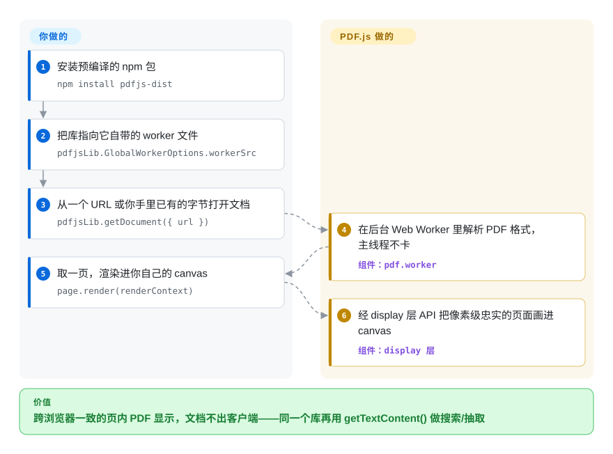

# PDF.js

Web 应用要给用户看 PDF，默认选项只有两个坑：各家浏览器参差不齐的内建查看器，或者把文档上传给第三方服务。PDF.js 是 Mozilla 出品的纯 JavaScript 渲染与解析引擎——Firefox 内置阅读器就是它——把页面画到 `<canvas>`、抽取文本，全在客户端完成，浏览器和 Node 里都能跑。

## 何时使用

你是前端工程师，在做一个需要内嵌查看 PDF 的 Web 应用——合同、发票、报表——又不想把用户甩给浏览器原生插件或某个第三方 SaaS 嵌入。你不想只为了渲染就把文档上传到别人服务器，还需要阅读器在 Chrome、Firefox、Safari 上表现一致。你引入 `pdfjs-dist`，把 PDF 喂给它（一个 URL、一个 `ArrayBuffer`，或你手里已有的字节），调用 `getDocument()`，再把每一页渲染进你自己掌控的 canvas——缩放、翻页、文本层选中全在客户端完成。想要开箱即用的界面，就直接放上预编译的 `web/viewer.html` 包，连壳子都不用自己写。

当你需要*读* PDF 而不只是*显示*它时，同一个库也是你的工具：按页拉文本内容（`getTextContent()`）做客户端搜索、摘录片段或喂一个轻量搜索索引，或读取文档大纲与注释。因为解析和渲染跑在 Web Worker 里、不占主线程，一份重文档不会把 UI 卡死——而且资源加载完之后整套东西能离线工作，所以它很适合那些必须把文档留在客户端的隐私敏感应用。

## 怎么用起来

PDF.js 分两层（官方文档自己就这么讲）：**core** 层解析 PDF 的二进制格式，**display** 层把解析出的对象变成你能画、能查的东西。你用 URL、`ArrayBuffer` 或手里已有的字节调用 `getDocument()`，解析发生在一个 **Web Worker**（浏览器后台线程）里，所以一份 50 页的合同也绝不会卡住 UI。接着你从返回的文档对象要一页（`getPage(1)`），拿到按你的缩放算好的 `viewport`，再对着你自己拥有的 `<canvas>` 上下文调 `render()`；可选中的文本层是单独生成的、带定位的 DOM，叠在 canvas 上面，而客户端搜索和文本抽取靠的就是 `getTextContent()`。它替你做的：解析、渲染、文本/大纲/注释访问，以及一套完整的预编译阅读器（`web/viewer.html`）——不想自己写壳就直接用。留在你那儿的：把 worker 文件（当前 `pdfjs-dist` 里是 `build/pdf.worker.mjs`）从可达 URL 托管出去、把 `GlobalWorkerOptions.workerSrc` 配成一致——这是最常见的集成翻车点——外加预编译阅读器之外的任何 UI，和客户端上的 CPU 预算。

<!-- flow-steps:begin (generated from flows/pdfjs.json by tools/flow_card.py — do not edit) -->

流程文字版

1. **你**：安装预编译的 npm 包 — `npm install pdfjs-dist`
2. **你**：把库指向它自带的 worker 文件 — `pdfjsLib.GlobalWorkerOptions.workerSrc`
3. **你**：从一个 URL 或你手里已有的字节打开文档 — `pdfjsLib.getDocument({ url })`
4. **PDF.js**：在后台 Web Worker 里解析 PDF 格式，主线程不卡 — 组件：`pdf.worker`
5. **你**：取一页，渲染进你自己的 canvas — `page.render(renderContext)`
6. **PDF.js**：经 display 层 API 把像素级忠实的页面画进 canvas — 组件：`display 层`

**价值**：跨浏览器一致的页内 PDF 显示，文档不出客户端——同一个库再用 getTextContent() 做搜索/抽取

<!-- flow-steps:end -->

## 何时不用

- **你需要创建或编辑 PDF。** PDF.js *渲染和读取* PDF，它不是生成器也不是编辑器。要从零构建 PDF、用程序填表单、合并/拆分或盖戳，请用 JS 里的 pdf-lib 或 jsPDF，服务端则用 reportlab。（PDF.js 的阅读器确实支持查看和基本的表单字段交互，但不能创作一份文档。）
- **服务端做简单文本抽取。** 如果你只是要在批处理/后端作业里把 PDF 里的文本掏出来，一整套浏览器渲染引擎太重了——pdfplumber 或 PyMuPDF（Python）在服务端做这一件事更精简、更快。
- **你想要面向 AI/RAG 的版面结构化解析。** PDF.js 给你的是带坐标的文本片段，而不是阅读顺序、表格或为 LLM 摄取调好的文档结构——那种活请用 [Docling](../document-parsing/docling.zh.md) 之类。
- **在意包体积 / worker 配置，而文档又很简单。** 它是个大依赖，需要正确地把 worker 文件托管出去（`workerSrc`）；只为一个极小的 PDF，集成成本可能盖过收益。
- **弱客户端上的超大或病态 PDF。** 在浏览器里渲染巨大、图多或嵌套很深的文档会又慢又吃内存；客户端扛不住时，把重解析挪到服务端。[推断]

## 横向对比

| 替代品 | 是否收录 | 我们的评价 | 取舍 |
|---|---|---|---|
| pdf-lib | ✅ | 若更看重“**创建和修改** PDF 的 JS 库（表单、合并、绘制）”，请选 [pdf-lib](pdf-lib.zh.md)。 | **创建和修改** PDF 的 JS 库（表单、合并、绘制）——正是 PDF.js 不覆盖的写一侧；它不是渲染器/阅读器。 |
| [jsPDF](jspdf.zh.md) | ✅ | 需要在浏览器端用 JavaScript 生成 PDF 时，选 jsPDF。 | 客户端用 JS **生成** PDF；是互补而非替代——它造文档，PDF.js 显示文档。 |
| [PyMuPDF](pymupdf.zh.md) / [pdfplumber](pdfplumber.zh.md) | ✅ | 做服务端渲染、文本抽取或表格抽取批处理时，选这些 Python 库。 | Python 库，服务端快速渲染 + 文本/表格抽取；后端批量作业更合适，但不是浏览器阅读器。 |
| [Docling](../document-parsing/docling.zh.md) | ✅ | 需要把文档解析成 AI/RAG 用的结构化输入，而不是做浏览器 PDF 阅读器时，选 Docling。 | 版面感知的文档解析器，产出结构化结果（阅读顺序、表格）供 AI/RAG；目标不同——要的是语义结构，不是像素级忠实显示。 |
| 原生 `<embed>` / 浏览器 PDF 插件 | 未收录 | 只有在零依赖比跨浏览器一致性和程序化访问更重要时，才选原生嵌入。 | 零依赖、浏览器自带，但跨浏览器表现不一致、不可控，也给不了你程序化的文本/渲染访问。 |

## 技术栈

- **语言：** JavaScript（ES 模块），外加少量配套工具。
- **执行模型：** 解析和渲染跑在 **Web Worker** 里；主线程驱动一套 API，返回页面给你绘进 `<canvas>`，再把可选中的文本层以 DOM 形式叠在 canvas 之上。
- **构建：** 基于 Gulp 的构建；以 `pdfjs-dist` npm 包形式分发预编译产物（API + worker + 预编译的 `web/viewer.html`）。
- **目标环境：** 现代浏览器；也可在 Node 中使用（例如配上合适的 canvas 后端做无头文本抽取/渲染）。

## 依赖

- **运行时：** 一个 JavaScript 环境——现代浏览器，或用于服务端的 Node。worker 脚本（当前 `pdfjs-dist` 里的 `build/pdf.worker.mjs`）必须被托管出去，并配好它的路径（`GlobalWorkerOptions.workerSrc`）。
- **安装：** `npm install pdfjs-dist` 即得库 + 预编译阅读器资源；不需要任何外部服务或数据存储。
- **Node 细节：** 服务端把页面渲染到 canvas 需要一个 canvas 实现（如 `node-canvas` / `@napi-rs/canvas`）；纯文本抽取的需求更轻。[未验证]
- **从源码构建：** 需要 Node.js 和 Gulp 工具链；确切最低版本由仓库决定且随时间变化。[未验证]

## 运维难度

**低。** PDF.js 是个客户端（或 Node 进程内）库——没有要部署的服务，没有数据存储，没有集群。唯一真正的坑是接 worker：`pdf.worker.mjs` 必须从一个可达 URL 托管，并把 `workerSrc` 配成与之匹配，否则渲染会无声失败；打包器（Webpack/Vite）往往需要一次性配置才能正确产出 worker。除此之外，“运维”其实只是把依赖保持更新（安全和格式兼容修复会定期合入），以及为大文档在客户端上预留 CPU/内存。托管预编译阅读器就是静态文件托管。

## 健康度与可持续性

- **响应速度**：Grade A——中位首次响应时间 2.7 小时，基于 52 个 qualifying issues/PRs。
- **维护（2026-09）：** 最后 push 在 2026-09-25，最新 release v6.3.289 标注 2026-08-29（GitHub API）——**活跃**，发版稳定；安全/格式修复会定期合入。[推断]
- **治理 / 背书：** Mozilla 所有（`mozilla/pdf.js`，Organization），也是 Firefox 内置 PDF 阅读器背后的引擎。[推断] 这是相当强的背书：它是一个在产浏览器的承重件，因此有结构性理由保持维护——不是任凭单个维护者摆布的业余项目。
- **年龄与 Lindy（创建于 2011-04，约 15 年）：** 又老**又**仍活跃——教科书级的**强 Lindy** 赌注。一个 15 岁、对浏览器至关重要、持续发版的库，几乎是开源能给出的最安全的长寿先验。[推断]
- **采用度：** 约 54k star（易波动，见存疑），外加事实标准地位——*那个* JS PDF 渲染器（随每个 Firefox 出货，被无数 Web 阅读器包装），生态采用又深又真实。[未验证]
- **风险标记：** Apache-2.0（无重新许可风险）；无 open-core/CLA 门槛。唯一真正要留意的是它只渲染/读取、不创作 PDF——这是范围边界，而非可持续性风险。

## 存疑（未验证）

- [未验证] ~54k GitHub star 和“active (2026-09)”是某一时点的快照（最新发布 v6.3.289，2026-08-29；核查于 2026-09-28）；star 数嘈杂且对时间敏感——仅供参考。
- [未验证] 现代 PDF.js 主要渲染到 `<canvas>`；历史上存在过一个 SVG 后端，在当前版本里可能已弃用/移除——请对照你锁定的版本核实，别假定还有 SVG 输出。
- [未验证] Node 侧渲染及其确切的 canvas 后端 / API 形态随版本而异；请对照你实际安装的 `pdfjs-dist` 版本确认。
- [推断] 在超大或图多的 PDF 上的浏览器内性能与内存压力，是从渲染模型做出的推断，而非对某份具体文档的实测基准。
- [推断] 构建期的 Node/Gulp 最低版本由仓库工具配置决定且随时间变化，这里不断言具体数字。
