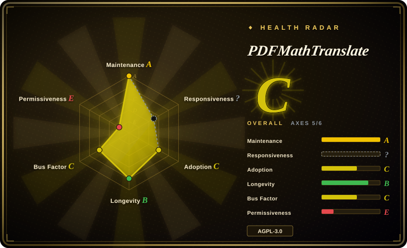
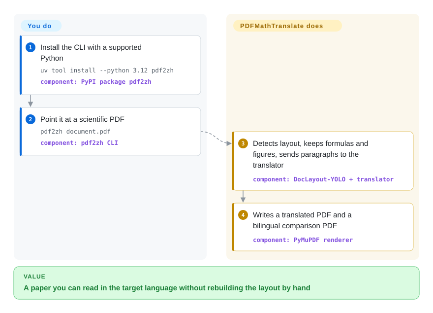

# PDFMathTranslate

You dump a paper PDF into a normal translator and the formulas shatter, the two-column layout collapses, and figure captions no longer sit next to their figures. PDFMathTranslate keeps those in place, sends only the running text to a translation engine, and writes a translated PDF plus a bilingual side-by-side PDF.

## When to use

You have an English (or other) scientific PDF whose formulas, charts, table of contents, and annotations must survive translation — not a book you are happy to flatten into paragraphs. You install the PyPI package `pdf2zh` and run `pdf2zh document.pdf`; it emits `document-mono.pdf` (translated only) and `document-dual.pdf` (original beside translation) in the working directory. Default engine is Google; `-s deepl` / `-s openai:gpt-4o-mini` / `-s ollama` and a long table of others are documented. There is also `pdf2zh -i` (Gradio UI), Docker (`byaidu/pdf2zh`), a Zotero plugin, and `--mcp`.

You pick it over [BabelDOC](babeldoc.md) because this is the *product*: many translators, a GUI, Docker, Zotero, MCP, and a 1.x CLI that still received commits in 2026. BabelDOC is the layout engine Immersive Translate ships, and this repo's own `pyproject.toml` pins it to `babeldoc>=0.1.22,<0.3.0` — not the current 0.6 line. You pick it over [Bilingual Book Maker](../reading-tools/bilingual-book-maker.md) when the artifact must remain a PDF with columns and equations intact; BBM's PDF path falls back to bilingual `.txt`.

## Q&A

**Q: What is BabelDOC, and which one do I install?**
BabelDOC is the layout-preserving translation *engine* (library + debug CLI). This page is the *product* you run as a user (`pdf2zh`). Install PDFMathTranslate unless you are embedding the current 0.6 kernel or debugging it — and even then BabelDOC's README says not to call its Python API.

**Q: Is the 2.0 fork the same project?**
No. `PDFMathTranslate-next` is a separate repository the 1.x README points at for the v2 kernel (`--mode precise` here shells out to an isolated copy of it). This batch indexes 1.x plus BabelDOC; next stays 未收录.

## How it works

You give it a PDF and, unless you stay on the default Google translator, a service flag or API key. It runs a document-layout model (DocLayout-YOLO via ONNX) to tell text from formulas, figures, and tables, extracts the text with pdfminer.six / PyMuPDF, sends paragraphs to the chosen translator, and writes translated glyphs back into a new PDF. You do not rebuild the page; it reuses the original boxes and shrinks the type to fit. Optional fast-mode OCR (`pip install 'pdf2zh[ocr]'`) runs locally on image-only pages before that pipeline; native-text pages skip it. `--babeldoc` is an experimental switch onto the pinned BabelDOC package, not a free upgrade to BabelDOC 0.6.

<!-- flow-steps:begin (generated from flows/pdfmathtranslate.json by tools/flow_card.py — do not edit) -->

Text version of the flow

1. **You**: Install the CLI with a supported Python — `uv tool install --python 3.12 pdf2zh` — component: `PyPI package pdf2zh`
2. **You**: Point it at a scientific PDF — `pdf2zh document.pdf` — component: `pdf2zh CLI`
3. **PDFMathTranslate**: Detects layout, keeps formulas and figures, sends paragraphs to the translator — component: `DocLayout-YOLO + translator`
4. **PDFMathTranslate**: Writes a translated PDF and a bilingual comparison PDF — component: `PyMuPDF renderer`

**Value**: A paper you can read in the target language without rebuilding the layout by hand

<!-- flow-steps:end -->

## When NOT to use

- **The file is an EPUB, txt, markdown, or subtitle, not a layout-sensitive PDF.** Use [Bilingual Book Maker](../reading-tools/bilingual-book-maker.md) instead — MIT, paragraph-stream, resume, no ONNX model download.
- **You need the current BabelDOC 0.6 kernel (cross-column/page work, glossary extraction, the engine Immersive Translate hosts).** This 1.x tree pins `babeldoc<0.3.0`. Use [BabelDOC](babeldoc.md) only as a debug CLI, or the 2.0 fork PDFMathTranslate-next (未收录) which BabelDOC's README names as the self-host path.
- **You cannot ship AGPL-3.0.** Both this repo and BabelDOC are AGPL; a proprietary product that embeds the translator as a network service inherits the copyleft. Use a licensed commercial PDF translator (非仓库) or a permissive paragraph tool like Bilingual Book Maker for non-PDF files.
- **You want structured Markdown/JSON for RAG, not a translated PDF.** Use [Docling](../document-parsing/docling.md) instead — this project re-renders a PDF, it does not linearize the document for an LLM.
- **The PDF is a hard scan, handwriting, or mixed scan-plus-text.** Fast-mode OCR is experimental (added 2026-09-08), targets white-background scans, and skips partial-scan pages that already contain text. Run [OCRmyPDF](ocrmypdf.md) first, or expect wrong inline equations.
- **You are on Python 3.13+.** Published PyPI `pdf2zh` 1.9.11 declares `>=3.10,<3.13`; main's `pyproject.toml` tightens that to `>=3.11,<3.13`.

## Comparison

| Alternative | In index | Our verdict | Tradeoff |
|---|---|---|---|
| [BabelDOC](babeldoc.md) | ✅ | When you want a user-facing CLI/GUI with Google/DeepL/Ollama and many services, pick PDFMathTranslate; pick BabelDOC only to debug or embed the current 0.6 engine, because 1.x pins `babeldoc<0.3.0` and BabelDOC's authors refuse to support direct API use. | This page is the product (37k stars, many translators); BabelDOC is the AGPL engine, OpenAI-compatible LLM only, EN→ZH first. |
| [Bilingual Book Maker](../reading-tools/bilingual-book-maker.md) | ✅ | When the input is a scientific PDF whose columns and formulas must survive, pick PDFMathTranslate; pick Bilingual Book Maker when you want a bilingual EPUB/txt from a book file. | BBM is MIT and layout-blind; PDFMathTranslate is AGPL and PDF-native, with a HuggingFace model download on first run. |
| PDFMathTranslate-next | 未收录 | When you need the 2.0 kernel (cross-column/page, current BabelDOC), go to that fork; stay here for the stable 1.x CLI/GUI that still landed 2026 commits. | The 1.x README itself points 2.0 at `PDFMathTranslate/PDFMathTranslate-next`; skipped this batch because indexing was scoped to BabelDOC plus this 1.x product. |
| Immersive Translate hosted PDF translator | 非仓库 | When you just want pages translated in a browser with a free quota, use the hosted service; pick this repo when the PDF must stay on your machine or you must own the translator key. | Hosted SaaS at `app.immersivetranslate.com/babel-doc/` — not a repository. |

## Tech stack

- **Python** package `pdf2zh` (Hatchling); CLI entry `pdf2zh = pdf2zh.pdf2zh:main`
- **Layout:** DocLayout-YOLO ONNX (`wybxc/DocLayout-YOLO-DocStructBench-onnx` via HuggingFace Hub)
- **PDF I/O:** PyMuPDF (`pymupdf<1.25.3`), pdfminer.six, pikepdf, fontTools
- **Translation adapters:** Google (default), Bing, DeepL, Ollama, OpenAI, Azure, Tencent, Gemini, MiniMax, and others listed in `docs/ADVANCED.md`
- **UI / packaging:** Gradio (`gradio<5.36`), Docker image `byaidu/pdf2zh`, optional MCP extra
- **Pinned engine:** `babeldoc>=0.1.22,<0.3.0` (not BabelDOC 0.6)

## Dependencies

- **Python 3.10–3.12** on the published 1.9.11 wheel; main now asks for 3.11–3.12
- **First-run model download** from HuggingFace (DocLayout-YOLO ONNX); `HF_ENDPOINT=https://hf-mirror.com` is the documented workaround when that fails
- **A translator:** none extra for Google/Bing; API keys or a local Ollama/Xinference host for the others
- **Optional OCR extra:** `pip install 'pdf2zh[ocr]'` pulls Pooch; Tesseract `tessdata_fast` 4.1.0 lands in `~/.cache/pdf2zh/tessdata/` on the first scanned page
- **Optional precise mode:** `pdf2zh-setup-precise` provisions an isolated venv for the v2 kernel (pdf2zh_next submodule)

## Ops difficulty

**Medium.** The happy path is one CLI command, but the first run fetches an ONNX layout model and fonts, and every non-Google backend needs credentials. Docker (`docker run -d -p 7860:7860 byaidu/pdf2zh`) hides the Python pin at the cost of a Gradio port. Translation cache lives in a local peewee database; `--ignore-cache` forces a re-translate. Serving the GUI as a public translator means locking down `ENABLED_SERVICES` and `HIDDEN_GRADIO_DETAILS` or users can read server-side keys off the page.

## Health & viability

- **Maintenance:** Created 2024-09-06; GitHub `pushed_at` 2026-09-27 (OCR work dated 2026-09-08 on main). Latest *tagged* GitHub/PyPI release is still v1.9.11 (2025-07-11); main's `pyproject.toml` already reads 1.9.12. 166 open issues. Active, but the release train lags the branch.
- **Governance / bus factor:** Org-owned (`PDFMathTranslate`). Human contributors on the GitHub graph: Byaidu (436), awwaawwa (246), reycn (165), hellofinch (110) plus a long tail — github-actions is the top committer by volume. Not a solo bus.
- **Backing & longevity (Lindy):** ~2 years old and still pushed the week of this page — weak Lindy (young), but still-active holds. EMNLP 2025 System Demonstrations paper. Immersive Translate sponsors contributor Pro codes. 2.0 work was moved out rather than killing 1.x.
- **Adoption:** 37.2k stars, 3.3k forks, PyPI `pdf2zh`, Docker Hub `byaidu/pdf2zh`, Zotero plugin, MCP mode (as of 2026-09-27).
- **Risk flags:** AGPL-3.0 (network copyleft). The health scorer also sets `relicense_36mo: true` — the file on HEAD is AGPL-3.0; the prior SPDX was not traced here. PyPI release 14 months behind main. 1.x depends on an old BabelDOC major; following the engine means leaving this repo.

## Caveats (unverified)

- [未验证] Layout-preservation quality (formulas, two-column, TOC) was not reproduced here; claims follow the README, the EMNLP 2025 demo abstract, and the preview GIF.
- [未验证] Fast-mode OCR accuracy on mixed or handwritten pages was not run; the README itself warns about inline equations and partial scans.
- [未验证] Whether `--babeldoc` on 1.x can ever see BabelDOC 0.6 without breaking the `<0.3.0` pin was not tested — the pin is in `pyproject.toml`, so a default `pip install pdf2zh` cannot.
- [未验证] Cost and wall-clock per paper depend entirely on the chosen translator; no official benchmark.
- [推断] The unpublished 1.9.12 on main plus a 2025-07 PyPI tag means most `pip install pdf2zh` users are not running the OCR work dated 2026-09-08.
- [未验证] `health.py` flagged a license change in the last 36 months (`relicense_36mo: true`); today's `LICENSE` is AGPL-3.0, but the previous SPDX was not opened.
