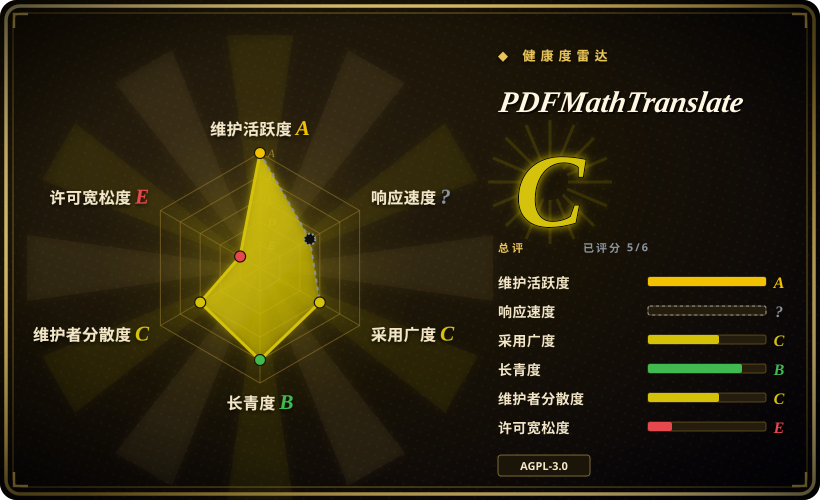
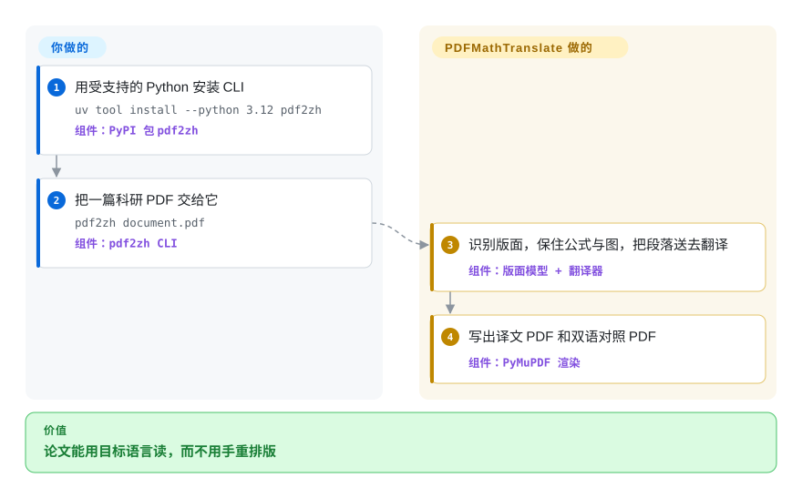

# PDFMathTranslate

论文 PDF 丢进普通翻译器，公式碎、双栏没、图注对不上。PDFMathTranslate 只把该译的段落送给翻译引擎，公式和图留在原位，吐出一份译文 PDF 和一份原文对照 PDF。

## 何时使用

你手上有一篇英文（或其他语言）的科研 PDF，公式、图表、目录和注释必须跟着译文一起活下来——不是一本可以拍扁成段落流的书。你安装 PyPI 包 `pdf2zh`，跑 `pdf2zh document.pdf`，工作目录里会出现 `document-mono.pdf`（纯译文）和 `document-dual.pdf`（原文对照）。默认引擎是 Google；`-s deepl` / `-s openai:gpt-4o-mini` / `-s ollama` 以及 `docs/ADVANCED.md` 里一长串其它服务都有文档。还有 `pdf2zh -i`（Gradio 界面）、Docker（`byaidu/pdf2zh`）、Zotero 插件和 `--mcp`。

你选它而不是 [BabelDOC](babeldoc.zh.md)，因为这是*成品*：翻译后端多、有 GUI、Docker、Zotero、MCP，1.x 命令行在 2026 年仍有提交。BabelDOC 是沉浸式翻译在用的排版引擎，而本仓库的 `pyproject.toml` 把它钉在 `babeldoc>=0.1.22,<0.3.0`——不是现在的 0.6 线。你选它而不是 [Bilingual Book Maker](../reading-tools/bilingual-book-maker.zh.md)，是因为产物必须仍是保住双栏和公式的 PDF；BBM 的 PDF 路径会退化成双语 `.txt`。

## 快问快答

**问：BabelDOC 是什么，我该装哪一个？**
BabelDOC 是保留排版的翻译*引擎*（库 + 调试 CLI）。本页是给用户跑的*成品*（`pdf2zh`）。除非你要嵌入当前 0.6 内核或调试它，否则装 PDFMathTranslate——即便要嵌，BabelDOC 的 README 也说不要直接调它的 Python API。

**问：2.0 那个 fork 是同一个项目吗？**
不是。`PDFMathTranslate-next` 是 1.x README 指向的另一个仓库，给 v2 内核用（这里的 `--mode precise` 会在隔离环境里调它）。见 [PDFMathTranslate-next](pdfmathtranslate-next.zh.md)。

## 怎么用起来

你交给它一份 PDF，若不用默认的 Google 翻译，再加一个服务开关或 API key。它用文档版面模型（经 ONNX 跑的 DocLayout-YOLO）区分文字、公式、图和表，用 pdfminer.six / PyMuPDF 抽出文本，把段落送给选定的翻译器，再把译文字形写回新的 PDF。你不用重排版；它复用原来的框，字号不够就缩小。可选的 fast 模式 OCR（`pip install 'pdf2zh[ocr]'`）会在流水线前对纯图片页做本地识别；原生文字页会跳过。`--babeldoc` 只是切到被钉死的 BabelDOC 包，不是免费升到 BabelDOC 0.6。

<!-- flow-steps:begin (generated from flows/pdfmathtranslate.json by tools/flow_card.py — do not edit) -->

流程文字版

1. **你**：用受支持的 Python 安装 CLI — `uv tool install --python 3.12 pdf2zh` — 组件：`PyPI 包 pdf2zh`
2. **你**：把一篇科研 PDF 交给它 — `pdf2zh document.pdf` — 组件：`pdf2zh CLI`
3. **PDFMathTranslate**：识别版面，保住公式与图，把段落送去翻译 — 组件：`版面模型 + 翻译器`
4. **PDFMathTranslate**：写出译文 PDF 和双语对照 PDF — 组件：`PyMuPDF 渲染`

**价值**：论文能用目标语言读，而不用手重排版

<!-- flow-steps:end -->

## 何时不用

- **文件是 EPUB、txt、Markdown 或字幕，不是对版式敏感的 PDF。** 改用 [Bilingual Book Maker](../reading-tools/bilingual-book-maker.zh.md)——MIT、段落流、可续跑，不用下载 ONNX 模型。
- **你要当前 BabelDOC 0.6 内核（跨栏/跨页、术语抽取、沉浸式翻译托管的那套引擎）。** 这条 1.x 线钉着 `babeldoc<0.3.0`。把 [BabelDOC](babeldoc.zh.md) 只当调试 CLI，或用 [PDFMathTranslate-next](pdfmathtranslate-next.zh.md)——BabelDOC 的 README 把自托管路径指到那里。
- **你不能接受 AGPL-3.0。** 本仓库和 BabelDOC 都是 AGPL；专有产品把翻译器做成网络服务会带上 copyleft。非 PDF 文件用宽松许可的段落工具如 Bilingual Book Maker，或买商业 PDF 翻译（非仓库）。
- **你要的是给 RAG 用的结构化 Markdown/JSON，不是译完的 PDF。** 改用 [Docling](../document-parsing/docling.zh.md)——本项目重绘 PDF，不把文档拉直给大模型。
- **PDF 是硬扫描件、手写、或扫描加文字混排。** fast 模式 OCR 仍是实验（2026-09-08 加入），面向白底扫描，已经带文字的半扫描页会跳过。先跑 [OCRmyPDF](ocrmypdf.zh.md)，否则行内公式很容易认错。
- **你在 Python 3.13+。** 已发布的 PyPI `pdf2zh` 1.9.11 声明 `>=3.10,<3.13`；main 上的 `pyproject.toml` 收紧为 `>=3.11,<3.13`。

## 横向对比

| 替代品 | 是否收录 | 我们的评价 | 取舍 |
|---|---|---|---|
| [BabelDOC](babeldoc.zh.md) | 已收录 | 要面向用户的 CLI/GUI，还要 Google/DeepL/Ollama 等多种服务，选 PDFMathTranslate；只有调试或嵌入当前 0.6 引擎时才选 BabelDOC，因为 1.x 钉死 `babeldoc<0.3.0`，且作者拒绝支持直接调 API。 | 本页是成品（3.7 万 star，翻译后端多）；BabelDOC 是 AGPL 引擎，只接 OpenAI 兼容 LLM，主攻英译中。 |
| [Bilingual Book Maker](../reading-tools/bilingual-book-maker.zh.md) | 已收录 | 输入是必须保住双栏和公式的科研 PDF 时选 PDFMathTranslate；要从书文件得到双语 EPUB/txt 时选 Bilingual Book Maker。 | BBM 是 MIT、无视版式；PDFMathTranslate 是 AGPL、PDF 原生，首次运行要下 HuggingFace 模型。 |
| [PDFMathTranslate-next](pdfmathtranslate-next.zh.md) | 已收录 | 需要 BabelDOC 0.6 以及 SiliconFlowFree/OpenAI 这类引擎时选 2.0；要默认 Google、且 2026-09 仍在提交时留在本页。 | 2.0 包当前 BabelDOC，但最后推送是 2026-05；1.x 内核更旧，树还在动。 |
| 沉浸式翻译托管服务 | 非仓库 | 只想在浏览器里按页翻译、用免费额度，走托管服务；PDF 必须留在本机或必须自持翻译密钥时选本仓库。 | 托管 SaaS，地址 `app.immersivetranslate.com/babel-doc/`——不是仓库。 |

## 技术栈

- **Python** 包 `pdf2zh`（Hatchling）；CLI 入口 `pdf2zh = pdf2zh.pdf2zh:main`
- **版面：** DocLayout-YOLO ONNX（`wybxc/DocLayout-YOLO-DocStructBench-onnx`，经 HuggingFace Hub）
- **PDF 读写：** PyMuPDF（`pymupdf<1.25.3`）、pdfminer.six、pikepdf、fontTools
- **翻译适配：** Google（默认）、Bing、DeepL、Ollama、OpenAI、Azure、腾讯、Gemini、MiniMax 等，见 `docs/ADVANCED.md`
- **界面 / 打包：** Gradio（`gradio<5.36`）、Docker 镜像 `byaidu/pdf2zh`、可选 MCP extra
- **钉死的引擎：** `babeldoc>=0.1.22,<0.3.0`（不是 BabelDOC 0.6）

## 依赖

- **Python 3.10–3.12**（已发布的 1.9.11 轮子）；main 现要求 3.11–3.12
- **首次运行要从 HuggingFace 下载模型**（DocLayout-YOLO ONNX）；失败时文档给出的变通是 `HF_ENDPOINT=https://hf-mirror.com`
- **一个翻译后端：** Google/Bing 不用额外东西；其它需要 API key 或本地 Ollama/Xinference
- **可选 OCR extra：** `pip install 'pdf2zh[ocr]'` 会带上 Pooch；第一次碰到扫描页时，Tesseract `tessdata_fast` 4.1.0 落到 `~/.cache/pdf2zh/tessdata/`
- **可选 precise 模式：** `pdf2zh-setup-precise` 为 v2 内核（pdf2zh_next 子模块）准备隔离虚拟环境

## 运维难度

**中。** 顺畅路径是一条 CLI，但首次运行要拉 ONNX 版面模型和字体，非 Google 后端都要凭据。Docker（`docker run -d -p 7860:7860 byaidu/pdf2zh`）躲过 Python 版本钉死，代价是一个 Gradio 端口。翻译缓存在本地 peewee 库；`--ignore-cache` 强制重译。把 GUI 当公共服务开出去，必须配好 `ENABLED_SERVICES` 和 `HIDDEN_GRADIO_DETAILS`，否则用户能从页面读到服务端密钥。

## 健康度与可持续性

- **维护：** 2024-09-06 建仓；GitHub `pushed_at` 为 2026-09-27（main 上 OCR 工作标注 2026-09-08）。*打过标签*的 GitHub/PyPI 发行仍是 v1.9.11（2025-07-11）；main 的 `pyproject.toml` 已写 1.9.12。166 个未关 issue。活跃，但发版跟不上分支。
- **治理 / 巴士因子：** 组织持有（`PDFMathTranslate`）。GitHub 贡献图上的人类提交者：Byaidu（436）、awwaawwa（246）、reycn（165）、hellofinch（110），另有长尾——按提交量 github-actions 排第一。不是单人巴士。
- **背书与寿命（林迪）：** 大约两岁，写本页那一周仍在推——林迪偏弱（年轻），但「仍在活跃」成立。EMNLP 2025 System Demonstrations 论文。沉浸式翻译给活跃贡献者发 Pro 兑换码。2.0 是迁出去，不是把 1.x 杀掉。
- **采用：** 3.72 万 star、3.3k fork、PyPI `pdf2zh`、Docker Hub `byaidu/pdf2zh`、Zotero 插件、MCP 模式（截至 2026-09-27）。
- **风险旗：** AGPL-3.0（网络 copyleft）。健康度评分还把 `relicense_36mo` 标成 true——HEAD 上的文件是 AGPL-3.0，此前的 SPDX 此处未追查。PyPI 发版落后 main 约 14 个月。1.x 依赖旧的 BabelDOC 主版本；要跟引擎走就得离开本仓库。

## 存疑（未验证）

- [未验证] 版式保留质量（公式、双栏、目录）此处未复现；说法来自 README、EMNLP 2025 demo 摘要和预览 GIF。
- [未验证] fast 模式 OCR 在混排或手写页上的准确率未实跑；README 自己也警告行内公式和半扫描页。
- [未验证] 1.x 的 `--babeldoc` 能否在不打破 `<0.3.0` 钉死的情况下看到 BabelDOC 0.6，未测试——钉死写在 `pyproject.toml` 里，默认 `pip install pdf2zh` 拿不到。
- [未验证] 每篇论文的费用和耗时完全取决于所选翻译器；没有官方基准。
- [推断] main 上未发布的 1.9.12 加上 2025-07 的 PyPI 标签，意味着大多数 `pip install pdf2zh` 的用户没有跑到标注为 2026-09-08 的 OCR 工作。
- [未验证] `health.py` 把近 36 个月许可证变更标成 true（`relicense_36mo: true`）；今天的 `LICENSE` 是 AGPL-3.0，但此前的 SPDX 没有打开核对。
