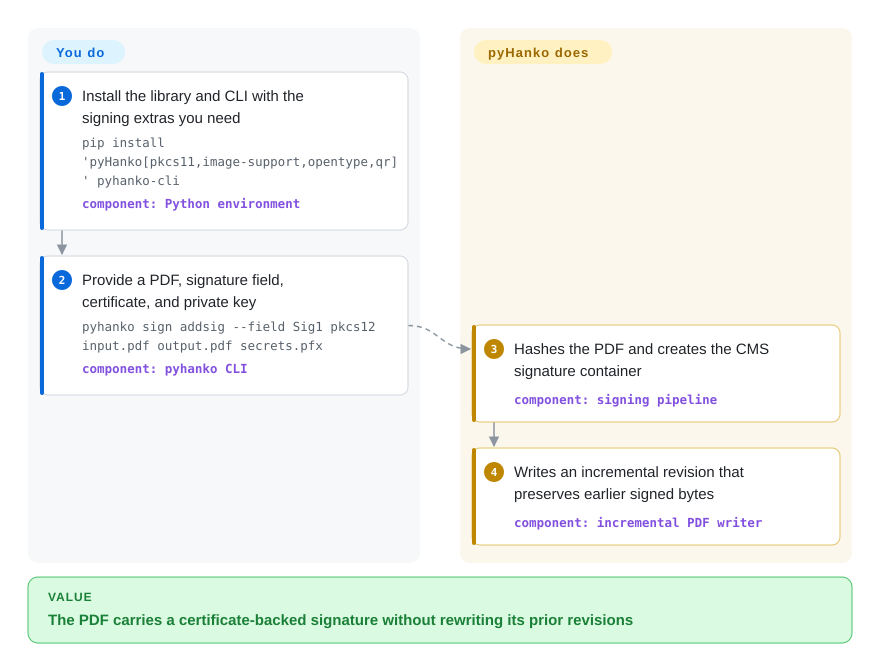

# pyHanko

A Python library and companion CLI for signing, timestamping, stamping, and validating PDFs, including documented PAdES baseline and long-term-validation workflows.

## When to use

You are building a Python service or signing pipeline that must preserve existing PDF revisions while adding certificate-backed signatures, timestamps, revocation data, or later validation. Choose pyHanko when you need a programmable signing library with PAdES B-B through B-LTA, PKCS#11, interrupted remote-signing flows, and signature validation in one stack; choose OpenPDFSign when a standalone Java command is enough and an application API would only add integration surface.

The separate `pyhanko-cli` package also makes the same repository useful for scripted signing and validation. The deciding tradeoff is signing depth and Python control versus operational responsibility for private keys, trust roots, timestamping, revocation fetching, and PDF interoperability.

## How it works

You install the library and CLI, provide signing key material or connect a PKCS#11 token, and select the signature field and validation settings. pyHanko hashes the PDF while reserving the signature container, asks the configured signer to produce the CMS signature, and writes the result as an incremental update so earlier signed bytes remain intact. PAdES LT/LTA workflows additionally collect certificate and revocation evidence and obtain RFC 3161 timestamps; you remain responsible for key custody, trust configuration, service availability, and renewing LTA timestamp chains. The Python API exposes the same pipeline at multiple levels, including asynchronous and interrupted-signing interfaces.

<!-- flow-steps:begin (generated from flows/pyhanko.json by tools/flow_card.py — do not edit) -->

Text version of the flow

1. **You**: Install the library and CLI with the signing extras you need — `pip install 'pyHanko[pkcs11,image-support,opentype,qr]' pyhanko-cli` — component: `Python environment`
2. **You**: Provide a PDF, signature field, certificate, and private key — `pyhanko sign addsig --field Sig1 pkcs12 input.pdf output.pdf secrets.pfx` — component: `pyhanko CLI`
3. **pyHanko**: Hashes the PDF and creates the CMS signature container — component: `signing pipeline`
4. **pyHanko**: Writes an incremental revision that preserves earlier signed bytes — component: `incremental PDF writer`

**Value**: The PDF carries a certificate-backed signature without rewriting its prior revisions

<!-- flow-steps:end -->

## When NOT to use

- **You only need page import or composition, not cryptographic signatures.** Choose FPDI for PHP page-template import, or [pdf-lib](pdf-lib.md) for JavaScript creation and editing; pyHanko's signing and validation machinery is unnecessary for layout work.
- **You want a small standalone signer with a Java deployment boundary.** Choose OpenPDFSign instead; pyHanko is the better fit when Python APIs, signature validation, or advanced PAdES lifecycle controls justify the broader stack.
- **Your application is PHP-native and needs direct PDF-object manipulation.** Choose [SAPP](sapp.md) when its incremental PHP object model is central and your signing requirements fit its narrower surface; pyHanko otherwise avoids forcing a Python process boundary only when the deeper signing feature set is needed.
- **You need a general Python cryptographic document toolkit beyond PDF.** Evaluate endesive when S/MIME and XAdES belong in the same package; choose pyHanko when PDF incremental-update analysis, PAdES, and LTV are the deciding requirements.
- **You require certified conformance or validated interoperability evidence out of the box.** Run your own profile, viewer, TSA, OCSP/CRL, trust-chain, and malformed-input suite before adoption; this research verified project documentation and code/package structure, not independent PAdES or PDF conformance. [未验证]
- **You need a production-ready declaration from upstream.** The README and package classifiers still call the project beta; either accept that release posture with targeted qualification or select a supported commercial signing product rather than treating active releases as a production-readiness guarantee.
- **You must preserve PDF/A or PDF/UA conformance automatically.** Use a workflow that explicitly validates those standards after signing; pyHanko's known-issues page says it does not enforce their additional restrictions.

## Comparison

| Alternative | In index | Our verdict | Tradeoff |
|---|---|---|---|
| OpenPDFSign | not indexed | Choose OpenPDFSign for a focused Java CLI that signs PDFs across a process boundary; choose pyHanko when Python embedding, validation, PKCS#11, interrupted signing, or explicit LT/LTA lifecycle controls decide the design. | OpenPDFSign narrows integration to a command and Java runtime; pyHanko exposes a much broader API and validation model but gives the application more configuration and dependency surface. |
| [SAPP](sapp.md) | ✅ | Choose SAPP when a PHP application needs incremental PDF-object access and signing in the same runtime; choose pyHanko when Python integration and the documented PAdES, validation, timestamp, and remote-signing workflows matter more. | SAPP is smaller and PHP-native; pyHanko covers more of the signing lifecycle but introduces Python, PKI configuration, and a larger dependency graph. |
| endesive | not indexed | Choose endesive when one Python package must span PDF, S/MIME, and XAdES signing; choose pyHanko when PDF-specific incremental updates, validation analysis, and PAdES LT/LTA workflows are the core requirement. | endesive has broader document-signature formats; pyHanko concentrates more machinery and documentation on PDF signatures and their validation lifecycle. |
| [FPDI](fpdi.md) | ✅ | Choose FPDI when the task is importing existing PDF pages as templates in PHP; choose pyHanko when preserving revisions while creating or validating cryptographic signatures is the actual task. | FPDI is a page-import library, not a signing stack; pyHanko adds cryptographic and PKI capabilities but is not a general page-composition substitute. |

## Tech stack

- **Language and packaging:** Python 3.10+ in a `uv` workspace, published as the `pyHanko`, `pyhanko-cli`, and `pyhanko-certvalidator` packages; setuptools is the build backend.
- **PDF and signature model:** incremental PDF writer, signature fields and appearances, CMS/ASN.1 containers, X.509 path validation, revocation handling, document-difference analysis, and synchronous or asynchronous signing APIs.
- **Cryptography and networking:** `cryptography`, `asn1crypto`, `lxml`, `aiohttp`, and the repository's `pyhanko-certvalidator` package form the core stack.
- **Optional surfaces:** PKCS#11 tokens, OpenType fonts, images, QR codes, ETSI trusted-list processing, YAML CLI configuration, and interrupted or remote signing.

## Dependencies

- **Core runtime:** Python 3.10+, `asn1crypto>=1.5.1`, `tzlocal>=4.3`, `pyhanko-certvalidator`, `aiohttp>=3.9,<3.15`, `cryptography>=48.0.0`, and `lxml>=5.4.0` as declared on 2026-09-22.
- **CLI runtime:** the separate `pyhanko-cli` package adds Click, PyYAML, certifi, and platformdirs and installs the `pyhanko` command.
- **Signing material:** a private key and certificate chain, commonly from PEM/DER, PKCS#12, PKCS#11 hardware, or a remote signer. These are supplied by the operator; pyHanko does not provision identity or trust.
- **LTV services:** PAdES LT/LTA normally needs reachable TSA and revocation endpoints plus explicitly configured trust roots. LTA archival also requires later timestamp-chain maintenance.
- **Optional packages:** `python-pkcs11`, fonttools/uharfbuzz, Pillow/python-barcode, qrcode, and xsdata/signxml are installed only for their corresponding features.

## Ops difficulty

**Low for local test signing; medium-to-high for production PAdES and LTV.** The library and CLI run in-process without a database or daemon, but the security boundary includes private-key custody, certificate-chain and trust-root policy, TSA and revocation-service availability, network timeouts, audit logging, dependency updates, and representative PDF/viewer interoperability tests. Hardware or remote signers add token/session or API lifecycle concerns. B-LTA is not a one-shot archive setting: the documented timestamp chain must be extended before its newest timestamp becomes unusable.

## Health & viability

- **Maintenance:** Grade A — the latest default-branch commit was 0 days old, with activity in all 13 measured weeks; the repository was not archived.
- **Responsiveness:** Grade A — median first-response time was 2.1 hours across 5 qualifying issues.
- **Adoption:** Grade A — the automated registry match selected `pyhanko-certvalidator`, measuring 6,270,036 monthly PyPI downloads and 313 dependent repositories.
- **Longevity:** Grade A — the repository was 2,238 days old with a commit 0 days old; sustained age plus current activity is a strong Lindy signal for a specialized signing library. [推断]
- **Governance:** Grade D — 8 active maintainers were measured over 12 months, but the top contributor accounted for 94.8% and the top three for 97.1% of contributions.
- **Risk / License:** Grade A — GitHub and the package metadata identify MIT, the repository license contains MIT terms, and the scorer found no relicense in its 36-month window. Beta status and concentrated authorship remain more material adoption cautions than license terms.

## Caveats (unverified)

- [未验证] No independent PAdES conformance, Acrobat/multi-viewer interoperability, PDF/A, PDF/UA, malformed-input, HSM, TSA, or revocation-service test suite was run in this research pass; feature and profile statements describe upstream documentation, not certification.
- [推断] “Medium-to-high” production operations difficulty follows from key custody, PKI policy, external validation services, interoperability testing, and LTA renewal duties; it is not a measured benchmark.
- [推断] Any Lindy judgment in the health section combines repository age with current commit and release activity as a selection prior, not a prediction of future maintenance.
