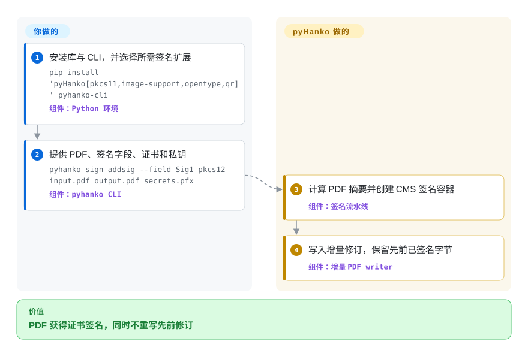

# pyHanko

一个用于 PDF 签名、时间戳、盖章和验证的 Python 库与配套 CLI，覆盖项目文档所述的 PAdES baseline 与长期验证工作流。

## 何时使用

你在构建 Python 服务或签名流水线，需要在保留现有 PDF 修订的同时加入证书签名、时间戳、吊销数据，或在之后验证签名。当一个栈内同时需要 PAdES B-B 至 B-LTA、PKCS#11、中断式远程签名和签名验证时，选 pyHanko；如果独立 Java 命令已经够用，而且应用 API 只会增加集成表面，则选 OpenPDFSign。

独立的 `pyhanko-cli` 包也让同一仓库适用于脚本化签名与验证。决定性取舍是更深的签名能力和 Python 控制力，代价则是你要负责私钥、信任根、时间戳、吊销信息获取和 PDF 互操作性。

## 怎么用起来

你安装库与 CLI，提供签名密钥材料或连接 PKCS#11 token，再选择签名字段和验证设置。pyHanko 在预留签名容器的同时计算 PDF 摘要，让已配置的 signer 产生 CMS 签名，然后把结果写成增量更新，从而保留先前已经签名的字节。PAdES LT/LTA 流程还会收集证书与吊销证据，并获取 RFC 3161 时间戳；密钥保管、信任配置、外部服务可用性和 LTA 时间戳链续期仍由你负责。Python API 在多个抽象层暴露同一流水线，包括异步和中断式签名接口。

<!-- flow-steps:begin (generated from flows/pyhanko.json by tools/flow_card.py — do not edit) -->

流程文字版

1. **你**：安装库与 CLI，并选择所需签名扩展 — `pip install 'pyHanko[pkcs11,image-support,opentype,qr]' pyhanko-cli` — 组件：`Python 环境`
2. **你**：提供 PDF、签名字段、证书和私钥 — `pyhanko sign addsig --field Sig1 pkcs12 input.pdf output.pdf secrets.pfx` — 组件：`pyhanko CLI`
3. **pyHanko**：计算 PDF 摘要并创建 CMS 签名容器 — 组件：`签名流水线`
4. **pyHanko**：写入增量修订，保留先前已签名字节 — 组件：`增量 PDF writer`

**价值**：PDF 获得证书签名，同时不重写先前修订

<!-- flow-steps:end -->

## 何时不用

- **只需要导入或组成页面，不需要密码学签名。** PHP 页面模板导入请选 FPDI，JavaScript 创建与编辑请选 [pdf-lib](pdf-lib.zh.md)；pyHanko 的签名和验证机制对排版任务没有必要。
- **想要小型独立 signer，并以 Java 进程作为部署边界。** 请选 OpenPDFSign；只有当 Python API、签名验证或高级 PAdES 生命周期控制值得更大的技术栈时，pyHanko 才更合适。
- **应用是 PHP 原生，而且需要直接操作 PDF 对象。** 当增量 PHP 对象模型是核心且签名需求能落在较窄能力面内时，选 [SAPP](sapp.zh.md)；只有需要更深的签名能力时，才值得为 pyHanko 引入 Python 进程边界。
- **需要覆盖 PDF 之外的通用 Python 密码学文档工具。** 如果同一包还要处理 S/MIME 和 XAdES，请评估 endesive；如果 PDF 增量更新分析、PAdES 和 LTV 才是决定性要求，则选 pyHanko。
- **要求开箱即有认证过的一致性或互操作证据。** 采用前应自行运行 profile、viewer、TSA、OCSP/CRL、信任链和异常输入测试；本次研究验证了项目文档及代码、包结构，没有独立验证 PAdES 或 PDF 一致性。[未验证]
- **要求上游明确声明 production-ready。** README 和包 classifier 仍把项目标为 beta；要么接受这种发布状态并做针对性资格验证，要么选择有商业支持的签名产品，不能把活跃发版直接当作生产就绪证明。
- **必须自动保留 PDF/A 或 PDF/UA 一致性。** 应使用签名后显式验证这些标准的流程；pyHanko 的 known-issues 页面说明，它不会强制执行这些标准的附加限制。

## 横向对比

| 替代品 | 是否收录 | 我们的评价 | 取舍 |
|---|---|---|---|
| OpenPDFSign | 未收录 | 需要专注的 Java CLI，通过进程边界给 PDF 签名时选 OpenPDFSign；需要 Python 嵌入、验证、PKCS#11、中断式签名或明确的 LT/LTA 生命周期控制时选 pyHanko。 | OpenPDFSign 把集成收窄到命令与 Java runtime；pyHanko 暴露更广的 API 和验证模型，也给应用增加更多配置与依赖表面。 |
| [SAPP](sapp.zh.md) | 已收录 | PHP 应用需要增量 PDF 对象访问，并在同一 runtime 签名时选 SAPP；Python 集成以及文档明确覆盖的 PAdES、验证、时间戳和远程签名流程更重要时选 pyHanko。 | SAPP 更小且为 PHP 原生；pyHanko 覆盖更多签名生命周期，但会引入 Python、PKI 配置和更大的依赖图。 |
| endesive | 未收录 | 一个 Python 包必须同时覆盖 PDF、S/MIME 与 XAdES 签名时选 endesive；核心要求是 PDF 专用增量更新、验证分析和 PAdES LT/LTA 流程时选 pyHanko。 | endesive 覆盖更多文档签名格式；pyHanko 把更多机制和文档集中在 PDF 签名及其验证生命周期上。 |
| [FPDI](fpdi.zh.md) | ✅ | 任务是把现有 PDF 页面作为模板导入 PHP 时选 FPDI；真正任务是保留修订并创建或验证密码学签名时选 pyHanko。 | FPDI 是页面导入库，不是签名栈；pyHanko 增加密码学与 PKI 能力，但不是通用页面组成替代品。 |

## 技术栈

- **语言与打包：** Python 3.10+ 的 `uv` workspace，发布为 `pyHanko`、`pyhanko-cli` 和 `pyhanko-certvalidator` 三个包；构建后端为 setuptools。
- **PDF 与签名模型：** 包含增量 PDF writer、签名字段与外观、CMS/ASN.1 容器、X.509 路径验证、吊销处理、文档差异分析，以及同步或异步签名 API。
- **密码学与网络：** 核心栈由 `cryptography`、`asn1crypto`、`lxml`、`aiohttp` 和仓库内的 `pyhanko-certvalidator` 组成。
- **可选能力：** 包括 PKCS#11 token、OpenType 字体、图片、二维码、ETSI trusted-list 处理、YAML CLI 配置，以及中断式或远程签名。

## 依赖

- **核心 runtime：** 截至 2026-09-22，声明要求 Python 3.10+、`asn1crypto>=1.5.1`、`tzlocal>=4.3`、`pyhanko-certvalidator`、`aiohttp>=3.9,<3.15`、`cryptography>=48.0.0` 和 `lxml>=5.4.0`。
- **CLI runtime：** 独立的 `pyhanko-cli` 包增加 Click、PyYAML、certifi 与 platformdirs，并安装 `pyhanko` 命令。
- **签名材料：** 需要私钥和证书链，常见来源包括 PEM/DER、PKCS#12、PKCS#11 硬件或远程 signer。材料由操作者提供，pyHanko 不负责配置身份或信任。
- **LTV 服务：** PAdES LT/LTA 通常需要可访问的 TSA 与吊销端点，以及显式配置的信任根。LTA 归档还需要日后维护时间戳链。
- **可选包：** `python-pkcs11`、fonttools/uharfbuzz、Pillow/python-barcode、qrcode 和 xsdata/signxml 只在对应能力启用时安装。

## 运维难度

**本地测试签名为低，生产 PAdES 与 LTV 为中到高。** 库与 CLI 在进程内运行，不需要数据库或 daemon，但安全边界包括私钥保管、证书链与信任根策略、TSA 和吊销服务可用性、网络超时、审计日志、依赖更新，以及有代表性的 PDF/viewer 互操作测试。硬件或远程 signer 还会增加 token/session 或 API 生命周期问题。B-LTA 不是一次性的归档开关：文档所述的时间戳链必须在最新时间戳失效前延长。

## 健康度与可持续性

- **维护：** Grade A——默认分支最近一次提交距评分 0 天，所测 13 周全部有活动；仓库未归档。
- **响应速度：** Grade A——中位首次响应时间为 2.1 小时，基于 5 个 qualifying issues。
- **采用广度：** Grade A——自动 registry 匹配选中了 `pyhanko-certvalidator`，测得 PyPI 月下载量 6,270,036，依赖仓库数 313。
- **长青度：** Grade A——仓库已创建 2,238 天，最近提交距评分 0 天；持续年龄与当前活跃度的组合，对垂直签名 library 是很强的 Lindy 信号。[推断]
- **治理集中度：** Grade D——过去 12 个月测得 8 名活跃维护者，但头部一人占贡献的 94.8%，前三人占 97.1%。
- **许可风险：** Grade A——GitHub 与包 metadata 都标识 MIT，仓库许可证包含 MIT 条款，评分器在 36 个月窗口内没有发现换证。相比许可证条款，beta 状态和作者集中度是更实质的采用警示。

## 存疑（未验证）

- [未验证] 本次没有运行独立的 PAdES 一致性、Acrobat/多 viewer 互操作、PDF/A、PDF/UA、异常输入、HSM、TSA 或吊销服务测试套件；功能和 profile 描述来自上游文档，不代表认证。
- [推断]“中到高”的生产运维难度来自密钥保管、PKI 策略、外部验证服务、互操作测试和 LTA 续期职责，并非实测基准。
- [推断] 健康度章节中的 Lindy 判断会把仓库年龄与当前提交、发版活动结合成选型先验，不是对未来维护的预测。
