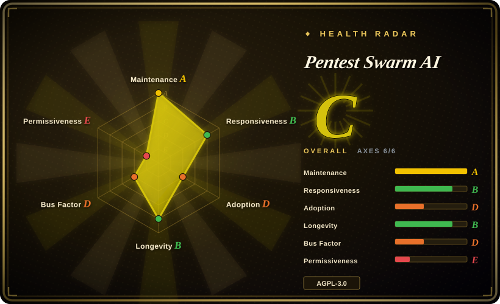
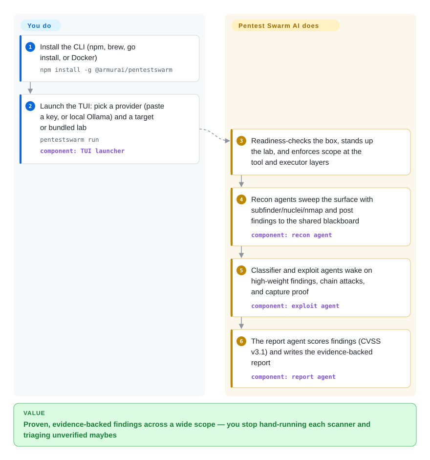

# Pentest Swarm AI

You hold written authorization over a wide web scope and a sequential scanner that takes all week to hand back a pile of unverified "maybes". Pentest Swarm AI sends a swarm of AI agents — recon, classify, exploit, report — at one authorized web target: they share findings on a live blackboard, exploit what they find, and only report vulnerabilities they actually proved.

## When to use

You're a bug-bounty hunter, pentester, or red teamer with explicit authorization over a broad web/API surface — hundreds of subdomains, a fresh program, a CTF, or an external attack surface you monitor continuously. Sequential scanning covers that breadth too slowly, and single-LLM "copilots" hand you suggestions you still execute by hand. You run `pentestswarm run`, pick a provider and a target — or a bundled vulnerable lab (crAPI, Juice Shop, VAmPI, DVGA) when you want a legal target with zero setup — and the agents work the surface concurrently: a recon finding wakes the classifier, a high-severity classification wakes the exploit agent, and the report lands with captured evidence per finding instead of scanner-grade "maybe" output.

The second trigger is provider freedom. XBOW-style autonomous pentesting is a closed hosted SaaS — their cloud, their model, their price. Here you bring any tool-calling model: Claude, any OpenAI-compatible endpoint, Together-hosted GLM/Qwen/DeepSeek, or fully local Ollama/LM Studio for air-gapped engagements where not one byte of target data leaves your box. The project supplies the hands — the real toolchain, scope enforcement, evidence capture, reporting — and the model only does the reasoning. If "self-hosted, any model, proves its findings" is the requirement, this is currently the most direct open-source fit.

## How it works

Pentest Swarm AI is a single Go binary that gives an LLM hands. **You pick the model and the target; the swarm runs the rest of the pipeline** — the part other tools leave to you. Coordination is stigmergic — agents don't wait for a central planner but read and write findings on a shared blackboard (in-memory by default; a Postgres 16 + pgvector backend is shipped as beta). Each finding carries a pheromone weight that biases other agents toward it and decays over time — an open port stays hot for hours, a session hint for minutes — so attack chains emerge from the board's state instead of a fixed pipeline, and stale paths die on their own. Scope (`--scope`) is enforced twice, at the tool layer and again at the executor, so an agent can't be pushed outside your authorization. Recon drives real tools (subfinder, httpx, nuclei, naabu, katana, dnsx, gau, nmap); exploitation is meant to prove rather than suggest — findings get CVSS v3.1 scores and captured evidence, and an optional second-opinion pass (Jev, off by default) filters false positives. Watch it live in the terminal TUI and the web dashboard on `localhost:7777`.

<!-- flow-steps:begin (generated from flows/pentest-swarm-ai.json by tools/flow_card.py — do not edit) -->

Text version of the flow

1. **You**: Install the CLI (npm, brew, go install, or Docker) — `npm install -g @armurai/pentestswarm`
2. **You**: Launch the TUI: pick a provider (paste a key, or local Ollama) and a target or bundled lab — `pentestswarm run` — component: `TUI launcher`
3. **Pentest Swarm AI**: Readiness-checks the box, stands up the lab, and enforces scope at the tool and executor layers
4. **Pentest Swarm AI**: Recon agents sweep the surface with subfinder/nuclei/nmap and post findings to the shared blackboard — component: `recon agent`
5. **Pentest Swarm AI**: Classifier and exploit agents wake on high-weight findings, chain attacks, and capture proof — component: `exploit agent`
6. **Pentest Swarm AI**: The report agent scores findings (CVSS v3.1) and writes the evidence-backed report — component: `report agent`

**Value**: Proven, evidence-backed findings across a wide scope — you stop hand-running each scanner and triaging unverified maybes

<!-- flow-steps:end -->

## When NOT to use

- **You need a stable, compliance-grade assessment.** The project itself labels the headline `--swarm` scheduler **alpha**, and as of 2026-09 the tracker carries open correctness bugs on the core path — swarm hangs (#65), a false-all-clear fix that sat unreleased for a week (#66), report generation without an HTTP timeout (#67), scope validation breaking on 301 redirects (#76). For a compliance deliverable, run established scanners directly (nuclei, nmap) or hire humans; treat this as an accelerator whose output still gets reviewed.
- **You want a copilot, not an autonomous runner.** If a human must decide each step — narrow or exotic targets, learning engagements — a suggest-only assistant (PentestGPT) fits better than a swarm that executes.
- **You can't carry the dependency stack.** A full campaign wants Postgres (+pgvector), Redis in compose, Docker for labs and tools, and a paid or local LLM. Minimal single-agent harnesses (HackingBuddyGPT) are lighter to stand up.
- **Your model can't do native tool/function calling.** That's the project's stated hard requirement; a small local model without it won't drive the swarm.
- **Target data must not touch any cloud.** Use the Ollama/LM Studio path — or if even a local agent writing findings into a Postgres board is too much, pick a different tool.
- **AGPL-3.0 clashes with your distribution model.** Offering a modified version as a network service obligates you to share modifications; MIT-licensed alternatives (PentAGI, PentestGPT, HackingBuddyGPT) avoid that.
- **The target isn't yours and isn't authorized.** Full stop — that's legal exposure (CFAA and equivalents), not a tooling question.

## Comparison

| Alternative | In index | Our verdict | Tradeoff |
|---|---|---|---|
| XBOW | not a repo | Choose XBOW when a managed, zero-ops autonomous pentest service is worth a closed SaaS; choose Pentest Swarm when self-hosting, model choice, and source access are non-negotiable. | XBOW is a closed hosted product (their cloud, their model, no public API); Pentest Swarm trades that polish and leaderboard provenance for an AGPL self-hosted swarm whose headline feature is still alpha. |
| PentAGI | not indexed | Choose PentAGI when you want a mature, larger pipeline (planner + 4 agents, 40+ tools via MCP/shell) executing today; choose Pentest Swarm when concurrent emergent chaining and any-provider freedom matter more than pipeline maturity. | PentAGI is a planner-ordered pipeline with more tools wired; Pentest Swarm replaces the planner with stigmergic blackboard coordination. Not added in this tab-intake batch. |
| PentestGPT | not indexed | Choose PentestGPT when you want an LLM that reasons about your pentest and suggests next commands while you drive; choose Pentest Swarm when the tool should execute the whole engagement itself. | Suggest-only single agent with no native tools or execution vs an autonomous swarm with evidence-backed reporting. Not added in this tab-intake batch. |
| HexStrike AI | not indexed | Choose HexStrike when your own agent (Claude/Cursor via MCP) needs 150+ security tools on call; choose Pentest Swarm when you want the whole campaign — planning, chaining, reporting — run for you. | HexStrike is a stateless MCP tool wrapper your client LLM orchestrates; Pentest Swarm is both orchestrator and toolchain. Not added in this tab-intake batch. |
| HackingBuddyGPT | not indexed | Choose HackingBuddyGPT to study and hack on a minimal, readable research harness; choose Pentest Swarm for an end-to-end productized campaign runner with labs and reports. | A deliberately tiny single agent with shell passthrough, ideal to extend in an afternoon; no swarm, no report pipeline, no bundled labs. Not added in this tab-intake batch. |

## Tech stack

- **Core:** Go 1.24 single binary; Cobra CLI + bubbletea TUI; Fiber web server; zap logging.
- **LLM providers:** anthropic-sdk-go plus OpenAI-compatible, Together, Gemini, OrcaRouter, Ollama, LM Studio; one orchestrator provider config inherited by all agents; prompt caching on Claude for recon/classifier.
- **Security toolchain:** ProjectDiscovery libraries (subfinder, httpx, nuclei, naabu, katana, dnsx, gau) + an nmap adapter, fetched by `pentestswarm install-tools`; sqlmap/Burp/Metasploit adapters still on the roadmap.
- **Blackboard:** in-memory by default; Postgres 16 + pgvector backend (beta) with pheromone decay in SQL. Redis 7 ships in the compose stack for rate limiting/session state [未验证] — no Redis client library appears in `go.mod`, so in-binary usage depth is unclear.
- **Surfaces:** terminal TUI, Next.js 15 web dashboard (:7777), API server (:8080), MCP server (`pentestswarm mcp serve`), VS Code extension and GitHub Action (both beta); five bundled playbooks (bug-bounty, external-ASM, CI/CD, internal-network, CTF).

## Dependencies

- **An LLM provider with native tool calling** — the hard requirement. Cloud (Claude default, Together, OpenAI-compatible, Gemini, OrcaRouter) or fully local (Ollama, LM Studio).
- **Postgres 16 (+pgvector)** for the DB-backed blackboard; the runner falls back to the in-memory board.
- **Redis 7** in `deploy/docker-compose*.yml`, checked by `pentestswarm doctor`.
- **Docker** for the bundled vulnerable labs (crAPI, Juice Shop, VAmPI, DVGA) and tool isolation.
- **External security tools** — subfinder/httpx/nuclei/naabu/katana/dnsx/gau/nmap, fetched on demand.
- **Ports:** 8080 (API), 7777 (dashboard).

## Ops difficulty

**Medium-high.** Install is genuinely one command (npm/brew/go/docker) and the TUI launcher hides flags, readiness checks, and lab spin-up behind `pentestswarm run`. But a real campaign runs Postgres + Redis + Docker + a recon toolchain + an LLM budget; SIGINT, crashes, and budget exhaustion trigger reverse-order cleanup (a stable feature), and `--scope` must be stated correctly because it is the safety mechanism. Release cadence is extreme — 31 releases in ~5 months, v0.2.x near-daily in September 2026 — so pin a version and re-verify behavior on upgrade, and expect alpha-stage edges (swarm scheduler, dashboard wiring) to require filing issues.

## Health & viability

- **Maintenance (2026-09-28):** exceptionally active — v0.2.29 released today, 31 releases since the first (v0.1.0, 2026-05-07), near-daily releases through September; maintainer responds in issue threads.
- **Governance / bus factor:** organization-backed (Armur AI, a security vendor) with an open-core Enterprise edition (cross-engagement learning, RBAC/SSO, live CVE-chain feed, SIEM integrations), but effectively single-maintainer: the top contributor holds ~94% of contributions (492 of ~520). The roadmap is the vendor's.
- **Age & Lindy:** repo created 2024-03, but only released since 2026-05 — about 5 months as a product. High star velocity (~2.7k) on a young, pre-benchmark project is a hype flag, not proof; the project itself labels the swarm scheduler alpha and defers benchmarks to the roadmap.
- **Adoption:** ADOPTERS.md is an empty template; community lives on Discord; no third-party benchmark numbers exist yet, and the README's comparison table is self-positioned. [推断]
- **Risk flags:** AGPL-3.0 (strong copyleft including network use); open-core split, though the README commits to keeping exploit classes in the community edition; an open PR (#71, 2026-09) reports 11 known CVEs in the Go toolchain/dependencies awaiting a bump; several open correctness bugs sit on the core path (see When NOT to use).

## Caveats (unverified)

- [未验证] "Redis 7 — rate limiting, session state" (README tech-stack table): Redis appears in compose files, config, and the `doctor` TCP check, but no Redis client library is in `go.mod` — actual in-binary usage was not audited.
- [未验证] Exploit-class coverage ("BOLA/IDOR, JWT forgery, mass assignment, SSRF, injection, GraphQL, BFLA") is the README's own claim; no scan was reproduced for this page.
- [未验证] Swarm-scale claims ("dozens of agents", "machine speed", 1,000-subdomain targets) are marketing framing; first-party benchmarks are roadmap items, not shipped results.
- [未验证] XBOW's characterization (closed SaaS, single agent) comes from this project's own positioning; not independently verified.
- [推断] ~2.7k stars against ~5 months of releases reads as rapid attention growth, not established production adoption; ADOPTERS.md lists no organizations.
- [未验证] Star/fork counts (2,653/485), issue states, and release counts are point-in-time as of 2026-09-28.
