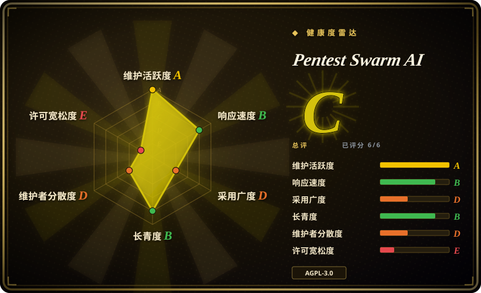
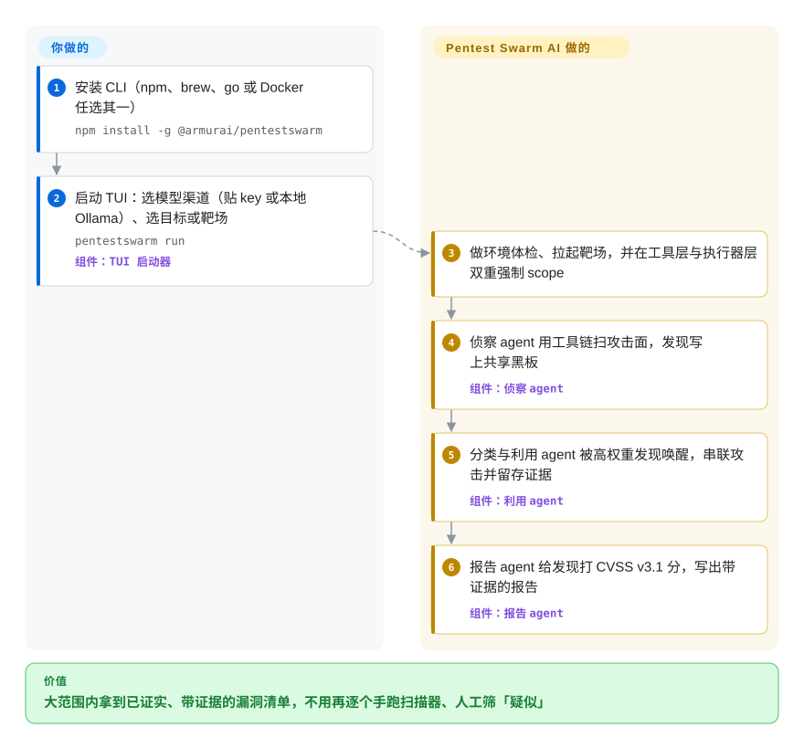

# Pentest Swarm AI

手握一整片授权过的 web 攻击面，顺序跑扫描器要一整周，最后拿到的还是一堆要人工复核的「疑似」。Pentest Swarm AI 放出一群各有分工的 AI agent——侦察、分类、利用、报告——并行打同一个授权目标：发现实时写上共享黑板，只有真正利用成功、留下证据的漏洞才会进报告。

## 何时使用

你是赏金猎人、渗透测试工程师或红队成员，对一片很宽的 web／API 攻击面持有明确书面授权——成百上千个子域、刚开的赏金项目、CTF，或需要持续监控的外部资产。顺序扫描覆盖这种广度太慢，单 LLM「副驾驶」给的建议还得你自己一条条去敲。你运行 `pentestswarm run`，选好模型渠道和目标——或选一个内置靶场（crAPI、Juice Shop、VAmPI、DVGA），零搭建拿到合法目标——然后一群 agent 并行开工：侦察发现一落板就唤醒分类 agent，高严重度分类唤醒利用 agent，最后落地的报告里每条发现都带抓取到的证据，而不是扫描器那种「疑似」输出。

第二个触发点是模型自由。XBOW 式自主渗透测试是闭源托管 SaaS——人家的云、人家的模型、人家的定价。这里你带任何支持工具调用的模型：Claude、任何 OpenAI 兼容端点、Together 托管的 GLM／Qwen／DeepSeek，或完全本地的 Ollama／LM Studio，做隔离演练时目标数据一个字节都不出你的机器。项目负责「手」——真实工具链、scope 强制、证据留存、报告生成——模型只负责推理。如果要求是「自托管、任选模型、发现要实证」，这是目前最直接的开源答案。

## 怎么用起来

Pentest Swarm AI 是一个 Go 单二进制，给 LLM 装上「手」。**你只选模型和目标，剩下的流水线由 swarm 跑完**——也就是别的工具留给你自己做的那部分。协调机制是共识激发（stigmergy）：agent 不等中央调度器指挥，而是读写一块共享黑板（默认在内存里，Postgres 16 + pgvector 后端已随 beta 提供）。每条发现带一个信息素权重，会引导其他 agent 跟进并随时间衰减——开放端口能热几个小时，会话线索只热几分钟——于是攻击链从黑板状态里涌现，而不是写死在流水线里，过期的路径会自然死掉。Scope（`--scope`）被强制两道——工具层一道、执行器再一道——agent 无法被提示词推出你的授权范围。侦察驱动真实工具（subfinder、httpx、nuclei、naabu、katana、dnsx、gau、nmap）；利用阶段的定位是「证实」而非「建议」——发现会打 CVSS v3.1 分并附抓取的证据，可选的第二意见过滤器（Jev，默认关闭）压误报。全程可以在终端 TUI 和 `localhost:7777` 的网页仪表盘里实时围观。

<!-- flow-steps:begin (generated from flows/pentest-swarm-ai.json by tools/flow_card.py — do not edit) -->

流程文字版

1. **你**：安装 CLI（npm、brew、go 或 Docker 任选其一） — `npm install -g @armurai/pentestswarm`
2. **你**：启动 TUI：选模型渠道（贴 key 或本地 Ollama）、选目标或靶场 — `pentestswarm run` — 组件：`TUI 启动器`
3. **Pentest Swarm AI**：做环境体检、拉起靶场，并在工具层与执行器层双重强制 scope
4. **Pentest Swarm AI**：侦察 agent 用工具链扫攻击面，发现写上共享黑板 — 组件：`侦察 agent`
5. **Pentest Swarm AI**：分类与利用 agent 被高权重发现唤醒，串联攻击并留存证据 — 组件：`利用 agent`
6. **Pentest Swarm AI**：报告 agent 给发现打 CVSS v3.1 分，写出带证据的报告 — 组件：`报告 agent`

**价值**：大范围内拿到已证实、带证据的漏洞清单，不用再逐个手跑扫描器、人工筛「疑似」

<!-- flow-steps:end -->

## 何时不用

- **你要稳定、可交付合规的评估结果。** 项目自己把招牌的 `--swarm` 调度器标为 alpha，且截至 2026-09 核心链路上还挂着多个未修的正确性 bug——swarm 挂起（#65）、一次「全线误报安全」的修复拖了一周才发版（#66）、报告生成没有 HTTP 超时（#67）、301 跳转破坏 scope 校验（#76）。合规交付请直接跑成熟扫描器（nuclei、nmap）或雇人测试；把它当加速器，产出仍要人工复核。
- **你要副驾驶，不是自动驾驶。** 如果每一步都必须人来拍板——目标窄、目标怪、以学习为目的——PentestGPT 式只建议不执行的工具更合适。
- **背不动这套依赖。** 完整战役要 Postgres（+pgvector）、compose 里的 Redis、跑靶场和工具的 Docker，加一个付费或本地 LLM。HackingBuddyGPT 式极简单 agent 更轻。
- **你的模型不支持原生工具调用。** 这是项目声明的硬性要求；不支持的小本地模型带不动 swarm。
- **目标数据一个字节都不能上云。** 走 Ollama／LM Studio 本地路线——如果连本地 agent 把发现写进 Postgres 黑板都不能接受，换工具。
- **AGPL-3.0 与你的分发模式冲突。** 把改过的版本做成网络服务就必须开源改动；MIT 许可的替代品（PentAGI、PentestGPT、HackingBuddyGPT）没有这层义务。
- **目标不属于你、也没有授权。** 到此为止——这是法律风险（CFAA 及各国同类法），不是工具选型问题。

## 横向对比

| 替代品 | 是否收录 | 我们的评价 | 取舍 |
|---|---|---|---|
| XBOW | 非仓库 | 想要零运维的托管式自主渗透服务、能接受闭源 SaaS 时选 XBOW；自托管、任选模型、要源码是硬要求时选 Pentest Swarm。 | XBOW 是闭源托管产品（它的云、它的模型、无公开 API）；Pentest Swarm 用 alpha 阶段的毛边和运维负担换来自托管的开源 swarm。 |
| PentAGI | 未收录 | 想要今天就能跑的成熟流水线（规划器 + 4 agent、40+ 工具经 MCP／shell 接入）时选 PentAGI；并发涌现的攻击链和任意模型自由更重要时选 Pentest Swarm。 | PentAGI 是规划器排序的流水线、接入工具更多；Pentest Swarm 用共识激发的黑板协调替代规划器。本批 tab-intake 未收录。 |
| PentestGPT | 未收录 | 想让 LLM 帮你推理、建议下一条命令、由你亲自执行时选 PentestGPT；想让工具自己跑完整场演练时选 Pentest Swarm。 | 只建议不执行的单 agent（无原生工具、无执行）对比带证据报告的自主 swarm。本批 tab-intake 未收录。 |
| HexStrike AI | 未收录 | 你自己的 agent（经 MCP 的 Claude／Cursor）需要随叫随到的 150+ 安全工具时选 HexStrike；要整场战役——规划、串链、报告——替你跑完时选 Pentest Swarm。 | HexStrike 是无状态的 MCP 工具包装器，由你的客户端 LLM 编排；Pentest Swarm 自带编排和工具链。本批 tab-intake 未收录。 |
| HackingBuddyGPT | 未收录 | 想研读、魔改一个极简可读的研究骨架时选 HackingBuddyGPT；要端到端产品化的战役执行器（带靶场和报告）时选 Pentest Swarm。 | 刻意做小的单 agent 加 shell 直通，一下午就能改起来；没有 swarm、没有报告流水线、没有内置靶场。本批 tab-intake 未收录。 |

## 技术栈

- **核心：** Go 1.24 单二进制；Cobra CLI + bubbletea TUI；Fiber web 服务；zap 日志。
- **LLM 渠道：** anthropic-sdk-go 加 OpenAI 兼容、Together、Gemini、OrcaRouter、Ollama、LM Studio；一份 orchestrator 渠道配置被所有 agent 继承；Claude 上对侦察／分类 agent 默认开提示词缓存。
- **安全工具链：** ProjectDiscovery 库（subfinder、httpx、nuclei、naabu、katana、dnsx、gau）加 nmap 适配器，由 `pentestswarm install-tools` 拉取；sqlmap／Burp／Metasploit 适配器还在路线图上。
- **黑板：** 默认内存版；Postgres 16 + pgvector 后端（beta）支持用 SQL 做信息素衰减。compose 栈里带 Redis 7，号称做限流与会话状态 [未验证]——`go.mod` 里没有任何 Redis 客户端库，二进制内的实际使用深度不明。
- **界面：** 终端 TUI、Next.js 15 网页仪表盘（:7777）、API 服务（:8080）、MCP 服务（`pentestswarm mcp serve`）、VS Code 扩展与 GitHub Action（均 beta）；五份内置 playbook（赏金、外部 ASM、CI/CD、内网、CTF）。

## 依赖

- **一个支持原生工具调用的 LLM 渠道**——硬性要求。云端（默认 Claude，或 Together、OpenAI 兼容、Gemini、OrcaRouter）或完全本地（Ollama、LM Studio）。
- **Postgres 16（+pgvector）** 供数据库版黑板；执行器默认退回内存黑板。
- **Redis 7** 在 `deploy/docker-compose*.yml` 里，`pentestswarm doctor` 会检查。
- **Docker** 跑内置靶场（crAPI、Juice Shop、VAmPI、DVGA）和工具隔离。
- **外部安全工具**——subfinder/httpx/nuclei/naabu/katana/dnsx/gau/nmap，按需拉取。
- **端口：** 8080（API）、7777（仪表盘）。

## 运维难度

**中高。** 安装确实一条命令（npm／brew／go／docker 任选），`pentestswarm run` 的 TUI 启动器把参数、环境体检、靶场拉起都藏在了交互界面后面。但一场真正的战役要跑 Postgres + Redis + Docker + 侦察工具链 + LLM 预算；SIGINT、崩溃和预算耗尽都会触发逆序清理（稳定特性），而 `--scope` 必须写对，因为它就是那道安全机制。发版节奏极端——约 5 个月 31 个 release，2026 年 9 月里 v0.2.x 几乎天天发——请锁定版本、升级时重新验证行为，并预期 alpha 阶段的毛边（swarm 调度器、仪表盘接线）需要你去提 issue。

## 健康度与可持续性

- **维护（2026-09-28）：** 极度活跃——v0.2.29 当天发布，自首个 release（v0.1.0，2026-05-07）以来 31 个 release，9 月里近乎日更；维护者在 issue 里响应及时。
- **治理／巴士系数：** 组织背景（安全厂商 Armur AI），带 open-core 的企业版（跨战役学习、RBAC／SSO、CVE 链实时订阅、SIEM 集成），但实际是单一维护者：首席贡献者占约 94% 的提交量（约 520 次里的 492 次）。路线图归厂商。
- **年龄／Lindy：** 仓库 2024-03 创建，但 2026-05 才发第一个 release——作为产品只有约 5 个月。年轻项目上 ~2.7k 的高星速是热度信号而非证明；项目自己也把 swarm 调度器标为 alpha，基准测试推给了路线图。
- **采用：** ADOPTERS.md 还是空模板；社区在 Discord；没有第三方基准数字，README 的对比表是自我定位。[推断]
- **风险旗标：** AGPL-3.0（含网络使用的强传染）；open-core 分层真实存在，不过 README 承诺漏洞利用类别留在社区版；一个未合并 PR（#71，2026-09）报告 Go 工具链／依赖里有 11 个已知 CVE 待升级；核心链路上还挂着数个正确性 bug（见何时不用）。

## 存疑（未验证）

- [未验证] 「Redis 7——限流与会话状态」（README 技术栈表）：Redis 出现在 compose 文件、配置和 `doctor` 的 TCP 检查里，但 `go.mod` 中没有任何 Redis 客户端库——二进制内的实际使用情况未审计。
- [未验证] 漏洞类别覆盖（「BOLA/IDOR、JWT 伪造、批量赋值、SSRF、注入、GraphQL、BFLA」）是 README 自述；本页未复现任何扫描。
- [未验证] swarm 规模相关说法（「几十个 agent」「机器速度」「千级子域目标」）是营销口径；第一方基准测试是路线图项，不是已交付结果。
- [未验证] 对 XBOW 的刻画（闭源 SaaS、单 agent）来自本项目自己的定位；未独立核实。
- [推断] 约 5 个月 release 史配 ~2.7k star 更像注意力快速聚集，而非成熟生产采用；ADOPTERS.md 未列出任何组织。
- [未验证] star／fork 数（2,653/485）、issue 状态和 release 计数均为 2026-09-28 时点快照。
