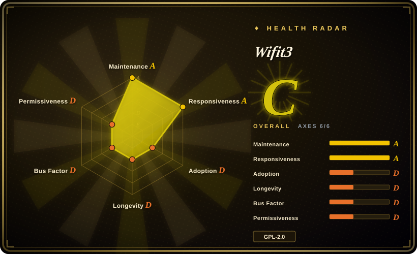
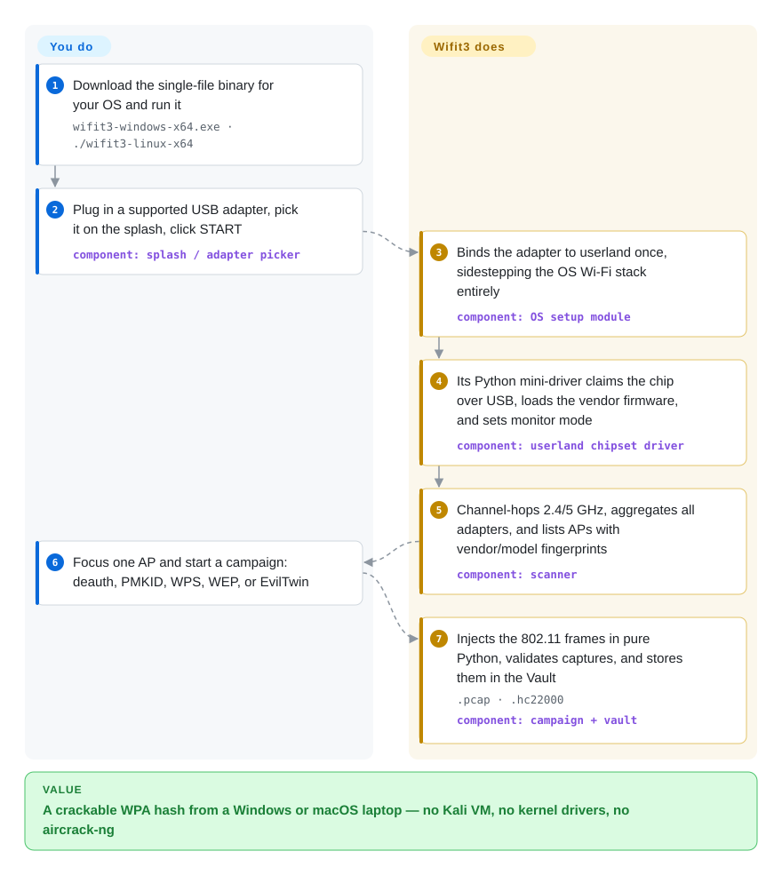

# Wifit3

You plug a USB Wi-Fi adapter into a Windows or macOS laptop to run a wireless audit — and monitor mode, the ability to capture and forge arbitrary 802.11 frames, simply isn't there; on Linux, the kernel driver that enables injection often doesn't compile against your current kernel. Wifit3 ships Python ports of the adapters' own chipset drivers, so the app drives the radio directly over USB, bypassing the OS Wi-Fi stack, and scanning, frame injection, and WPA capture work the same on Linux, Windows, and macOS.

## When to use

You're a pentester or homelab auditor with written authorization over a Wi-Fi target, and your laptop is a Windows work machine or a Mac, not a Kali box. The standard recipe — wifite2 or the aircrack-ng suite — needs OS monitor mode, a kernel driver that compiles, and a whole toolchain you have to install; macOS and Windows don't offer monitor mode at all. Wifit3 gives you a single per-OS binary: plug in a supported dongle, click `START`, and it binds the device to userland once (a `pkexec`/UAC prompt) and runs the audit from pure Python — no `aircrack-ng`, no `reaver`, no VM. Pick it over its own ancestor wifite2 when cross-platform reach and zero toolchain dependency are the deciding constraints, not raw breadth of supported hardware.

The second trigger is Linux kernel-driver pain. The classic Wi-Fi audit stack lives or dies by DKMS drivers matching your kernel version; wifit3 sidesteps the kernel entirely, and its default ports for cards like the RTL8812AU and RTL8814AU are translations of the *vendor DKMS* drivers, per-chip-graded against the kernel driver on real captures. And because the whole 802.11 attack surface — frame crafting, WPS EAP exchanges, WEP's RC4 attacks, EAPOL harvesting — is readable Python under `src/wifit3/`, it doubles as a reference implementation for how these attacks actually work, which the C toolchains don't offer.

## How it works

The division of labor: *you* bring one supported USB adapter and accept one elevation prompt; *wifit3* brings everything between the USB bus and the finished attack. On first run per device, its setup module either writes udev rules and a modprobe blacklist (Linux), installs a WinUSB binding via a vendored `wdi-simple.exe` (Windows), or asks for nothing but an "Allow" dialog (macOS) — that's how the dongle leaves the OS Wi-Fi stack. Then a per-chipset "mini-driver" — a hand-ported Linux kernel or vendor driver (ath9k_htc, mt76, rt2x00, Realtek DKMS) — takes the chip over via USB bulk/control transfers, uploads a bundled vendor firmware blob, and puts the radio in monitor mode itself, register by register, in user space; Windows NDIS restrictions and Linux kernel locking never enter the picture. Above that chip layer you drive a Textual terminal TUI: it channel-hops 2.4/5 GHz (aggregating several adapters at once, with one picked for injection), fingerprints APs and clients down to router make and model, and runs campaigns — deauth → 4-way handshake, PMKID harvest, WPS PixieDust / Push-Button / resumable PIN brute force, WEP chopchop / ARP replay, EvilTwin WPA3 downgrade — all crafted in pure Python, not shelled out to aircrack-ng. Captures land in a persistent Vault as `.pcap` / `.hc22000`, and the Vault can launch *your* installed hashcat binary (`-m 22000`) against them; wifit3 itself never cracks, only captures.

<!-- flow-steps:begin (generated from flows/wifit3.json by tools/flow_card.py — do not edit) -->

Text version of the flow

1. **You**: Download the single-file binary for your OS and run it — `wifit3-windows-x64.exe · ./wifit3-linux-x64`
2. **You**: Plug in a supported USB adapter, pick it on the splash, click START — component: `splash / adapter picker`
3. **Wifit3**: Binds the adapter to userland once, sidestepping the OS Wi-Fi stack entirely — component: `OS setup module`
4. **Wifit3**: Its Python mini-driver claims the chip over USB, loads the vendor firmware, and sets monitor mode — component: `userland chipset driver`
5. **Wifit3**: Channel-hops 2.4/5 GHz, aggregates all adapters, and lists APs with vendor/model fingerprints — component: `scanner`
6. **You**: Focus one AP and start a campaign: deauth, PMKID, WPS, WEP, or EvilTwin
7. **Wifit3**: Injects the 802.11 frames in pure Python, validates captures, and stores them in the Vault — `.pcap · .hc22000` — component: `campaign + vault`

**Value**: A crackable WPA hash from a Windows or macOS laptop — no Kali VM, no kernel drivers, no aircrack-ng

<!-- flow-steps:end -->

## When NOT to use

- **Your adapter isn't on the supported-chip list.** This tool works with exactly ~19 chipsets (AR9271, MT7610U/7612U/7921AU/7925U, the RT2xxx/RT3070/RT537x family, RTL8187L/8188EUS/8812AU/8814AU/8821AU/8821CU/8822BU/8822CU/8922AU) — no internal or PCIe cards, and cards outside it are dead ends. If you already have a kernel-supported adapter on Linux, the classic aircrack-ng + `iw` stack drives far more hardware; reach for that instead of buying a dongle to match the tool.
- **You need battle-tested breadth or headless scripting.** Aircrack-ng's suite and hcxdumptool are CLI, scriptable, and field-tested across 15+ years of edge cases; wifit3's product surface is an interactive TUI (the console entry boots the Textual app; a headless mode exists only as a CI packaging self-test). For a scripted or CI-driven audit, use the classic tools.
- **Your target card grades poorly on its own merits.** The maintainer's dated benchmark matrix (2026-07) puts RTL8814AU RX at broken (grade D) and RT2500USB at D; RTL8187L's hard MAC can't auto-ACK spoofed addresses, which constrains WPS. If your engagement depends on one of those chips, run the kernel driver on Linux instead.
- **You cannot tolerate hardware risk.** There are no kernel guardrails between the app and the radio: the project's own porting methodology says to bring up chips "on a card you can afford to lose." A card the OS still needs for Wi-Fi is one bad register sequence from being unusable until the documented replug recovery works. If that risk is unacceptable, don't bind the card to userland at all.
- **Your org prohibits unsigned binaries or redistributed firmware blobs.** The Windows driver-binding helper `wdi-simple.exe` is vendored unsigned (with full build provenance and SHA-256s in the repo), and the app ships 24 vendor firmware binaries under their manufacturers' redistribution licenses. If procurement or policy can't clear that, the Linux kernel stack is the compliant route.
- **The network is yours or unauthorized targets are in scope.** The tool captures handshakes and deauthenticates clients; do this only on networks you own or have written permission to audit — that's legal exposure, not a tooling choice.

## Comparison

| Alternative | In index | Our verdict | Tradeoff |
|---|---|---|---|
| wifite2 (`kimocoder/wifite2`, rewrite of `derv82/wifite`) | not indexed | Choose wifite2 when you're already on Linux/Kali and want a decade-plus-proven wrapper over whatever monitor-mode hardware you own; choose wifit3 when the audit must run on Windows or macOS, or when kernel-driver DKMS churn is your blocker. | Same problem space and lineage (the original wifite repo dates to 2012, dormant since 2022-09; the maintained rewrite is kimocoder's): wifite2 orchestrates external aircrack-ng/reaver through OS monitor mode and supports many more adapters; wifit3 carries its own userland drivers and TUI to buy cross-platform reach at the cost of a supported-dongle list. Not added in this tab-intake batch. |
| aircrack-ng | not indexed | Choose the aircrack-ng suite when you need the reference capture/injection toolkit on Linux and maximum chipset coverage through kernel drivers; choose wifit3 when installing that toolchain (or any OS monitor mode) isn't an option. | Mature, scriptable, community-battle-tested — but Linux-only in practice, and its weakest point is exactly what wifit3 replaces: driver/toolchain installation. Not added in this tab-intake batch. |
| hcxdumptool (`ZerBea/hcxdumptool`) | not indexed | Choose hcxdumptool when your whole job is harvesting PMKIDs/EAPOL for hashcat on Linux in a CLI you can script; choose wifit3 when you want the guided scan → focus → campaign → Vault flow, and on an OS hcxdumptool can't get monitor mode on. | A lean single-purpose capture specialist riding the kernel stack; wifit3 reimplements the capture path in userland Python. Not added in this tab-intake batch. |
| Kismet | not indexed | Choose Kismet when you need passive wireless recon/IDS with logging and a web server, not attacks; choose wifit3 when the engagement requires the active half (deauth, PMKID, WPS, EvilTwin). | Kismet is 20+ years old and multi-sensor; it deliberately does not inject frames, so campaigns still need another tool. Not added in this tab-intake batch. |
| bettercap | not indexed | Choose bettercap when your target is on-LAN protocol attacks (ARP/DNS/TLS) from a Linux hub; choose wifit3 when the target is the 802.11 radio itself and you need frame-level control cross-platform. | bettercap is a modular network-attack framework whose Wi-Fi story rides OS monitor mode; wifit3 is Wi-Fi-only but owns the hardware path. Not added in this tab-intake batch. |

## Tech stack

- **Core:** Python ≥ 3.11, GPL-2.0-only; `uv` + hatchling; PyInstaller one-file binaries (Windows x64, Linux x64/arm64, macOS universal2).
- **USB / driver layer:** `pyusb` + `libusb-package` (libusb shipped in the bundle); per-chipset userland drivers in `src/wifit3/chips/` translated from Linux kernel (ath9k_htc, mt76, rt2x00) and Realtek vendor DKMS sources, plus 24 vendored firmware blobs byte-verified against upstream (`docs/FIRMWARE.md`).
- **Windows binding:** vendored libwdi `wdi-simple.exe` (x64 + arm64, unsigned, documented provenance) to attach WinUSB to the adapter.
- **Protocol / attack layer:** pure-Python 802.11 frame crafting (`dot11/`), WPS (`wsc/`, PixieDust, PBC, PIN), WEP RC4 attacks, EAPOL handshake + PMKID parsing with `.hc22000` export.
- **UI:** Textual + Rich terminal app — splash/adapter picker, scanner, focus screen, Vault; ASCII card-art per adapter model.

## Dependencies

- **One supported USB Wi-Fi adapter** — a hard requirement the README states up front.
- **One elevation per device:** `pkexec`/sudo on Linux (writes udev rules + `/etc/modprobe.d/` blacklist), UAC on Windows (WinUSB), an "Allow" dialog on macOS; uninstall path returns the device to the OS stack.
- **hashcat + your wordlist** only if you crack captured hashes — wifit3 launches *your* `hashcat_exe`; it ships no cracker.
- No runtime `aircrack-ng`, `reaver`, or similar — attacks run in-process.
- VirtualBox users: add the device to USB Filters before plugging in.

## Ops difficulty

**Low, with a beta caveat.** Run one binary, click through a one-time device binding, replug the adapter to clear wedged state — the documented recovery. There is no service, database, or network setup. But releases are `v0.x` marked BETA through v0.3.4 (2026-09-27) at near-weekly cadence, so pin a version and re-check the per-chip grade table before each engagement; capabilities genuinely differ by chipset.

## Health & viability

- **Maintenance (2026-09-28):** exceptionally active — 2,453 commits on `master` since creation, 20 releases from v0.0.1 (2026-08-03) to v0.3.4 BETA (2026-09-27), commits the day this page was written; issues triaged with fixes (hardware requests, RX regressions) within days.
- **Governance / bus factor:** effectively single-maintainer — `derv82` holds ~95% of commits (2,322 of ~2,448 listed). Mitigating context: he is the author of wifite (repo created 2012, pushed through 2022; the maintained rewrite wifite2 is now kept alive by kimocoder), so this is a long-tenured owner of this exact problem space, not a fly-by-night one. Development is heavily agent-assisted (a `claude` contributor account with 63 commits, `AGENTS.md` porting playbooks); the repo states human-facing docs are human-written.
- **Age & Lindy:** repo created 2026-06-20 — roughly 3 months old at v0.x BETA. ~1.4k stars and 119 forks in that window is a hype signal, not a durability proof; the Lindy bet here is on the wifite lineage, not this repo's own age.
- **Adoption:** no registry presence (not on PyPI — installation is binaries or `uv` from source); adoption signal is GitHub stars/forks and hardware-support issues from users; docs quality (per-chip grade tables, firmware provenance, porting methodology) is unusually high for the age. [推断] — no third-party usage data was available to check.
- **Risk flags:** GPL-2.0-only code plus 24 vendor firmware blobs redistributed verbatim (byte-verified against `linux-firmware`/vendor arrays, per-mfr licenses); vendored *unsigned* `wdi-simple.exe` for Windows driver binding (provenance + rebuild steps recorded); dual-use offensive tool — expect antivirus/SmartScreen friction on the binaries [未验证：未实测扫描]; some chipsets still below parity (RTL8814AU, RT2500USB graded D by the maintainer's own 2026-07 matrix).

## Caveats (unverified)

- [未验证] The per-chip RX/TX/ACK/stress grades in `docs/SUPPORTED-HARDWARE.md` (dated 2026-07) are the maintainer's own benchmark runs against a reference AP; not reproduced for this page.
- [未验证] Antivirus/SmartScreen friction on the unsigned release binaries — asserted from the vendored-unsigned facts, no scan performed.
- [推断] WPA3-only targets are outside the capture path: the README's WPA3 story is transition-mode tracking plus an EvilTwin *downgrade* campaign; no independent test of a strict WPA3-only AP was run for this page.
- [推断] "Single-maintainer" from GitHub contributors listing (2,322/~2,448); the human/agent split of commits (the `claude` account) is inferred from repo docs, not audited per commit.
- [未验证] Star/fork/issue counts (1,434 / 119 / 6 open), 20 releases, and 2,453 commits are point-in-time as of 2026-09-28.
