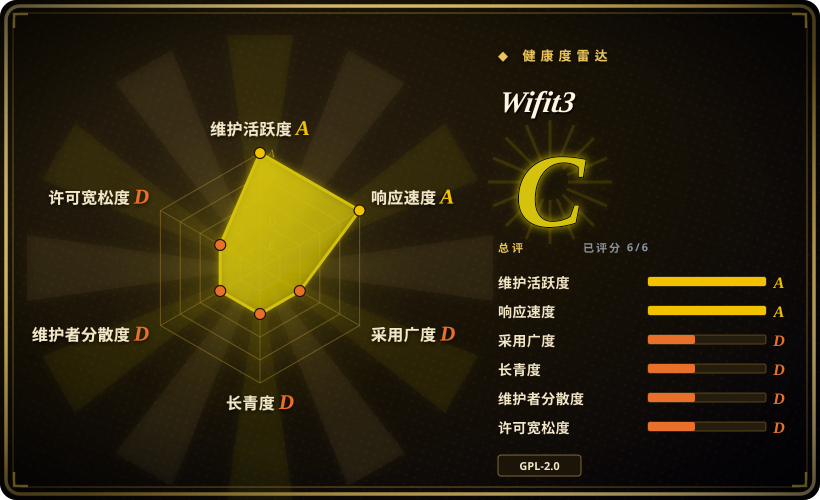
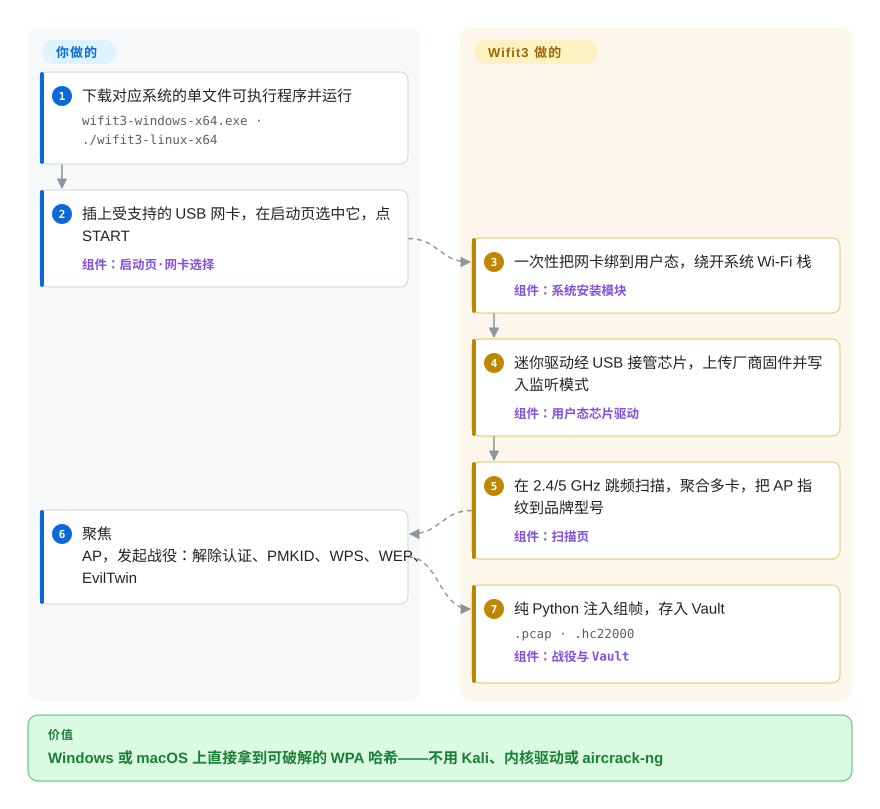

# Wifit3

想用笔记本做 Wi-Fi 安全审计，Windows 和 macOS 压根不提供监听模式（monitor mode，即抓取并伪造任意 802.11 帧的前提）；Linux 上能开监听注入的内核驱动又常和当前内核版本打架。Wifit3 把网卡芯片的驱动重写成 Python 内置在应用里，越过系统 Wi-Fi 栈直接经 USB 控制芯片，让同一套扫描、注入与 WPA 抓取在三个平台上行为一致。

## 何时使用

你是渗透测试者或家庭实验室审计者，手里有一纸授权和一个 Wi-Fi 目标，但手上的电脑是 Windows 工牌机或 Mac，不是 Kali 盒子。经典配方——wifite2 或 aircrack-ng 全家桶——要系统级监听模式、能编译的内核驱动、外加一整条要装的工具链；macOS 与 Windows 根本没有监听模式可用。Wifit3 每个系统只有一个可执行文件：插上受支持的 USB 网卡，点 `START`，它一次性把设备绑到用户态（`pkexec`／UAC 提权一次），之后全部攻击逻辑跑在纯 Python 里——不装 `aircrack-ng`，不装 `reaver`，不开虚拟机。当「跨平台、零工具链」是决定性约束、而硬件覆盖广度可以妥协时，选它而不是它自己的前身 wifite2。

第二个触发条件是 Linux 内核驱动之痛。经典审计栈的生死取决于 DKMS 驱动能否匹配你的内核版本；Wifit3 完全不进内核，且 RTL8812AU、RTL8814AU 这类卡的默认移植来自*厂商 DKMS 驱动*本体，每款芯片都对照内核驱动用真实抓包打分。另外，整套 802.11 攻击面——组帧、WPS EAP 交互、WEP 的 RC4 攻击、EAPOL 抓取——都是 `src/wifit3/` 下可读的 Python，它顺带就成了「这些攻击到底怎么工作」的参考实现，这是 C 工具链给不了的。

## 怎么用起来

分工是这样：*你*出一块受支持的 USB 网卡，并接受一次提权弹窗；*Wifit3*负责从 USB 总线到攻击完成的一切。首次连接某设备时，安装模块在 Linux 写 udev 规则与 modprobe 黑名单、在 Windows 用自带的 `wdi-simple.exe` 绑 WinUSB 驱动、在 macOS 只要一个「允许」对话框——网卡由此脱离系统 Wi-Fi 栈。随后每款芯片一个的「迷你驱动」——由 Linux 内核驱动（ath9k_htc、mt76、rt2x00）或 Realtek 厂商 DKMS 驱动手工移植的 Python——经 USB 批量／控制传输接管芯片，自己上传打包好的厂商固件 blob，自己把电台写进监听模式，全程在用户态逐寄存器操作，Windows NDIS 限制和 Linux 内核锁都不参与。芯片层之上是一个 Textual 终端界面：它在 2.4／5 GHz 信道上跳频扫描（可同时聚合多块网卡、指定一块负责注入），把 AP 与客户端指纹到路由器的品牌型号，然后跑各种攻击战役——解除认证逼出四次握手、PMKID 收割、WPS PixieDust／按键／可断点续跑的 PIN 爆破、WEP 的 chopchop 与 ARP 重放、EvilTwin 的 WPA3 降级——组帧全部纯 Python，不调外部工具。战果进入持久化的 Vault，落成 `.pcap`／`.hc22000`，并且可以拉起*你自己装的* hashcat（`-m 22000`）离线破解；Wifit3 本身只抓取、不破解。

<!-- flow-steps:begin (generated from flows/wifit3.json by tools/flow_card.py — do not edit) -->

流程文字版

1. **你**：下载对应系统的单文件可执行程序并运行 — `wifit3-windows-x64.exe · ./wifit3-linux-x64`
2. **你**：插上受支持的 USB 网卡，在启动页选中它，点 START — 组件：`启动页·网卡选择`
3. **Wifit3**：一次性把网卡绑到用户态，绕开系统 Wi-Fi 栈 — 组件：`系统安装模块`
4. **Wifit3**：迷你驱动经 USB 接管芯片，上传厂商固件并写入监听模式 — 组件：`用户态芯片驱动`
5. **Wifit3**：在 2.4/5 GHz 跳频扫描，聚合多卡，把 AP 指纹到品牌型号 — 组件：`扫描页`
6. **你**：聚焦 AP，发起战役：解除认证、PMKID、WPS、WEP、EvilTwin
7. **Wifit3**：纯 Python 注入组帧，存入 Vault — `.pcap · .hc22000` — 组件：`战役与 Vault`

**价值**：Windows 或 macOS 上直接拿到可破解的 WPA 哈希——不用 Kali、内核驱动或 aircrack-ng

<!-- flow-steps:end -->

## 何时不用

- **你的网卡不在支持芯片名单里。** 它精确支持约 19 款芯片（AR9271、MT7610U/7612U/7921AU/7925U、RT2xxx／RT3070／RT537x 家族、RTL8187L/8188EUS/8812AU/8814AU/8821AU/8821CU/8822BU/8822CU/8922AU），不支持内置或 PCIe 网卡，名单外的卡就是死路。若你在 Linux 上已有一块内核支持的网卡，经典的 aircrack-ng + `iw` 栈驱动多得多的硬件——别为了迁就工具去买网卡，改用那条路。
- **你要久经考验的工具广度或无人值守脚本化。** aircrack-ng 套件与 hcxdumptool 是 CLI、可脚本化，十余年打磨过各种边角；Wifit3 的产品面是交互式 TUI（入口命令直接拉起 Textual 应用，无头模式只是 CI 的打包自检）。要做脚本化或流水线化的审计，用经典工具。
- **你的目标芯片自己评分就不行。** 维护者的实测打分表（2026-07）里 RTL8814AU 接收为坏（D 级）、RT2500USB 为 D，RTL8187L 的硬 MAC 不能对伪造地址自动 ACK，拖累 WPS。作战依赖这几款芯片时，回到 Linux 用内核驱动。
- **你不能接受硬件风险。** 应用和电台之间没有内核护栏：移植方法论自己写着要在「赔得起的卡上」调芯片。一块还兼任日常 Wi-Fi 的网卡，离变砖只隔着一次错误的寄存器序列，直到按文档拔插复位。这个风险不可接受，就别把网卡绑到用户态。
- **组织禁不起未签名二进制或转售固件 blob。** Windows 绑驱动用的 `wdi-simple.exe` 是未签名随仓库分发（仓库记录了完整构建来源与 SHA-256），且应用打包了 24 个厂商固件 blob，按其厂商的再分发许可原样转发。采购或合规过不了这一关，就走 Linux 内核栈。
- **目标网络不属于你、或范围里有未授权网络。** 它会解除认证、抓握手——只能对自己的网络或拿到书面许可的目标使用，这是法律风险，不是工具选择问题。

## 横向对比

| 替代品 | 是否收录 | 我们的评价 | 取舍 |
|---|---|---|---|
| wifite2（`kimocoder/wifite2`，`derv82/wifite` 的重写版） | 未收录 | 已经在 Linux/Kali 上、想要十多年验证过的封装并驱动手头任意监听网卡时选 wifite2；审计必须跑在 Windows 或 macOS 上、或被 DKMS 内核驱动 churn 卡住时选 wifit3。 | 同一问题域与血统（原版 wifite 仓库 2012 年创建、2022-09 后停更，活跃维护的重写版在 kimocoder 手里）：wifite2 经系统监听模式调度外部 aircrack-ng/reaver，支持的适配器多得多；wifit3 自带用户态驱动和 TUI，用一份支持网卡名单换来跨平台。本批 tab-intake 未收录。 |
| aircrack-ng | 未收录 | 需要参考级的抓包／注入工具集、经内核驱动覆盖最多芯片且平台锁定 Linux 时选 aircrack-ng；连装这条工具链（或任何系统监听模式）都做不到时选 wifit3。 | 成熟、可脚本化、社区实战充分——但实际只活在 Linux，而它最弱的环节恰是 wifit3 消灭的东西：装驱动装工具链。本批 tab-intake 未收录。 |
| hcxdumptool（`ZerBea/hcxdumptool`） | 未收录 | 工作只有「为 hashcat 收割 PMKID／EAPOL」、且要 Linux 上可脚本化的 CLI 时选 hcxdumptool；要扫描→聚焦→战役→Vault 的引导式全流程、还要跑在拿不到监听模式的系统上时选 wifit3。 | 单专功能的精简抓取器，依托内核栈；wifit3 把抓取路径在用户态 Python 里重写了一遍。本批 tab-intake 未收录。 |
| Kismet | 未收录 | 需要的是被动无线侦察／IDS、带日志与 web 服务而非攻击时选 Kismet；作战需要主动的一半（解除认证、PMKID、WPS、EvilTwin）时选 wifit3。 | Kismet 二十多年积累、多传感器汇聚，但刻意不做帧注入，战役仍需别的工具。本批 tab-intake 未收录。 |
| bettercap | 未收录 | 目标是局域网协议攻击（ARP／DNS／TLS）、主机是 Linux 枢纽时选 bettercap；目标是 802.11 射频本身、要帧级控制且跨平台时选 wifit3。 | bettercap 是模块化网络攻击框架，Wi-Fi 一面依托系统监听模式；wifit3 只做 Wi-Fi，但整条硬件通道握在自己手里。本批 tab-intake 未收录。 |

## 技术栈

- **核心：** Python ≥ 3.11，GPL-2.0-only；`uv` + hatchling 构建；PyInstaller 单文件产物（Windows x64、Linux x64/arm64、macOS universal2）。
- **USB／驱动层：** `pyusb` + `libusb-package`（libusb 打进产物）；`src/wifit3/chips/` 下每款芯片一个用户态驱动，由 Linux 内核驱动（ath9k_htc、mt76、rt2x00）与 Realtek 厂商 DKMS 源码移植而来，外加 24 个固件 blob，逐字节对照上游核验（`docs/FIRMWARE.md`）。
- **Windows 绑定：** 随仓库分发的 libwdi `wdi-simple.exe`（x64 与 arm64，未签名、附构建来源记录），负责把设备绑到 WinUSB。
- **协议／攻击层：** 纯 Python 的 802.11 组帧（`dot11/`）、WPS（`wsc/`：PixieDust、PBC、PIN）、WEP RC4 攻击、EAPOL 握手与 PMKID 解析并导出 `.hc22000`。
- **界面：** Textual + Rich 终端应用——启动页选网卡、扫描页、聚焦页、Vault；每款网卡配 ASCII 卡绘。

## 依赖

- **一块受支持的 USB Wi-Fi 网卡**——README 开头就写明的硬要求。
- **每设备一次提权：** Linux 用 `pkexec`/sudo（写 udev 规则与 `/etc/modprobe.d/` 黑名单），Windows 走 UAC（装 WinUSB），macOS 只要「允许」对话框；应用内有卸载路径把设备还给系统栈。
- **hashcat 与你的字典**——仅当你要离线破解抓到的哈希；Wifit3 只拉起*你自己的* `hashcat_exe`，不自带破解器。
- 运行时不需要 `aircrack-ng`、`reaver` 等外部工具——攻击全在进程内跑。
- VirtualBox 用户：插卡之前先把设备加入 USB Filters。

## 运维难度

**低，带 beta 前提。** 跑一个二进制文件，一次设备绑定弹窗，卡死就按文档拔插复位——没有服务、数据库或网络配置。但 v0.3.4（2026-09-27）仍标 BETA、发布节奏接近每周一版，所以请钉住版本，并在每次行动前重查芯片打分表；芯片之间的能力差异是真实存在的。

## 健康度与可持续性

- **维护状态（2026-09-28）：** 异常活跃——创建以来 `master` 已有 2,453 个提交，从 v0.0.1（2026-08-03）到 v0.3.4 BETA（2026-09-27）共 20 个发布，写本页当天仍有提交；硬件适配、RX 回归等 issue 数日内有人响应并修掉。
- **治理／巴士系数：** 实际单一维护者——`derv82` 占约 95% 提交（2,448 个具名贡献中占 2,322）。缓冲因素：他是 wifite 的作者（仓库 2012 年创建、推送止于 2022 年；活跃维护的重写版 wifite2 现由 kimocoder 接手），是对同一问题域的长期持有者而非过客。开发高度借助 coding agent（贡献者列表里有 63 个提交的 `claude` 账号、仓库带 `AGENTS.md` 移植手册）；仓库声明面向人的文档由人撰写。
- **年龄与 Lindy：** 仓库建于 2026-06-20——v0.x BETA 状态下约 3 个月大。3 个月拿约 1.4k 星、119 fork 是热度信号而非耐久证明；这里的 Lindy 押注在 wifite 的血统上，不是本仓库自己的年龄。
- **采用度：** 无注册表存在（不在 PyPI，安装只靠二进制或源码 `uv`）；采用信号就是 GitHub 星数和用户提交的硬件支持 issue；文档质量（逐芯片打分表、固件来源账、移植方法论）相对项目年龄高得罕见。[推断]——没有可核查的第三方使用数据。
- **风险信号：** GPL-2.0-only 代码外加 24 个厂商固件 blob 原样再分发（对照 `linux-firmware`／厂商数组逐字节核验，依各厂商许可）；Windows 绑驱动用的 `wdi-simple.exe` 未签名（来源与重建步骤在仓库有记录）；双用途攻击工具——预计杀软/SmartScreen 会对产物有摩擦 [未验证：未实测扫描]；部分芯片未达内核平价（RTL8814AU、RT2500USB 按维护者 2026-07 打分表为 D）。

## 存疑（未验证）

- [未验证] `docs/SUPPORTED-HARDWARE.md`（标注 2026-07）的逐芯片 RX/TX/ACK/压力评级是维护者对参考 AP 的自测数据，本页未复现。
- [未验证] 未签名产物触发杀软/SmartScreen 摩擦——由「未签名」事实推得，未实际扫描。
- [推断] 纯 WPA3 目标在抓取路径之外：README 的 WPA3 故事是 transition 模式识别加 EvilTwin *降级*战役；未对严格 WPA3-only 的 AP 做独立测试。
- [推断] 「单一维护者」来自 GitHub 贡献者接口（2,322／约 2,448）；`claude` 账号背后的人机分工依据仓库文档推断，未逐提交审计。
- [未验证] 星数／fork／issue 计数（1,434／119／6 open）、20 个发布、2,453 提交均为 2026-09-28 的时点值。
