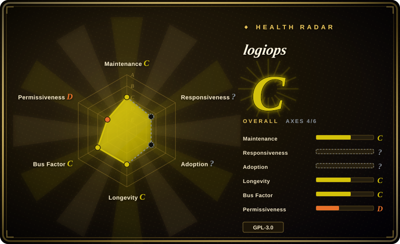
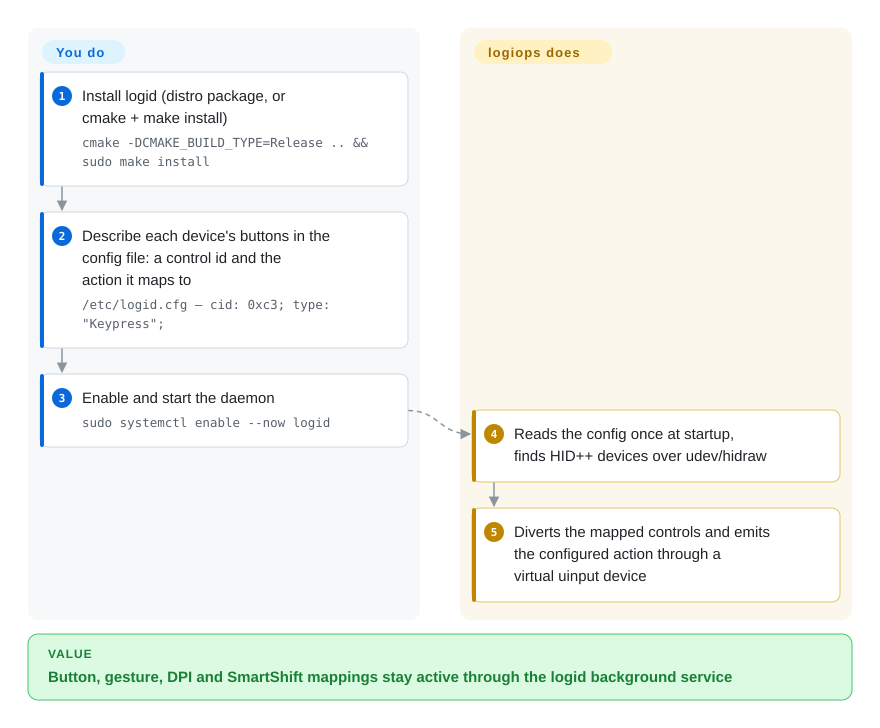

# logiops

An unofficial Linux userspace driver for HID++ Logitech devices: a root `logid` daemon that reads one config file and turns your mouse's buttons, gestures, DPI and SmartShift into Linux input events.

## When to use

You run Linux on a workstation you administer, you have an MX-series mouse, and you would rather declare your bindings in a text file next to the rest of your system configuration than click them into a GUI — or you want the mappings to work for every user on the machine, before anyone logs in, without a session app running. You are comfortable with a root systemd unit and `journalctl`. The two obvious alternatives are shaped differently: [Solaar](solaar.md) is a per-user GTK application that expects to be running for settings to stick and refuses to be a device driver, and [OpenLogi](openlogi.md) is a user-level GUI + agent whose config schema is still changing under a pre-1.0 project.

You pick logiops when a declarative `/etc/logid.cfg` and a system daemon are exactly the shape you want, and when Debian/Fedora/AUR packaging plus a stable config language matter more than new features. The tradeoff is explicit and worth stating plainly: **logiops is the least actively developed option here.** It has been around since 2019 and its config format is stable precisely because it has barely changed — roughly one release in two years, with the last 12 months of commits not touching `src/` at all. Choose it for the shape, not for momentum; if you need active development, camera support or a GUI, choose OpenLogi or Solaar instead.

## How it works

logiops splits into a daemon and a config file, with no GUI in between. You install `logid` (distro package, or build it yourself), write `/etc/logid.cfg` in libconfig syntax describing each device by name — its `buttons` with a control `cid` and an action type, plus optional `dpi`, `smartshift`, `hiresscroll` and `thumbwheel` blocks — and start the systemd service. At startup `logid` reads that file **once**, enumerates Linux `hidraw` devices through udev, and for each HID++ 2.0+ device discovers its capabilities and temporarily diverts the controls you mapped. When a diverted control fires, the daemon looks up the configured action and emits a keyboard or relative-axis event into the system through a virtual `libevdev`/uinput device named `LogiOps Virtual Input`, so the rest of the desktop sees an ordinary input device. Your part is the config file and a service restart after each edit; logiops' part is the protocol work, the diversion and the event synthesis.

<!-- flow-steps:begin (generated from flows/logiops.json by tools/flow_card.py — do not edit) -->

Text version of the flow

1. **You**: Build the daemon in release configuration — `cmake -DCMAKE_BUILD_TYPE=Release ..`
2. **You**: Install the binary and its system service — `sudo make install`
3. **You**: Write the device configuration at the default path — `/etc/logid.cfg`
4. **You**: Declare the control id and the action it maps to — `cid: 0xc3;`
5. **You**: Enable and start the daemon — `sudo systemctl enable --now logid`
6. **logiops**: Reads the config once and discovers HID++ devices through hidraw
7. **logiops**: Diverts matching button events and emits the configured keypress — `type: "Keypress";`

**Value**: Button, gesture, DPI and SmartShift mappings stay active through the logid background service

<!-- flow-steps:end -->

## When NOT to use

- **You are not on Linux.** logiops depends on udev/hidraw/uinput/libevdev and a systemd unit; use [OpenLogi](openlogi.md) or [Mouser](mouser.md) for Windows/macOS, or the vendor app.
- **You want a GUI or receiver pairing.** There is no merged GUI (a Tkinter one was proposed in an open PR in 2026-09), and no pairing/unpairing at all — use [Solaar](solaar.md), which exists precisely to manage pairing, device status and battery.
- **You want per-application switching.** logiops maps controls to system-level input; it has no notion of which app is frontmost, so use OpenLogi or Mouser for per-app profiles.
- **Your device is not HID++ 2.0 or newer.** logiops targets HID++ >2.0; for other Logitech gear or other vendors' gaming mice, a different tool is the right answer. `[未验证]`
- **You need cameras, lighting or keyboard RGB.** The registered feature set is DPI, SmartShift, HiResScroll, RemapButton, DeviceStatus and ThumbWheel; RGB feature IDs exist in the HID++ constants but have no implementation here. Use OpenLogi (webcams, Litra lights, static keyboard RGB) or Options+.
- **You need Logitech Flow.** It was requested in 2020 and the maintainer called it low priority; it has not landed. Use Options+.
- **You want to avoid root.** The README states logiops may only run as root; there is a non-root user-bus mode but it is documented as development-only and requires a custom build (`-DUSE_USER_BUS=ON`). Solaar is the user-level option.
- **You are choosing on maintenance momentum.** For a fast-moving project, look at OpenLogi or Mouser — but weigh their much shorter histories against the risk you are taking here.
- **You run Solaar or OpenLogi simultaneously.** They compete for the same device state; users have had to stop and uninstall another configurator to make logiops behave.

## Comparison

| Alternative | In index | Our verdict | Tradeoff |
|---|---|---|---|
| [Solaar](solaar.md) | ✅ | Choose logiops when you want a root daemon plus a declarative config and your devices are HID++ 2.0+ mice; choose Solaar when you need pairing, battery/device status, HID++ 1.0 coverage, or to avoid running anything as root. | logiops gains a system-level daemon and a config file you can version; it pays with root, no GUI, no pairing and a stalled release cadence. Solaar gains device management and 14 years of history; it pays with a per-user GUI that must stay running. |
| [OpenLogi](openlogi.md) | ✅ | Choose logiops if you value the daemon/config shape and stable format; choose OpenLogi when you want active development, a GUI, per-app profiles, keyboards, webcams or Windows/macOS. | OpenLogi gains breadth and momentum; it pays with pre-1.0 config churn and a much shorter track record. logiops gains stability and distro packaging; it pays with near-dormant development and Linux-only, mouse-centric scope. |
| [Mouser](mouser.md) | ✅ | Choose logiops on Linux when you prefer no session app and system-wide behaviour; choose Mouser when you want a portable GUI with per-application profiles and no root. | Mouser gains cross-platform portability and app-aware switching; it pays with mouse-only scope, global mappings, and a 7-month history. logiops gains a system daemon and a config language; it pays with root and no app awareness. |
| Logitech Options+ (official) | 未收录 | Keep Options+ if you need Flow, Smart Actions, firmware updates, or vendor device QA on Windows/macOS; choose logiops if you are on Linux and want the configuration to live in a text file. | Options+ is the only option with Flow, firmware support and official device coverage; it pays with no Linux build and a closed application. logiops trades those away for a local daemon and a hand-editable config. |

## Tech stack

- **Language / standard:** C++ with `CMAKE_CXX_STANDARD 20` (used mainly for string-literal template parameters); CMake ≥ 3.12.
- **Libraries:** `libevdev`, `libudev`, `libconfig++`, POSIX threads, and `ipcgull` (a pinned git submodule using GLib/GIO/GDBus) for the D-Bus interface; systemd is detected via pkg-config and, when present, installs `logid.service`.
- **Device layer:** udev's `hidraw` subsystem for discovery; `libevdev-uinput` to create the `LogiOps Virtual Input` device that emits the mapped keystrokes.
- **Configuration:** libconfig syntax at `/etc/logid.cfg` (`-c`/`--config` to override); read once at process start — there is no file watcher or SIGHUP reload path.
- **CLI:** `logid` takes `-v/--verbose [level]`, `-V/--version`, `-c/--config [path]`, `-h/--help`; there is no separate configuration tool.

## Dependencies

- **A Linux system with systemd** (the shipped unit sets `User=root` and runs `/usr/bin/logid`), udev, and `/dev/hidraw*` plus uinput access.
- **Runtime libraries:** `libevdev`, `libudev`, `libconfig++`, GLib/GIO/GDBus via `ipcgull`. Build-time also needs a C++20 compiler, CMake, and pkg-config; a source build must initialise the `ipcgull` submodule or CMake fails.
- **Distribution packages exist** for Debian (0.3.x in Bookworm/Trixie/Testing) and Fedora, plus AUR (`logiops`, `logiops-git`); Arch's official repos do not carry it.
- **Root privileges by design.** Running as root is the documented mode; the non-root user-bus path is development-only.
- **Hardware:** Logitech HID++ devices, with the implemented feature set requiring HID++ 2.0+; receivers are managed as HID++ 1.0 entry points. Some BLE-only devices time out during initialisation, so verify per device.
- **Coexistence constraint:** do not run alongside Solaar/OpenLogi — they contend for the same device settings.

## Ops difficulty

**Medium.** The install itself is ordinary (distro package, or `cmake -DCMAKE_BUILD_TYPE=Release ..` + `sudo make install`), but you now own a root daemon whose configuration is hand-written libconfig, reloaded only by restarting the service (`sudo systemctl restart logid`), with stdout/stderr going to the journal. Debugging means `journalctl -u logid -f` or `sudo logid -v`. Config errors surface as a daemon that starts and does nothing useful; there is no schema validation and no GUI to tell you a key is wrong. The upside is that once it works, it is genuinely set-and-forget — mapping state lives in a file you can review and version, and it survives without any desktop session.

## Health & viability

- **Maintenance — coasting, not abandoned (as of 2026-09-20).** Last release v0.3.5 on 2024-09-28 (nearly two years before this writing); `pushed_at` 2025-12-29; roughly six commits in the trailing 12 months, all in 2025-11/12 and none touching `src/` — the last source change was the 2024-09-28 CVE fix. Not archived, and a maintainer was still merging in late 2025.
- **Governance & bus factor — effectively one person.** `PixlOne` accounts for ~286 of 336 recorded contributions (~85%), with the next contributor at 4. A `User`-owned repo with no GOVERNANCE/CODEOWNERS/SECURITY files and a first-person README that asks for contributors.
- **Age & Lindy — old but not still-active, so the prior does not rescue it.** Created 2019-07-09, past its seventh year, but the age × still-active test fails on the "still-active" half: 7 years of history does not compensate for near-zero source commits and half a year of unanswered issues. Treat it as a stable, frozen tool rather than a growing one. `[推断]`
- **Adoption & ecosystem — real packaging, real open backlog.** Debian and Fedora packages, AUR entries, and issue history of ~173 closed issues; against that, ~237 open issues and ~52 open PRs with recent filings getting no maintainer response in the sampled window. CI is a multi-distro compile gate (`-Werror` on Ubuntu/Ubuntu 20.04/Fedora/Arch) with no unit tests.
- **Risk flags — a high-severity CVE in its recent past.** CVE-2024-45752 (GHSA-6ffr-69v4-q8xm, high) allowed an unprivileged user to arbitrarily remap buttons; it was fixed in v0.3.5, and the D-Bus policy was tightened to root-only. That is a genuine "fixed, not open" datapoint, but it also shows the attack surface of a root daemon that consumes device input. GPL-3.0 adds copyleft constraints.

## Caveats (unverified)

- `[未验证]` **License suffix.** The root `LICENSE` is GPLv3 and GitHub reports `GPL-3.0`, while source headers state "either version 3 of the License, or (at your option) any later version"; Fedora packages it as `GPL-3.0-or-later`. The `-or-later` reading is taken from the source headers.
- `[未验证]` **Trailing-12-month commit count (~6) and the claim that none touched `src/`** come from the GitHub commits API for the default branch; force-pushes or non-default-branch work would not show up there.
- `[未验证]` **"Config is read once; restart to reload"** is inferred from `Configuration.cpp` constructing and calling `readFile()` at startup with no watcher or SIGHUP handler; the README does not document a reload procedure.
- `[未验证]` **HID++ version floor.** The project describes itself as HID++ >2.0; whether some HID++ 2.0 devices work in practice, and which BLE devices time out, was not enumerated — that is per-device and reported informally in issues.
- `[推断]` **"Coasting rather than abandoned"** is a judgment from release/commit/issue evidence, not a maintainer statement; the repo is not archived and a maintainer was active in late 2025.
- `[未验证]` **The non-root `-DUSE_USER_BUS=ON` mode** is described in the README as development-only; whether it works for daily use was not tested.
- `[未验证]` **The proposed Tkinter GUI (open PR as of 2026-09)** was not reviewed; it is an open pull request, not a shipped feature, and should not be assumed to land.
