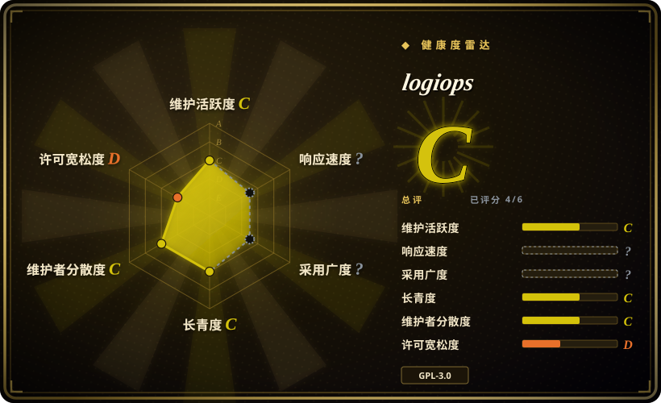
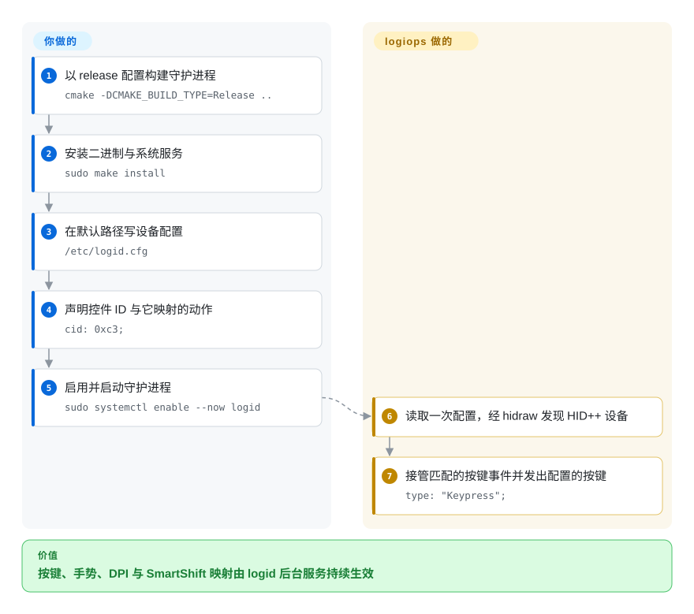

# logiops

Linux 上的非官方 HID++ 罗技设备用户态驱动：一个 root `logid` 守护进程读取一份配置文件，把鼠标的按键、手势、DPI 与 SmartShift 变成 Linux 输入事件。

## 何时使用

你在自己管理的 Linux 工作站上办公，有一只 MX 系列鼠标，并且宁可在系统配置旁边用一个文本文件声明映射，也不愿意在 GUI 里点出来——或者你希望映射对所有用户生效、在任何会话启动之前就可用、且不需要任何会话级应用在跑。你对 root systemd 单元和 `journalctl` 不陌生。两个显而易见的替代品形状不同：[Solaar](solaar.zh.md) 是用户级 GTK 应用，设置要生效就指望它一直运行，并且拒绝当设备驱动；[OpenLogi](openlogi.zh.md) 是用户级 GUI + agent，配置 schema 在一个 1.0 之前的项目里仍在变动。

当 `/etc/logid.cfg` 这种声明式配置加系统守护进程正是你想要的形状，且 Debian／Fedora／AUR 的打包与稳定的配置语言比新功能更重要时，你选 logiops。取舍必须说得直白：**logiops 是本分类里开发活跃度最低的选项。** 它从 2019 年存在至今，配置格式稳定恰恰是因为它几乎没变——大约两年一个版本，过去 12 个月的提交完全没有碰 `src/`。为形状选它，不要为势头选它；如果你需要活跃开发、摄像头支持或 GUI，改选 OpenLogi 或 Solaar。

## 怎么用起来

logiops 分成守护进程加配置文件，中间没有 GUI。你安装 `logid`（发行版包，或自己构建），用 libconfig 语法写 `/etc/logid.cfg`，按设备名描述它的 `buttons`——一个控件 `cid` 加一个 action 类型——以及可选的 `dpi`、`smartshift`、`hiresscroll`、`thumbwheel` 块，然后启动 systemd 服务。启动时 `logid` **只读一次**该文件，经 udev 枚举 Linux `hidraw` 设备，对每台 HID++ 2.0+ 设备发现其能力并临时 divert 你映射过的控件。被 divert 的控件触发时，守护进程查出配置的动作，通过一个名为 `LogiOps Virtual Input` 的虚拟 `libevdev`／uinput 设备向系统发出键盘或相对轴事件，于是桌面其余部分看到的就是一个普通输入设备。你的部分是配置文件和每次改完后的服务重启；logiops 的部分是协议处理、控件接管与事件合成。

<!-- flow-steps:begin (generated from flows/logiops.json by tools/flow_card.py — do not edit) -->

流程文字版

1. **你**：以 release 配置构建守护进程 — `cmake -DCMAKE_BUILD_TYPE=Release ..`
2. **你**：安装二进制与系统服务 — `sudo make install`
3. **你**：在默认路径写设备配置 — `/etc/logid.cfg`
4. **你**：声明控件 ID 与它映射的动作 — `cid: 0xc3;`
5. **你**：启用并启动守护进程 — `sudo systemctl enable --now logid`
6. **logiops**：读取一次配置，经 hidraw 发现 HID++ 设备
7. **logiops**：接管匹配的按键事件并发出配置的按键 — `type: "Keypress";`

**价值**：按键、手势、DPI 与 SmartShift 映射由 logid 后台服务持续生效

<!-- flow-steps:end -->

## 何时不用

- **你不在 Linux 上。** logiops 依赖 udev／hidraw／uinput／libevdev 和 systemd 单元；Windows／macOS 请用 [OpenLogi](openlogi.zh.md) 或 [Mouser](mouser.zh.md)，或者厂商应用。
- **你想要 GUI 或接收器配对。** 没有已合并的 GUI（2026-09 有一个 Tkinter 方案处于开放 PR 状态），也完全没有配对／解绑——改用 [Solaar](solaar.zh.md)，它的存在就是为了管理配对、设备状态与电量。
- **你想要按应用切换。** logiops 把控件映射到系统级输入；它没有「哪个应用在前台」的概念，按应用 profile 请用 OpenLogi 或 Mouser。
- **你的设备不是 HID++ 2.0 或更新。** logiops 面向 HID++ >2.0；其他罗技设备或其他厂商的游戏鼠标应改用别的工具。`[未验证]`
- **你需要摄像头、灯效或键盘 RGB。** 其注册的功能集只有 DPI、SmartShift、HiResScroll、RemapButton、DeviceStatus 与 ThumbWheel；HID++ 常量里虽然有 RGB feature ID，但没有实现。用 OpenLogi（摄像头、Litra 灯、静态键盘 RGB）或 Options+。
- **你需要 Logitech Flow。** 该需求 2020 年就提了，维护者当时称为低优先级，至今没有落地。用 Options+。
- **你想避开 root。** README 明确说 logiops 只能以 root 运行；有一个非 root 的 user-bus 模式，但文档标明仅供开发用途，且需要自行以 `-DUSE_USER_BUS=ON` 重新构建。用户级的选项是 Solaar。
- **你是按维护势头来选的。** 要快速迭代的项目就看 OpenLogi 或 Mouser——但要把它们短得多的历史，和你在这里承担的风险放在一起权衡。
- **你同时运行 Solaar 或 OpenLogi。** 它们争抢同一批设备状态；有用户为了让 logiops 正常工作，不得不先停掉并卸载另一个配置工具。

## 横向对比

| 替代品 | 是否收录 | 我们的评价 | 取舍 |
|---|---|---|---|
| [Solaar](solaar.zh.md) | ✅ | 当你想要 root 守护进程加声明式配置、且设备是 HID++ 2.0+ 鼠标时选 logiops；当你需要配对、电量／设备状态、HID++ 1.0 覆盖，或者不想以 root 运行任何东西时选 Solaar。 | logiops 换来系统级守护进程与可版本化的配置文件；代价是 root、没有 GUI、没有配对，以及停滞的发布节奏。Solaar 换来设备管理与 14 年历史；代价是一个必须保持运行的用户级 GUI。 |
| [OpenLogi](openlogi.zh.md) | ✅ | 如果你看重守护进程加配置文件的形状与稳定格式，选 logiops；当你想要活跃开发、GUI、按应用 profile、键盘、摄像头或 Windows／macOS 时选 OpenLogi。 | OpenLogi 换来广度与迭代速度；代价是 1.0 之前的配置变动和短得多的记录。logiops 换来稳定与发行版打包；代价是近乎休眠的开发和仅限 Linux、以鼠标为中心的范围。 |
| [Mouser](mouser.zh.md) | ✅ | 在 Linux 上，当你偏好没有会话应用、行为是系统级的时候选 logiops；当你想要无需 root、便携 GUI 且有按应用 profile 时选 Mouser。 | Mouser 换来跨平台便携与应用感知切换；代价是只管鼠标、映射为全局，以及 7 个月的历史。logiops 换来系统守护进程与配置语言；代价是 root 与没有应用感知。 |
| Logitech Options+（官方） | 未收录 | 如果你在 Windows／macOS 上需要 Flow、Smart Actions、固件更新或厂商设备质量保证，就继续用 Options+；如果你在 Linux 上且希望配置留在文本文件里，就选 logiops。 | Options+ 是唯一具备 Flow、固件支持和官方设备覆盖的选项；代价是没有 Linux 版本、应用闭源。logiops 用这些换来了本地守护进程与可手改的配置。 |

## 技术栈

- **语言／标准：** C++，`CMAKE_CXX_STANDARD 20`（主要用于字符串字面量模板参数）；CMake ≥ 3.12。
- **库：** `libevdev`、`libudev`、`libconfig++`、POSIX 线程，以及 `ipcgull`（固定版本的 git 子模块，内部使用 GLib／GIO／GDBus）提供 D-Bus 接口；systemd 通过 pkg-config 探测，探测到就安装 `logid.service`。
- **设备层：** 用 udev 的 `hidraw` 子系统做发现；用 `libevdev-uinput` 创建 `LogiOps Virtual Input` 设备来发出映射后的按键。
- **配置：** libconfig 语法，位于 `/etc/logid.cfg`（可用 `-c`／`--config` 改路径）；进程启动时读一次——没有文件监听，也没有 SIGHUP 重载路径。
- **CLI：** `logid` 支持 `-v/--verbose [level]`、`-V/--version`、`-c/--config [path]`、`-h/--help`；没有单独的配置工具。

## 依赖

- **带 systemd 的 Linux 系统**（随包单元设置 `User=root` 并运行 `/usr/bin/logid`）、udev，以及 `/dev/hidraw*` 加 uinput 的访问权。
- **运行时库：** `libevdev`、`libudev`、`libconfig++`，以及经 `ipcgull` 引入的 GLib／GIO／GDBus。构建期还需要 C++20 编译器、CMake 和 pkg-config；源码构建必须初始化 `ipcgull` 子模块，否则 CMake 直接报错。
- **存在发行版包：** Debian（Bookworm／Trixie／Testing 中为 0.3.x）与 Fedora，另有 AUR（`logiops`、`logiops-git`）；Arch 官方仓库没有收录。
- **按设计需要 root 权限。** 以 root 运行是文档模式；非 root 的 user-bus 路径仅供开发。
- **硬件：** 罗技 HID++ 设备，已实现的功能集要求 HID++ 2.0+；接收器被当作 HID++ 1.0 入口管理。部分 BLE-only 设备在初始化阶段会超时，需按具体设备验证。
- **共存约束：** 不要与 Solaar／OpenLogi 同时运行——它们争抢同一批设备设置。

## 运维难度

**中等。** 安装本身平平无奇（发行版包，或 `cmake -DCMAKE_BUILD_TYPE=Release ..` 加 `sudo make install`），但你从此要负责一个 root 守护进程，它的配置靠手写 libconfig，只有重启服务才能重载（`sudo systemctl restart logid`），stdout／stderr 进 journal。调试手段是 `journalctl -u logid -f` 或 `sudo logid -v`。配置写错的表现是守护进程起来了但什么也不做；没有 schema 校验，也没有 GUI 告诉你哪个键写错了。好处是一旦调通就是真正的「设完不用管」——映射状态在一个你能审阅、能版本化的文件里，而且不依赖任何桌面会话就能存活。

## 健康度与可持续性

- **维护活跃度——正在滑行，但没有弃坑（截至 2026-09-20）。** 最新版本 v0.3.5 发布于 2024-09-28（距写作时接近两年）；`pushed_at` 为 2025-12-29；过去 12 个月约 6 次提交，全部在 2025-11／12，且没有一次碰 `src/`——最后一次源码变更是 2024-09-28 的 CVE 修复。未归档，且维护者在 2025 年末仍在合并提交。
- **治理与维护者分散度——实际是单人。** `PixlOne` 占 336 次统计贡献中的约 286 次（约 85%），第二名只有 4 次。`User` 名下仓库，没有 GOVERNANCE／CODEOWNERS／SECURITY 文件，README 用第一人称并公开招募贡献者。
- **项目年龄与 Lindy——老但不再活跃，因此先验救不了它。** 创建于 2019-07-09，已过第七年；但「年龄 × 仍活跃」的检验在「仍活跃」这一半上不通过：7 年历史抵不过近乎为零的源码提交和半年没人回的 issue。把它当作稳定但冻结的工具，而不是还在生长的工具。`[推断]`
- **采用与生态——打包真实，待办真实。** Debian 与 Fedora 有包、AUR 有条目，历史上关闭过约 173 个 issue；反面是约 237 个未关闭 issue 与约 52 个开放 PR，抽样窗口内新提交的问题没有任何维护者回应。CI 是多发行版编译门禁（Ubuntu／Ubuntu 20.04／Fedora／Arch，带 `-Werror`），没有单元测试。
- **风险旗标——近期有过高危 CVE。** CVE-2024-45752（GHSA-6ffr-69v4-q8xm，high）允许非特权用户任意重映射按键；已在 v0.3.5 修复，D-Bus 策略也被收紧为仅 root。这是「已修复、非未决」的正面数据点，但也暴露了一个消费设备输入的 root 守护进程的攻击面。GPL-3.0 还带来 copyleft 约束。

## 存疑（未验证）

- `[未验证]` **许可证后缀。** 根目录 `LICENSE` 是 GPLv3，GitHub 报告 `GPL-3.0`，而源码文件头写的是「either version 3 of the License, or (at your option) any later version」，Fedora 也按 `GPL-3.0-or-later` 打包。这里采用源码头给出的 `-or-later` 读法。
- `[未验证]` **过去 12 个月约 6 次提交、且没有碰 `src/`** 来自 GitHub 默认分支的 commits API；强推或非默认分支的工作不会体现在那里。
- `[未验证]` **「配置只读一次、需重启才重载」** 是从 `Configuration.cpp` 在启动时构造并调用一次 `readFile()`、且没有 watcher 或 SIGHUP 处理推断而来；README 没有写明重载流程。
- `[未验证]` **HID++ 版本下限。** 项目自称面向 HID++ >2.0；实践中是否有些 HID++ 2.0 设备可用、哪些 BLE 设备会超时，都没有清单——这属于逐设备问题，只在 issue 中被零散报告。
- `[推断]` **「滑行而非弃坑」** 是基于发布／提交／issue 证据的判断，不是维护者的表态；仓库未归档，且维护者在 2025 年末仍有活动。
- `[未验证]` **非 root 的 `-DUSE_USER_BUS=ON` 模式** README 描述为仅供开发；是否可用于日常未做实测。
- `[未验证]` **2026-09 仍处开放状态的 Tkinter GUI PR** 未被审阅；它是开放的 pull request，不是已发布功能，不应假定会落地。
